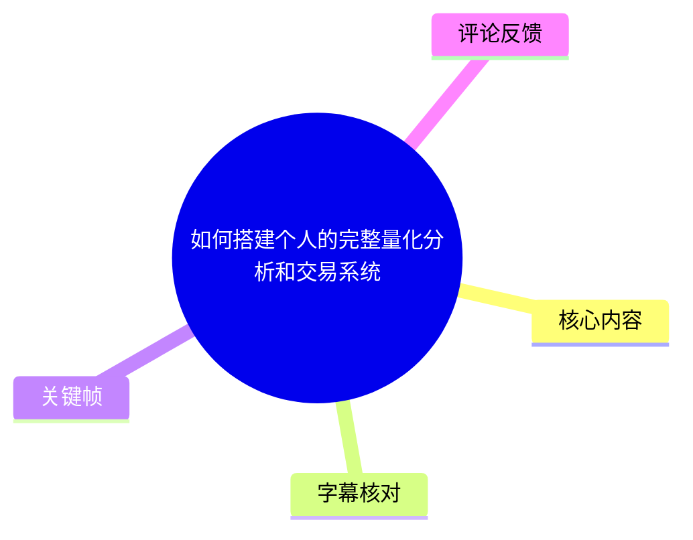
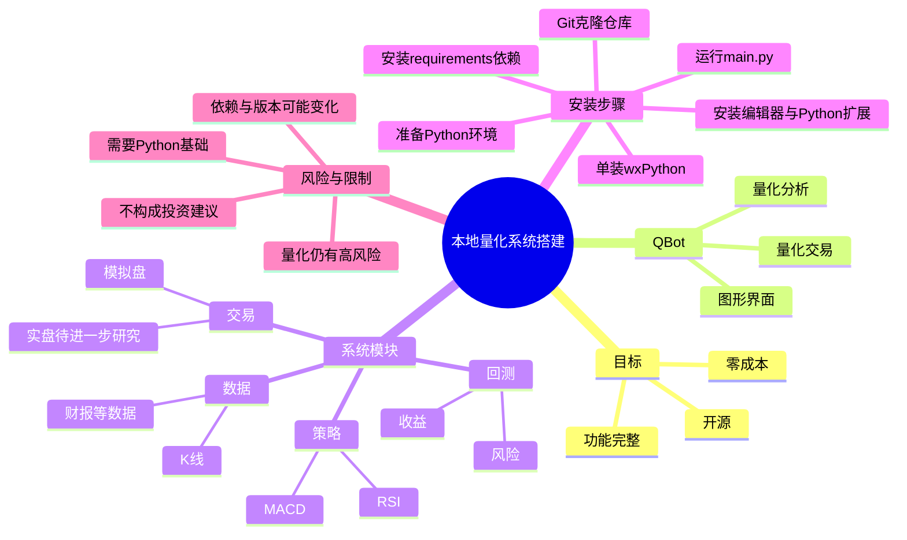
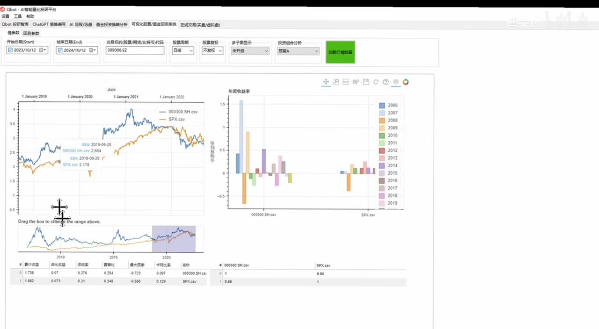

# 如何搭建个人的完整量化分析和交易系统

> 来源：[Bilibili 视频](https://www.bilibili.com/video/BV16KmVYAEod)<br>
> UP 主：田昊然｜发布时间：2024-10-14｜视频时长：05:15｜合集：AIcode

## 小结

视频介绍的是一条本地、零成本搭建量化分析与交易系统的入门路径：作者选择开源项目 **QBot**，并将其定位为覆盖数据、策略、回测、交易四环节的量化平台。本文聚焦“把环境装好并成功启动程序”，而非讲解具体策略设计或实盘交易。

作者给出的选择标准有三点：**免费、开源、功能尽可能完整**。其中，“开源”不仅是成本问题，更意味着使用者能够查看源码、继续研究系统机制；单纯使用封闭式软件，难以形成对量化系统整体的深入认识。

一个完整量化系统在视频中被划分为四个模块：数据系统负责 K 线、财报等数据；策略系统负责定义 MACD、RSI 等指标并组合为策略；回测系统用历史数据评估策略收益与风险；交易系统则面向模拟盘或实盘执行。视频展示的 QBot 图形界面可呈现股票走势、收益及策略分析结果，并有交易系统页面。

实际操作的前置条件是已有 Python 基础和 Python 环境。作者推荐 VS Code，但明确 PyCharm、Jupyter 等 Python 编辑器同样可用。安装流程为：克隆 QBot 仓库、进入项目目录、安装依赖、单独安装 wxPython、运行 `main.py`；缺少其他包时，再按报错逐个通过 `pip install` 补装。

风险边界同样重要：作者明确不提供入场或投资建议，并认为投资中“收益多高”并非最关键，风险大小才会直接影响人的心态。量化可以是控制风险的方式之一，但**量化本身仍属高风险活动**；本视频也未验证某一策略的有效性、数据来源质量、实盘接口可用性或当前版本兼容性。

## 思维导图





## 目录

- [定位、前置条件与时效性](#定位前置条件与时效性-0000)
- [QBot 对完整量化系统的覆盖](#qbot-对完整量化系统的覆盖-0048)
- [本地安装与启动步骤](#本地安装与启动步骤-0201)
- [运行后的界面与可见能力](#运行后的界面与可见能力-0401)
- [风险提示、适用边界与后续内容](#风险提示适用边界与后续内容-0425)
- [字幕比对](#字幕比对)
- [评论分析](#评论分析)
- [处理记录](#处理记录)

## [定位、前置条件与时效性](https://www.bilibili.com/video/BV16KmVYAEod?t=0)

视频从“快速、零成本、在本地获得功能完整的量化交易系统”这一目标切入。作者认为，对多数个人用户而言，免费是首要条件；除此以外，开源也很关键，因为只有源代码可见，用户才能在使用之后继续向底层原理和系统设计深入。

作者经多次尝试后，主观推荐 **QBot**，称其同时符合免费、开源和功能较全的要求。这里应将其视为作者在 2024 年发布视频时的个人试用结论，而不是对所有量化框架的横向评测结论。

### 前置条件

- 需要会使用 Python，并已准备 Python 环境。
- 编辑器推荐 **VS Code**；若已习惯 PyCharm 或 Jupyter，也可以使用。
- 安装过程中需要 Git 命令及 Python 包管理工具 `pip`。
- 视频只演示本地部署与启动，没有展示云端部署、容器化部署、账户开户、券商接口配置或实盘下单流程。

### 时效性说明

视频发布于 2024 年 10 月。QBot 仓库状态、依赖包版本、`wxPython` 预编译包与本机 Python/操作系统的匹配关系，都可能在此后变化。尤其是热评中提供的 `cp38-cp38-win_amd64.whl` 文件名，表示其面向 **CPython 3.8、Windows 64 位**；不能不加核对地用于其他 Python 版本或非 Windows 系统。

## [QBot 对完整量化系统的覆盖](https://www.bilibili.com/video/BV16KmVYAEod?t=48)

作者将量化分析和量化交易系统概括为四个相互衔接的部分。

### 1. 数据系统

数据系统解决“数据从哪里来、如何组织”的问题。视频举例包括：

- 各股票每日的 K 线数据；
- 财报等其他数据。

视频未展示具体的数据供应商、接口密钥、数据清洗方式、复权规则、更新频率或数据授权条款。因此，“有数据模块”不等于数据质量、数据完整性和可用于实盘决策已经得到保证。

### 2. 策略系统

策略系统用于自定义指标和策略逻辑。作者以常见技术指标 **MACD**、**RSI** 为例，说明用户可以在指标基础上形成自己的策略。

这里的关键是：指标只是策略输入或规则组成部分，并不天然代表可盈利。视频没有给出 MACD、RSI 的参数设置、买卖条件、仓位管理或股票池规则，也未给出任何策略的实证结论。

### 3. 回测系统

有了策略后，需要利用过去的数据观察策略表现。作者特别提到两类输出：

- 策略的收益表现；
- 策略的风险大小。

回测是策略研究工具，不是未来表现的保证。视频没有展开交易成本、滑点、停牌、涨跌停、幸存者偏差、未来函数、样本外检验等回测偏差控制问题，使用时需要自行补充验证。

### 4. 交易系统

交易系统对应模拟盘或实盘交易。作者称从目前观察看，QBot“好像是能做的”，并表示后续会进一步研究。该表述意味着视频中对交易执行能力并未完成充分验证，不能据此认定其已适配任意市场、券商或实盘账户。


> 图：画面直接列出“数据模块、策略模块”，对应作者对量化系统结构的拆分。它的价值在于强调量化不是单一选股公式，而是从数据到策略、回测和交易的链条；不过该帧未完整呈现全部四个模块，完整结构仍应以音频讲述为准。

## [本地安装与启动步骤](https://www.bilibili.com/video/BV16KmVYAEod?t=121)

本期的操作目标很明确：配置环境并让 QBot 程序正常运行。以下按视频叙述和 UP 主热评提供的命令整理；其中，热评补全了视频 ASR 未能清楚识别的仓库地址与 wxPython 安装文件名。

### 步骤 1：准备 Python 与编辑器

1. 确认系统已安装并可使用 Python。
2. 安装 VS Code，或使用自己熟悉的 PyCharm、Jupyter 等编辑器。
3. 在 VS Code 中打开一个用于存放项目的文件夹。
4. 打开扩展（Extensions）面板，搜索 **Python**，安装搜索结果中的 Python 扩展。

作者指出，后续安装与使用均在已打开的项目文件夹内进行。

### 步骤 2：克隆 QBot 仓库

在 VS Code 中打开终端，进入希望存放项目的目录，执行：

```bash
git clone https://github.com/UFund-Me/Qbot --depth 1
```

参数 `--depth 1` 表示浅克隆，仅获取最新历史深度，通常可减少下载量；这是 UP 主在热评中明确给出的命令。完成后，视频中通过 `ls` 查看目录，确认出现 `Qbot` 文件夹。

进入项目目录：

```bash
cd Qbot
```

> 注意：仓库目录实际大小写应以克隆后的本地目录为准。视频 ASR 对 `QBot/Qbot` 的大小写识别不稳定，热评命令为 `Qbot`。

### 步骤 3：安装常规依赖

项目依赖清单位于 `requirements.txt`。热评给出的安装命令为：

```bash
pip install -r requirements.txt
```

视频说明：除 wxPython 外，其他依赖可通过该命令自动安装。

### 步骤 4：单独安装 wxPython

作者说明 wxPython 负责图形用户界面（GUI），需要手动单独安装。UP 主热评给出的是 Windows 与 Python 3.8 对应的本地 wheel 文件安装命令：

```bash
python -m pip install dev/wxPython-4.2.1-cp38-cp38-win_amd64.whl
```

这个命令包含明确的环境约束：

| 文件片段 | 可据文件名判断的含义 |
| --- | --- |
| `wxPython-4.2.1` | 包版本为 4.2.1 |
| `cp38-cp38` | 适用于 CPython 3.8 |
| `win_amd64` | 适用于 Windows 64 位 |

若本机不是 Python 3.8 或不是 Windows 64 位，不能假设该 wheel 可以安装成功；视频没有提供替代包、替代版本或跨平台安装方法。

### 步骤 5：启动程序与处理缺包报错

安装完成后，在项目目录运行：

```bash
python main.py
```

视频口述为 `python Main.py`，而 UP 主热评写作 `python main.py`。考虑到 Windows 文件系统通常不区分大小写、而 Linux/macOS 通常区分大小写，应优先查看仓库内实际入口文件名后执行，避免因大小写不一致造成启动失败。

如果启动时提示缺少其他 Python 库，作者的处理建议是按报错信息单独安装：

```bash
pip install <缺少的包名>
```

这只是通用排障方向。若报错来自 Python 版本、系统编译环境、二进制依赖或接口配置，单纯安装包未必能解决。

## [运行后的界面与可见能力](https://www.bilibili.com/video/BV16KmVYAEod?t=241)

作者表示，正常启动后会弹出图形界面，这是数据与结果的主要展示位置。在该界面中可方便查看：

- 股票走势；
- 收益情况；
- 对策略的多种分析结果；
- 交易系统界面。



> 图：关键帧展示了 QBot 的桌面图形界面：左侧为两条数据序列的走势比较及可拖动时间范围选择器，右侧为按年份显示的柱状结果，底部有统计表格。该画面是“系统可视化展示数据、收益和分析结果”这一视频陈述的直接视觉佐证，但并不证明任何策略具有稳定盈利能力。

从界面截图可见，展示区包含时间区间、证券代码/标的输入、图形区域与统计结果区域；这是工具的交互层能力，不应与数据准确性、回测严谨性或实盘可用性混为一谈。

作者在约 04:25 处将当前状态总结为“量化系统已经完整安装好”，并预告下一期将讲基础使用。也就是说，本视频完成的交付是**安装成功与界面启动**，尚未进入指标编写、策略回测配置或交易执行的教学细节。

## [风险提示、适用边界与后续内容](https://www.bilibili.com/video/BV16KmVYAEod?t=265)

视频结尾结合当时 A 股市场热度回应“是否可以入场”的问题。作者说明自己不做投资建议，只讨论思考逻辑和规律。

作者的核心经验判断是：

1. 对投资而言，高收益不是唯一或最关键的观察维度；
2. 风险大小会直接影响投资者心态；
3. 量化可以作为控制风险的一种方式；
4. 但量化交易本身仍然是高风险活动。

### 可迁移经验

- 不要把量化理解为“安装一个软件即可自动赚钱”；更完整的视角应包括数据、策略、回测与执行。
- 使用开源项目时，除了运行界面，更应阅读项目结构、依赖清单和源码，理解数据与交易链条。
- 先保证本地环境、依赖和基础运行稳定，再进入策略研究。
- 评价策略至少应同时看收益与风险，不能只看某一段历史收益曲线。

### 本视频未覆盖或未验证的内容

- QBot 当前仓库维护状态与当前版本兼容性；
- 市场数据的来源、成本、授权、完整性和实时性；
- 具体策略逻辑、指标参数和回测配置；
- 交易费用、滑点、流动性、涨跌停等实盘摩擦；
- 券商/交易接口接入、模拟盘与实盘权限；
- 风控规则、仓位管理、异常处理与日志监控；
- 任意投资标的或策略的收益承诺。

因此，本视频适合有 Python 基础、希望快速建立本地量化研究环境的入门者；不适合将其当作实盘交易指南或投资推荐。

## 字幕比对

站内字幕与视频主题发生了根本性错配：其内容从“诺贝尔奖”开始，持续讨论物理学奖、引力波、凝聚态物理等，与本视频标题、ASR 音频以及关键帧中的 QBot 界面均不一致。因此，站内字幕不能用于本文内容整理。

| 字幕来源 | 完整性 | 专有名词 | 时间轴 | 主要问题 |
| --- | --- | --- | --- | --- |
| Bilibili 站内字幕 `p01-ai-zh.srt` | 时间覆盖约 00:00—04:22，但与本片主题完全不符 | 含诺贝尔奖、引力波等，与 QBot 无关 | 有真实 SRT 时间轴，但对应的是错误内容 | 疑似串片/错配字幕，不能采用 |
| 本次 ASR 字幕 | 覆盖 00:00:00.180—00:05:14.520，语音覆盖率 99.83% | 可辨认 QBot、Python、VS Code、MACD、RSI、wxPython 等，但有大量同音与断词错误 | 有真实分段时间轴，且与视频主题、界面画面一致 | 长分段、标点不足；“系统”“数据”等词多处识别错误，命令内容不完整 |

### 最终字幕选择与校正

本文以**本次 ASR 时间轴**作为章节定位依据，原因是其时间覆盖完整、内容与音频主题一致；再用 UP 主热评中的命令、视频关键帧和上下文校正专有名词。

重点校正如下：

| ASR 原始近似识别 | 采用写法 | 校正依据 |
| --- | --- | --- |
| “酷它”“Qbot” | `QBot` / 仓库目录 `Qbot` | 视频语境、界面标题、UP 主热评仓库地址 |
| “数据的系组”“交易系组” | 数据系统、交易系统 | 上下文语义 |
| “K线数损”“这些数捲” | K 线数据、这些数据 | 上下文语义 |
| “人策” | 策略 | 前后文“形成我们自己的策略” |
| “WXpython” | `wxPython` | Python 包名及热评 wheel 文件名 |
| “pipinstall-r” | `pip install -r` | 热评明确命令 |
| “python 空格 Main.py” | `python main.py`，以实际文件名为准 | 热评与跨平台大小写风险说明 |

ASR 诊断未标记 `noAudioStream=true`：源视频存在音轨，且 ASR 显示语音覆盖率为 99.83%。站内字幕的问题是内容错配，不是无音轨或 ASR 工具失败。

## 评论分析

以下仅分析可获取的热评前三条；评论是用户观点或补充信息，不自动等同于已独立验证的事实。

### 1. UP 主田昊然：补全安装命令（214 赞）

UP 主在置顶/热评中按顺序给出编辑器准备、仓库克隆、依赖安装、wxPython 单独安装和程序运行命令。其中最有价值的补充是：

```bash
git clone https://github.com/UFund-Me/Qbot --depth 1
pip install -r requirements.txt
python -m pip install dev/wxPython-4.2.1-cp38-cp38-win_amd64.whl
python main.py
```

这条评论与视频教学内容高度一致，且由发布者本人提供，因此可作为视频操作细节的优先补充来源。但其 wxPython wheel 明确绑定 Python 3.8 和 Windows 64 位，其他环境仍需自行确认兼容包。

### 2. 一百瓦菜腿：数据来源才是关键难点（96 赞）

评论指出：“做为一个码农，其他都简单，关键是数据哪里来……”。这一反馈抓住了视频只概述、未展开的核心问题：即使程序能够安装启动，数据的获取、质量、复权、时效、许可和成本仍会决定策略研究是否可靠。

该评论不是对 QBot 数据能力的事实判断，但适合作为实践提醒：搭好框架只是开始，数据治理可能是量化系统中更长期、更复杂的部分。

### 3. 逃禅煮石陈山人：希望建立交流社群（70 赞）

评论希望 UP 主创建微信群共同交流。它反映出观众对后续答疑、经验交流和实践协作的需求，但视频及素材中没有显示 UP 主已建立该社群，也没有可验证的官方群信息。

因此，这条评论只能说明社区交流诉求，不应据此推断存在官方交流群或任何付费/私域服务。

## 处理记录

- Worker ID：`worker-mrj0www4-e8d79408`
- 调用模型：`gpt-5.6-terra`
- 使用素材与工具结果：读取视频元数据、站内 SRT、ASR 时间轴结果、ASR 诊断、关键帧清单及可获取热评前三条；未对素材外的仓库状态、依赖版本或交易接口进行联网验证。
- 字幕选择：检查了站内字幕与本次 ASR。站内 `p01-ai-zh.srt` 为诺贝尔奖相关内容，与本片不符，判定为错配而弃用；采用本次 ASR 的真实时间段作为时间轴基础，并以热评、关键帧和上下文修正术语。
- ASR 状态：ASR 语言为中文，置信度 `0.994140625`，时长约 `314.89` 秒，语音覆盖率 `0.9983`；未出现 `noAudioStream=true`，因此未触发无音轨处理流程。
- 关键帧选择依据：选用 `frames/frame-004.jpg` 说明数据/策略模块的结构表达；选用 `frames/frame-001.jpg` 展示 QBot 图形界面中的走势、年度柱状结果与统计区域。两帧均与 ASR 对系统结构、数据结果展示的描述直接相关。
- 缓存清理：本次仅基于任务提供的既有素材进行整理；未生成或保留额外下载缓存，未提供可执行的缓存清理回执。
- 未解决问题：未从素材中获得 QBot 的当前维护状态、当前安装兼容矩阵、数据源配置方式、实盘交易适配范围及任何策略的真实绩效验证；这些内容不能据视频推断。
