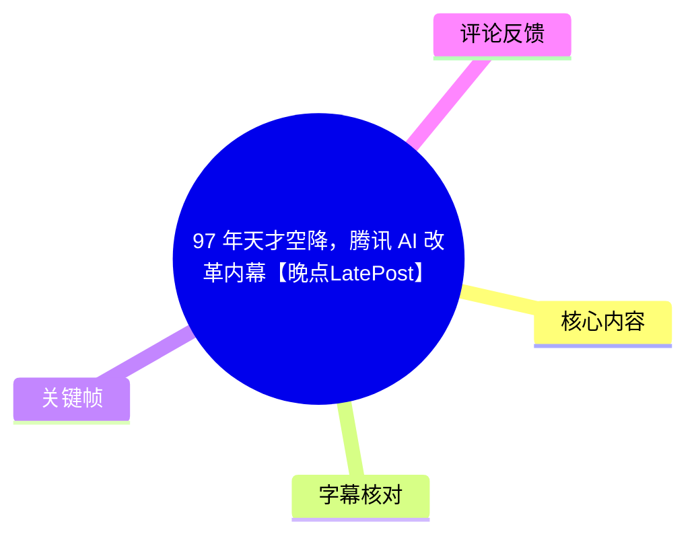
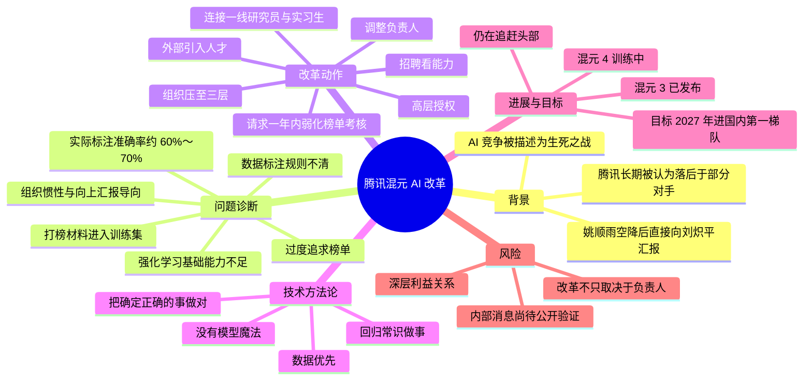
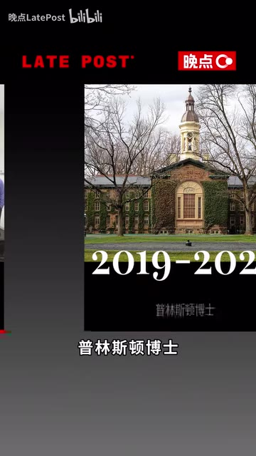
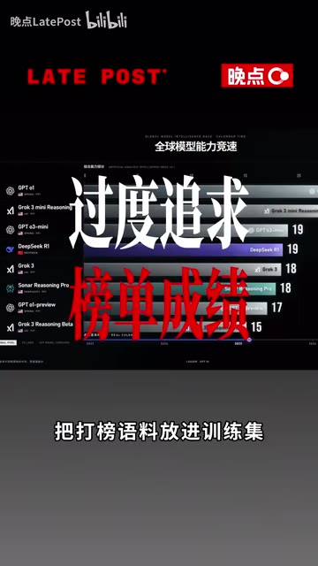
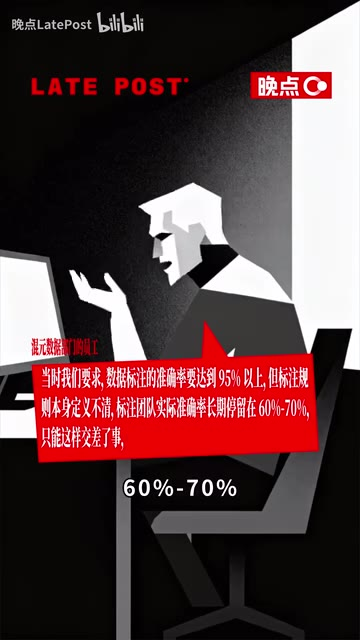

# 97 年天才空降，腾讯 AI 改革内幕【晚点LatePost】

> 来源：[Bilibili 视频](https://www.bilibili.com/video/BV1p7GN6JE6u)  
> UP 主：晚点LatePost｜发布时间：2026-08-03｜视频时长：05:11  
> 说明：这是一则基于多位腾讯内部人士采访的新闻报道。文中“了解到”“内部人士称”“内部判断”等内容均为视频转述，不等同于已由腾讯或相关个人公开证实的事实。

## 小结

视频聚焦 1997 年出生的姚顺雨加入腾讯约 300 天后，对混元大模型团队所做的组织与研发改革。报道认为，腾讯 AI 的核心问题不只是模型技术落后，还包括过度追求榜单、评测数据污染、数据标注规则混乱、强化学习基础不足，以及大公司内部围绕汇报和既有利益形成的惯性。

姚顺雨的首要诊断是：此前团队把“打榜材料”放入训练集，导致模型更擅长回答见过的题目，却无法在真实场景中稳定发挥；数据标注虽被要求达到 95% 以上准确率，但由于规则不清，实际准确率长期只有 60%～70%。视频将这概括为“几乎每个环节都在漏水”。

其改革路径包括争取高层授权、暂时弱化榜单压力、调整团队负责人、从字节跳动、Kimi、DeepSeek、美团等外部机构引入人才、以能力而非学历资历作为招聘标准、压缩组织层级，并加强与一线研究员和实习生的技术交流。报道强调，这并非一次彻底清洗，而是借由高水平新人进入组织形成技术压力和竞争氛围。

技术层面，视频的核心方法论是“没有魔法”：基础模型架构未必存在神秘捷径，真正困难的是持续把数据、训练、评测等确定正确的环节做好。姚顺雨据称尤其重视数据质量，并将其作为影响模型效果的关键变量。

结果方面，视频称 7 月发布的混元 3 是姚顺雨空降后的首份成绩单，相比上一代有显著提升；但混元内部仍认为距离国内第一梯队存在差距。混元 4 已在训练，内部预期仍处于追赶状态；报道所称目标是 **2027 年进入国内第一梯队**。这属于有明确时效的内部计划，后续可能调整。

本视频适合关注大模型研发流程、AI 组织治理、大厂创新困境，以及“技术负责人如何获得组织授权”的读者。需要注意的是，视频没有提供模型评测原始数据、训练配置、组织调整名单或腾讯官方回应，因此不能将其作为对混元技术能力或企业内部治理的完整定论。

## 思维导图

## 目录

- [背景：AI 竞争与姚顺雨空降](#背景ai-竞争与姚顺雨空降)
- [问题一：榜单导向与训练数据污染](#问题一榜单导向与训练数据污染)
- [问题二：数据标注与强化学习短板](#问题二数据标注与强化学习短板)
- [改革步骤：争取授权、重组人员与压缩层级](#改革步骤争取授权重组人员与压缩层级)
- [组织经验：以技术压力替代单向命令](#组织经验以技术压力替代单向命令)
- [数据优先与“没有魔法”的方法论](#数据优先与没有魔法的方法论)
- [进展、目标与改革限制](#进展目标与改革限制)
- [关键帧索引](#关键帧索引)
- [字幕比对](#字幕比对)
- [评论分析](#评论分析)
- [处理记录](#处理记录)

## 背景：AI 竞争与姚顺雨空降 [00:30](https://www.bilibili.com/video/BV1p7GN6JE6u?t=30)

视频开篇将 AI 描述为互联网公司的“生死之战”，并以字节跳动、阿里、智谱、Kimi、DeepSeek 等公司或产品为竞争背景，称腾讯长期处于被追赶的局面。

报道转述马化腾在当年 5 月股东大会上的比喻：一年前“以为上了船”，后来才发现“船漏水了”。在这一背景下，腾讯以高成本引入姚顺雨，试图补齐混元大模型的研发与组织短板。

视频展示和转述的姚顺雨背景包括：

- 本科毕业于清华大学姚班；
- 获普林斯顿博士学位；
- 博士毕业后加入 OpenAI；
- 28 岁时空降腾讯；
- 加入后直接向腾讯总裁刘炽平汇报；
- 被视频称为国内大模型行业中最年轻的技术负责人之一。

> 图：画面呈现“普林斯顿博士”等履历信息。它有助于理解视频为何将姚顺雨定位为“空降的技术型负责人”；不过履历画面本身不能证明视频中关于其职责范围、汇报关系和改革效果的全部说法。

视频认为，腾讯的问题并非单一技术问题。作为中国最赚钱的互联网公司之一，腾讯同时被诟病创新不足、赛马机制强、部门壁垒重。姚顺雨的第一项任务，被报道概括为排查混元长期落后的原因。

## 问题一：榜单导向与训练数据污染 [00:55](https://www.bilibili.com/video/BV1p7GN6JE6u?t=55)

视频称，姚顺雨首先指出混元的评测机制存在问题：此前团队过度追求模型在榜单上的名次，并将用于“打榜”的材料放入训练集。

这里涉及一个关键技术风险：**评测集或与评测高度相关的材料进入训练集，会使评测成绩失真。**

可以将视频描述的问题拆为以下链条：

1. 团队以榜单成绩为重要目标；
2. 为提高榜单表现，使用与榜单题目相关的材料训练模型；
3. 训练数据与评测目标发生污染或泄漏；
4. 模型在特定题型上更容易取得高分；
5. 真实用户场景中的泛化能力却不一定提升。

视频的判断是，这会使模型“很会答题”，但真实表现较差。需要区分的是：报道没有给出具体榜单名称、被纳入训练的数据范围、污染比例，也没有提供污染前后的量化对比。因此，能够确认的是视频提出了这一指控与解释框架，不能据此计算实际影响幅度。

> 图：画面直接标出“过度追求榜单成绩”“把打榜语料放进训练集”，是理解本段最关键的视觉证据。其价值在于辅助校正 ASR 中“刷榜”“打榜预料”等识别错误，并明确视频所批评的是评测—训练边界被破坏。

## 问题二：数据标注与强化学习短板 [01:19](https://www.bilibili.com/video/BV1p7GN6JE6u?t=79)

视频继续将问题指向数据环节。一位被匿名处理的腾讯数据部门员工向《晚点》表示，当时对数据标注准确率的要求是 **95% 以上**；但由于标注规则定义不清，标注团队实际准确率长期停留在 **60%～70%**，只能以此交差。

这组参数是全片最具体的流程质量指标：

| 项目 | 视频所述数值 | 含义 |
| --- | ---: | --- |
| 数据标注要求准确率 | 95% 以上 | 管理或项目层面设定的质量目标 |
| 实际标注准确率 | 60%～70% | 在规则不清条件下，团队实际达到的水平 |
| 差距 | 约 25～35 个百分点 | 反映目标与可执行规则、交付质量之间存在显著落差 |

视频没有说明“准确率”的统计口径，例如是抽检准确率、多人一致性、验收通过率，还是某一批次的标注结果。因此，上表只整理视频明确口述的数值，不能与其他公司的标注指标直接横向比较。

> 图：画面明确呈现“要求准确率达到 95% 以上”与“实际准确率长期停留在 60%～70%”的对比。这张关键帧为视频的核心量化说法提供了直观锚点，也帮助确认 ASR 中“数捷”“标著”等误识别对应“数据”“标注”。

在训练环节，视频还转述内部人士的说法：混元“几乎没做过强化学习”，原因不是团队不想做，而是基础模型能力不支持。由此带来的表现被描述为更像搜索引擎：能够回答见过答案的问题，但推理能力不足，也难以在推理过程中发现或纠正错误。

这段内容涉及三个层次：

- **基础模型能力**：是后续训练、对齐与强化学习能够有效开展的前提；
- **强化学习**：视频将其视为提升模型推理、任务执行和行为质量的重要环节；
- **数据质量**：不清晰的标注规则会直接削弱监督数据与后训练数据的价值。

但视频没有披露混元当时采用何种强化学习范式、奖励模型结构、训练数据规模、算力资源或各项能力基准，故不能将“几乎没做过强化学习”延展为对具体技术栈的判断。

## 改革步骤：争取授权、重组人员与压缩层级 [02:07](https://www.bilibili.com/video/BV1p7GN6JE6u?t=127)

视频称，姚顺雨将腾讯 AI 的状态比作一艘长期围绕“向上汇报”打转的漏水船：表面工作仍在推进，但问题被隐藏在水面以下。面对这种惯性，他首先争取到的是高层授权。

### 1. 暂时弱化榜单考核

据报道，姚顺雨刚进入腾讯时便向刘炽平请求：从新模型发布起，至少一年内希望高层不要看榜单。

视频给出的时间参数是：

- **期限：至少一年**
- **对应训练节奏：约两代模型**

这一安排的逻辑是，为研发团队留出纠正训练、数据与模型基础问题的窗口，避免短期榜单压力再次驱动“为评测而训练”的行为。刘炽平据称同意了这一请求。视频将其同时描述为“缓冲期”和“军令状”：高层给予试错空间，但团队也需以中长期结果回应授权。

### 2. 调整负责人并引入外部人才

视频称，自“去年下半年以来”，混元部分团队已更换负责人；新人来自字节跳动、Kimi、DeepSeek、美团等公司。招聘标准被概括为“不看学校、年龄、资历，只看能力”。

报道进一步给出两个组织设计细节：

- 混元模型架构负责人是一位在读博士生；
- 部门层级被压缩到 **三层**。

### 3. 把重心放到一线研究者

视频称，姚顺雨最关注一线研究员，并会与实习生交流至深夜。这里传达的并不是一项可复用的固定管理制度，而是一种组织信号：技术负责人试图缩短与实际研究、工程问题之间的反馈链路。

上述改革动作可整理为一个顺序化框架：

1. **诊断系统性问题**：从榜单、数据、训练和组织惯性切入；
2. **获得高层授权**：建立一年左右的中期研发窗口；
3. **重组关键岗位**：替换部分负责人、外部引才；
4. **重设选人标准**：弱化学历、年龄和资历，强调实际能力；
5. **压缩管理链条**：将层级控制在三层；
6. **增强一线连接**：让技术讨论直接抵达研究员与实习生；
7. **以数据与训练质量检验改革结果**：而非只以短期榜单排名检验。

## 组织经验：以技术压力替代单向命令 [02:55](https://www.bilibili.com/video/BV1p7GN6JE6u?t=175)

视频特别强调，改革并非“疾风骤雨式的大清洗”。一位混元人士称，原有员工曾等待被裁撤，但实际仍有许多人留在管理岗位和一线岗位。

视频提出的组织经验是：与其仅依赖自上而下的行政命令，不如让高水平人才和高密度技术交流在团队内形成可感知的能力压力。

报道中的具体表现包括：

- 新人能力被老员工评价为显著更强；
- 姚顺雨会在混元大群中发论文、讨论技术；
- 能跟上讨论的人不多，有时成员甚至看不懂；
- 某个小组若有来自字节 Seed 的成员加入，团队会很快“自发卷起来”。

视频的观点是，这种由同行能力差异带来的压力，比单向命令更能提升团队战斗力。它可以被理解为一种“标准外显化”机制：技术标准不只写在 KPI 或制度里，也通过人才密度、公开技术讨论和共同协作被日常化。

不过，该机制同样存在边界：

- 高压竞争不天然等于健康协作；
- 技术讨论门槛过高可能造成信息壁垒；
- 外部人才快速进入能否与旧团队形成稳定合作，取决于激励、权责和资源分配；
- 留任旧员工并不必然消除历史流程、利益结构和评价体系的影响。

## 数据优先与“没有魔法”的方法论 [03:19](https://www.bilibili.com/video/BV1p7GN6JE6u?t=199)

视频称，在混元 3.0 正式发布前约一个月，姚顺雨因一批数据出现问题、直接影响模型效果而罕见发火，并严厉警告：“数据非常重要，再出现这样的情况直接走人。”

这件事在报道中的意义不止于一次管理冲突，而是再次明确了改革优先级：**数据问题不是后端交付瑕疵，而是会直接决定模型效果的核心研发问题。**

视频称，姚顺雨在新模型训练前以 OpenAI 为例，表达了两项判断：

1. 即使到当时，OpenAI 的基础模型也没有所谓神秘技术；
2. 基础架构与 2023 年相比没有根本性变化。

据此，他提出的核心方法论是：

> 做大模型没有魔法，也不要相信别人有魔法。真正难的是把确定能做对的事情都做对。

按照视频语境，“确定能做对的事”至少包括：

- 保持训练集、验证集、评测集之间的边界；
- 用定义清晰、可验收的规则进行数据标注；
- 对数据异常快速定位与追责；
- 建设支持后训练与强化学习的基础模型能力；
- 不把单次榜单成绩等同于真实产品能力；
- 建立可让一线技术人员直接反馈问题的组织结构。

这是经验性原则而非具体工程配方。视频没有披露数据治理制度、标注供应商管理办法、训练基础设施参数或模型架构，因而无法据此复现混元的训练流程。

## 进展、目标与改革限制 [04:08](https://www.bilibili.com/video/BV1p7GN6JE6u?t=248)

视频将 7 月发布的混元 3 称为姚顺雨空降腾讯后的第一份成绩单，并称其相比上一代已有大幅提升。但报道同时指出，混元内部仍清楚自己与国内第一梯队有差距。

视频所述进展与规划如下：

| 时间或状态 | 视频陈述 | 需注意的边界 |
| --- | --- | --- |
| 7 月 | 混元 3 发布 | 未提供具体版本号、公开榜单或产品指标 |
| 发布后 | 相比上一代有大幅提升 | “大幅”没有量化定义 |
| 当前研发状态 | 混元 4 已在训练中 | 未披露训练时间、参数规模、发布日期 |
| 内部判断 | 仍是追赶头部的状态，但差距会明显缩小 | 属内部预期，不是结果 |
| 目标年份 | 2027 年进入国内第一梯队 | 属未来计划，可能受技术、产品、组织和市场变化影响 |

视频的结尾将腾讯的处境与百度曾引入陆奇的历史作对照：陆奇曾在搜索广告这一核心业务上调整利益格局，最终任职一年多后离职。报道以此说明，改革走入深水区后，成败不只取决于改革者个人能力，还取决于其能否处理触及核心利益的组织阻力。

最后，视频认为当前 AI 战争已不同于过去，并以“腾讯不想成为大号百度、姚顺雨也不是小号陆奇”收束叙事。这是媒体的评论性表达，不能视为对腾讯未来结果的事实预测。

## 关键帧索引

| 关键帧 | 正文用途 | 画面价值与依据 |
| --- | --- | --- |
|  | 背景章节 | 展示“普林斯顿博士”等履历信息，用于辅助确认人物背景。 |
|  | 问题总览 | 画面文字为“姚顺雨空降腾讯，都发现了什么问题？”，适合作为从人物背景转入问题诊断的视觉节点。 |
|  | 榜单与数据污染章节 | 明示“过度追求榜单成绩”“把打榜语料放进训练集”，是本片核心技术批评的直观概括。 |
|  | 数据标注章节 | 清晰呈现“95% 以上”目标与“60%～70%”实际准确率，支持正文中的参数整理。 |

> 关键帧素材未附逐帧采样时间戳，因此本文不为图片虚构精确出现时间；章节时间轴均依据 ASR SRT 的真实分段起始时间生成。

## 字幕比对

| 字幕来源 | 完整性 | 专有名词 | 时间轴 | 主要问题 |
| --- | --- | --- | --- | --- |
| Bilibili 站内字幕 | 未提供可用字幕，无法比较正文完整性 | 无法核验 | 无可用分段 | 素材中明确标注“未提供可用站内字幕” |
| 本次 ASR 字幕 | 覆盖约 279.77 秒语音，覆盖率 90.22%；首段为 00:30.180，末段为 05:09.950 | 存在较多同音字、错字和断句错误 | 有 13 段真实 SRT 时间戳，可用于章节链接 | 首段文本被异常压缩在 0.8 秒内；“腾讯、混元、姚顺雨、刘炽平、数据标注、强化学习”等词多处误识别 |

本次 ASR 使用 `large-v3-turbo`，识别语言为中文，语言置信度为 `0.998046875`。诊断信息未标记 `noAudioStream=true`，且已成功提取并识别音频，因此本视频并非无音轨素材。

最终采用策略为：**以本次 ASR 的 SRT 时间轴作为时间定位依据，以视频标题、元数据、关键帧文字和上下文对明显专有名词进行有限校正。**由于不存在可用站内字幕，无法进行逐句双源校验。

主要校正如下：

| ASR 误识别或不稳定写法 | 正文采用写法 | 校正依据 |
| --- | --- | --- |
| 腾信、腾迅、腾途讯 | 腾讯 | 视频标题、元数据与上下文 |
| 魂元、魂远、魂约、混运 | 混元 | 腾讯大模型名称及上下文 |
| 姚顺宇、姚舜与、姚身宇等 | 姚顺雨 | 视频标题、描述与关键帧文字 |
| 刘齿平、刘之平 | 刘炽平 | 腾讯总裁姓名与上下文 |
| 数捷、数捡 | 数据 | 语境及“数据标注”关键帧 |
| 标著、标出团队 | 标注、标注团队 | 语境及关键帧文字 |
| 打榜预料 | 打榜语料 | 关键帧明确文字 |
| 强严重 | 部门墙严重／部门壁垒重 | ASR 不稳定；正文采用更谨慎的概括，不将其视为逐字引语 |

特别说明：部分人物履历、内部汇报关系、训练状态和未来目标来自报道叙述。即使经过专有名词校正，也不意味着这些内容已获得企业公开确认。

## 评论分析

以下仅处理可获取的热评前三条。评论反映的是个体经历或观点，不作为已验证事实。

### 1. 一任人猜心上事（243 赞）

评论者自述曾面试混元的数据标注评测外包岗位：完成面试题后通过初筛，但面试官迟到、不开视频、沟通态度较傲慢；首次未通过后，又在数日后被告知可再给一次机会。

- **核心观点**：招聘流程不规范、沟通体验不佳，可能折射外包岗位管理问题。
- **补充价值**：从求职者视角补充了视频中“数据标注”和组织管理的讨论。
- **可信度与边界**：这是单一个案，且涉及外包岗位，无法外推至混元全部团队或腾讯整体招聘流程；评论未提供可核验材料。

### 2. 经神科童主任（94 赞）

评论者认为腾讯仍在用旧的组织方式做事，建议另设一家与母公司交叉持股的新子公司，以减少内部掣肘，并类比谷歌与甲骨文。

- **核心观点**：大厂 AI 改革若受原有组织制约，可通过独立组织承载创新。
- **补充价值**：回应视频关于“大厂内部根深蒂固顽疾”和利益关系的讨论，提出“组织隔离”的替代方案。
- **可信度与边界**：这是管理建议，不是对腾讯现有架构的事实披露；类比对象及“交叉持股”方案在评论中没有展开其适用条件和治理成本。

### 3. 薇儿胃大无需多言（83 赞）

评论者认为，若做实事的人无法获得奖励，员工缺乏认真工作的动力；并批评大厂结构僵化、管理者不懂 AI 而只看数据，导致前端人员敷衍、后续团队难以从头训练模型而继续延续问题。

- **核心观点**：激励错配、管理认知不足和技术债会共同固化低质量产出。
- **补充价值**：与视频的“向上汇报导向”“过度看榜单”“数据问题”形成呼应。
- **可信度与边界**：该评论是概括性判断，未指明具体公司、团队和证据；“不能从头训练模型”等说法不应视为本视频所涉团队的已证实技术事实。

## 处理记录

- Worker ID：`worker-mrj0wbly-5dc4e50c`
- 模型：`gpt-5.6-terra`
- ASR 模型：`large-v3-turbo`（中文识别，CUDA，`int8_float16`）
- 使用的素材与工具结果：
  - 视频元数据与 Bilibili 统计信息；
  - 音频提取产物：`audio/audio.wav`；
  - 本次 ASR 分段结果：`asr/asr-result.json`；
  - 本次 ASR 时间轴字幕：`asr/transcript.srt`；
  - 关键帧目录：`frames/`；
  - 热评数据：`comments/comments.json`。
- 字幕选择：站内字幕未提供可用版本；已检查本次 ASR，采用其 13 段 SRT 的起止时间生成章节时间轴，并依据标题、元数据、关键帧和上下文校正明显专名错识别。
- 关键帧选择依据：选用 `frame-001` 至 `frame-004`，原因是画面分别包含人物履历、问题引入、榜单训练数据污染、数据标注准确率等与正文直接对应的可读文字；关键帧未提供采样秒数，未将其作为精确时间轴依据。
- 评论处理范围：仅分析接口可获取的热评前三条，未扩展至更多评论或楼中楼。
- 缓存清理：提供的素材未包含缓存清理执行记录；为避免编造，无法确认是否已清理缓存。
- 未解决问题：
  - 无可用站内字幕，无法对 ASR 做逐句交叉核对；
  - ASR 首段存在文本与时长明显不匹配的问题；
  - 视频中的内部人士说法、模型训练状态、组织调整和 2027 年目标未附原始材料或腾讯官方回应；
  - 关键帧缺少对应采样时间戳。
