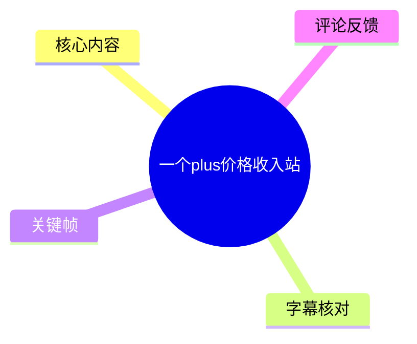
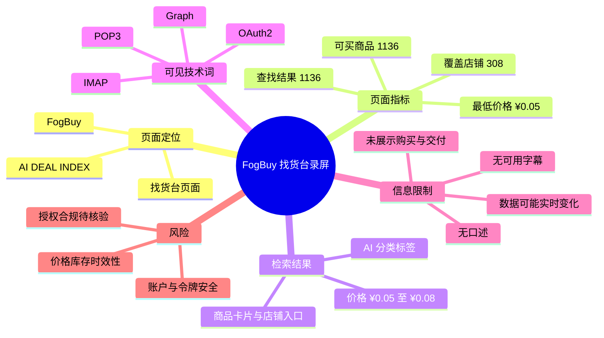
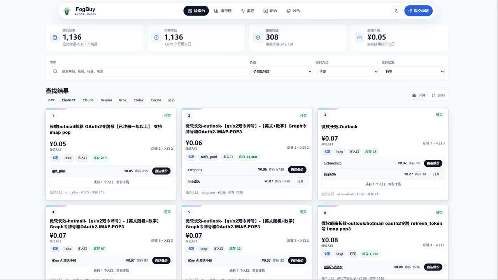

# 一个plus价格收入站

> 来源：[Bilibili 视频](https://www.bilibili.com/video/BV1Gs786JESa) 
> UP 主：FgoMaly ｜发布时间：2026-06-25（元数据仅提供日期）｜视频时长：11 秒 
> 视频简介：`一键三联私信获取`

## 小结

视频为一段约 11 秒的网页录屏，画面主体是名为 **FogBuy / AI DEAL INDEX** 的站点“找货台”页面。标题称其为“plus价格收入站”，但视频中没有口述说明，也没有展示收入、结算、提现或实际购买流程；因此，能够确认的是该页面展示了与 AI 相关商品/入口的检索及价格列表，而不能据此确认其“收入站”属性或商业效果。

页面顶部显示了四项聚合指标：查找结果 **1,136**、可买商品 **1,136**、覆盖店铺 **308**、最低价格 **¥0.05**。这些均为录屏时刻的页面展示值，不能视为持续有效的库存、商家数或市场报价。

页面的结果区提供 GPT、ChatGPT、Claude、Gemini、Grok、Codex、Cursor、搜索等分类标签，并展示若干低价条目。可见条目涉及 Outlook/Hotmail 邮箱、OAuth2 令牌号、Graph 令牌号、IMAP/POP3 等字样，标价在 **¥0.05—¥0.08** 之间。视频未展示商品来源、合规授权、付款、交付、退款、账号归属或服务稳定性。

对希望了解“低价 AI 相关资源聚合页面”界面的人，本视频可作为极简界面记录；对准备购买、使用或依赖这些条目的人，视频提供的信息严重不足。尤其是涉及邮箱、令牌、OAuth2、Graph、IMAP/POP3 等可能关联账户访问权限的内容，应先核验合法授权、平台规则、隐私及安全风险，不应仅凭页面截图作出使用决定。

由于没有可用站内字幕，本次 ASR 也未识别到任何语音分段，本文只能基于视频画面、元数据和可获取评论整理；不补写画外音、操作步骤或收益逻辑。

## 思维导图

## 目录

- [视频范围与证据边界](#视频范围与证据边界)
- [找货台页面与统计指标](#找货台页面与统计指标)
- [检索、筛选与结果卡片](#检索筛选与结果卡片)
- [可见技术词与使用限制](#可见技术词与使用限制)
- [时效性、风险与结论](#时效性风险与结论)
- [字幕比对](#字幕比对)
- [评论分析](#评论分析)
- [处理记录](#处理记录)

## 视频范围与证据边界 [00:00](https://www.bilibili.com/video/BV1Gs786JESa?t=0)

本视频总时长为 11 秒。现有 ASR 结果为空，未提供站内 SRT 或其他可用站内字幕；关键帧画面均为同一网页界面附近的静态录屏内容。因此，以下内容严格区分为：

- **可由画面直接确认的信息**：站点名称、页面栏目、列表标签、可见价格、统计数字与部分商品文字。
- **来自元数据的信息**：视频标题、简介、标签、发布日、互动统计。
- **不能确认的信息**：UP 主对页面的评价、实际成交情况、商品真实性、可用性、收益方式、服务授权与操作结果。

视频标题中的“plus”可能指向 GPT/ChatGPT Plus 等相关需求场景，但画面没有明确展示“Plus 订阅购买”页面，也没有显示官方产品定价或订阅状态。元数据标签包含“价格”“plus”“gpt”，只能说明投稿者使用了这些标签，不能替代页面功能或商品属性的证明。

## 找货台页面与统计指标 [00:00](https://www.bilibili.com/video/BV1Gs786JESa?t=0)

画面左上角为 **FogBuy** 标识，副标题为 **AI DEAL INDEX**。顶部导航中，“找货台”处于选中状态；同排还能看到“排行榜”“监控”“后台”“公告”等入口。右上角可见月亮图标及“提交申请”按钮。

页面的四个数据卡片如下：

| 指标 | 画面显示值 | 画面附带说明 | 解读边界 |
| --- | ---: | --- | --- |
| 查找结果 | 1,136 | 全站收录 4,307 个商品 | 是录屏当刻的站内汇总展示，不等于已验证可交易数。 |
| 可买商品 | 1,136 | 1,619 个可用入口 | 仅为页面自述；视频没有打开入口或验证可购买性。 |
| 覆盖店铺 | 308 | 当前库存 242,324 | 未说明“库存”的计量对象、更新频率或统计规则。 |
| 最低价格 | ¥0.05 | 当前最低价格入口 | 是可见最低标价，不代表所有类别、所有时段或最终成交价。 |

> 图：关键帧集中呈现 FogBuy 页面名称、四项统计卡、筛选栏与首屏商品卡片，是核对本视频核心画面信息与价格范围的主要依据。由于未提供关键帧对应的精确时间戳，图片仅用于画面佐证，不被赋予具体秒点。

从界面可见，视频并非演示某项完整业务流程，而是将焦点放在“可检索的低价条目列表”上。标题关于“收入站”的说法在画面中没有对应的收益数据、订单数据或结算页面支撑，阅读时应避免将标题表述扩大为已证实事实。

## 检索、筛选与结果卡片 [00:00](https://www.bilibili.com/video/BV1Gs786JESa?t=0)

页面在统计卡片下方提供检索与筛选控件，可见字段包括：

1. **搜索框**：占位提示为“搜索商品、店铺、标签、来源”。
2. **价格筛选**：显示“价格”，下拉项为“价格低到高”。
3. **交付方式**：下拉筛选，当前为“全部”。
4. **库存情况**：下拉筛选，当前为“有货”。
5. **展示形式**：结果区右上角可切换“卡片”和“表格”，当前画面为卡片视图。
6. **分类标签**：GPT、ChatGPT、Claude、Gemini、Grok、Codex、Cursor、搜索。

这些元素表明页面设计为按商品、店铺、标签、来源、价格、交付方式与库存状态定位条目。**但视频未展示输入关键词、点击标签、修改筛选条件、切换视图或进入商品详情的过程**，因此无法整理出经过验证的实际操作路径。

首屏可见的卡片按价格排列，价格如下：

| 卡片序号 | 可见标题摘要 | 标价 | 可见状态/信息 |
| ---: | --- | ---: | --- |
| 1 | 长效 Hotmail 邮箱、OAuth2 令牌号等字样 | ¥0.05 | 显示“可买”；卡片内可见店铺与库存信息。 |
| 2 | 微软长效 Outlook、Graph 令牌号、OAuth2、IMAP-POP3 等字样 | ¥0.06 | 显示“可买”；可见多入口/多店铺样式信息。 |
| 3 | 微软长效 Outlook 等字样 | ¥0.07 | 显示“可买”；可见库存与店铺入口信息。 |
| 4 | 微软长效 Hotmail、Graph 令牌号、OAuth2-IMAP-POP3 等字样 | ¥0.07 | 显示“可买”。 |
| 5 | 微软长效 Outlook、Graph 令牌号、OAuth2-IMAP-POP3 等字样 | ¥0.07 | 显示“可买”。 |
| 6 | 微软邮箱长效、Outlook/Hotmail OAuth2 令牌、refresh_token、imap、pop3 等字样 | ¥0.08 | 显示“可买”。 |

> 图：该关键帧保留了首屏六张结果卡片、¥0.05—¥0.08 的价格梯度及“可买”标记，适合说明视频展示的是列表检索界面，而非购买或交付实录。画面中文字较小，本文仅记录可辨识的关键词，不对模糊店铺名、库存数或完整商品标题作超出画面证据的转写。

### 可复现的界面观察步骤

以下是根据**可见控件**整理的观察顺序，并不代表视频已经实际执行：

1. 打开 FogBuy 的“找货台”页面。
2. 在搜索框中按商品、店铺、标签或来源进行检索。
3. 通过价格排序、交付方式和库存情况缩小结果。
4. 通过 GPT、ChatGPT、Claude、Gemini、Grok、Codex、Cursor 等标签观察不同分类。
5. 在卡片或表格视图中查看结果条目、标价、店铺入口和库存标签。
6. 如需进入后续购买或交付环节，必须另行核验平台规则、授权来源、账户安全、退款机制与所在地区法律要求；本视频没有提供这部分证据。

## 可见技术词与使用限制 [00:00](https://www.bilibili.com/video/BV1Gs786JESa?t=0)

画面商品标题中可见以下技术相关词汇：

| 词汇 | 一般技术含义 | 视频可确认范围 |
| --- | --- | --- |
| OAuth2 | 常见的授权框架，用于令牌化授权访问。 | 仅能确认该词出现在商品标题中，无法确认具体授权范围、令牌来源或有效性。 |
| Graph | 通常可能指 Microsoft Graph 相关接口或令牌语境。 | 画面出现“Graph 令牌号”等文字；未展示接口调用、权限清单或实际验证。 |
| IMAP | 常用于邮件客户端读取邮件的协议。 | 仅见于商品标题，未展示服务器配置或连接测试。 |
| POP3 | 常用于邮件客户端下载邮件的协议。 | 仅见于商品标题，未展示服务器配置或连接测试。 |
| refresh token | 通常指用于刷新访问令牌的凭据。 | 仅见于一张卡片的标题文字；不能据此推断其合法性、有效期或权限。 |

这些词语具有账户访问、身份认证或邮件协议关联性。视频没有说明这些条目是否来自账户所有者的明确授权，亦未展示用途限制。对于任何涉及第三方账号、邮箱、访问令牌、授权码或登录凭据的资源，至少应注意：

- 不使用来源不明、未经账户所有者授权的账号或令牌；
- 不在不可信页面提交个人账号、密码、验证码、恢复码或支付信息；
- 不把页面的“可买”“有货”“长效”等营销性文字视为技术或法律保证；
- 核验目标服务的服务条款、API 使用政策、数据保护要求及所在地法律；
- 以官方订阅、正规授权渠道或自有账户方案优先替代风险不明的第三方资源。

上述为基于画面技术词所作的审慎风险提示，不是对画面中任一商品来源、用途或违法性的事实判定。

## 时效性、风险与结论 [00:00](https://www.bilibili.com/video/BV1Gs786JESa?t=0)

### 时效性

视频发布日为 2026-06-25，素材抓取时间为 2026-07-15。页面中的价格、库存、店铺覆盖数和可买状态均具有明显的实时性，可能在录屏后发生变化。尤其是：

- **最低价格 ¥0.05** 只对应录屏时刻可见页面的最低展示价格；
- **1,136、308、242,324** 等数字是页面当时的统计展示，未提供统计口径或历史趋势；
- 商品卡片中的库存、店铺、入口和“可买”状态不能外推至当前；
- 视频没有展示站点 URL、账号体系、支付通道、售后承诺或具体服务协议，无法独立复核。

### 结论

视频的有效信息是：UP 主展示了一个名为 FogBuy、带有 AI DEAL INDEX 标识的“找货台”检索页面；该页面以卡片形式陈列含 AI 分类标签与邮箱/令牌相关关键词的低价条目，首屏价格约为 ¥0.05—¥0.08。

视频未能证明的内容包括：该站点是否为“Plus 价格收入站”、是否存在稳定收益、所有条目是否有效、是否可合法购买使用、是否支持何种交付或售后。面对涉及账户和授权令牌的条目，应把“来源与授权核验”置于价格比较之前。

## 字幕比对

| 字幕来源 | 完整性 | 专有名词 | 时间轴 | 主要问题 |
| --- | --- | --- | --- | --- |
| Bilibili 站内字幕 | 无可用字幕 | 无法核验 | 无 | 素材明确说明未提供可用站内字幕。 |
| 本次 ASR 字幕 | 空 | 无法识别 | 无可用分段 | 已执行 ASR（medium，自动语言识别为 en，置信度 0.541015625），结果为 0 个语音片段、语音覆盖率 0；诊断提示未识别到可听语音。 |

最终未采用任何字幕文本作为正文事实来源。时间轴链接统一指向 **00:00**，原因是：

1. 本次 ASR 没有输出 `HH:MM:SS,mmm --> HH:MM:SS,mmm` 形式的真实分段；
2. 无站内 SRT 可交叉引用；
3. 关键帧虽可证明画面内容，但未提供与帧文件一一对应的精确秒点；
4. 因而不能按文字内容猜测章节发生时刻。

本次通过画面校正和保留的关键名称/术语包括：**FogBuy、AI DEAL INDEX、找货台、GPT、ChatGPT、Claude、Gemini、Grok、Codex、Cursor、OAuth2、Graph、IMAP、POP3、refresh_token**。其中技术词均仅作为画面可见文本记录，不补充不存在的语音解释。

## 评论分析

可获取热评共 2 条，少于“热评前三条”的上限；以下仅分析实际可获得内容，评论不作为已验证事实。

1. **FogMaly：**“UP主加油！”（获赞 2）  
   - 观点：对 UP 主表达鼓励。  
   - 补充信息：没有提供站点功能、商品质量、价格真实性或使用经验。  
   - 可信度与争议：属于情感支持，不构成对视频所示服务的背书。

2. **FgoMaly：**“一键三联私信获取 [打call][打call][打call]”（获赞 1）  
   - 观点：引导观众通过私信获取更多信息，并号召“一键三连”。  
   - 补充信息：没有公开说明私信将提供何种内容，也没有公开验证页面或商品的可用性。  
   - 可信度与争议：评论用户名与视频 UP 主名称高度相似，但仅可确认昵称相近，不能据此推断账户关系或私信内容；“私信获取”也不替代公开、可核验的说明与合规证明。

未获取到第 3 条热评，因此不虚构补充评论。

## 处理记录

- **Worker ID**：worker-mrj0www4-e8d79408
- **模型**：gpt-5.6-terra
- **调用工具与素材**：视频元数据、已生成的音频与 ASR 诊断、关键帧目录、评论 JSON、站内字幕目录检查。
- **本次 ASR 执行情况**：已执行；ASR 模型为 `medium`，设备为 CUDA，计算类型为 float16，自动语言识别为英语（概率 0.541015625），但未识别到语音片段，未生成可用字幕文本或时间戳。
- **字幕选择**：未提供可用 Bilibili 站内字幕；本次 ASR 输出为空。正文不采用字幕转写，只依据画面、元数据和评论；章节时间轴均保守链接至视频起点 00:00。
- **关键帧选择依据**：选用 `frames/frame-001.jpg` 说明页面整体结构、统计指标与筛选栏；选用 `frames/frame-006.jpg` 说明首屏结果卡片、价格范围和“可买”状态。两帧均展示核心网页内容，且不依赖不可见的操作结果。
- **关键帧时间限制**：素材未提供帧文件的精确采样时间，故不将帧序号等同于具体秒点。
- **缓存清理**：未提供可验证的缓存清理执行日志；不宣称已完成清理。
- **未解决问题**：无语音内容可供转写；无站内字幕；未展示站点链接、购买链路、交付方式、收益数据、授权证明、服务条款或售后机制；页面数据与商品状态均可能已变化。
