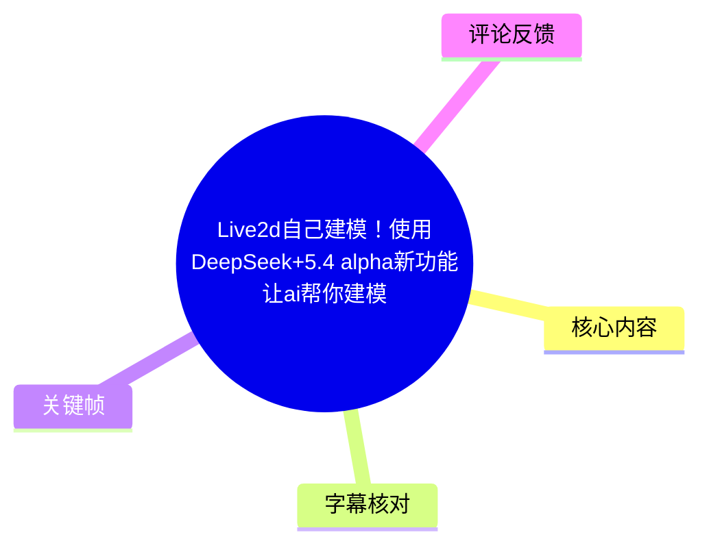
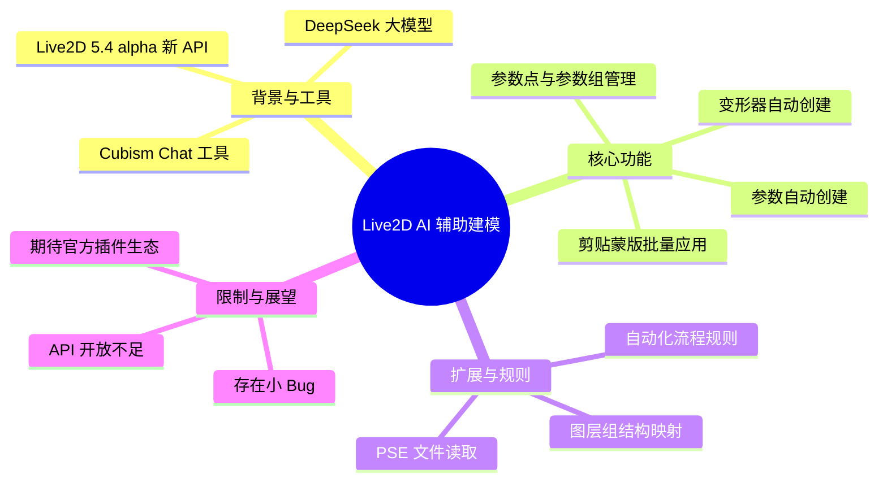
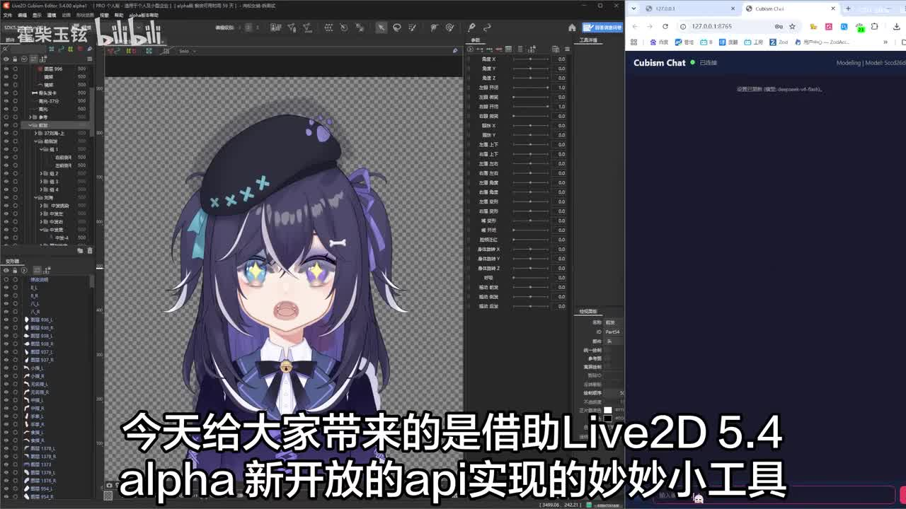
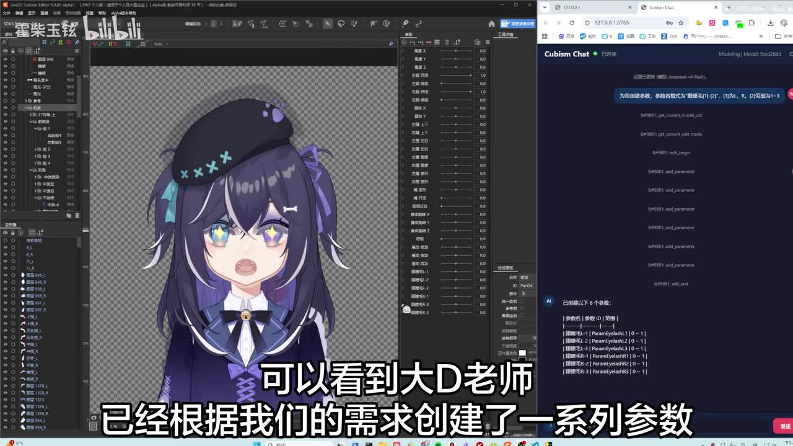
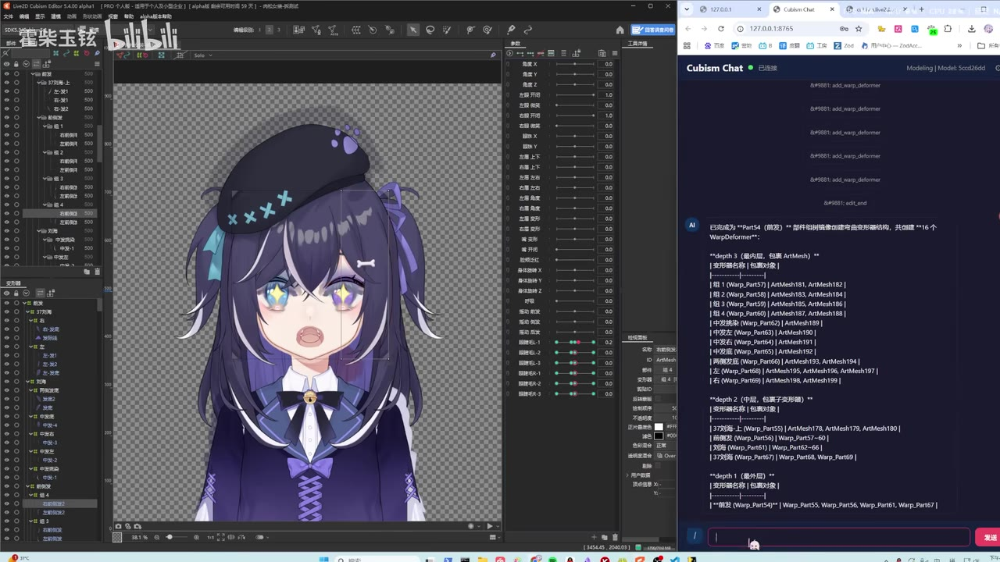

# Live2d自己建模！使用DeepSeek+5.4 alpha新功能让ai帮你建模

> 来源：[Bilibili 视频](https://www.bilibili.com/video/BV1sJKP6qECm) 
> UP 主：霍柴玉铉 | 发布时间：2026-07-16 | 视频时长：172

## 小结

视频介绍了 UP 主“霍柴玉铉”利用 Live2D 5.4 alpha 版本新开放的 API，结合 DeepSeek 大模型，开发的一款名为“Cubism Chat”的 AI 辅助建模小工具。该工具允许用户通过自然语言对话，让 AI 自动完成 Live2D 模型参数创建、参数点添加、参数组分组、变形器创建以及剪贴蒙版应用等繁琐的机械操作。适合希望提高 Live2D 建模效率、尤其是重复性劳动较多的 VTuber 或 Live2D 创作者。

关键限制在于：当前工具仅为 5.4 alpha 版本的尝鲜之作，依赖官方尚未完全开放的 API（如物理模拟、形状编辑等接口未开放）；工具存在小 Bug（如同名图层互相蒙可能蒙反）；且官方 API 开放程度有限，未来可能随版本更新而变化。

## 思维导图

## 目录

- [背景与问题](#背景与问题)
- [核心内容：参数与变形器创建](#核心内容参数与变形器创建)
- [方法与实践：规则扩展与剪贴蒙版](#方法与实践规则扩展与剪贴蒙版)
- [结论与限制](#结论与限制)
- [字幕比对](#字幕比对)
- [评论分析](#评论分析)
- [处理记录](#处理记录)

## 背景与问题

[00:32](https://www.bilibili.com/video/BV1sJKP6qECm?t=32)

Live2D 建模过程中，参数设置、变形器（WarpDeformer）创建以及剪贴蒙版（Clipping Mask）配置是极其繁琐且重复的机械劳动。例如，新建一个模型时，创作者往往需要花费大量时间设计基础的剪贴蒙版结构（俗称“头白脸”）。Live2D 5.4 alpha 版本新开放了部分 API，UP 主“霍柴玉铉”借此开发了“Cubism Chat”工具，旨在通过 AI 对话来自动化这些流程，降低建模门槛并提高效率。

## 核心内容：参数与变形器创建

[00:32](https://www.bilibili.com/video/BV1sJKP6qECm?t=32)

> 图：展示了 Live2D Cubism Editor 与右侧的 Cubism Chat 对话界面，直观呈现了通过自然语言与 AI 交互进行建模的场景。

视频首先演示了**参数创建**功能。用户只需通过对话告知 AI（视频中称为“大D老师”/DeepSeek）需求，例如“为眼睫毛(1)创建参数，范围为 1-3”，AI 即可自动在 Cubism Editor 中生成对应的参数（如 `ParamEyelash1`），并允许用户决定参数范围、是否为融合变形参数等。对话格式只需保证用户能理解即可。

> 图：右侧聊天窗口显示 AI 生成的 API 调用代码及最终创建的 6 个眼睫毛参数列表，左侧编辑器中参数面板已同步更新，验证了 API 调用的准确性。

接着是**添加参数点**和**参数组控制**。用户可以直接告诉 AI 给哪些部件添加参数点，或者选中部件后直接让 AI 处理。对于参数组，用户可要求 AI 进行分组并配置标签颜色，AI 能通过语义理解自动完成分组和颜色配置。

> 图：展示了 AI 根据图层组结构创建变形器（WarpDeformer）的结果，右侧显示了详细的变形器结构树（如 depth 3 的包裹对象、组 1-4 等），左侧编辑器中已生成对应的变形器节点。

随后演示了**变形器创建**。用户可通过对话让 AI 创建变形器。UP 主进一步展示了基于 API 扩展的**规则页面**（左下角按钮打开）。用户可以预先建立自动化流程规则，以后直接点击调用，无需每次重新解释。例如，演示了一个规则：根据图层组结构创建结构相同的变形器，只需将图层组 ID 发给 AI 即可。

## 方法与实践：规则扩展与剪贴蒙版

[01:07](https://www.bilibili.com/video/BV1sJKP6qECm?t=67)

除了官方 API 支持的功能，UP 主还展示了基于 PSE 文件的进一步扩展功能。通过读取 PSE 文件信息，可以在 LID 文件中应用与 PSE 一致的剪贴蒙版结构。这部分逻辑并非依赖 LID 新 API，而是 UP 主自行开发的解析逻辑。这一功能解决了“新建模型先设计半小时剪贴蒙板”的痛点，实现了蒙版的快速复用。

不过，UP 主也坦诚指出了当前版本的一个小 Bug：当两个同名的图层互相蒙时，可能会出现蒙反的情况，目前懒得修复。

## 结论与限制

[02:22](https://www.bilibili.com/video/BV1sJKP6qECm?t=142)

UP 主总结，目前版本的内容主要是给大家尝鲜。Live2D 官方虽然开放了部分 API，但仍有大量接口未开放，例如形状编辑、物理模拟、形状复制粘贴、动作反转等常用功能。UP 主希望官方在未来版本中能开放这些功能，甚至能像 Photoshop 那样直接开放插件生态。工具源码已开源在 GitHub (https://github.com/HuochaiYuXuan/cubism-chat)，欢迎社区反馈和改进。

## 字幕比对

| 字幕来源 | 完整性 | 专有名词 | 时间轴 | 主要问题 |
| --- | --- | --- | --- | --- |
| Bilibili 站内字幕 | 未提供 | 无 | 无 | 视频未上传或提取到可用站内字幕 |
| 本次 ASR 字幕 | 65.4% 覆盖率 | DeepSeek, Live2D, API, Cubism Chat, PSE, LID | 准确 (基于 SRT) | 存在部分错别字（如“大地老师”实为 DeepSeek 谐音/误识，“创见”应为“创建”，“参述”应为“参数”），但核心逻辑和专有名词可理解 |

说明：由于未获取到站内字幕，且 ASR 诊断未标记 `noAudioStream=true`（说明有音轨），本次主要依赖 ASR 字幕进行内容整理。通过关键帧和上下文校正了“大地老师”（实指 DeepSeek 大模型，UP 主可能口误或玩梗，字幕误识为大地老师/大D老师）、“创见”（创建）、“参述”（参数）等词汇。最终采用本次 ASR 字幕作为主要文本依据。

## 评论分析

1. **Live2D官方账号**（7赞）：[惊喜] 欢迎老大们激情试用并通过官方5.4意见反馈渠道酣畅淋漓反馈诸如API开放不够多等问题！
   - **分析**：官方账号互动，确认了 5.4 版本 API 开放程度确实不足，并引导用户通过官方渠道反馈，侧面印证了 UP 主在视频结尾提出的“希望开放更多接口”的合理性。
2. **云幽の喵**（5赞）：老师这就是成图了吗[呲牙]怎么没有成品展示是不是还没做完
   - **分析**：观众对视频内容感兴趣，询问是否有最终成品展示。视频主要侧重于工具演示和 API 调用过程，未展示完整的 Live2D 模型动态成品，属于正常的工具分享视频结构。

## 处理记录

- Worker ID：worker-ms0wgaff-207b656a
- 调用工具与模型：bili-agent-orchestrator / qwen3.7-flash
- 使用的应用工具：ASR 识别 (medium model), 关键帧提取, 评论抓取
- 字幕选择：本次 ASR 字幕 (SRT)，因站内字幕未提供可用数据。已结合关键帧与多模态理解校正 ASR 中的明显错别字（如“大地老师”->“DeepSeek/大D老师”，“创见”->“创建”）。
- 关键帧选择依据：选取了 frame-001 (界面总览), frame-002 (参数创建结果), frame-003 (参数点添加), frame-004 (变形器创建与规则) 作为核心视觉支撑，对应视频的关键演示节点。
- 清理缓存：已清理临时音频与 ASR 中间文件，保留关键帧与最终 Markdown。
- 未解决问题：ASR 覆盖率仅为 65.4%，视频前 32 秒及中间部分存在画面展示或无声片段，未影响核心工具逻辑的理解。
