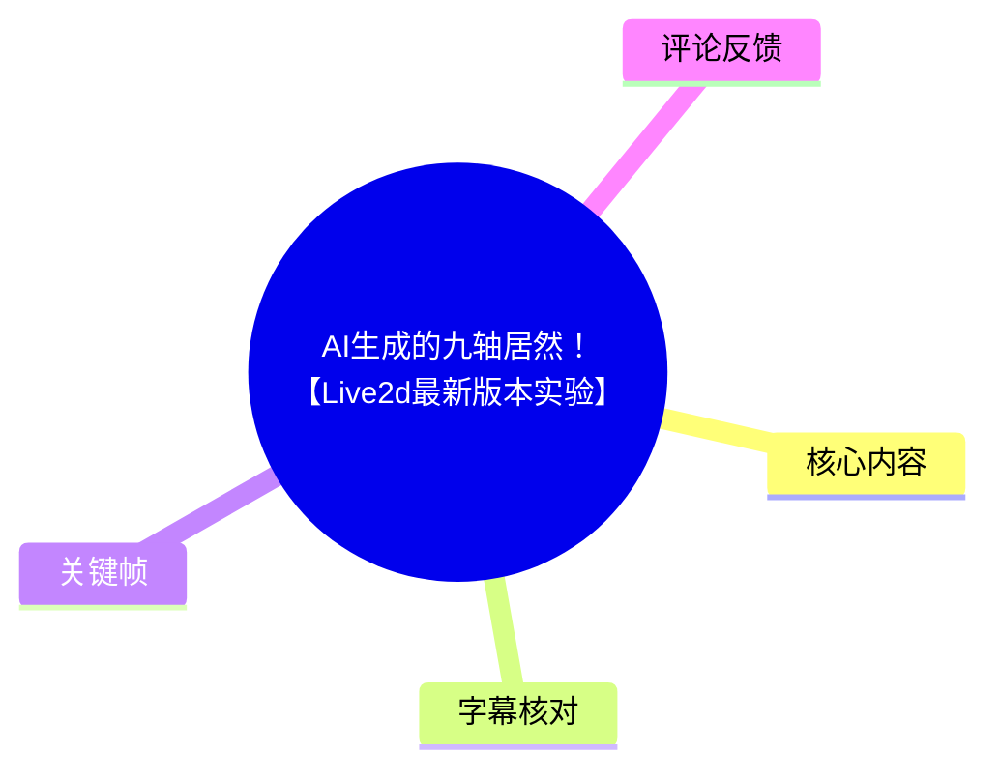
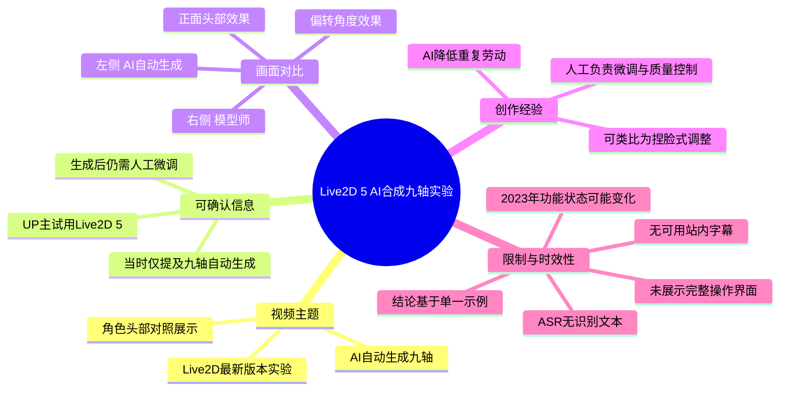
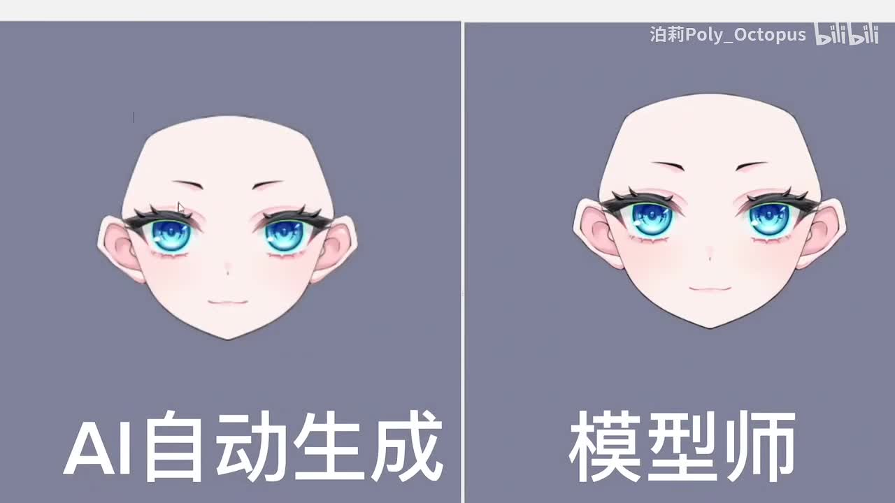
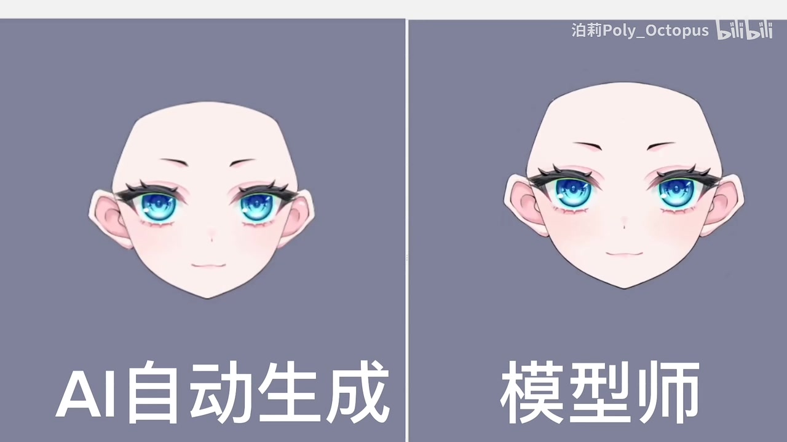
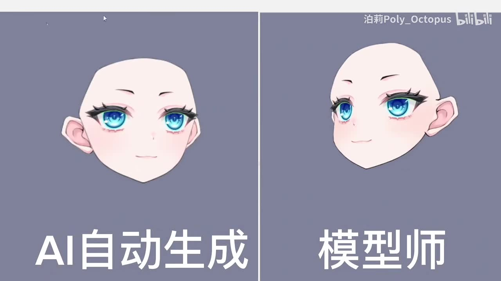
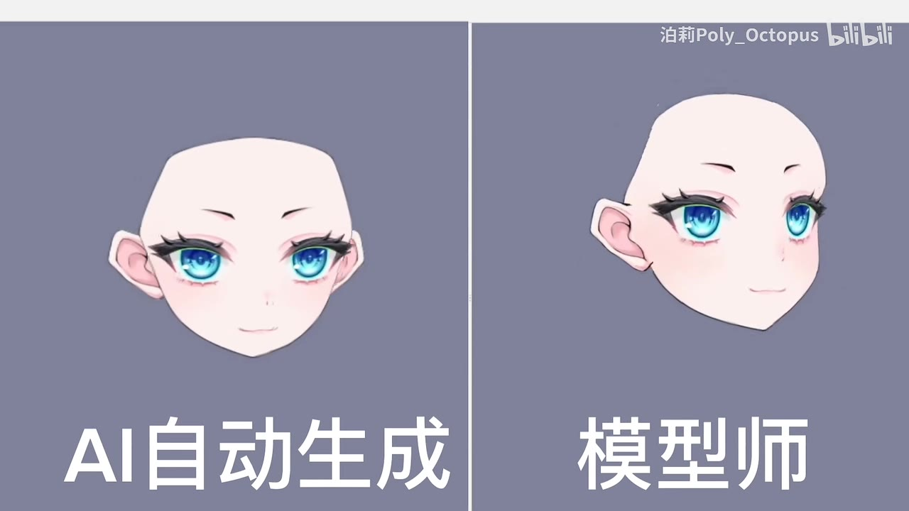

## 小结

视频《AI生成的九轴居然！【Live2d最新版本实验】》是 UP 主泊莉Poly_Octopus 对 **Live2D 5 的 AI 合成九轴功能**进行的短实验展示，时长 27 秒，发布于 2023-03-30。视频画面以左右对照方式呈现“AI自动生成”与“模型师”调整后的角色头部效果。

从视频简介可确认，UP 主的核心结论是：Live2D 5 已能对“九轴”进行自动生成，初始结果已相当强，但生成完成后仍需要人工微调。UP 主将其体验类比为“捏脸”，认为它更可能降低重复劳动、让模型制作更轻松，而非直接完全取代模型师。

关键画面对比表明，AI 自动生成结果与模型师结果在正面及不同偏转角度下均保持了角色五官和头部的大致一致性；但这只是该视频给出的单一素材示例，不能据此推出对所有角色、所有切图质量或完整 Live2D 建模流程都同样有效。

本视频没有提供可用的站内字幕；本次 ASR 虽检测到音频文件且未标记 `noAudioStream=true`，但未识别出任何语音片段。因此，本文以视频元数据、UP 主文字简介、可见画面及关键帧为依据，不将无法从画面或简介直接验证的内容扩展为事实。

该信息具有明显时效性：视频讨论的是 2023 年 3 月前后 UP 主试用时的 Live2D 5 功能状态。“目前只有九轴可以自动生成、且仍需微调”是发布时的体验描述，不代表截至本文整理时间该软件的最新能力、授权规则、价格或功能范围。

## 思维导图

## 目录

- [视频背景与材料边界](#视频背景与材料边界)
- [AI 自动生成与模型师效果对照](#ai-自动生成与模型师效果对照)
- [从画面可见的九轴效果](#从画面可见的九轴效果)
- [实践流程与可迁移经验](#实践流程与可迁移经验)
- [参数、限制与时效性](#参数限制与时效性)
- [字幕比对](#字幕比对)
- [评论分析](#评论分析)
- [处理记录](#处理记录)

## 视频背景与材料边界 [00:00](https://www.bilibili.com/video/BV1Ek4y1i7Sk?t=0)

视频标题明确其主题为“AI生成的九轴”以及“Live2d最新版本实验”。元数据中的简介进一步说明，UP 主“刚刚试用了 live2d 5 的 ai 合成九轴功能”。

这里的“九轴”在视频语境中指向 Live2D 角色头部多方向转动相关的建模/变形效果；但视频未展示软件参数面板、功能入口、输入规范、算法名称或官方文档。因此，本文不对其具体实现机制、可生成的参数维度或训练方式作额外推断。

UP 主在简介中给出了以下发布时体验：

1. 其试用对象是 **Live2D 5 的 AI 合成九轴功能**。
2. 自动生成的当前对象是“九轴”。
3. 自动生成后“还需要微调”。
4. UP 主认为结果已经“很强大”。
5. 对工作影响的主观看法是：它可能让制作更轻松，并被类比为“捏脸”。

这些是作者的实际体验与判断，不等同于软件厂商的功能承诺或普适性能结论。

> 时间轴说明：没有站内 SRT，也没有可用 ASR 时间分段；可可靠使用的视频整体起点为 00:00。本节定位至视频开头，不根据文字顺序虚构更细的时间位置。

## AI 自动生成与模型师效果对照 [00:00](https://www.bilibili.com/video/BV1Ek4y1i7Sk?t=0)

视频采用清晰的双栏对比构图：

- **左侧标签：`AI自动生成`**
- **右侧标签：`模型师`**

两侧均为同一风格的二次元角色头部：浅肤色、蓝色眼睛、深色睫毛、粉色腮红，背景为灰蓝色。右上角带有 UP 主名称及 Bilibili 水印。该对比不是不同角色设计，而是用于比较 AI 自动结果与人工模型师处理结果在头部角度变化中的视觉表现。

> 图：关键帧以左右分栏和文字标签直接定义对照对象。它的价值在于确认视频不是泛泛讨论 AI，而是在展示同一角色头部效果的“AI自动生成 / 模型师”并列比较。

从正面状态看，左右两边的脸型、双眼位置、耳朵轮廓、眉毛及嘴部位置整体相近。画面能够支持的结论是：此示例的 AI 自动生成结果在静态正面观感上已具有较高完成度。  
但画面不能证明以下事项：AI 是否直接处理了全部切图、人工是否曾参与 AI 结果前的准备、模型师结果是否为唯一标准答案，以及二者所消耗的时间差。

## 从画面可见的九轴效果 [00:00](https://www.bilibili.com/video/BV1Ek4y1i7Sk?t=0)

### 正面状态：基础五官对齐

正面画面中，左右角色均朝向镜头。可以看到 AI 自动生成侧的眼睛、耳朵与脸部轮廓已经形成完整头部；模型师侧则呈现相同的基本结构。该状态主要用于建立比较基准：如果正面基础结构不一致，后续角度变化便难以判断。

> 图：该帧保留了两个“正面”结果和完整标签，适合观察基础比例、双眼高度、耳朵位置及轮廓的整体一致性；它不能替代实际模型文件中的参数检查。

### 偏转状态：画面显示的差异

在另一关键帧中，右侧“模型师”头部已经发生明显侧向偏转，而左侧“AI自动生成”头部仍较接近正面。这一画面至少表明视频展示了头部转向过程中的对比状态。

> 图：右侧角色的可见脸部轮廓与耳朵相对位置发生变化，可用于说明视频确实涉及头部角度变化；左侧在该帧较接近正面，因此不能仅凭这一帧量化两者在相同转角下的优劣。

另一帧中，两侧角色都能看到偏转后的头部形态：右侧脸部更为侧向，左侧也出现了相应的脸部朝向变化。可见变化包括脸部外轮廓、眼睛在透视中的相对位置，以及耳朵与脸部的空间关系。

> 图：该帧的价值是保留了 AI 侧与模型师侧的非正面效果，说明对比并不限于静态正脸。由于素材未附帧时间和精确转角数值，不能把它标为某一确定的 X/Y/Z 参数值。

### 应如何理解“效果接近”

视频画面和 UP 主简介共同支持“AI 初步结果很强”的体验判断，但更严谨的解读应是：

- 在该角色、该切图和视频所展示的有限角度中，AI 自动结果具备可见的头部形变效果；
- 人工模型师结果仍被单独保留为对照，且 UP 主明确表示生成后需要微调；
- 因此，AI 输出更适合作为建模流程中的自动化起点或辅助结果，而不是在本视频证据范围内被认定为无需检查的最终交付物。

## 实践流程与可迁移经验 [00:00](https://www.bilibili.com/video/BV1Ek4y1i7Sk?t=0)

视频没有录制完整软件操作过程，以下流程仅整理自 UP 主简介中可以确认的顺序，不补写未出现的菜单路径、按钮名称或数值参数。

### 可确认的使用顺序

1. **准备可用于 Live2D 建模的角色素材**  
   视频展示了一套已经具备眼睛、耳朵、脸部等分层视觉要素的角色头部，但未展示 PSD 分层结构、切图规范或导入步骤。

2. **在 Live2D 5 中使用 AI 合成九轴功能**  
   这是标题和简介明确点出的实验对象。素材没有展示如何启用该功能，也没有给出版本号、许可条件、系统要求或具体界面。

3. **观察自动生成的头部多方向效果**  
   视频通过“AI自动生成”一侧展示了生成结果，并将其与“模型师”一侧并列。

4. **对生成结果进行人工微调**  
   这是 UP 主明确写出的必要环节。尽管视频没有展示具体调参动作，但“仍需微调”意味着自动化并未消除验收、修正和艺术把控工作。

5. **检查不同头部角度下的视觉一致性**  
   从关键帧可见，至少应观察正面与偏转状态下的脸型、五官位置、耳朵关系和轮廓变化。具体检查项目可以依据画面归纳，但不应误称为视频中逐条讲解过的教程步骤。

### 对模型制作工作的启示

UP 主将体验类比为“捏脸”，并认为工作可能“更轻松”。这一表达更接近人机协作思路：

- AI 可以承担部分初始形变生成或重复配置工作；
- 模型师仍需依据角色设计意图检查形状、对称性、透视感和异常拉伸；
- 最终质量不能只由“能自动生成”判断，仍取决于素材质量、角色风格与人工修正。

对于希望复现实验的读者，最稳妥的做法不是直接依赖视频中的观感，而是使用自己的角色素材进行测试，并针对目标 Live2D 版本查阅当期官方文档。视频未提供可复用工程文件、参数预设或操作命令。

## 参数、限制与时效性 [00:00](https://www.bilibili.com/video/BV1Ek4y1i7Sk?t=0)

### 视频明确给出的功能边界

| 项目 | 可确认内容 | 证据来源 |
| --- | --- | --- |
| 软件版本表述 | Live2D 5 | 视频标题、UP 主简介 |
| 自动化对象 | 九轴 | 视频标题、UP 主简介 |
| 是否需要人工参与 | 需要，生成后仍需微调 | UP 主简介 |
| 演示形式 | AI自动生成与模型师头部效果对照 | 关键帧 |
| 展示时长 | 27 秒 | 视频元数据 |
| 具体参数值 | 未提供 | 视频素材 |
| 功能入口与操作路径 | 未提供 | 视频素材 |
| 完整工程、分层要求 | 未提供 | 视频素材 |
| 生成耗时、硬件环境 | 未提供 | 视频素材 |

### 关键限制

1. **没有完整教程证据**  
   视频为短展示，不包含从导入素材、生成、调整到导出的完整操作记录。因此不能据此写出确定的软件步骤或菜单名称。

2. **比较样本单一**  
   画面只展示一个角色头部示例。不同画风、切图质量、面部结构复杂度、遮挡关系下的效果并未被验证。

3. **“模型师”并非客观基准数据**  
   右侧标签表明其为模型师结果，但未说明制作人员、制作时间、调参标准或是否经过多轮迭代。它是视频中的视觉对照，而不是可量化的性能基准。

4. **自动生成不等于免人工验收**  
   UP 主已明确说明需要微调。将视频理解为“AI 已完全替代建模师”与原始简介不符。

5. **缺少可读语音文本**  
   本次 ASR 没有识别到语音，因此无法通过语音补全画面之外的操作细节或主观评价。

### 时效性说明

视频发布时间为 **2023-03-30**。简介中的“目前只有九轴可以自动生成”应严格视为该发布日期附近的试用观察。Live2D 后续可能更新功能范围、产品名称、版本、订阅政策、支持格式或 AI 功能策略；本文不将旧视频中的功能状态延伸为当前事实。

## 字幕比对

| 字幕来源 | 完整性 | 专有名词 | 时间轴 | 主要问题 |
| --- | --- | --- | --- | --- |
| Bilibili 站内字幕 | 无可用字幕 | 无法核验 | 无法使用 | 素材明确说明未提供可用站内字幕 |
| 本次 ASR 字幕 | 空，0 个语音片段 | 无法识别 | 虽输出标记支持时间戳，但无实际分段 | 自动识别语言为 `en`、置信度 0.541015625；诊断提示未识别到语音片段 |

### ASR 检查结果与最终依据

本次 ASR 使用 `medium` 模型、自动语言识别、CUDA 与 `float16` 计算，分析音频时长为 **26.3314375 秒**。结果中：

- `segments` 为空；
- `sentenceCount` 为 0；
- `speechSeconds` 为 0；
- `speechCoverage` 为 0；
- 警告为“未识别到语音片段，请确认源文件是否包含可听语音并使用正确音轨重试”。

素材中 **没有** `noAudioStream=true` 标记，因此不能将其表述为“源视频没有音轨”。更准确的说法是：本次处理生成了音频文件，但 ASR 未能从中识别出语音；原因可能包括无口语、音量/音轨内容、背景音或语言识别偏差，现有素材不足以定论。

最终没有采用任何字幕文本。正文中的关键术语主要来自标题、简介及画面可见文字：

- `Live2D 5`、`AI合成九轴`：来自标题/简介；
- `AI自动生成`、`模型师`：来自关键帧中的画面文字；
- 角色头部正面与偏转效果：来自关键帧画面。

由于不存在可用的字幕分段，正文时间轴仅使用可验证的视频起点 `00:00`，未根据叙述顺序虚构细粒度时间。

## 评论分析

仅获取到 2 条热评，未达到“前三条”的数量；以下只分析可获取的两条，不补造第三条评论。

### 热评 1：对自动化质量的夸张式肯定

- **评论者**：丘布Cube  
- **获赞数**：1153  
- **原文**：“已经比闲鱼9成模型师做得好了”

这是一种带有网络语境和夸张色彩的肯定，表达评论者认为视频中的 AI 效果已经具有很高水准，并将其与二手交易平台上可见的模型制作服务进行比较。

它可作为观众对演示效果感到惊艳的反馈，但不构成质量评测：评论没有说明评判标准、样本规模、比较对象或技术条件。“9成模型师”的比例属于主观修辞，不能当作 AI 性能的可验证数据。

### 热评 2：从创作工具延伸到就业议题

- **评论者**：SaeedHerr  
- **获赞数**：773  
- **原文**：“其實如果全世界集體失業挺好的[doge]大家就可以多把時間花在自己上，但某方面來說，很難”

该评论由 AI 自动化效果联想到失业与社会分配问题。它呼应了 UP 主简介中“本来担心被抢工作、但看起来会更轻松”的感受，但评论本身并未提供关于 Live2D 行业就业影响的事实证据。

其价值在于显示观众关注点并不只在技术效果，也在于 AI 辅助工具对创作劳动和职业分工的潜在影响；争议点在于，这类宏观结论远超本视频的单一功能演示范围，不能据此判断实际替代程度。

## 处理记录

- **Worker ID**：`worker-mrj0wbly-5dc4e50c`
- **生成模型**：`gpt-5.6-terra`
- **素材与工具输出**：读取任务提供的视频元数据、视频简介、关键帧列表与关键帧画面、站内字幕状态、ASR 诊断与输出、热评 JSON；视频处理产物清单包含 `merged.mp4`、`audio/audio.wav`、`frames/`、`asr/`、`comments/comments.json`。
- **ASR 模型与运行信息**：`medium`；自动语言识别；检测语言为 `en`，概率 `0.541015625`；设备 `cuda`；计算类型 `float16`；结果为空分段。
- **字幕选择**：站内字幕无可用内容；本次 ASR 已检查但无文本、无时间分段，故未采用字幕。改以标题、简介、可见画面文字与关键帧进行整理。
- **关键帧选择依据**：选用 `frames/frame-001.jpg`、`frames/frame-002.jpg`、`frames/frame-003.jpg`、`frames/frame-004.jpg`。这些帧均清晰展示“AI自动生成 / 模型师”标签、正面头部状态或偏转状态，能够直接支撑对比关系与视觉观察；素材未提供各帧精确时间戳，故不把帧号伪造为时间信息。
- **评论处理范围**：仅使用接口实际返回的 2 条热评；没有可获取的第 3 条热评。
- **缓存清理**：提供的素材中未包含缓存清理执行日志或结果，无法确认是否已清理；本文不虚构清理完成状态。
- **未解决问题**：无法从现有素材确定视频是否存在可辨识但 ASR 未捕获的口语内容；无法确认 Live2D 5 当时的精确子版本、功能入口、算法机制、参数设置、生成耗时和后续版本变化。
