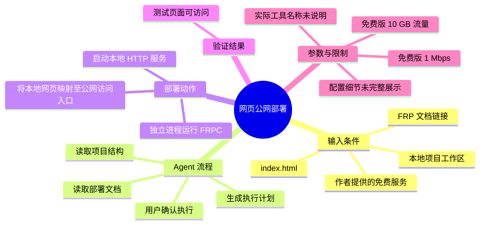
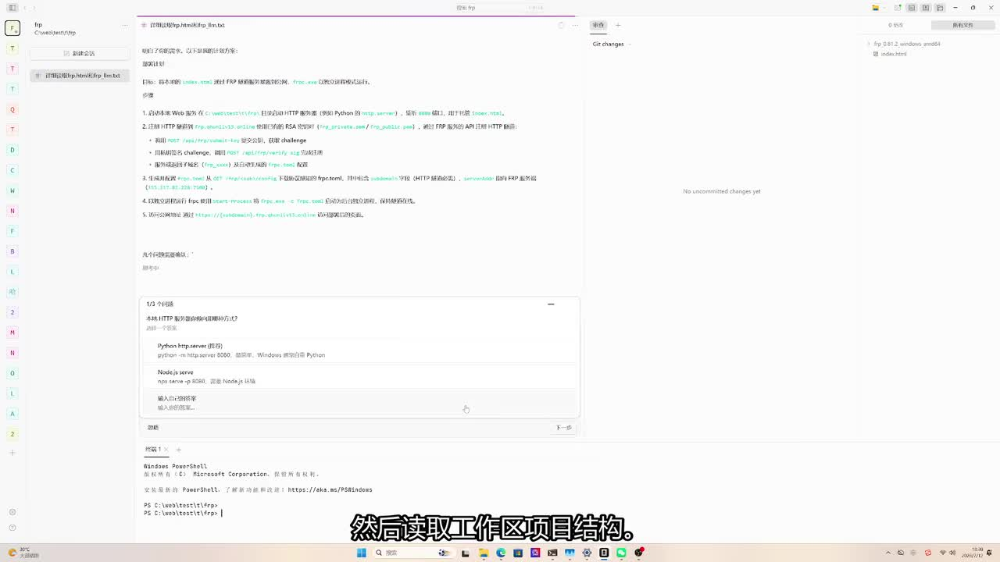

# 两分钟搞定网页部署

> 来源：[Bilibili 视频](https://www.bilibili.com/video/BV1D9N36YEt4)<br>
> UP 主：Qhunliv13 ｜合集：AIcode ｜时长：39 秒<br>
> 视频简介提供的文档/服务入口：<https://frp.qhunliv13.online/frp.html>、<https://frp.qhunliv13.online/frp_llm.txt>

## 小结

视频记录了一次借助 Agent、FRP 文档与作者提供的免费服务，将本地网页部署到可从公网访问地址的过程。核心思路不是手工逐项配置，而是先让 Agent 阅读部署文档和当前工作区结构，再由 Agent 生成计划并在确认后执行。

流程包含三个关键环节：读取 FRP 文档、识别项目中的网页入口文件 `index.html`、以独立进程运行本地 Web 服务和 FRPC 客户端。视频最后以测试页面可被访问作为部署成功的验证结果。

从画面可见，Agent 正在处理一份包含部署步骤的说明，并询问使用何种 HTTP 静态文件服务器；候选方式包括 Python 的 `python -m http.server 8080` 与 Node.js 的 `npx serve -p 8080`。不过，视频素材没有明确展示最终实际选择了哪一种，也没有展示完整 FRPC 配置内容，因此不能据此复现全部命令。

作者在视频简介中说明免费版资源限制为 **1 Mbps 带宽、10 GB 流量**。这意味着该方案更适合演示页、个人作品展示、临时联调或低流量静态页面，不应仅依据本视频将其视作高可用或生产级托管方案。

视频时长仅 39 秒，“全程仅需 2 分钟”是作者在 ASR 内容中的表述；素材本身展示的是一次成功记录，未提供多次运行耗时、稳定性、并发能力、安全策略、域名策略或服务长期可用性证据。

## 思维导图




## 目录

- [背景、目标与时效性](#背景目标与时效性)
- [视频流程：由 Agent 驱动的部署](#视频流程由-agent-驱动的部署)
  - [读取文档与项目结构](#读取文档与项目结构)
  - [启动服务与运行 FRPC](#启动服务与运行-frpc)
  - [确认计划与访问验证](#确认计划与访问验证)
- [可见操作、参数与复现边界](#可见操作参数与复现边界)
- [服务限制与风险](#服务限制与风险)
- [关键帧解读](#关键帧解读)
- [字幕比对](#字幕比对)
- [评论分析](#评论分析)
- [处理记录](#处理记录)

## 背景、目标与时效性

### 从本地网页到公网访问 [00:00](https://www.bilibili.com/video/BV1D9N36YEt4?t=0)

视频要解决的问题是：将工作区内的网页项目部署出去，使测试页面能通过公网访问。ASR 表述为“部署网页到工网”，结合视频主题、FRP 使用场景以及后文“即可访问”的结果，这里的“工网”更可能是 ASR 对“公网”的识别误差；正文采用“公网”描述，并保留这一校正依据。

视频依赖的外部条件包括：

1. 一个含网页入口文件的本地项目。ASR 明确提到 `index.html`。
2. FRP 相关文档，作者要求 Agent 先详细读取该文档链接。
3. 可运行本地 HTTP 服务的环境。
4. FRPC 客户端及相应服务端接入信息。
5. 作者提供的免费服务入口；简介给出了两个 URL，但素材未展示服务注册、鉴权、申请或完整配置过程。

> 时效性说明：视频发布元数据对应 2026-07-13，且部署依赖作者维护的外部站点与免费额度。URL 可用性、FRP 版本、服务规则、带宽与流量政策均可能在发布后变化，应以链接中的当前文档为准。

## 视频流程：由 Agent 驱动的部署

### 读取文档与项目结构 [00:03](https://www.bilibili.com/video/BV1D9N36YEt4?t=3)

ASR 的第一步是：“首先让 agent 详细读取 FRP 文档链接，然后读取工作区项目结构。”

这一步的价值在于让 Agent 同时理解两类上下文：

- **服务侧约束**：FRP 服务要求的地址、认证、域名/子域名、端口或隧道类型等信息理论上应来自文档；
- **项目侧事实**：网页文件在哪里、入口是否为 `index.html`、是否需要构建、适合使用哪种静态文件服务。

关键帧中可以看到 Agent 的执行计划界面与左侧工作区文件树。画面右上区域可辨识出项目内有 `index.html`，与 ASR 描述相互印证。画面中还出现了“选择 HTTP 静态文件服务器”的询问区域，说明 Agent 没有直接盲目执行，而是在服务方式上请求确认。



> 图：该帧同时呈现了部署说明、静态服务器选项、PowerShell 区域和项目文件树，是理解“先读文档、再读项目、随后请求确认”这一 Agent 工作流的主要视觉证据。由于截图文字较小，不能将未清晰可辨的配置字段视为确定参数。

### 启动服务与运行 FRPC [00:14](https://www.bilibili.com/video/BV1D9N36YEt4?t=14)

ASR 说明：“接着以独立进程运行 FRPC 部署 index.h...”。其中 `index.h...` 的尾部被截断，但结合工作区可见的 `index.html`，可确认视频目标是部署以 `index.html` 为入口的网页；不能据此断言 FRPC 直接“部署”该文件。

更准确的技术关系应是：

1. 本地 HTTP 服务负责把 `index.html` 及相关静态资源提供到本机端口；
2. FRPC 作为客户端，将可访问的本地服务映射到 FRP 服务端可公开访问的入口；
3. 外部访问者通过服务端分配的公网地址访问网页。

关键帧中的可选静态服务命令包括：

```bash
python -m http.server 8080
```

以及：

```bash
npx serve -p 8080
```

这些命令显示的共同参数是本地端口 `8080`。但应注意：截图显示的是 Agent 提供的候选方案，不等于视频已经证实其中任一方案被最终选中或成功执行。ASR 只明确证实“以独立进程运行 FRPC”，未给出 FRPC 的实际启动命令、配置文件名称、服务端地址、认证参数或映射域名。

### 确认计划与访问验证 [00:25](https://www.bilibili.com/video/BV1D9N36YEt4?t=25)

ASR 接着说：“Agent 自动生成计划，确认执行。稍等一会，测试页面就成功部署到工网即可访问。”

这里体现的经验是将自动化过程拆为两阶段：

- **计划阶段**：Agent 根据文档与项目结构提出部署步骤；
- **执行阶段**：由用户确认后启动服务、运行 FRPC，并等待隧道建立。

视频把“测试页面可访问”作为成功标准。这能证明该次演示中的基础链路已打通，但以下内容没有被素材完整展示：

- 最终公网 URL；
- HTTP 状态码、响应内容或浏览器开发者工具验证；
- 重启后的持久性；
- 本地进程退出后的访问结果；
- HTTPS、证书、访问控制、日志和故障恢复；
- 多文件资源、前端路由、后端接口或 WebSocket 的兼容性。

## 可见操作、参数与复现边界

### 实际顺序整理 [00:00](https://www.bilibili.com/video/BV1D9N36YEt4?t=0)

基于 ASR、关键帧和视频简介，可可靠整理出的操作顺序如下：

1. 打开作者提供的 FRP 文档链接。
2. 让 Agent 详细阅读该文档。
3. 让 Agent 读取本地工作区的项目结构。
4. 确认网页入口，素材支持 `index.html` 这一事实。
5. 选择或确认本地 HTTP 静态文件服务器方案。
6. 以独立进程运行 FRPC。
7. 查看 Agent 生成的计划并确认执行。
8. 等待部署完成。
9. 通过测试页面是否可访问，验证公网访问链路。

### 素材明确给出的参数 [00:14](https://www.bilibili.com/video/BV1D9N36YEt4?t=14)

| 项目 | 值/状态 | 证据与说明 |
| --- | --- | --- |
| 网页入口 | `index.html` | ASR 与关键帧文件树共同支持。 |
| 本地静态服务候选端口 | `8080` | 关键帧中 Python、Node.js 两种候选命令均使用该端口。 |
| Python 候选命令 | `python -m http.server 8080` | 出现在关键帧的服务选择区域。 |
| Node.js 候选命令 | `npx serve -p 8080` | 出现在关键帧的服务选择区域。 |
| 隧道客户端 | FRPC | ASR 明确提及。 |
| 带宽限制 | 1 Mbps | 视频简介说明为免费版限制。 |
| 流量限制 | 10 GB | 视频简介说明为免费版限制。 |
| 完成耗时 | “全程仅需 2 分钟” | 来自 ASR 的作者表述；视频文件本身为 39 秒，不代表可独立验证的稳定耗时。 |

### 不应擅自补全的信息

以下是复现部署通常需要、但本次素材未充分给出的信息：

- FRPC 下载版本、操作系统适配包与实际文件位置；
- `frpc.toml`、`frpc.ini` 或命令行参数的完整内容；
- 服务端地址、端口、认证 token、用户标识；
- 采用 HTTP、HTTPS、TCP 或其他 FRP 代理类型；
- 分配的域名、子域名及 DNS 处理方式；
- 是否需要账号、是否公开注册、免费服务的申请条件；
- Agent 的具体产品名、模型、权限范围与执行命令；
- 最终选择 Python 还是 Node.js 静态服务。

因此，视频适合作为“让 Agent 辅助阅读部署文档并完成一次网页穿透”的流程参考；如要实际执行，应先阅读作者当前 FRP 文档，并在本机核实所有配置字段与安全影响。

## 服务限制与风险

### 免费额度与适用范围 [00:31](https://www.bilibili.com/video/BV1D9N36YEt4?t=31)

作者在视频简介中明确标出免费版为 **1 Mbps、10 GB 流量**。这两个限制直接影响使用方式：

- **1 Mbps 带宽**：对纯 HTML、少量 CSS/JS 和轻量图片的展示通常更友好；大文件下载、高清图片、视频或较多并发访问可能体验较差。
- **10 GB 流量**：应关注页面资源体积、访问量与缓存策略；视频未说明流量统计周期、超额后的处理方式或剩余额度查询方法。
- **依赖本地进程**：视频提到独立进程运行 FRPC。若本地 HTTP 服务或 FRPC 进程停止，公网访问通常可能随之中断；这是基于该架构的技术推断，视频未展示断线测试。
- **外部服务依赖**：作者的服务地址及政策可能变化，免费服务不应被默认等同于 SLA、备份、监控和长期可用性承诺。
- **安全与隐私**：将本机端口暴露到公网前，应确认只映射需要的静态服务，不在同一端口暴露管理后台、敏感文件或调试接口。视频没有展示访问控制或 HTTPS 配置。

## 关键帧解读

### Agent 的计划界面与服务选项 [00:08](https://www.bilibili.com/video/BV1D9N36YEt4?t=8)


这张关键帧的正文价值主要有三点：

1. **印证项目结构读取**：右侧文件树可见 `index.html`，对应 ASR 中关于读取工作区与部署网页入口的描述。
2. **印证存在服务方式选择**：中间的 Agent 界面给出 Python 与 Node.js 静态服务器候选命令，说明本地服务是部署链路的一部分。
3. **区分计划与执行**：画面以说明/选择界面为主，不能把其中出现的全部文字理解为已执行完成的命令或最终有效配置。因此本文只将清晰可读的命令、端口和文件名列为“候选/可见信息”。

## 字幕比对

| 字幕来源 | 完整性 | 专有名词 | 时间轴 | 主要问题 |
| --- | --- | --- | --- | --- |
| Bilibili 站内字幕 | 无可用字幕 | 无法评估 | 无法评估 | 素材采集阶段返回“Missing JSON resource URL”，未获得可用站内字幕。 |
| 本次 ASR 字幕 | 覆盖了视频主要叙述流程 | 能识别 Agent、FRP、FRPC、`index.html` 等，但存在识别误差 | 未提供逐句时间戳，只能按视频叙事顺序定位 | “工网”应为“公网”的可能性较高；“index.h...”发生截断；未给出完整命令与配置细节。 |

最终采用 **本次 ASR 字幕为主、关键帧与视频简介为交叉校正** 的方式整理内容，未与站内字幕合并，因为站内字幕不可用。

重要校正如下：

- ASR 的“工网”在上下文中校正为“公网”：理由是视频主题为网页部署、使用 FRPC，并以外部可访问为结果；这是一项基于上下文的校正，不是站内字幕证实。
- ASR 的“index.h...”以关键帧中可见的 `index.html` 补足为网页入口文件名。
- 关键帧中的 Python/Node.js 命令被标记为候选服务方式，不扩展为视频已确认的最终执行命令。

## 评论分析

截至采集结果，可获取的热评不足三条：仅返回 1 条评论。因此只分析该条，不补造其余热评。

1. **Hello-pan（1 赞）**：“你这是什么工具？”
   - **观点/需求**：评论者关注视频中用于读取文档、生成计划和执行部署的 Agent 工具是什么。
   - **补充信息**：该评论反映出视频没有在可获取素材中清楚交代 Agent 的具体产品名称或运行环境。
   - **可信度与边界**：这是对信息缺口的提问，不提供关于工具身份的事实答案；不能据此推断视频使用了某个特定 IDE、Agent 框架或模型。

## 处理记录

- Worker ID：`worker-mrj0wbly-5dc4e50c`
- 模型：`gpt-5.6-terra`
- 调用工具与素材：视频元数据、视频简介、ASR 字幕、关键帧 `frames/frame-001.jpg`、热评采集结果；站内字幕获取结果。
- 使用的应用工具：素材采集流程已输出合并视频、音频、关键帧、信息文件、评论文件与 ASR 目录；未提供可进一步核验的命令执行日志。
- 字幕选择：站内字幕不可用；已执行本次 ASR，正文以 ASR 为基础，使用关键帧和简介对“公网”“index.html”等关键信息作谨慎校正。
- 关键帧选择依据：仅提供 `frame-001.jpg`。该帧同时显示 Agent 部署计划、静态服务器候选命令、终端区域和含 `index.html` 的工作区文件树，与正文的核心流程直接相关。
- 评论处理范围：按要求仅处理可获取热评前三条；实际仅获取 1 条，未补充不可获取评论。
- 缓存清理：素材未提供缓存清理执行记录，无法确认是否已清理；不将其写作已完成。
- 未解决问题：具体 Agent 工具名称、FRPC 版本与完整配置、最终使用的静态服务器、服务端鉴权与域名、实际公网 URL、免费额度统计周期及长期可用性均未在现有素材中确认。
