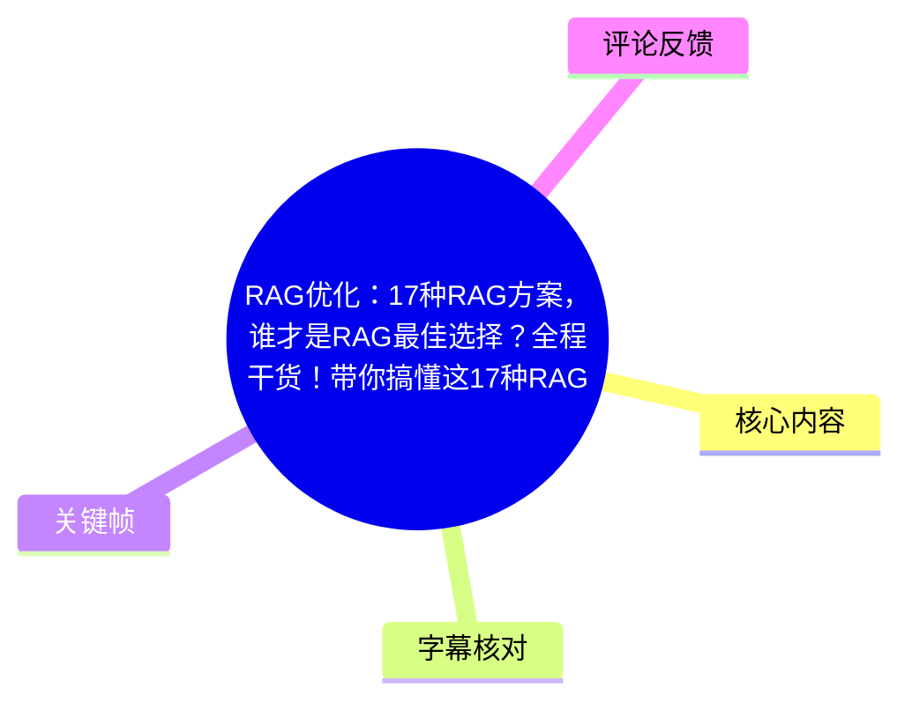
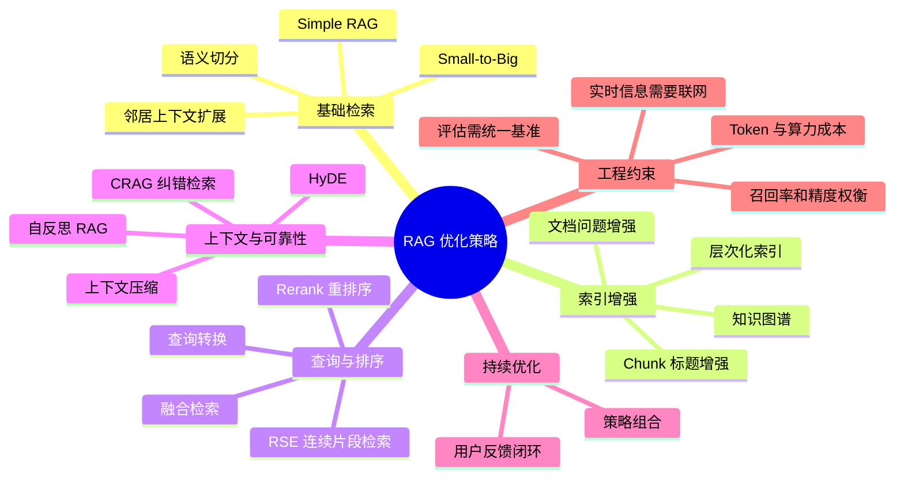
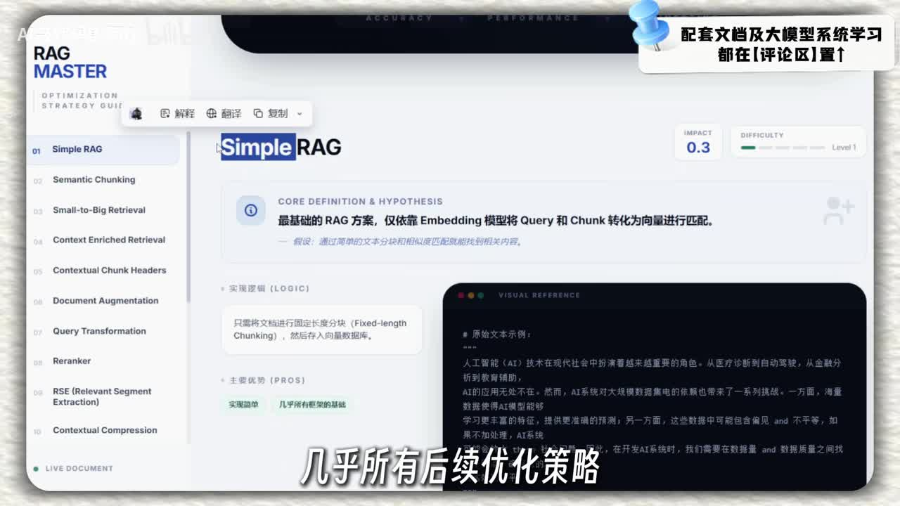
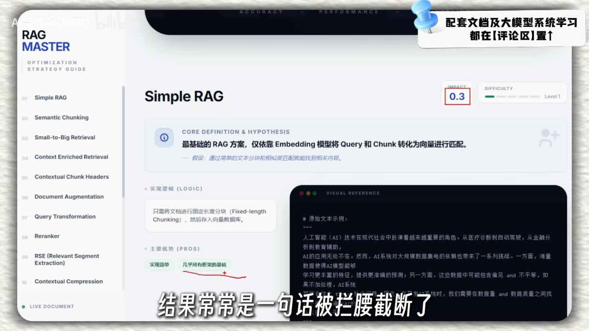
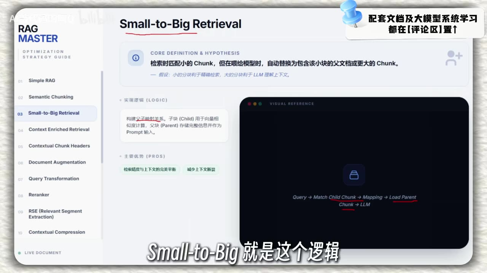
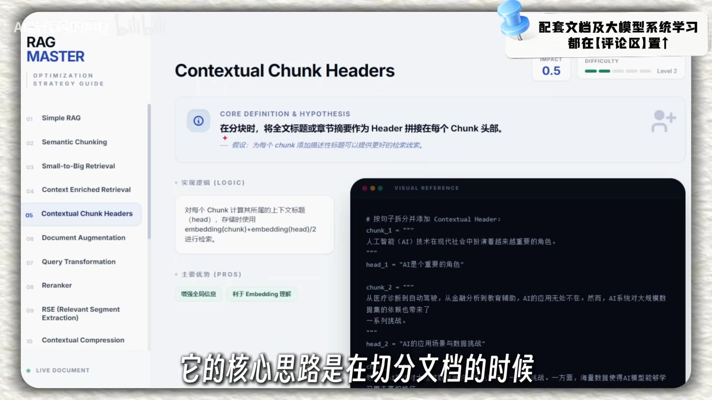

# RAG 优化：17 种策略的原理、选型与组合

> 来源：[Bilibili 视频](https://www.bilibili.com/video/BV1DmzABsEty)  
> UP 主：AI敲代码的阿Q｜时长：25:35｜分辨率：1920×1080  
> 主题：以 17 种 RAG（Retrieval-Augmented Generation，检索增强生成）优化策略为线索，解释其工作流、优劣、适用场景及视频中给出的效果评分。

## 小结

本视频将 RAG 优化拆为一套从基础分块、检索召回、排序、上下文构建，到反馈学习、图谱与联网纠错的“工具箱”。核心观点是：RAG 的效果差异不只由 Embedding 或大模型决定，更多取决于检索策略、上下文组织方式与后处理流程。

视频从最基础的 **Simple RAG（固定长度硬切分）** 出发，指出其实现容易、成本低，但会破坏语义完整性；随后依次介绍语义切分、Small-to-Big、邻居扩展、Chunk 标题增强、文档问题增强、查询改写、重排序、连续片段检索、上下文压缩等策略，以解决“召回不准”“上下文断裂”“噪声过多”等问题。

在视频给出的评分中，**Small-to-Big Retrieval 为 0.85**、**层次化索引为 0.84**、**融合检索为 0.83**、**CRAG 为 0.824**，属于较高分方案；但这些分数是视频口述的评估结果，未展示统一数据集、指标定义、Prompt、模型版本或实验配置，因此只能作为讲解中的相对参考，不能直接视为可复现的工程基准。

工程上不存在“唯一最佳 RAG”。如果目标是快速落地，可从“合理分块 + 向量召回 + Rerank”开始；如果问题常依赖完整段落，可优先采用 Small-to-Big、邻居扩展或连续片段检索；如果语料规模大，则层次化索引更有价值；如果对事实覆盖和知识时效要求高，则可结合融合检索、CRAG 与外部 Web 搜索。

视频适合已有 RAG 基础、正在做课程设计、比赛项目、企业知识库或 AI 工程实践的读者。需注意：视频中部分术语的英文名称、缩写及评分受 ASR 识别影响，本文已结合画面关键帧与上下文进行校正，并保留不确定性说明。

## 思维导图





## 目录

- [背景：RAG 优化解决什么问题](#背景rag-优化解决什么问题)
- [基础分块与上下文重建](#基础分块与上下文重建)
- [索引与查询增强](#索引与查询增强)
- [排序、连续片段与压缩](#排序连续片段与压缩)
- [反馈、自反思、图谱与层次索引](#反馈自反思图谱与层次索引)
- [HyDE、融合检索与 CRAG](#hyde融合检索与-crag)
- [17 种策略对照与选型](#17-种策略对照与选型)
- [结论、限制与时效性](#结论限制与时效性)
- [字幕比对](#字幕比对)
- [评论分析](#评论分析)
- [处理记录](#处理记录)

## 背景：RAG 优化解决什么问题 [00:00:30](https://www.bilibili.com/video/BV1DmzABsEty?t=30)

视频开场提出，许多人将 RAG 简化理解为“接入 Embedding 和 LLM”，但实际系统上线后常出现三类问题：

1. **召回不准**：与问题词面相似的内容不一定真正能回答问题。
2. **上下文断裂**：固定长度切块可能把一句话、一个论点或一个因果链拆散。
3. **回答质量波动**：检索结果不稳定、噪声过多、上下文不足，都会使最终生成结果忽高忽低。

UP 主将后续内容定位为 17 种优化策略，覆盖从分块、检索、查询转换、重排序，到图谱、层次化索引、联网纠错等环节。视频最后强调，策略不是相互替代，而是可以按需求组合。

> **术语说明**：视频口述及 ASR 中多次将 RAG 识别为“RG”“RRG”等，结合标题、画面和上下文，本文统一校正为 **RAG**。

## 基础分块与上下文重建 [00:00:55](https://www.bilibili.com/video/BV1DmzABsEty?t=55)

### 1. Simple RAG：固定长度硬切分 [00:00:55](https://www.bilibili.com/video/BV1DmzABsEty?t=55)

Simple RAG 是视频所称的起点方案：将原始文档切成若干 Chunk；将 Chunk 和用户 Query 分别向量化；在向量数据库中检索相似 Chunk；再把召回文本交给大模型回答。

视频描述的常见做法是按固定字符长度切分，例如“每 512 个字符切一次”。其问题在于不关心句子、段落或论点是否结束，可能把同一句话分到 Chunk A 和 Chunk B，导致模型缺少完整语境。

**视频中的流程：**

1. 文档固定长度切分；
2. 每个 Chunk 经 Embedding 转为向量并入库；
3. Query 转向量；
4. 按相似度召回若干 Chunk；
5. 拼接召回结果作为 Prompt 上下文；
6. LLM 生成回答。

**视频口述评价：**

- 优点：实现快、成本低、多数框架均支持。
- 缺点：难处理复杂关系与深层语义，易造成语义截断、信息丢失。
- 视频给分：**0.3**。



> 图：关键帧展示“Simple RAG”页面，画面明确写出其依赖 Embedding 匹配 Query 与 Chunk，并标注 `IMPACT 0.3`。它直观说明视频将固定切分视为后续优化策略的基线方案。



> 图：画面字幕强调“结果常常是一句话被拦腰截断了”。该帧对应 Simple RAG 的关键缺陷：切块边界与语义边界不一致。

### 2. Semantic Chunking：语义切分 [00:02:56](https://www.bilibili.com/video/BV1DmzABsEty?t=176)

语义切分不再只按照固定长度分块，而是计算相邻句子之间的语义相似度：主题连续则合并；相似度低于阈值时切分。例如文本从“AI 的应用场景”转向“AI 的伦理挑战”，则将转折处作为新的 Chunk 边界。

**要点：**

- 目标是让一个 Chunk 内部主题更一致、逻辑更连贯。
- 视频以“然而”作为语义转折标记，说明正反观点不宜被混在同一 Chunk。
- 它改善了硬切分，但小块仍可能丢失更大范围的上下文。

**视频给分：0.5。**

### 3. Small-to-Big Retrieval：小块检索、大块回答 [00:04:08](https://www.bilibili.com/video/BV1DmzABsEty?t=248)

该策略建立 **Child Chunk（子块）—Parent Chunk（父块）** 的映射关系：

- 子块较小，适合与 Query 做精确相似度匹配；
- 父块保留较完整的段落、章节或原始上下文；
- 检索命中子块后，通过映射加载对应父块，再将父块交给 LLM。

视频用图书馆类比：目录中的关键词定位到书页类似子块检索，但实际阅读应拿到整本书或完整章节，而不是只看命中的一页。

**核心收益：**

- 小块提高定位精度；
- 大块减少语义断裂；
- 在“检索精度”和“上下文完整性”之间取得平衡。

**视频给分：0.85。**



> 图：画面标题为“Small-to-Big Retrieval”，并显示 `Query → Match Child Chunk → Mapping → Load Parent Chunk → LLM`。该帧直接呈现了视频定义的关键数据流。

### 4. Context Enriched Retrieval：邻居上下文增强 [00:05:21](https://www.bilibili.com/video/BV1DmzABsEty?t=321)

该方法先找到最相关 Chunk，再根据其在原文中的位置，额外加载前后相邻 Chunk。例如命中 Chunk 2 时，同时带入 Chunk 1 与 Chunk 3。

与 Small-to-Big 相比，它不必额外维护严格的父子块体系，逻辑较轻：

1. 召回 Top-K 相关 Chunk；
2. 依据文档位置，拉取每个命中块前后一个或多个邻居；
3. 将连续上下文拼接给 LLM。

**优点：**

- 缓解孤立句子带来的语境缺失；
- 容易接入已有 RAG 流程；
- 可通过调整邻居数量控制上下文长度。

**限制：**

- 邻居只是物理相邻，并不保证一定与问题相关；
- 邻居数量增加会带来 Token 成本和噪声。

**视频给分：0.6。**

### 5. Contextual Chunk Headers：为 Chunk 增加上下文标题 [00:06:33](https://www.bilibili.com/video/BV1DmzABsEty?t=393)

视频将该策略表述为：为每一个 Chunk 自动生成简短、描述性的标题或上下文说明，再把“标题 + Chunk 内容”一起进行向量化或参与检索打分。

例如，一个段落的标题可以概括为“AI 的应用场景与数据挑战”。标题像摘要，能够补充局部片段缺失的全局语义。

**视频描述的实现逻辑：**

1. 以较大段落作为 Chunk；
2. 调用 LLM 为每个 Chunk 生成 Header；
3. 对 `Header + Chunk` 建立向量；
4. 检索时综合 Query 与 Header、正文的相似度。

**优点：**

- 给 Embedding 提供更明确的主题线索；
- 提升全局信息感知；
- 不一定需要像邻居扩展那样显著增加输入正文长度。

**视频给分：0.5。**



> 图：该帧展示“Contextual Chunk Headers”页面，核心定义为将全文标题或章节摘要作为 Header 拼接到 Chunk 头部，并展示 `embedding(chunk)+embedding(head)` 的思想，有助于理解其与普通分块的差异。

## 索引与查询增强 [00:07:45](https://www.bilibili.com/video/BV1DmzABsEty?t=465)

### 6. Document Augmentation：文档问题增强 [00:07:45](https://www.bilibili.com/video/BV1DmzABsEty?t=465)

视频的“文档增强”不是只存正文 Chunk，而是在索引阶段让 LLM 为每个 Chunk 生成一组可能被用户问到的问题，并将“原文 Chunk + 假设问题”一起入库。

其出发点是：用户输入通常是问句，问句与预生成问题的表达空间可能比与原始段落更接近。

**流程：**

1. 获取 Chunk；
2. 用 LLM 生成关联问题；
3. 对 Chunk 与问题一并向量化；
4. 查询时综合 Query—正文、Query—预设问题的相似度；
5. 按综合得分排序召回。

**价值：**

- 弥补用户问法与原文表述不一致造成的“语义鸿沟”；
- 当正文没有出现用户关键词，但预设问题中有相近表达时，仍可能命中；
- 更偏向提高召回和相关性判断。

**视频给分：0.8。**

### 7. Query Transformation：查询转换 [00:09:22](https://www.bilibili.com/video/BV1DmzABsEty?t=562)

查询转换针对“用户原始 Query 不够清楚、过窄或过于复杂”的问题。视频列出三种改写方式：

| 方式 | 视频中的含义 | 适合的问题 |
| --- | --- | --- |
| 查询重写 | 将模糊问题改写得更具体 | 意图不完整、表达模糊 |
| 回溯提示 / 扩展 | 将问题放宽，补充背景性表达 | 需要召回更多上下文 |
| 子查询分解 | 将复杂问题拆成多个子问题，分别检索后整合 | 多跳、多维、复合任务 |

视频举例：将“AI 对医疗的影响有哪些”拆为“AI 如何辅助诊断”“AI 是否会影响医生工作流程”等分别检索，再汇总答案。

**视频给分：0.5。**

**工程限制：**

- 改写可能偏离用户原意；
- 多查询会增加检索次数、延迟与 Token 消耗；
- 需要对改写质量、去重和结果融合进行控制。

## 排序、连续片段与压缩 [00:10:58](https://www.bilibili.com/video/BV1DmzABsEty?t=658)

### 8. Rerank：重排序 [00:10:58](https://www.bilibili.com/video/BV1DmzABsEty?t=658)

Rerank 是视频重点推荐的常用组件。其理念是“初筛追求速度，精排追求语义相关性”：

1. 用向量检索快速取回较多候选，例如 Top 50；
2. 使用更精细的 Cross-Encoder 或 LLM 对 Query—候选文本进行相关性评分；
3. 选出更少、更准确的结果，例如 Top 5。

视频的例子是“苹果手机的价格是多少”：

- iPhone 价格信息：应得到高分；
- “苹果是一种水果”：字面相似但语义不相关，应低分；
- iPhone 发布消息但没有价格：相关但不直接回答，应处于中间分数。

**优势：**

- 显著过滤关键词相同、语义不相关的噪声；
- 能区分提及某实体与真正回答问题之间的差异；
- 在速度与精度之间形成两阶段平衡。

**限制：**

- 需要额外模型调用和算力；
- 候选池越大，延迟越高；
- 应结合业务设定候选数与最终保留数，而不是机械使用 Top 50 / Top 5。

**视频给分：0.7。**

### 9. RSE：连续片段检索 [00:12:35](https://www.bilibili.com/video/BV1DmzABsEty?t=755)

视频将该方法称为 RSE，并解释为基于滑动窗口的连续片段检索。其目标是解决相关内容分布在相邻多个 Chunk 中、但单独检索某一个 Chunk 不够完整的问题。

**流程：**

1. 先向量召回高分 Chunk；
2. 以高分 Chunk 为中心，向前后滑动窗口扩展；
3. 累加窗口中 Chunk 的相似度；
4. 以片段总分筛选连续文本区间；
5. 将高分完整片段提供给大模型。

视频示例中对连续 Chunk 的相似度进行加和，例如计算 `0.8 + 0.7` 等窗口组合，以选择总相似度更高的连续片段。

**优点：**

- 结果是连续文本，逻辑关系更完整；
- 适合跨段落、长文本和上下文依赖强的问题；
- 视频提到法律文书、科研论文、长报告分析等场景。

**代价：**

- 需要额外窗口计算；
- 可能增加文本长度和推理成本；
- 窗口大小、阈值需依语料结构调参。

**视频给分：0.8。**

### 10. Contextual Compression：上下文压缩 [00:14:35](https://www.bilibili.com/video/BV1DmzABsEty?t=875)

上下文压缩用于处理“召回内容里夹杂大量无关信息”的问题。视频建议利用 LLM 对检索结果做过滤、提炼，只将与 Query 直接相关的内容传入最终 Prompt。

**目标：**

- 减少 Token 浪费；
- 降低无关背景对答案生成的干扰；
- 提高最终回答的聚焦程度。

**实施要点：**

- Prompt 要明确模型角色、压缩任务和输出要求；
- 压缩不等于摘要，应保留支撑答案的事实、限定条件和关键数值；
- 对高风险任务应保留来源定位，避免压缩过程把证据或否定条件删掉。

**视频给分：0.75。**

## 反馈、自反思、图谱与层次索引 [00:15:23](https://www.bilibili.com/video/BV1DmzABsEty?t=923)

### 11. Feedback Loop：基于用户反馈的循环优化 [00:15:23](https://www.bilibili.com/video/BV1DmzABsEty?t=923)

该方法把用户对答案的评分和评论沉淀为结构化数据，例如 JSON，并据此调整文档权重或排序策略。

视频中的例子：文档 A 原始相似度为 `0.8`；获得用户正向反馈后，通过 `0.8 × 1.2` 调整为 `0.96`；之后相似问题到来时，文档 A 更容易靠前。

**反馈闭环：**

```text
用户查询
  → 检索文档
  → 生成回答
  → 用户评分 / 评论
  → 结构化保存反馈
  → 调整文档权重或排序
  → 服务后续查询
```

**优势：**

- 可逐步贴近真实用户偏好；
- 从静态检索走向动态优化；
- 有机会提升长期系统效果。

**限制：**

- 需要防范刷分、偏见反馈、冷启动和反馈稀疏；
- 用户满意度不必然等于事实正确性；
- 权重更新策略应可回滚、可审计。

**视频给分：0.71。**

### 12. Self-RAG / 自我检索增强生成 [00:17:24](https://www.bilibili.com/video/BV1DmzABsEty?t=1044)

ASR 将该方法识别为“CF-RG”，但按视频描述“先判断是否需要检索、再判断检索结果是否相关”的工作流，本文以 **自我检索增强生成（Self-RAG）** 作为说明性名称；具体英文缩写以视频画面或原始资料为准。

该策略包含两层判断：

1. **是否需要检索**：模型先判断能否依靠内部知识回答；简单、稳定的常识问题可直接回答。
2. **检索内容是否可用**：若需要检索，仍需评估召回 Chunk 是否真正相关，过滤仅有关键词但没有实质信息的片段。

**价值：**

- 避免对所有问题无差别检索；
- 降低不必要检索开销；
- 增加对低质量证据的过滤环节；
- 表现出从“被动检索”转向“主动判断与推理”的方向。

**风险：**

- 模型对“自己是否知道”的判断不一定可靠；
- 对时效性、专业性和高风险事实，不能仅因模型“自信”就跳过检索；
- 判断链增加系统复杂度与延迟。

**视频给分：0.6。**

### 13. Graph RAG：知识图谱检索 [00:19:01](https://www.bilibili.com/video/BV1DmzABsEty?t=1141)

视频提出，把知识转为图结构：节点表示实体，边表示关系。以《西游记》为例，孙悟空、唐僧、猪八戒、沙僧是节点，“师徒”等是边；查询“孙悟空”时，可沿关系获取相关人物和关系网络。

**适合解决的问题：**

- 多实体关系查询；
- 跨章节、跨文档的隐性关联；
- 需要结构化关系推理的任务，例如“谁是谁的徒弟的徒弟”。

**优点：**

- 能表达文本 Chunk 不易直接显式表达的关系；
- 可支持多跳关联和关系链查询；
- 对医疗、金融等结构化、关系密集领域有价值。

**限制：**

- 图谱构建成本高；
- 通常涉及实体识别、关系抽取、图谱校验；
- 自动抽取仍可能产生错误关系，需要治理机制。

**视频给分：0.78。**

### 14. Hierarchical Indexing：层次化索引 [00:20:37](https://www.bilibili.com/video/BV1DmzABsEty?t=1237)

层次化索引将文档分成两层：

- **Summary 层**：章节或主题级总结；
- **Chunk 层**：用于精确回答的细粒度文本块。

检索时先在 Summary 向量库中定位相关章节，再只在该章节关联的 Chunk 范围内精查。

**流程：**

1. 将文档按章节或主题分成大段；
2. 为每段生成 Summary；
3. 大段继续切分为 Chunk；
4. Summary 与 Chunk 分别向量化，建立两套索引；
5. Query 先召回相关 Summary；
6. 在对应 Chunk 子集内进行精细检索。

**优点：**

- 缩短海量 Chunk 中的盲目搜索路径；
- 平衡全局主题理解与局部事实定位；
- 适合企业知识库、法律文书、专业论文等大规模文档。

**限制：**

- 需要维护两套索引及层级映射；
- Summary 质量会影响第一阶段召回；
- 文档更新时要同步更新摘要与下层 Chunk。

**视频给分：0.84。**

## HyDE、融合检索与 CRAG [00:21:49](https://www.bilibili.com/video/BV1DmzABsEty?t=1309)

### 15. HyDE：假设性文档嵌入检索 [00:21:49](https://www.bilibili.com/video/BV1DmzABsEty?t=1309)

视频口述为“Hide”，结合描述可对应 **HyDE（Hypothetical Document Embeddings）**。其流程是：用户先提出 Query；模型先生成一篇假想的答案文档；对该假想文档向量化；再用其向量检索真实文档库；最后将真实召回证据交给 LLM 生成最终回答。

**它试图解决的问题：**

用户问题是问句，语料是陈述句，两者表达方式不同。HyDE 先把问句转换成“可能的答案文本”，使检索向量更接近文档语义空间。

**视频指出的关键短板：**

若初始假设文档方向错误，检索将被整体带偏。例如错误地将“AI 医疗”狭义理解为“机器人手术”，则可能遗漏诊断辅助等关键信息。

**视频结论：**

- 有效但不稳定；
- 更适合作为组合策略，而非唯一检索手段；
- 视频给分：**0.5**。

### 16. Fusion Retrieval：语义检索与关键词检索融合 [00:22:38](https://www.bilibili.com/video/BV1DmzABsEty?t=1358)

融合检索将两条召回路径合并：

- **向量 / 语义检索**：擅长处理同义改写、表达不同但意思接近的内容；
- **关键词检索**：擅长精确术语、专有名词、完整字面匹配。

视频以“如何预防感冒”为例：语义检索可能返回“保持良好作息”等近义建议；关键词检索可能返回直接包含“预防”“新冠病毒”等字面的内容。合并后，答案覆盖面更广。

**优点：**

- 降低单一检索方式的漏召回；
- 对用户表达模糊、术语不一致有更强鲁棒性；
- 视频特别指出医疗、法律等高召回要求场景。

**限制：**

- 要维护两套检索通道；
- 需要设计融合排序策略；
- 高召回不等于高精度，通常仍应配合 Rerank。

**视频给分：0.83。**

### 17. CRAG：纠错检索增强生成 [00:23:50](https://www.bilibili.com/video/BV1DmzABsEty?t=1430)

视频最后介绍的 CRAG，口述为“纠错相关度查询”，并解释 `Corrective` 有纠错之意。其基本思想是：检索后先评价召回文本与 Query 的相关程度，再按不同等级采取不同处理。

| 检索相关性等级 | 视频中的处理方式 |
| --- | --- |
| 高相关 | 直接使用本地文档片段生成答案 |
| 中相关 | 结合 Web 搜索补充和丰富信息 |
| 低相关 | 主要依赖 Web 搜索结果生成答案 |

**价值：**

- 将本地知识库检索与 Web 检索结合；
- 在知识库覆盖不足时减少“强行用不相关文档回答”的风险；
- 有助于解决知识盲区与时效问题。

**关键限制：**

- Web 搜索结果仍需评估可信度、时效性和来源质量；
- 使用联网信息时，应记录检索时间与引用来源；
- 高风险领域不应只凭相关性等级决定事实可靠性。

**视频给分：0.824。**

## 17 种策略对照与选型 [00:24:38](https://www.bilibili.com/video/BV1DmzABsEty?t=1478)

下表汇总视频按讲解顺序呈现的 17 种策略。评分均为视频口述结果，不代表统一、公开、可复现的行业排名。

| # | 策略 | 主要解决问题 | 视频给分 | 主要成本 / 风险 |
| --- | --- | --- | ---: | --- |
| 1 | Simple RAG | 基础向量检索 | 0.3 | 硬切分导致上下文断裂 |
| 2 | Semantic Chunking | 语义边界切分 | 0.5 | 小块仍可能缺上下文 |
| 3 | Small-to-Big | 精确检索与完整上下文兼得 | 0.85 | 需维护父子块映射 |
| 4 | Context Enriched Retrieval | 命中块缺少邻近语境 | 0.6 | 邻居可能引入噪声和 Token |
| 5 | Contextual Chunk Headers | 局部文本缺主题信息 | 0.5 | Header 生成质量影响效果 |
| 6 | Document Augmentation | 用户问法与正文表述不一致 | 0.8 | 索引构建 Token 成本高 |
| 7 | Query Transformation | 模糊、复杂、复合 Query | 0.5 | 改写偏意图、多路检索增延迟 |
| 8 | Rerank | 初筛结果相关性不足 | 0.7 | 额外模型算力与时延 |
| 9 | RSE 连续片段检索 | 证据跨相邻 Chunk 分布 | 0.8 | 窗口参数与上下文长度控制 |
| 10 | Contextual Compression | 召回内容冗余、噪声多 | 0.75 | 压缩可能遗漏限定条件 |
| 11 | Feedback Loop | 系统无法利用用户反馈迭代 | 0.71 | 反馈偏差、冷启动、权重治理 |
| 12 | 自我检索增强生成 | 不必要检索、低质量证据 | 0.6 | 自我判断未必可靠 |
| 13 | Graph RAG | 多实体关系与跨文档关联 | 0.78 | 图谱抽取、校验成本高 |
| 14 | Hierarchical Indexing | 海量 Chunk 检索效率与全局定位 | 0.84 | 双层索引与摘要维护 |
| 15 | HyDE | 问句与文档陈述的语义差异 | 0.5 | 假设答案可能带偏检索 |
| 16 | Fusion Retrieval | 单路检索漏召回 | 0.83 | 双通道维护与融合排序 |
| 17 | CRAG | 本地知识不足或检索质量不稳定 | 0.824 | 联网结果的可信度与时效治理 |

### 推荐的分层落地路径

视频没有给出唯一标准架构，但根据其讲解顺序与策略互补关系，可整理为以下**工程化组合建议**；这是对视频内容的归纳，不是视频原话的性能承诺。

#### 1. 低复杂度知识库起步

```text
合理分块
  → 向量检索
  → Rerank
  → 回答生成
```

适合语料量较小、先验证业务价值的场景。重点是先避免纯硬切分，并引入重排序改善相关性。

#### 2. 上下文依赖明显的文档问答

```text
语义切分 / Small-to-Big
  → 向量检索
  → 邻居扩展或连续片段检索
  → 上下文压缩
  → 回答生成
```

适合法律条款、技术手册、研究报告等需要保留前后论证关系的内容。

#### 3. 大规模企业知识库

```text
Summary 层索引
  → 章节级召回
  → Chunk 层精检索
  → Rerank
  → 反馈闭环
```

层次化索引先缩小搜索空间，Rerank 负责精排，反馈闭环用于长期迭代。

#### 4. 强时效或高召回要求任务

```text
融合检索（向量 + 关键词）
  → Rerank
  → CRAG 相关性判断
  → 本地知识库 / Web 搜索分流
  → 来源约束下的回答生成
```

适合术语多、信息易变、知识库可能不完备的任务。但联网回答必须增加来源、时间与可信度治理。

## 结论、限制与时效性 [00:25:03](https://www.bilibili.com/video/BV1DmzABsEty?t=1503)

视频结论是：17 种方法不是“非此即彼”，而是可按业务需求组合。UP 主举例可将层次化索引、重排序和反馈循环集成，构建更准确、鲁棒、智能的 RAG 系统。

可迁移的经验包括：

1. **先解决 Chunk 与上下文问题**：如果分块本身破坏语义，后续模型很难完全补救。
2. **区分召回与排序**：向量检索适合快速取候选，Rerank 更适合精细判断。
3. **高召回与高精度往往要组合实现**：融合检索、重排序、压缩和纠错各自解决不同环节。
4. **时效性需要显式设计**：本地知识库无法自然获得实时信息，CRAG 一类联网补充机制才可能覆盖知识盲区。
5. **长期可用性依赖反馈和评估**：反馈闭环有潜力，但必须有质量控制，不能把点赞或主观满意度直接等同于真值。

### 视频内容的证据限制

- 视频提到的 0.3、0.85、0.84、0.824 等分数未提供公开评测集、样本规模、指标定义、评审方法、Prompt、Embedding 模型、Reranker 模型或统计置信区间。
- 因此，不能据此得出“Small-to-Big 必然优于所有方案”或“CRAG 是最佳方案”的结论。
- 视频中的术语命名有部分口语化表达，且 ASR 专有名词识别存在误差；本文以画面和上下文校正，但无法替代原始课件或代码资料。
- 涉及 Web 搜索的 CRAG 类方案，结果会随检索时间、搜索引擎、地区、索引状态和来源变动，必须记录检索日期与来源。
- 视频发布时间按元数据为 2026 年 1 月，RAG 框架、模型价格、上下文窗口、检索模型能力与开源实现均可能在之后变化。

## 字幕比对

### 比对结论

站内字幕与本视频主题**严重不一致**：其内容从 00:00:01 开始讨论 A 股、白酒、股市涨跌与投资复盘，且全文仅约 8 分 39 秒；而视频元数据时长为 25:35，实际 ASR 覆盖从 00:00:30 至 00:25:34，内容为 RAG 优化策略。因此，站内字幕显然不是本视频的有效文字内容，不能作为正文依据。

本次 ASR 检测到中文音频，`languageProbability` 为 `0.99951171875`，总语音覆盖约 `1504.35` 秒、覆盖率 `0.9801`，没有 `noAudioStream=true` 标记。这说明源视频**存在音轨**，本次 ASR 不是因无音轨而失败。

| 字幕来源 | 完整性 | 专有名词 | 时间轴 | 主要问题 |
| --- | --- | --- | --- | --- |
| Bilibili 站内字幕 | 不完整且与视频无关，仅约 8:39 | 与 RAG 主题不匹配 | 时间轴本身连续，但对应另一段投资内容 | 内容谈股市、白酒、A 股，与本视频标题、画面和音频不一致 |
| 本次 ASR 字幕 | 较完整，覆盖约 98.01% 语音时长 | 存在较多识别错误 | 00:00:30—00:25:34 的分段可用 | 将 RAG 识别为“RG”，将 Embedding、Chunk、HyDE、CRAG、Rerank 等英文术语多次识别错误 |

### 最终字幕选择与校正

正文以**本次 ASR 时间轴**为准，并结合关键帧和上下文校正术语；未采用站内字幕的正文内容。

主要校正包括：

| ASR 中的表述 | 正文采用表述 | 校正依据 |
| --- | --- | --- |
| RG / RRG | RAG | 视频标题、主题与上下文 |
| Symetic Chunking | Semantic Chunking | RAG 常见术语及上下文 |
| Contexture Chunk Haters | Contextual Chunk Headers | 关键帧标题可见 |
| Document documentation | Document Augmentation | 视频逻辑为生成问题增强文档索引 |
| Priori transformation | Query Transformation | 上下文明确在讲查询改写、扩展、分解 |
| crossing code | Cross-Encoder | 重排序常见模型类型 |
| RSC | RSE（视频口述的连续片段检索缩写） | ASR 与文字上下文均存在不确定性，保留视频所述 RSE 标记 |
| Hide | HyDE | “假设性文档生成与检索”的描述对应 HyDE |
| CRGC / CRG | CRAG | `Corrective`、相关性分级、Web 搜索补充的流程与 CRAG 描述相符 |
| CF-RG | 自我检索增强生成 | 视频流程是先自省是否检索、再评价证据；具体英文缩写未能由素材完全确认 |

## 评论分析

仅处理可获取的热评前三条。评论反映观众感受，不构成对视频技术结论、评分或效果的独立验证。

1. **花の祭｜8 赞**  
   > “讲得很好啊，很全面，完全没有废话。怎么播放量不高呢？”  
   该评论认可内容覆盖面和表达效率，并对播放量较低表示疑问。这属于主观观看体验，没有补充可验证的技术信息。

2. **bili_88038254746｜6 赞**  
   > “方法都不错，就是都要token”  
   评论指出了本视频大量方案的共同工程约束：Chunk 标题生成、问题生成、查询改写、Rerank、上下文压缩、反馈学习与自我反思等都可能增加 LLM 或模型调用成本。该观点与视频中若干策略的实现特点一致，但评论未给出具体成本数据。

3. **zuohang123｜3 赞**  
   > “已三连，求资料”  
   该评论表达对配套材料的需求，侧面说明视频信息密度较高，观众希望获取课件或参考资料。但当前素材未提供资料链接、代码仓库或课程文档，不能据此确认有公开配套资料。

## 处理记录

- **Worker ID**：worker-mrj0wjed-b0c290ad
- **模型**：gpt-5.6-terra
- **素材与工具产物**：
  - 视频元数据：`info.json`
  - 视频文件：`merged.mp4`
  - 音频文件：`audio/audio.wav`
  - 本次 ASR：`asr/asr-result.json`、`asr/transcript.srt`、`asr/asr-transcript.txt`
  - 站内字幕：`subtitles/p01-ai-zh.srt`
  - 评论数据：`comments/comments.json`
  - 关键帧目录：`frames/`
- **ASR 检查结果**：
  - 识别语言：中文；
  - 语言置信度：0.99951171875；
  - 音频时长：1534.8854375 秒；
  - 语音覆盖率：0.9801；
  - 未标记 `noAudioStream=true`，因此确认源视频有音轨。
- **字幕选择**：弃用内容错配的站内字幕；正文时间轴采用本次 ASR 的真实时间分段；对 RAG、Semantic Chunking、Rerank、HyDE、CRAG 等术语结合画面和上下文校正。
- **关键帧选择依据**：
  - `frames/frame-001.jpg`：展示 Simple RAG 的定义与 0.3 评分；
  - `frames/frame-002.jpg`：展示硬切分造成句子被截断；
  - `frames/frame-003.jpg`：展示 Small-to-Big 的 Child Chunk 到 Parent Chunk 映射；
  - `frames/frame-004.jpg`：展示 Contextual Chunk Headers 的标题增强逻辑。
- **评论处理范围**：仅分析素材中可获取的热评前三条，未扩展到其他评论。
- **缓存清理**：本次仅依据已提供素材生成 Markdown，未执行额外下载、转码或缓存写入；无新增缓存需要清理。
- **未解决问题**：
  - 视频评分的实验数据、评测基准与模型配置未提供；
  - 连续片段检索缩写在 ASR 中存在“RSC / RSE”不一致，本文保留“RSE”并标注不确定性；
  - “自我检索增强生成”的英文缩写被 ASR 识别为“CF-RG”，无法仅凭现有文字素材完全确认其原始拼写。
