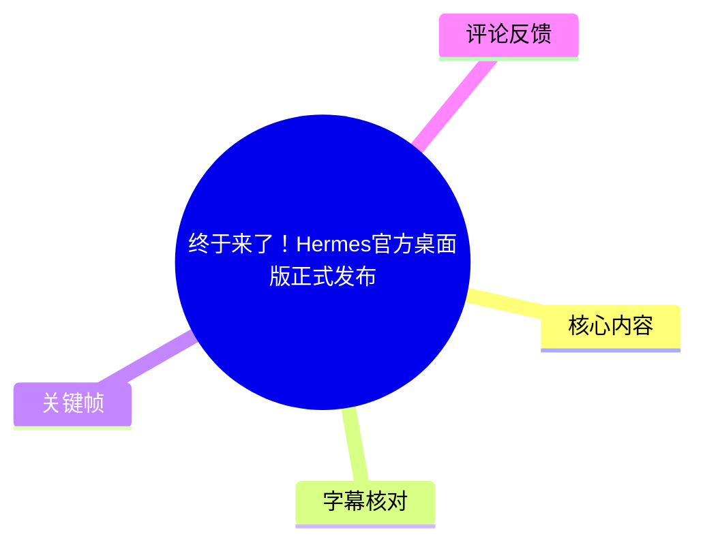
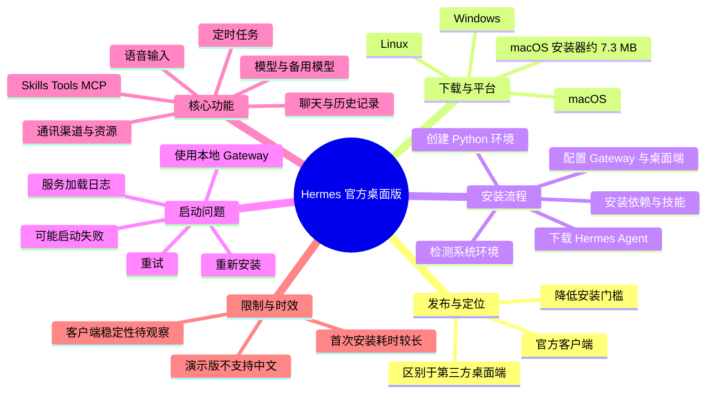
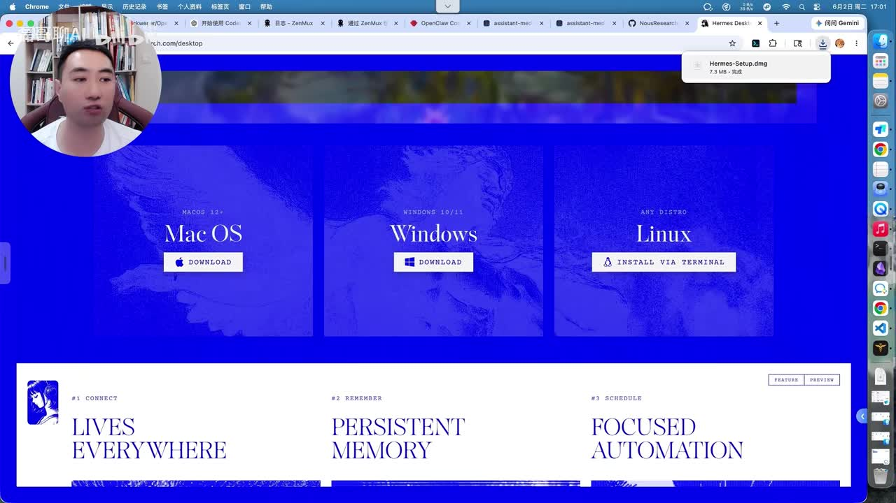
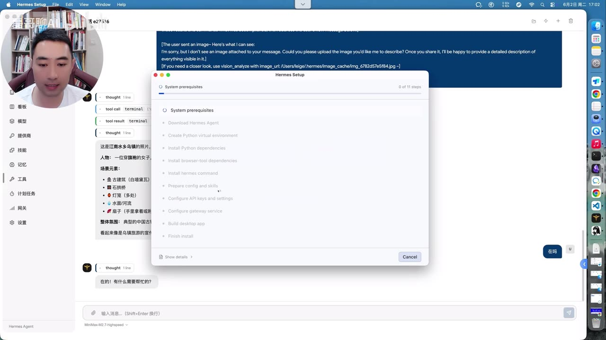
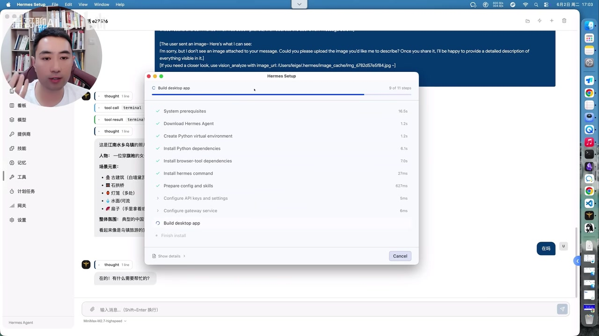
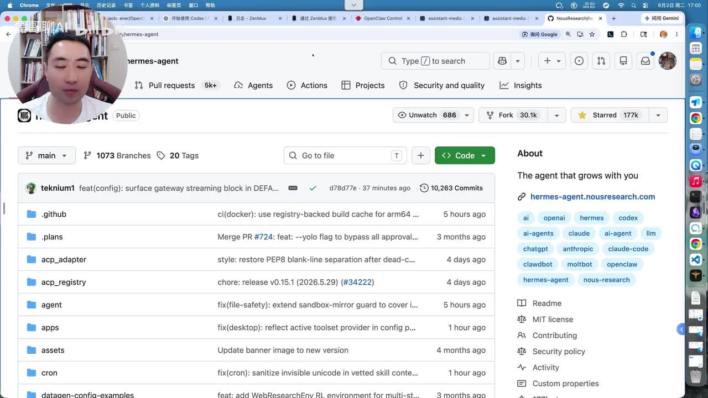

# 终于来了！Hermes官方桌面版正式发布

> 来源：[Bilibili 视频](https://www.bilibili.com/video/BV1EGVz6yEby) 
> UP 主：磊哥聊AI｜发布时间：2026-06-02｜视频时长：08:48｜分辨率：1920×1080

## 小结

视频展示了 **Hermes Agent 官方桌面版（Desktop App）** 的下载、安装、首次启动与主要设置界面。UP 主的核心判断是：相较于此前已存在的第三方桌面端，这次是 Hermes 官方推出的客户端，能够把 Hermes Agent 服务、Python 依赖、部分技能与桌面客户端的安装流程串联起来，降低新手部署门槛。

下载页展示桌面版支持 macOS、Windows 与 Linux。视频实测的是 macOS：下载的 `Hermes-Setup.dmg` 文件约 **7.3 MB**，但这只是安装器体积；首次安装仍会继续下载 Hermes Agent、Python 依赖、浏览器工具依赖、技能及配置，因此并非“完整环境只占 7.3 MB”。

官方安装器会检查系统环境并分步骤执行安装。对于已经安装 Hermes Agent 的机器，UP 主的安装很快；对于全新环境，UP 主估计可能要等待约 **15 分钟**，原因是需安装大量依赖，视频明确提到包括用于音视频处理的 **FFmpeg** 等第三方库。此时长是视频中的经验估计，不应视为所有设备、网络环境下的固定结果。

首次启动并不完全顺利：UP 主遇到了服务启动失败，界面提供“重试”“重新安装”“使用本地 Gateway”等处理选项。他先尝试本地 Gateway 未成功，再重试后最终启动成功。因此，视频既证明了官方客户端可用，也记录了当前版本可能存在启动稳定性问题；热评中“BUG 一堆”的反馈与这一现场现象方向一致，但不能由此推断全部用户都会遇到相同问题。

客户端功能方面，视频演示了聊天记录侧栏、新建会话、消息发送、语音输入、模型与备用模型设置、上下文设置、思考模式、主题、语音/TTS、系统执行步数、Gateway、API Key、Skills、Tools、MCP、通讯渠道、资源文件与定时任务。明显限制是：**视频所演示的版本没有语言切换项，界面当前不支持中文**；同时 UP 主对非白色主题的视觉设计持保留态度。

## 思维导图

## 目录

- [发布背景与平台支持](#发布背景与平台支持)
- [下载与安装流程](#下载与安装流程)
- [首次启动、报错与恢复](#首次启动报错与恢复)
- [客户端聊天与交互能力](#客户端聊天与交互能力)
- [设置项与可配置范围](#设置项与可配置范围)
- [通讯、资源与定时任务](#通讯资源与定时任务)
- [实践步骤与排障清单](#实践步骤与排障清单)
- [结论、限制与时效性](#结论限制与时效性)
- [关键帧索引](#关键帧索引)
- [字幕比对](#字幕比对)
- [评论分析](#评论分析)
- [处理记录](#处理记录)

## 发布背景与平台支持

### 官方桌面端的定位 [00:00:32](https://www.bilibili.com/video/BV1EGVz6yEby?t=32)

视频开场说明，Hermes 此次推出的是“官方”桌面版，而非 UP 主此前使用过的第三方桌面面板。视频将其价值概括为：官方亲自提供客户端，并展示其下载、安装方式及与第三方客户端的差异。

需要注意，视频没有给出官方桌面端与第三方客户端的完整功能对照表、性能基准或安全审计结果。因此，“官方正版”应理解为视频对发布主体与客户端来源的描述，不能外推为功能必然更强、问题必然更少。

### 下载入口与操作系统 [00:00:33](https://www.bilibili.com/video/BV1EGVz6yEby?t=33)

UP 主从 Hermes 的开源项目进入官网，并在官网中找到 `Desktop App` 页面。该页面展示：

- **macOS**：提供下载按钮；
- **Windows**：提供下载按钮；
- **Linux**：页面显示为通过终端安装（`Install via terminal`）；
- 视频实测设备为 Mac。

> 图：该帧直接展示桌面端官网的三平台入口，以及页面上“Lives Everywhere / Persistent Memory / Focused Automation”等产品文案。它是确认视频中“支持 macOS、Windows、Linux”这一结论的画面依据；但页面未在该帧展示具体版本号或系统最低要求。

## 下载与安装流程

### macOS 安装包与拖拽安装 [00:00:58](https://www.bilibili.com/video/BV1EGVz6yEby?t=58)

UP 主下载 macOS 版本后，称安装文件大小约为 **7.3 MB**。随后双击安装包，通过拖拽方式完成应用安装，并在“应用程序”中看到官方的 `Hermes Setup`。视频同时提到，UP 主此前已有一个第三方 `Hermes Agent` 客户端，因此画面中会同时存在不同来源的相关应用。

**参数与含义：**

| 项目 | 视频中信息 | 解读 |
| --- | --- | --- |
| 实测平台 | macOS | 仅代表视频演示环境 |
| 安装器大小 | 约 7.3 MB | 不等于最终完整运行环境大小 |
| 安装方式 | 双击 DMG 后拖拽安装 | 视频展示的 macOS 常规应用安装流程 |
| 其他平台 | Windows、Linux | 视频未实际演示其安装步骤 |

### 安装器的执行步骤 [00:01:22](https://www.bilibili.com/video/BV1EGVz6yEby?t=82)

打开 `Hermes Setup` 后，安装器会执行系统检查和依赖部署。画面中的步骤列表显示，安装过程至少涉及：

1. `System prerequisites`：检查系统先决条件；
2. `Download Hermes Agent`：下载 Hermes Agent；
3. `Create Python virtual environment`：创建 Python 虚拟环境；
4. `Install Python dependencies`：安装 Python 依赖；
5. `Install browser-tool dependencies`：安装浏览器工具依赖；
6. `Install hermes command`：安装 Hermes 命令；
7. `Prepare config and skills`：准备配置与技能；
8. `Configure API keys and settings`：配置 API Key 与设置；
9. `Configure gateway service`：配置 Gateway 服务；
10. `Build desktop app`：构建桌面应用；
11. `Finish install`：完成安装。

> 图：该帧显示 Hermes Setup 的 11 步安装清单。它说明官方桌面端并非单纯的前端壳程序，而是会在本机部署 Agent、Python 环境、浏览器工具依赖、配置及 Gateway 等相关组件。

### 已安装环境与全新环境的耗时差异 [00:01:46](https://www.bilibili.com/video/BV1EGVz6yEby?t=106)

UP 主的电脑已经安装 Hermes Agent，因此系统检测后发现部分环境已具备，Python 依赖及后续配置完成较快。视频强调：如果本机此前没有安装 Hermes，也可以直接安装官方客户端；安装器会自动安装 Hermes Agent 和客户端。

对于全新设备，UP 主给出的经验是可能需要等待约 **15 分钟**。视频将耗时归因于大量依赖的下载与安装，其中点名包含 FFmpeg 等用于音视频处理的第三方库。

> 图：该帧显示前置检查、下载 Hermes Agent、创建 Python 虚拟环境、安装 Python 与浏览器工具依赖等步骤已完成，当前进度为“Build desktop app”。它可帮助读者理解：7.3 MB 仅是安装器下载体积，后续仍存在本机环境构建过程。

## 首次启动、报错与恢复

### 服务加载与启动失败现象 [00:02:59](https://www.bilibili.com/video/BV1EGVz6yEby?t=179)

安装成功后，UP 主点击启动 Hermes。客户端会打开页面并加载 Hermes 服务，底部有日志显示区域，可用于观察启动过程。

但在本次实测中，服务启动出现报错，界面提供以下处理路径：

- 重试；
- 重新安装；
- 使用本地 Gateway。

这是视频中明确出现的实际故障，不是推测。UP 主认为随后通过重试恢复，说明问题更像是客户端侧的临时问题；但视频未提供日志全文、错误码或根因分析，因此不能据此确认故障原因。

### 本地 Gateway 与重试结果 [00:03:23](https://www.bilibili.com/video/BV1EGVz6yEby?t=203)

UP 主因本机已安装 Gateway，选择使用本地 Gateway。第一次启动本地 Gateway 未成功，随后点击“重试”，安装器再次检测；检查完成后重新启动 Hermes 服务，并最终成功进入完整客户端。

可从这段演示得到的实用结论：

- 如果首次启动报错，优先查看日志；
- 对于已有本地 Gateway 的用户，可尝试切换到本地 Gateway；
- 若第一次仍未成功，可执行“重试”让客户端重新检测；
- 全新机器不一定会出现与 UP 主相同的报错，因为其本机已有 Hermes/Gateway 环境，可能存在旧配置或环境交互因素。

### 完整客户端与历史会话 [00:03:47](https://www.bilibili.com/video/BV1EGVz6yEby?t=227)

启动成功后，视频展示了完整客户端界面。UP 主指出，既有聊天记录会保留并显示在客户端中；视频没有进一步说明聊天历史的本地存储位置、同步机制、加密方式或跨设备一致性，因此这些方面仍需以官方文档与实际版本为准。

## 客户端聊天与交互能力

### 模型询问与响应速度体验 [00:04:12](https://www.bilibili.com/video/BV1EGVz6yEby?t=252)

UP 主创建测试对话，输入“你使用的是什么大模型”，点击发送后获得回复，并主观评价整体响应速度“比较快”。

这属于单次主观体验，视频没有提供：

- 网络环境；
- 模型名称与版本；
- 首 Token 延迟；
- 完整响应时长；
- 并发条件；
- 与网页端或第三方客户端的量化对比。

因此，可将其理解为“该演示环境下交互可正常完成”，而非通用性能结论。

### 会话、消息与语音输入 [00:04:23](https://www.bilibili.com/video/BV1EGVz6yEby?t=263)

视频中展示的交互能力包括：

- 新建对话；
- 左侧集中显示全部会话；
- 右侧展示当前对话内容；
- 发送消息；
- 支持语音输入。

UP 主特别提到，这个桌面端解决了其使用网页端时“不能进行消息发送”的问题。这里应限定为 UP 主当时所接触的网页端使用体验，并不代表所有 Hermes 网页版本或账号状态都不能发送消息。

## 设置项与可配置范围

### 模型、聊天与上下文设置 [00:04:47](https://www.bilibili.com/video/BV1EGVz6yEby?t=287)

设置页中可见的模型与聊天相关选项包括：

| 配置类别 | 视频明确提及的项目 |
| --- | --- |
| 模型 | 当前模型、默认模型、上下文、备用模型 |
| 聊天 | 聊天相关信息、时间格式、思考模式、图片相关信息 |
| 模型管理 | 选择最新模型并保存 |
| 用量 | 查看 Token 使用量 |

视频没有展示每个选项的具体字段、默认数值或模型供应商清单。因此，文中仅记录可见的配置维度，不补充未出现的参数值。

### 主题与中文支持限制 [00:05:11](https://www.bilibili.com/video/BV1EGVz6yEby?t=311)

UP 主尝试在主题设置中寻找中文语言选项。画面显示可选择白色、黑色及跟随系统等外观方式，但视频结论是：**该版本主题设置中没有语言选项，目前不支持中文。**

这项限制需要与“界面文字为英文”区分：

- 视频显示客户端当前 UI 为英文；
- 视频未发现语言切换入口；
- 视频不能证明未来版本、隐藏配置、命令行配置或其他发行渠道永远不支持中文；
- 该结论的有效范围是视频录制时演示的当前版本。

UP 主个人偏好白色主题，对其他配色持否定态度。这是审美评价，不属于可通用的功能结论。

### 工作区、安全、记忆与语音 [00:05:59](https://www.bilibili.com/video/BV1EGVz6yEby?t=359)

视频继续展示设置页中的工作区、安全性与记忆相关配置，但没有逐项展开字段内容。此外，语音相关设置中，UP 主称默认内置 **Azure Microsoft TTS**，并使用本地方式；这些配置可以调整，但他建议一般情况下不需要修改。

应注意：视频只证明该演示界面存在相关入口，并未验证 Azure Microsoft TTS 的具体认证方式、可用地区、语音质量、费用或离线能力。

### 系统、Gateway、API Key、Skills 与 MCP [00:06:23](https://www.bilibili.com/video/BV1EGVz6yEby?t=383)

视频展示了更偏运行与扩展的设置：

| 模块 | 视频内容 | 关键说明 |
| --- | --- | --- |
| 系统 | 最大执行步数默认 **90 步** | 可修改；视频未说明更改后的资源、费用或成功率影响 |
| Gateway | 当前使用本地 Gateway | 也可配置远程 Gateway |
| API Key | 管理模型供应商及相应大模型 | 未展示具体供应商或密钥保存策略 |
| Skills / Tools | 展示已安装技能与工具 | 未逐个演示安装或调用 |
| MCP | 可配置 MCP 连接 | 未提供具体服务器、协议参数或配置示例 |

### 设置范围小结 [00:06:47](https://www.bilibili.com/video/BV1EGVz6yEby?t=407)

UP 主认为当前版本设置项“基本足够”，但重申不支持中文是较麻烦的点。视频还展示了技能快捷入口、模型选择与 Token 使用量查看功能。

需要谨慎看待“足够”的结论：它是以 UP 主个人使用需求为尺度的评价。对于需要团队权限、审计日志、企业级密钥托管、离线部署、细粒度成本控制或复杂 MCP 编排的用户，视频没有提供足够信息判断该桌面端是否满足要求。

## 通讯、资源与定时任务

### 通讯渠道和资源文件 [00:07:36](https://www.bilibili.com/video/BV1EGVz6yEby?t=456)

视频称客户端可在相关页面配置通讯工具，举例包括：

- 钉钉；
- 飞书；
- 微信（ASR 对该词识别不稳定，结合语境整理为“微信”）。

此外，Agent 执行操作产生的图片、音频、视频等资源，会展示在资源文件区域。视频未演示实际连接通讯渠道的授权流程，也未展示资源保存路径、访问权限和清理策略。

### 定时任务与模型切换 [00:08:00](https://www.bilibili.com/video/BV1EGVz6yEby?t=480)

针对“没有看到定时任务”的疑问，UP 主指出底部可进入定时任务区域，查看当前状态与 Agent 执行情况，并创建定时任务。右下角还可以选择、切换模型；底部显示当前 Hermes 版本。

视频没有给出定时任务的触发条件、Cron 表达式、时区、失败重试、执行权限或任务并发限制。因此，能够确认的是“存在创建定时任务的界面入口”，而不是完整的调度能力细节。

## 实践步骤与排障清单

### 从官网下载到启动的顺序 [00:00:33](https://www.bilibili.com/video/BV1EGVz6yEby?t=33)

以下步骤按视频实际操作顺序整理，适用于希望复现视频流程的用户：

1. 从 Hermes 开源项目进入官方站点；
2. 找到 `Desktop App` 页面；
3. 根据系统选择 macOS、Windows 或 Linux 安装入口；
4. macOS 下载完成后双击安装包，拖拽安装应用；
5. 打开官方 `Hermes Setup`，而非已有第三方同名/近似应用；
6. 在安装器中点击下一步，等待系统检查、Agent 下载、Python 环境与依赖安装、配置与桌面端构建；
7. 安装完成后启动 Hermes 服务；
8. 若发生启动失败，先查看日志，再根据已有环境尝试重试、重新安装或切换本地 Gateway；
9. 启动成功后，在模型、API Key、Gateway、Skills、MCP 等页面完成后续配置；
10. 按实际需要设置模型、上下文、备用模型、语音输入、定时任务与通讯渠道。

### 安装前后的注意事项 [00:02:11](https://www.bilibili.com/video/BV1EGVz6yEby?t=131)

- **不要仅根据 7.3 MB 判断安装成本**：该数字是视频中的 macOS 安装器下载体积，首次部署还会安装运行依赖。
- **新机器应预留时间**：视频估计约 15 分钟，但实际时间受网络、系统性能、依赖源和已有环境影响。
- **已有环境可能更快，也可能引入交互问题**：UP 主因已安装 Hermes/Gateway 而快速通过部分步骤，但启动时也出现失败。
- **不要跳过日志**：启动加载区有日志，是判断故障的第一手材料。
- **谨慎调整系统步数**：默认最大执行步数为 90，视频只确认可改，未说明增大后对成本、时间、循环风险的影响。
- **API Key 属于敏感信息**：视频只说明可在 UI 管理模型供应商和模型，未说明凭据保护方式；实际操作中不应在截图、公开日志或不可信环境暴露密钥。
- **中文界面需求需提前评估**：视频版本中未找到中文入口，中文用户需接受英文 UI，或等待后续版本变化。

## 结论、限制与时效性

### 视频可确认的结论 [00:08:24](https://www.bilibili.com/video/BV1EGVz6yEby?t=504)

1. Hermes 官方网站已提供桌面端入口，视频展示 macOS、Windows、Linux 三个平台选项。
2. 官方安装器会自动处理 Hermes Agent、Python 虚拟环境、依赖、配置、Gateway 与桌面端构建等步骤。
3. 在 UP 主的 Mac 环境中，安装后可进入完整客户端并完成聊天、语音输入、模型选择、Skills/Tools/MCP 配置、通讯渠道配置、资源查看和定时任务创建。
4. 视频所演示版本的 UI 为英文，未找到中文语言切换选项。
5. 首次启动可能出现服务启动失败，视频中的“重试”最终恢复成功。

### 不应过度外推的部分

- “响应快”来自 UP 主单次体验，未做性能测试；
- “约 15 分钟”是视频经验估计，不是安装 SLA；
- “客户端问题”是 UP 主对一次启动故障的判断，缺少错误日志和官方说明；
- 钉钉、飞书、微信、MCP、远程 Gateway、定时任务等均只确认有配置入口或功能提及，未验证实际配置成功；
- 视频没有比较官方客户端与第三方客户端的完整功能、资源消耗、稳定性、安全性和数据处理差异。

### 时效性说明

本视频发布时间为 **2026-06-02**，内容反映的是录制时的 Hermes 桌面端状态。桌面应用、安装器、模型支持、语言包、Gateway 行为、MCP 生态和第三方通信集成均可能快速变化。尤其“不支持中文”“默认最大执行 90 步”“安装器步骤”“启动异常”均应以当前实际客户端与官方文档为最终依据。

## 关键帧索引

| 关键帧 | 对应内容 | 使用价值 |
| --- | --- | --- |
|  | Hermes Agent 开源项目主页 | 画面显示项目页及官网入口，是“从开源项目进入官网”的依据。 |
|  | macOS、Windows、Linux 下载入口 | 直接确认三平台桌面端下载/安装入口。 |
|  | Hermes Setup 的完整步骤列表 | 展示安装器需要处理的环境、依赖、Gateway 与桌面端构建任务。 |
|  | 已完成多项依赖安装并构建桌面端 | 说明安装器下载后仍会进行较完整的本地部署。 |

## 字幕比对

| 字幕来源 | 完整性 | 专有名词 | 时间轴 | 主要问题 |
| --- | --- | --- | --- | --- |
| Bilibili 站内字幕 | 未提供可用字幕 | 无法评估 | 无法评估 | 素材中没有可用站内字幕文件，无法用于正文转写。 |
| 本次 ASR 字幕 | 较高：诊断显示语音覆盖约 93.57%，覆盖 00:00:32.300 至 00:08:47.800 | 存在较多同音/断词错误 | 有真实 SRT 起止时间，可用于章节时间链接 | 首段时间仅 1.4 秒却承载大量文本；Hermes、Gateway、FFmpeg、TTS、Skills、Tools、MCP、微信等词存在误识别或变体。 |

本次素材中的 `asr-result.json` **未标记 `noAudioStream=true`**，且诊断显示存在音轨、识别语言为中文（置信度约 0.9995）。因此，本整理以本次 ASR 的带时间戳 SRT 为主要时间轴来源；由于没有站内字幕，无法进行逐句交叉校验。

对 ASR 的必要校正遵循“仅依据上下文与关键帧”的原则：

- “艾马仕 / Hermessegent”等统一整理为 **Hermes / Hermes Agent**；
- “Gateways / Gatway”等统一整理为 **Gateway**；
- “FonePack”结合视频所述“音视频处理第三方库”整理为 **FFmpeg**；
- “A 纸微软 TTS”整理为 **Azure Microsoft TTS**；
- “Skills and Torts”结合界面功能语境整理为 **Skills 和 Tools**；
- “丁丁、飞书、某信”中“某信”仅结合常见通讯工具及语境整理为“微信”，视频未展示实际连通结果；
- 第一条 ASR 段的文字量与 00:00:32.300—00:00:33.700 的时长明显不匹配，故正文不以该段内部细粒度时间做断言，只使用其开始时间作为“发布背景”章节定位。

## 评论分析

仅分析本次可获取的热评前三条。评论代表个人观点或经验，不作为已验证事实。

1. **996-007（68 赞）**  
   评论认为，如果要“正经干活”，仍更倾向于 Claude Code 和 Codex。该观点将 Hermes 放在 AI Agent/编程工具竞争环境中评价，反映部分用户更看重实际生产力与代码工作流。评论没有给出对比场景、任务样本、版本或量化指标，因此不能据此判定 Hermes 的能力弱于 Claude Code 或 Codex。

2. **太乙澈（47 赞）**  
   评论以“省流：BUG 一堆”概括使用感受。视频本身确实记录了一次首次启动失败、需重试后恢复的情形，因此该评论与视频现场的稳定性疑虑相呼应。但评论未列举具体 Bug、复现条件、系统版本和日志，也没有证明问题普遍存在；应将其视作风险提醒而非结论。

3. **省级退堂鼓表演艺术家（21 赞）**  
   评论建议结合 `agent memory` 使用，并称 Hermes 的记忆 Markdown 文件“经常爆满”；其认为引入该工具后，新开对话可减少遗忘前序对话的问题。这为视频中“记忆”配置和跨会话工作流提供了补充方向，但属于评论者经验，视频未验证 `agent memory` 的兼容方式、文件容量问题、记忆注入机制或效果。实际采用前应先确认该扩展的来源、安全性、配置方式与数据隐私影响。

## 处理记录

- Worker ID：worker-mrj0wbly-5dc4e50c
- 调用模型：gpt-5.6-terra
- 使用的素材工具输出：视频元数据、ASR 诊断与 `asr/transcript.srt` 时间轴字幕、关键帧目录、热评 JSON。
- 字幕选择：未提供可用 Bilibili 站内字幕；已检查本次 ASR，确认源视频存在音轨且 ASR 含时间戳。正文以 ASR SRT 为时间轴基础，并对明显专有名词误识别作保守校正。
- 关键帧选择依据：选用已提供且与正文直接对应的开源项目页、三平台下载页、安装步骤页、安装构建进度页；图片均用于支撑“官网入口、平台支持、安装器工作内容、依赖部署”这些可视事实。
- 评论处理范围：仅使用可获取热评前三条，未扩展到其他评论。
- 缓存清理：本任务仅依据已提供素材生成文档，未新增下载、转码或生成中间缓存；无额外缓存需要清理。
- 未解决问题：未提供官方桌面端版本号、完整错误日志、站内字幕、Windows/Linux 实测流程、通讯渠道授权流程、MCP 配置示例及官方与第三方客户端的完整对比数据。
