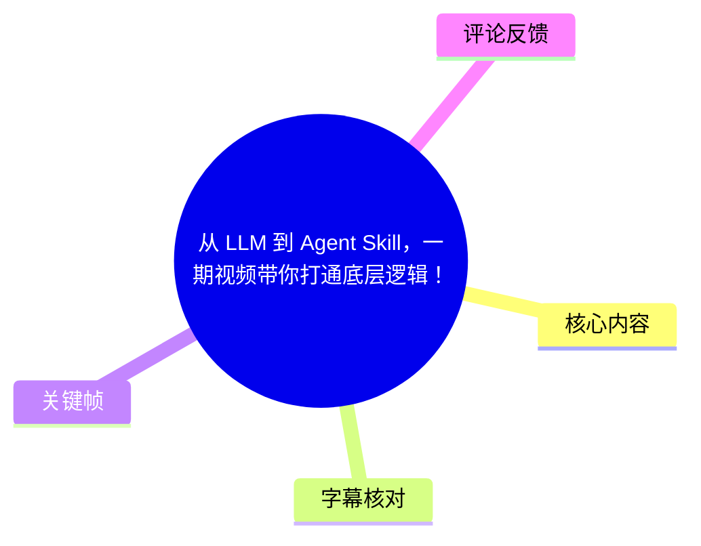
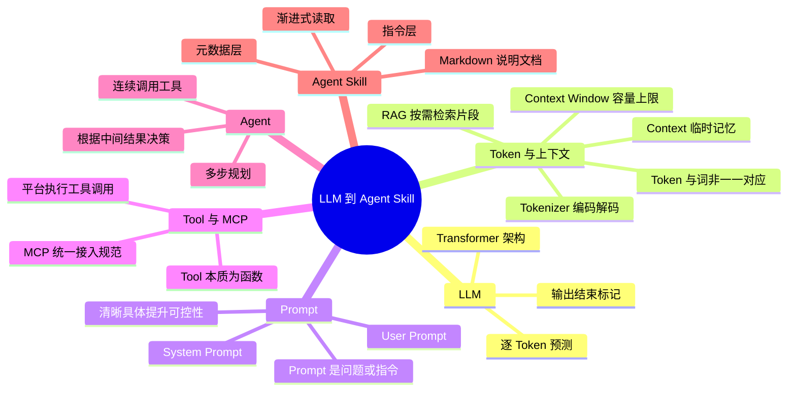
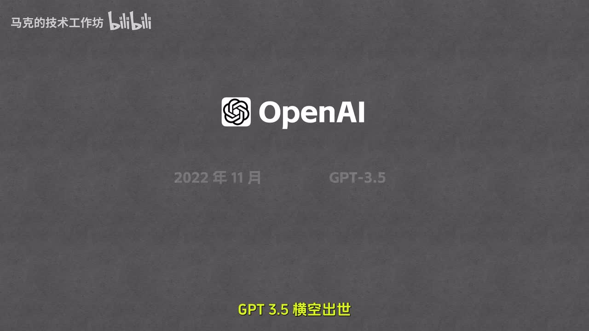
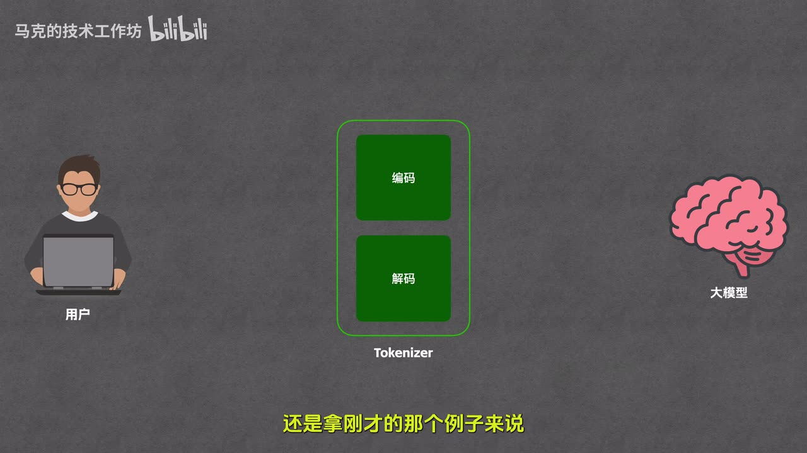
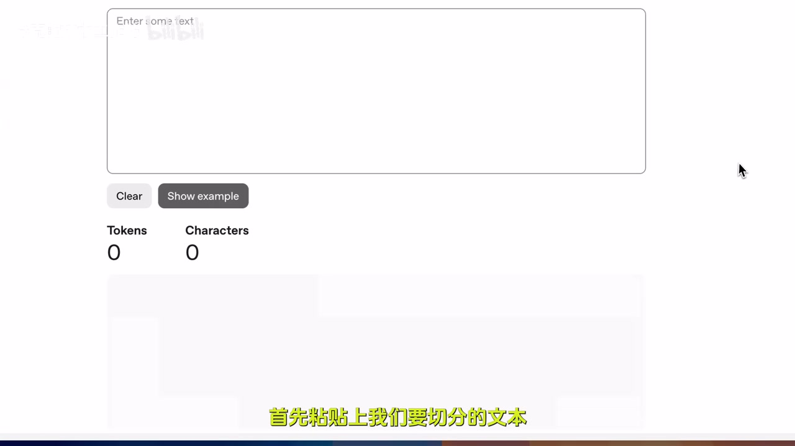
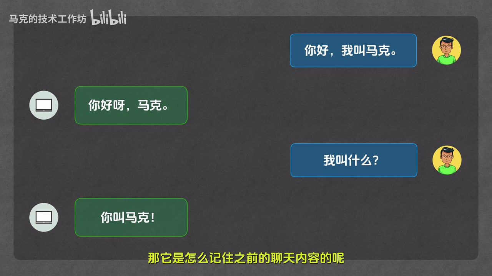

# 从 LLM 到 Agent Skill，一期视频带你打通底层逻辑！

> 来源：[Bilibili 视频](https://www.bilibili.com/video/BV1E7wtzaEdq)  
> UP 主：马克的技术工作坊｜视频时长：32 分 31 秒｜合集：AIcode  
> 视频定位：从工程视角串联 `LLM → Token → Context → Prompt → Tool → MCP → Agent → Agent Skill` 的入门概念体系。

## 小结

本视频不是讲某一个具体模型或框架的操作教程，而是按“由底向上”的工程依赖关系，解释当前 AI 应用中的核心术语：LLM 负责逐 Token 生成；Tokenizer 负责将文本与数字 ID 相互转换；Context 是模型单次处理时收到的全部信息；Prompt、工具和系统规则都属于上下文的一部分。

视频最重要的拆解是：**模型本身只能基于输入生成文本，不能亲自执行工具**。当模型要查询天气、读取位置或搜索店铺时，模型只会输出“调用哪个工具、传什么参数”的结构化指令；真正执行函数、接收结果并回传模型的是平台/宿主程序。Tool 由此提供外部能力，MCP 则被解释为让工具能以统一方式接入不同平台的协议。

在此基础上，视频将 Agent 定义为一个能够根据当前状态自主规划、连续调用多个工具、直到完成任务的系统。示例中，Agent 为回答“如果下雨，附近是否有卖伞的店”，依次调用定位、天气和店铺查询工具，并根据中间结果决定后续动作。

最后，视频用“出门清单”场景引出 Agent Skill：它是一份预先写好的 Markdown 说明文档，用于沉淀高频任务的目标、步骤、判断规则、输出格式和示例，避免用户每次都重复粘贴长 Prompt。视频强调其元数据层至少含 `name` 和 `description`，并提到“渐进式披露”可以避免无关任务一开始就加载完整指令，从而节省 Token。

适合对 AI 产品、Agent、MCP 和上下文机制缺乏整体框架的初学者阅读。视频给出的模型版本、上下文窗口、产品名称与本地 Skill 路径均具有明显时效性；尤其 ASR 对专有名词存在较多误识，涉及具体产品、目录和文件名时应以对应软件的当前官方文档为准。

## 思维导图





## 目录

- [概念体系与 LLM 的工作方式](#概念体系与-llm-的工作方式)
- [Token、Tokenizer 与上下文](#token-tokenizer-与上下文)
- [Prompt：任务指令与系统规则](#prompt任务指令与系统规则)
- [Tool：模型如何获得外部能力](#tool模型如何获得外部能力)
- [MCP：统一工具接入规范](#mcp统一工具接入规范)
- [Agent：多步规划与工具循环](#agent多步规划与工具循环)
- [Agent Skill：把高频规则固化为说明文档](#agent-skill把高频规则固化为说明文档)
- [完整概念链路、限制与时效性](#完整概念链路限制与时效性)
- [字幕比对](#字幕比对)
- [评论分析](#评论分析)
- [处理记录](#处理记录)

## 概念体系与 LLM 的工作方式 [00:00:26](https://www.bilibili.com/video/BV1E7wtzaEdq?t=26)

视频开场提出的问题是：LLM、Token、Context、Prompt、Tool、MCP、Agent 与 Agent Skill 等词被频繁使用，但它们在工程上分别指什么、彼此如何连接，往往没有被放入一套统一框架中解释。作者选择从最底层的 LLM 开始逐层向上构建。

### LLM、Transformer 与发展背景 [00:00:34](https://www.bilibili.com/video/BV1E7wtzaEdq?t=34)

- **LLM** 是 `Large Language Model` 的缩写，即“大语言模型”。
- 视频称当代主流大模型基本建立在 **Transformer** 架构基础上；作者不展开架构图细节，只将其视为大模型的底层引擎。
- 作者提到 Transformer 由 Google 团队于 2017 年通过论文《Attention Is All You Need》提出。
- 视频以 GPT-3.5 在 2022 年末出现、GPT-4 在 2023 年 3 月发布为节点，说明生成式 AI 被广泛关注的过程；并称市场后来不再只是 OpenAI 的单一竞争，Claude、Gemini 等也在各自领域竞争。



> 图：画面以 OpenAI 标识、“2022 年 11 月”和“GPT-3.5 横空出世”呈现视频的历史叙述节点。它有助于区分视频的背景回顾与后续的工程机制讲解。

### LLM 的生成机制：逐步预测下一个 Token [00:01:46](https://www.bilibili.com/video/BV1E7wtzaEdq?t=106)

作者用“文字接龙”概括 LLM 的生成过程。以“马克的视频怎么样”为输入：

1. 模型依据当前输入预测下一个概率较高的 Token，例如“特别”。
2. 生成出的“特别”会被追加回当前输入。
3. 模型再预测下一个 Token，例如“的”。
4. 重复追加与预测，直至生成“棒”等后续内容。
5. 当模型判断回答结束时，输出特殊的结束标记，完成本轮生成。

因此，视频所说的“一个词一个词输出”是便于理解的简化表达；更严格地说，模型是**一个 Token 一个 Token 地自回归生成**。Token 未必等于一个自然语言词，后续章节会进一步说明。

## Token、Tokenizer 与上下文 [00:03:05](https://www.bilibili.com/video/BV1E7wtzaEdq?t=185)

### Tokenizer：文本与数字之间的翻译器 [00:03:30](https://www.bilibili.com/video/BV1E7wtzaEdq?t=210)

视频强调：模型内部进行的是矩阵等数值计算，不直接“认识”人类文字。因此，用户与模型之间需要 **Tokenizer** 负责转换：

- **编码（Encoding）**：将文本变为模型可处理的数字。
  1. **切分**：把文本拆为若干最小片段，即 Token。
  2. **映射**：将每一个 Token 映射为对应的数字，即 Token ID。
- **解码（Decoding）**：将模型输出的 Token ID 映射回 Token，再呈现为文本。
  - 视频指出解码时不需重新切分，因为模型每次输出的是单个 Token ID。



> 图：画面把“用户—Tokenizer—大模型”并列，Tokenizer 内部标有“编码”和“解码”。这是理解“模型处理数字而非原始文字”的核心视觉辅助。

### Token 不等于词或字符 [00:05:30](https://www.bilibili.com/video/BV1E7wtzaEdq?t=330)

视频用多个示例说明 Token 的边界由 Tokenizer 的切分规则决定，而不是由汉语分词、英语单词或单个字符机械决定：

- “马克的视频怎么样”在演示中被切为 4 个 Token：“马克”“的”“视频”“怎么样”。
- 频道名“马克的技术工作坊”按自然词汇直觉可能是 4 个词，但演示结果是 5 个 Token；其中“工作坊”被拆成“工作”与“坊”。
- “程序员”被举例切为“程序”与“员”。
- 常见英文单词如 `Hello`、`Going` 可能各对应一个 Token，但并非绝对规则；视频举例称 `helpful` 可以被拆为多个 Token。
- 某些特殊字符可能消耗多个 Token；视频以“对勾”字符需要 3 个 Token 为例，且可视化界面可能无法将这些 Token 正常显示为字符。



> 图：画面展示文本输入区、`Tokens` 与 `Characters` 计数区，是视频验证“文本实际被切成多少 Token”的工具演示入口。其价值在于提示读者不要仅凭自然语言直觉估算 Token。

作者给出的粗略估算为：

| 换算项 | 视频中的估算 |
| --- | --- |
| 1 Token 对英文 | 约 0.75 个英文单词 |
| 1 Token 对中文 | 约 1.5～2 个汉字 |
| 40 万 Token 对中文 | 约 60～80 万汉字 |

这些是视频中的经验性估算，不是所有 Tokenizer、所有文本类型都适用的固定公式。实际计费、上下文占用和切分结果应使用目标模型的 Tokenizer 测量。

### Context 与 Context Window：模型的“临时记忆” [00:08:13](https://www.bilibili.com/video/BV1E7wtzaEdq?t=493)

作者用对话记忆解释 Context：

- 模型并不像人一样自动长期记住先前聊天内容。
- 应用程序通常会在用户每次提问时，把此前对话历史连同当前问题重新发送给模型。
- 因而，**Context（上下文）** 是模型在一次任务处理中接收到的**全部信息总和**。
- 视频列举的 Context 内容包括：用户当前问题、对话历史、模型已生成的 Token、工具列表、System Prompt 等。
- 作者将其类比为模型的“临时记忆体”；这个比喻便于理解，但不等同于模型拥有独立、持续、自动写入的记忆数据库。



> 图：画面展示“你好，我叫马克”之后再问“我叫什么”，模型能够答出“你叫马克”。它直观说明所谓“记住”依赖历史消息被重新放入本轮 Context。

**Context Window（上下文窗口）** 则是 Context 能容纳的最大 Token 数量。视频的例子是：若窗口为 1 万 Token，模型最多处理 1 万 Token 的上下文内容。

视频列出的当时产品规格包括：

| 模型名称（按视频说法整理） | Context Window |
| --- | ---: |
| GPT-5.4 | 105 万 Token |
| Gemini 3.1 Pro | 100 万 Token |
| Claude Opus 4.6 | 100 万 Token |

作者进一步用“100 万 Token 约为 150 万汉字”的估算，类比其可以容纳《哈利·波特》全集量级的内容。**这些具体型号及容量是强时效信息**：视频发布后，厂商命名、可用模型、套餐限制和窗口大小都可能变化，不能据此作为当前产品规格。

### 长文档为何需要 RAG [00:10:36](https://www.bilibili.com/video/BV1E7wtzaEdq?t=636)

对于“上千页公司产品手册问答”的场景，视频不建议将整本手册随每个问题完整发送给模型，理由是：

- 内容可能超过上下文窗口；
- 即使不超窗口，输入 Token 成本也难以控制；
- 大量无关信息会被一并放入当前上下文。

视频引出 **RAG（检索增强生成）**：先从手册中检索与用户问题最匹配的若干片段，再将这些片段连同问题发送给模型回答。其核心收益是减少输入规模、降低成本，并缓解上下文窗口限制。

需要注意：视频只解释了 RAG 的基本作用，并未展开索引构建、切块策略、召回、重排序、引用验证或检索失败处理等实现问题。

## Prompt：任务指令与系统规则 [00:11:45](https://www.bilibili.com/video/BV1E7wtzaEdq?t=705)

### Prompt 的作用与质量 [00:11:45](https://www.bilibili.com/video/BV1E7wtzaEdq?t=705)

**Prompt（提示词）** 被定义为模型接收到的具体问题或指令，例如“帮我写一首诗”。

视频的关键经验是：模糊的 Prompt 会留下大量解释空间。例如只要求“写一首诗”，模型可能产出古诗、现代诗或其他形式；若改为“请帮我写一首五言绝句，主题是秋天的落叶，风格要悲凉一点”，任务形式、主题与风格就更明确，输出更接近预期。

作者将 Prompt Engineering 概括为“把话说清楚，让模型更准确理解意图”，并提出自己的时效性判断：

- 这一领域曾较热门；
- 随着模型能力提升，模型对含糊指令的理解能力增强；
- 因其门槛较低，视频认为如今不必对“提示词工程”本身投入过多形式化关注。

这是作者的经验判断，不意味着复杂系统不再需要清晰的任务描述、结构化输出约束、评测或安全边界设计。

### User Prompt 与 System Prompt [00:13:21](https://www.bilibili.com/video/BV1E7wtzaEdq?t=801)

视频将 Prompt 分成两类：

| 类型 | 来源 | 作用 |
| --- | --- | --- |
| User Prompt | 用户在对话框直接输入 | 描述当前具体问题或任务 |
| System Prompt | 开发者在后台配置 | 规定角色、人设、长期行为规则与限制 |

示例是一个数学辅导机器人：

- System Prompt：要求模型扮演耐心数学老师，不直接公布答案，而是逐步引导学生思考。
- User Prompt：“3 加 5 等于几？”
- 在系统规则约束下，模型不会只回答“8”，而会用“三个苹果又拿五个苹果”的方式引导学生自行得出结果。

视频借此强调：User Prompt 让模型知道“当前要做什么”，System Prompt 让模型知道“应以何种规则完成”。两者会一同构成当前上下文的一部分。

## Tool：模型如何获得外部能力 [00:15:15](https://www.bilibili.com/video/BV1E7wtzaEdq?t=915)

### Tool 的本质与边界 [00:15:15](https://www.bilibili.com/video/BV1E7wtzaEdq?t=915)

作者指出，纯模型不能自行感知实时外部环境。例如询问“今天上海天气怎么样”，如果没有实时数据访问能力，模型不能真正去天气网站查询；它只能根据训练数据生成文字。

视频将 **Tool（工具）** 解释为本质上的**函数**：

- 输入：例如城市、日期；
- 内部行为：例如调用气象局接口；
- 输出：对应天气信息。

因此 Tool 的作用是为模型提供可调用的外部能力，使 AI 应用能够获取实时信息或影响外部环境。

### 用户、平台、模型和工具的协作流程 [00:16:27](https://www.bilibili.com/video/BV1E7wtzaEdq?t=987)

视频用天气查询拆解完整调用链，参与者包括用户、平台、大模型和天气查询工具：

1. 用户将天气问题发给**平台**。
2. 平台向模型转发用户问题，同时提供当前可用工具列表，例如天气工具、计算器工具。
3. 模型判断需要实时天气信息，并根据工具描述生成工具调用指令，包含工具名称和参数。
4. 平台接收该指令，实际执行工具背后的函数。
5. 平台获取工具执行结果，再将结果提交给模型。
6. 模型把结果整理为自然语言答案。
7. 平台把最终答案返回给用户。

视频特别纠正一个常见误解：**不是模型亲自调用工具**。模型的能力是输出文本或结构化调用意图；实际调用函数、处理权限、获取结果、处理异常并将结果反馈给模型，属于平台或宿主程序的职责。

职责可归纳为：

| 角色 | 视频中的职责 |
| --- | --- |
| 大模型 | 选择工具、生成参数、对工具结果归纳总结 |
| Tool | 执行实际动作，例如查询天气 |
| 平台 | 提供工具列表、执行调用、串联消息与结果 |
| 用户 | 提出需求、获得最终结果 |

## MCP：统一工具接入规范 [00:19:23](https://www.bilibili.com/video/BV1E7wtzaEdq?t=1163)

视频提出的工程问题是：平台不仅要把工具列表传给模型，还必须知道每个工具的用途、参数和调用方式；若不同模型平台各自拥有不同的接入规范，同一个工具就要为多个平台分别写接入代码。

作者将 **MCP** 展开为 `Model Context Protocol`，中文称“模型上下文协议”，并将其定位为**统一的工具接入规范**。视频使用 Type-C 接口作为类比：

- 没有统一标准时，同一工具需要按不同平台的要求重复接入；
- 使用 MCP 后，工具开发者按 MCP 规范实现一次；
- 支持 MCP 的平台可以按该规范使用工具。

视频的表述重点在“标准化接入带来的复用便利”，没有进一步讨论 MCP 的传输层、服务端部署、权限边界、认证、工具信任、版本兼容或安全治理。因此，不能将“MCP 接入”简单等同于工具天然安全、零配置或一定跨所有平台可用。

## Agent：多步规划与工具循环 [00:21:12](https://www.bilibili.com/video/BV1E7wtzaEdq?t=1272)

### 从单次调用到多步骤任务 [00:21:12](https://www.bilibili.com/video/BV1E7wtzaEdq?t=1272)

视频设计了一个条件式任务：

> “今天我这里的天气怎么样？如果下雨，帮我查一下附近有没有卖雨伞的店。”

假设可用工具为：

- 定位工具：查询用户位置经纬度；
- 天气工具：根据经纬度查询天气；
- 店铺工具：根据经纬度检索附近店铺。

执行逻辑为：

1. 模型先调用定位工具，得到经度 `-74`、纬度 `40`。
2. 模型将坐标作为参数调用天气工具，得到“有雨”。
3. 因用户任务包含“如果下雨”的条件，模型继续调用店铺工具搜索雨伞。
4. 平台返回“附近 100 米有一家全家便利店卖伞”的示例结果。
5. 模型综合位置、天气、店铺信息形成最终答复。

### Agent 的定义与构建模式 [00:23:13](https://www.bilibili.com/video/BV1E7wtzaEdq?t=1393)

作者将上述“根据当前状态逐步决定下一步、连续调用工具直至完成任务”的系统称为 **Agent**。其定义要点包括：

- 能够自主规划；
- 能够自主选择并请求调用工具；
- 会基于中间结果调整下一步；
- 直到完成用户目标才结束。

视频提到市场上流行的 Agent 产品包括 Claude Code、Codex、Gemini CLI 等，并列举了 `ReAct`、`Plan and Execute` 等构建模式。这里仅为概念引导，未在本视频中展开这些模式的具体状态机、循环终止条件、失败重试、人工审批、权限模型或评估方法。

## Agent Skill：把高频规则固化为说明文档 [00:24:12](https://www.bilibili.com/video/BV1E7wtzaEdq?t=1452)

### 为什么需要 Agent Skill [00:24:12](https://www.bilibili.com/video/BV1E7wtzaEdq?t=1452)

视频以“出门助手”为例说明 Agent 的不足。用户希望 Agent 根据天气给出携带物品建议，并遵守私有规则：

- 下雨带伞；
- 光照强带帽子；
- 空气差戴口罩；
- 风大穿防风外套；
- 无论如何携带手机；
- 输出先给一句总结，再列出附带原因的物品清单；
- 回答不要冗长。

如果这些偏好只存在于用户脑中，而用户仅输入“我马上要出门，该带些什么”，Agent 虽然可能查询天气，却不知道用户的规则和格式要求。若每次都在 User Prompt 中重复粘贴完整规则，使用成本很高。

作者据此引入 **Agent Skill**：预先写好、供 Agent 阅读的一份说明文档；其本质是一个 Markdown 文档，用来将高频任务的规则和流程沉淀下来。

### Skill 文档结构 [00:25:24](https://www.bilibili.com/video/BV1E7wtzaEdq?t=1524)

视频将 Agent Skill 分为两层：

| 层级 | 作用 | 视频给出的内容 |
| --- | --- | --- |
| 元数据层 | 相当于文档封面，让 Agent 知道技能名称和用途 | 至少包含 `name`、`description` |
| 指令层 | 具体说明如何完成任务 | 目标、执行步骤、判断规则、输出格式、示例 |

视频的出门清单示例使用 `go out checklist` 作为 Skill 名称。指令层中规定：

1. 先调用定位工具获得经纬度；
2. 再调用天气工具获得天气数据；
3. 根据天气结果和预定义判断规则整理携带物品；
4. 严格按指定格式输出；
5. 文档末尾给出“用户输入—工具返回—预期输出”的示例。

这套结构的本质不是赋予模型新能力，而是把已有工具、步骤、业务规则和格式约束组织为可复用的任务说明。

### 视频中的本地存放与加载步骤 [00:27:24](https://www.bilibili.com/video/BV1E7wtzaEdq?t=1644)

视频以某个代码 Agent 工具为演示环境，ASR 多次识别为“Cloud Code”，原词与具体产品名存在不确定性。按视频 ASR 所述，操作要求如下：

1. 找到用户目录下的 `.cloud-skills` 文件夹。
2. 在该目录下新建一个文件夹。
3. 文件夹名称必须与 Skill 名称一致，例如 `go out checklist`。
4. 进入文件夹后新建文件，将先前定义的 Skill 内容粘贴进去。
5. 文件名必须为 `SKILL.md`；视频强调 `SKILL` 使用大写，并称这是该工具识别 Skill 的硬性规范。
6. 保存后，在空项目目录启动演示中的代码 Agent。

> **重要限制**：以上目录 `.cloud-skills`、产品名称以及 `SKILL.md` 的具体大小写来自本次 ASR，其中“Claude/Cloud”“skills 路径”等专名存在明显转写风险；素材中提供的关键帧未覆盖该目录与文件名画面，不能据此确认它适用于当前任意版本的软件。实际操作前必须查询所用 Agent 产品的官方文档。

### 渐进式披露与演示执行 [00:28:23](https://www.bilibili.com/video/BV1E7wtzaEdq?t=1703)

视频解释启动和匹配逻辑：

- 启动时，Agent 先读取每个 Skill 的元数据层，即名称与描述。
- 指令层可能很长，因此不会在启动时全部读取。
- 当用户问题与某个 Skill 的名称、描述相关时，Agent 才读取对应 Skill 的完整指令层。
- 这种按需读取方式被称为“渐进式披露”，视频称其可以节省 Token。

演示中，作者预先导入了定位与天气 MCP 工具，并明确说明：**工具返回值是为演示流程而编造的**。用户输入“我要出门了，告诉我要带什么”后，Agent：

1. 将问题匹配到出门清单 Skill；
2. 读取完整指令层；
3. 请求调用定位工具；
4. 请求调用天气工具；
5. 按 Skill 规定格式整理最终回答。

视频最后补充称，Agent Skill 还有运行代码、引用资源等高级能力，但本片没有展开其配置方法和执行边界。

## 完整概念链路、限制与时效性 [00:30:46](https://www.bilibili.com/video/BV1E7wtzaEdq?t=1846)

视频的最终回顾可以整理为如下依赖关系：

```text
LLM
 └─ 以 Token 为最小单位处理与生成内容
    └─ Token 组成 Context
       └─ Context Window 限制单轮可容纳 Token 总量
          └─ Prompt 为 Context 中的任务指令
             ├─ User Prompt：用户当前需求
             └─ System Prompt：开发者规定的角色与规则
          └─ Tool：外部函数能力
             └─ MCP：工具接入的统一协议
                └─ Agent：规划并循环请求工具调用的系统
                   └─ Agent Skill：沉淀高频流程与规则的说明文档
```

### 可迁移经验

1. **先区分模型与应用平台**：模型负责推理、生成调用意图和整理结果；平台负责工具执行、流程编排与权限控制。
2. **把 Context 当作有限预算**：对话历史、系统提示、工具描述、检索片段和输出都会占用 Token，应避免无节制堆入信息。
3. **高频任务应沉淀为结构化规则**：当任务持续依赖固定步骤、判断逻辑和输出格式时，Skill 或类似机制比重复粘贴长 Prompt 更适合复用。
4. **RAG 与大上下文不是简单替代关系**：视频强调 RAG 可以减少输入规模和成本；实际项目仍需根据文档规模、检索质量、延迟、更新频率与准确性要求选择组合方案。
5. **Tool 与 MCP 增加能力，也增加治理需求**：工具权限、数据来源、参数校验、错误恢复、审计和用户确认，不会因为模型能够“调用工具”而自动解决。

### 时效性与未展开限制

- 视频中 GPT、Gemini、Claude 的具体版本名称及上下文窗口为发布时叙述，可能已经变化。
- “主流模型均基于 Transformer”“Token 约等于若干汉字”等为概括性说明，不能替代面向具体模型的技术文档和实测。
- Tool 调用示例展示正常路径，未讨论调用失败、网络异常、工具返回错误、权限拒绝、幻觉调用、循环失控或敏感操作确认。
- Agent 的“自主规划”不代表必然正确完成任务；多步骤任务可能在检索、参数、条件判断、工具可靠性或输出总结任一环节出错。
- Agent Skill 的目录、文件命名和加载规则高度依赖具体客户端与版本；本视频 ASR 对相关专名存在不确定性。

## 字幕比对

| 字幕来源 | 完整性 | 专有名词 | 时间轴 | 主要问题 |
| --- | --- | --- | --- | --- |
| Bilibili 站内字幕 `p01-ai-zh.srt` | 严重不完整且与正片主题不符，仅覆盖约 00:00:00～00:01:04 | 与视频无关，出现聚会、输入法等内容 | 有真实 SRT 时间轴，但不能用于本视频正文 | 明显为错配字幕，内容不是本片 AI 教程 |
| 本次 ASR 字幕 | 覆盖 00:00:26.120～00:32:30.340，语音覆盖率 96.18% | 多处误识，如 GPT、Claude、Agent Skill、MCP、产品名及目录名 | 有逐段真实时间戳，可用于正文时间轴 | 将大量英文技术词转写为近音字；部分句子过长、标点缺失，具体版本和路径需谨慎 |

### 最终字幕选择

本次整理以 **ASR 时间轴字幕** 为主要依据，因为其覆盖了完整正片并提供可用的分段时间；所有章节时间轴均按 ASR/SRT 的真实起始秒数生成。

站内字幕虽然存在，但内容与视频主题完全错配，仅能确认其不可用，未被采纳为事实来源。ASR 诊断显示：

- 识别语言：中文；
- 音频时长：1950.997 秒；
- 首段语音：26.120 秒；
- 末段语音：1950.340 秒；
- 未标记 `noAudioStream=true`，即源视频存在可识别音轨；
- 未报告大段语音空缺。

### 关键校正与保留不确定性

- 将 ASR 中的 `LNM`、`GBD` 等结合视频标题和上下文统一表述为 **LLM、GPT**。
- 将 `Agents`、`Agent Scale` 等转写，依据视频标题和上下文整理为 **Agent、Agent Skill**。
- `Cloud Code`、`.cloud-skills`、`SKILL.md` 等具体产品与路径未获得对应关键帧验证；正文保留其“按 ASR 所述”的性质，不将其当作可直接执行的通用配置。
- “GPT-5.4”“Gemini 3.1 Pro”“Claude Opus 4.6”等版本名按照视频陈述记录，但不对其当前存在性或规格作额外验证。

## 评论分析

仅处理可获取的热评前三条，评论内容均为用户观点，不作为已验证事实。

1. **霉菌爱思考｜1070 赞**  
   评论感谢 UP 主并称已分享给伙伴学习，还提到自己整理了笔记。该反馈说明视频的“概念串联”形式具备较强的学习传播性，但没有补充可核验的技术细节。

2. **CJ视觉设计师｜744 赞**  
   评论尝试用自己的笔记重述概念，并补充了几个观点：输入 Token 通常可能比输出 Token 更贵；Agent 还依赖循环（loop）；工具可区分内置与外置；MCP 可类比为向某一领域外包工具能力。  
   其中“通过动手开发自己的 Agent 理解这些概念”的学习建议具有实践价值；但“输入 Token 一定贵好几倍”“MCP 就是外包”等表述是简化总结，具体定价和 MCP 的技术定位仍需按厂商、模型和架构分别确认。

3. **Principia_寻道者｜598 赞**  
   评论称“一图帮你理解 AI 概念”。这与视频采用层级化概念串联、流程图和示例的表达方式相呼应，但评论本身未提供额外事实或技术争议。

## 处理记录

- Worker ID：`worker-mrj0wbly-5dc4e50c`
- 模型：`gpt-5.6-terra`
- 可用素材：视频元数据、站内 SRT、ASR SRT/分段诊断、12 个关键帧路径清单、热评前三条。
- 字幕选择：检查后弃用错配的站内字幕 `p01-ai-zh.srt`；采用本次 ASR 的带时间戳分段作为正文时间轴依据。
- ASR 音频诊断：未出现 `noAudioStream=true`；音轨可用，ASR 语音覆盖率为 96.18%。
- 关键帧选择依据：
  - `frames/frame-001.jpg`：展示 GPT-3.5 的历史叙述节点；
  - `frames/frame-002.jpg`：展示 Tokenizer 的编码/解码位置；
  - `frames/frame-003.jpg`：展示 Token 切分/计数工具；
  - `frames/frame-004.jpg`：展示聊天历史构成上下文的示例。
- 关键帧使用原则：仅选择与正文概念直接相关、画面内容可从提供素材确认的关键帧；未将未提供画面证据的具体目录、命令或配置补写为确定事实。
- 评论处理：仅分析素材中可获取的热评前三条，未扩展到其他评论。
- 缓存清理：未提供缓存清理执行日志；本记录不虚构清理结果。
- 未解决问题：
  - 站内字幕为什么与正片内容错配，素材未提供原因；
  - ASR 对 Claude/Cloud、Skill 路径、产品名和部分版本号存在误识，无法仅凭现有关键帧完全校正；
  - 视频所述具体模型规格和本地 Skill 配置具有时效性，需以当前官方文档复核。
