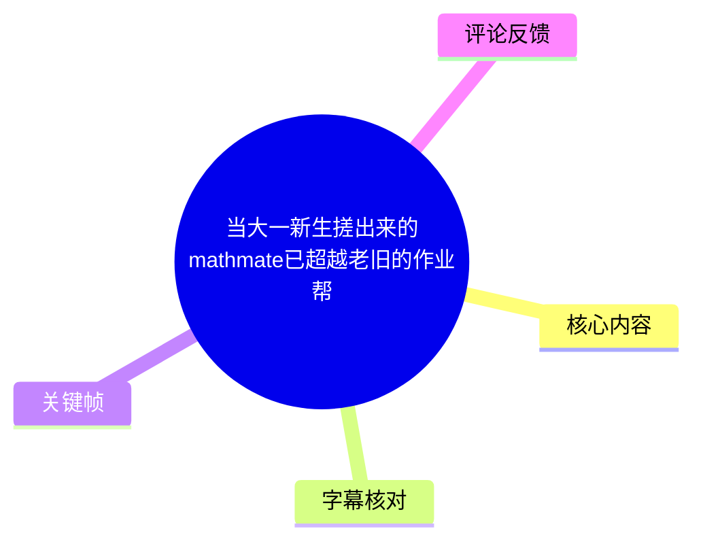
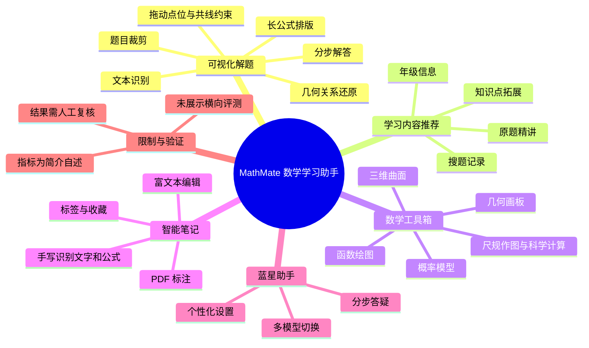
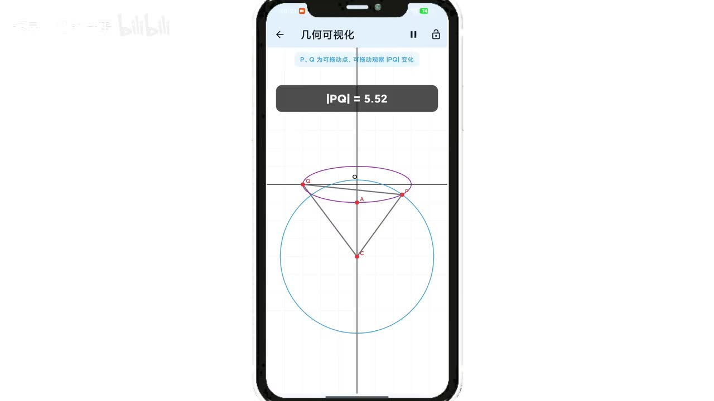
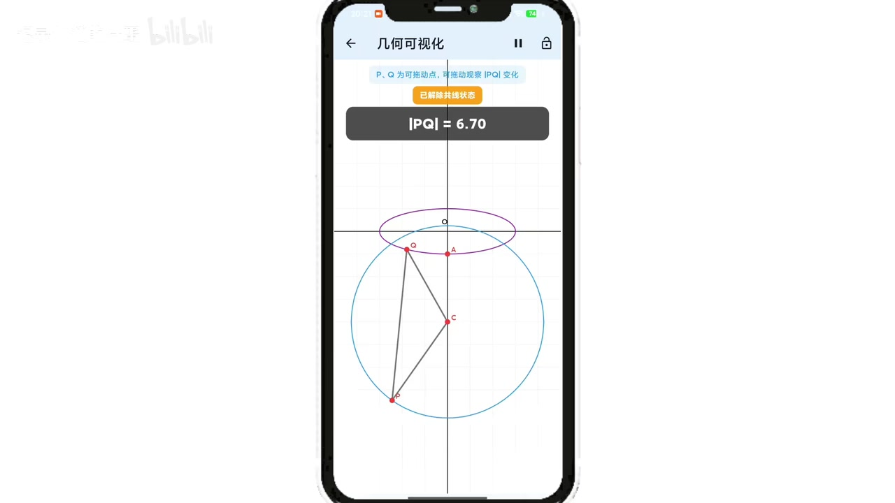

# 当大一新生搓出来的mathmate已超越老旧的作业帮

> 来源：[Bilibili 视频](https://www.bilibili.com/video/BV1EfLJ6bEnw) 
> UP 主：markdown的生活｜时长：03:00｜分区/标签：科技猎手、大学、校园、学习心得 
> 视频页标题将 MathMate 与作业帮作比较；但视频演示主要展示 MathMate 的功能，**未提供与作业帮或夸克搜题等产品的统一测试、准确率对比或成本对比**。

## 小结

视频介绍了一款名为 **MathMate（站内字幕中个别位置误转为“Buff妹”“mats妹”）** 的数学学习应用。其展示重点不是单纯拍照搜题，而是“题目识别—步骤化解答—几何可视化”的连续体验：用户先裁剪题目，系统提取题干并排版长公式，随后把部分几何关系用可交互图形呈现。

演示中最有辨识度的能力是几何可视化。画面显示用户可拖动点位、观察长度变化，并可解除“三点共线状态”；这使抽象的平面/空间关系能够以动态图形呈现。需要注意，视频只展示了一个几何示例，不能据此推及所有题型、所有识别质量或所有几何约束均可靠。

产品还整合了按年级和搜题记录推荐教学视频、函数绘图/概率模型/几何画板/三维曲面等数学工具、PDF 标注与手写/文本笔记，以及可切换模型的“蓝星助手”。最终的产品叙述是以“视频、笔记、答疑”构成一体化学习流程，目标从“找答案”转向“懂数学”。

投稿简介补充列出 Flutter 3.x、DeepSeek API、自研 Canvas、Isar 与 GeoGebra 等技术栈，并声称图形生成准确率 92.4%、60fps、内存降低 70%、12 个版本迭代、200+ 师生内测、NPS 42%。这些均属于发布者在简介中的产品自述；视频本身没有给出测试方法、样本构成、基线产品或第三方验证材料，阅读和实际选用时应将其视为待验证信息。

适合关注 AI 数学学习工具、几何动态可视化、Flutter 教育应用整合方式的读者。若用于考试备考或正式作业，应自行复核 OCR 结果、计算过程、几何条件和模型回答；视频没有说明免费范围、订阅价格、离线能力、隐私策略、支持地区及不同模型的具体可用性。

## 思维导图

## 目录

- [产品定位与观看边界](#产品定位与观看边界)
- [可视化解题：从题目裁剪到几何关系](#可视化解题从题目裁剪到几何关系)
- [视频推荐：按年级与搜题记录匹配](#视频推荐按年级与搜题记录匹配)
- [数学工具箱与智能笔记](#数学工具箱与智能笔记)
- [蓝星助手、个性化设置与三位一体定位](#蓝星助手个性化设置与三位一体定位)
- [投稿简介披露的技术与指标](#投稿简介披露的技术与指标)
- [使用步骤、适用范围与限制](#使用步骤适用范围与限制)
- [字幕比对](#字幕比对)
- [评论分析](#评论分析)
- [处理记录](#处理记录)

## 产品定位与观看边界 [00:05](https://www.bilibili.com/video/BV1EfLJ6bEnw?t=5)

视频将 MathMate 定位为“智能数学学习助手”。从全片结构看，产品将解题、数学工具、学习视频、笔记与对话式答疑放在同一应用中，而非只展示单一搜题入口。

> 图：该帧展示应用的拍照入口、数学工具箱及个人中心页面，是理解“搜题 + 工具 + 设置”一体化产品定位的直观依据；画面中文字还标注“数学可视化助手”。

标题使用“已超越老旧的作业帮”的表达，但现有素材没有给出竞品版本、测试题集、正确率、响应时间、价格或用户留存等对照数据。因此，能从素材中确认的是 MathMate 所展示的功能组合，而不能确认其已经在整体能力上超越任何竞品。

## 可视化解题：从题目裁剪到几何关系 [00:09](https://www.bilibili.com/video/BV1EfLJ6bEnw?t=9)

### 1. 识题与步骤化输出 [00:13](https://www.bilibili.com/video/BV1EfLJ6bEnw?t=13)

视频描述的解题起点是从题目图像中进行裁剪。接着，系统以“极速文本识别”完整提取题干，并通过规范排版和长公式处理呈现解答；叙述强调每一步推导应当清晰可辨、长串公式也能阅读。

> 图：画面上半部分为“题目内容”，下半部分为“解答过程”，示例题涉及椭圆标准方程、焦点与点坐标等条件。这一帧证明视频展示了题目识别及分步解答的界面形态，但不构成对任意题目的识别准确率证明。

可按视频演示将这一流程理解为：

1. 在应用内拍摄或选择数学题目图像；
2. 对需要处理的题目区域进行裁剪；
3. 检查系统提取的题干、公式符号、上下标和条件是否完整；
4. 阅读经过排版的解答过程；
5. 对涉及几何对象或动点关系的题目，进入几何可视化页面观察关系；
6. 将结论与原题条件、教材方法或教师讲解交叉核验。

其中第 3 步尤其重要：OCR 对公式、手写字符、图形标记和多小问题目可能存在误读风险。视频使用“完整提取”“严谨解答”等表述，但未展示失败案例、置信度提示或人工纠错机制。

### 2. 几何可视化与关系操作 [00:34](https://www.bilibili.com/video/BV1EfLJ6bEnw?t=34)

视频称其更核心的能力是通过几何可视化还原关键关系，并可绑定“三点共线”，将抽象几何条件具象化。画面中出现圆、椭圆、坐标轴、点位和线段；顶端提示“P、Q 为可拖动点，可拖动观察 |PQ| 变化”。

> 图：该帧展示几何可视化界面中圆、椭圆、点 P/Q/A/C 与线段的关系，界面实时显示 `|PQ| = 5.52`。它体现了视频所说的“拖动观察变化”，比静态解题文本更适合观察动点问题。

> 图：该帧顶部出现“已解除共线状态”，`|PQ|` 读数变为 `6.70`，点位与连线也随之改变。这是“约束状态可切换、参数随操作变化”的画面证据，但并未说明所有约束类型、计算精度或导出能力。

对于这类工具，真正可迁移的学习方法是：先从题面中辨认不变量与约束（例如共线、圆上、长度关系），再拖动可变点观察量的变化，最后回到代数或几何证明建立严谨结论。动态图形用于形成猜想和检查直觉，不能替代证明本身。

## 视频推荐：按年级与搜题记录匹配 [00:48](https://www.bilibili.com/video/BV1EfLJ6bEnw?t=48)

视频的第二项功能是教学视频推荐。其宣称的推荐逻辑为：

- 每次刷新时，结合用户的**年级**与**搜题记录**；
- 定位题目对应的考题或考点；
- 优先推荐“原题精讲”；
- 配合对应知识点的拓展内容；
- 若用户更改年级，推荐视频也会改变。

这是一种“搜题结果—考点—视频讲解”的衔接思路：当用户只得到单题答案时，再以精讲和拓展内容补足概念学习。视频声称这能让推荐结果更贴近用户“当下最需要”的内容。

不过，素材没有说明推荐来源中 B 站内容的授权、排序标准、冷启动策略、是否可关闭行为记录、搜题记录在本地或云端保存、推荐准确率，以及“年级”与教材版本之间如何对应。对未成年人或学校场景而言，数据使用与内容审核同样是实际部署时需要确认的事项。

## 数学工具箱与智能笔记 [01:19](https://www.bilibili.com/video/BV1EfLJ6bEnw?t=79)

### 数学工具箱 [01:19](https://www.bilibili.com/video/BV1EfLJ6bEnw?t=79)

视频列出的 MathMate 工具箱包含：

| 类别 | 视频明确提及的能力 |
| --- | --- |
| 函数与计算 | 函数绘图、科学计算 |
| 概率 | 概率模型 |
| 几何 | 几何画板、尺规作图 |
| 三维 | 三维曲面 |
| 可视化目标 | 覆盖多类可视化工具，帮助理解难懂的数学内容 |

视频没有逐项展示工具参数、输入语法、结果精度、支持的函数范围或三维渲染操作。因此，这些能力可视为功能清单，而非完整操作手册或性能验证。

### 智能笔记 [01:34](https://www.bilibili.com/video/BV1EfLJ6bEnw?t=94)

“智能笔记”被分为三种方式，并有分类整理能力：

1. **导入 PDF**：可在课件上直接标注；
2. **手写笔记**：写完后自动识别文字和公式；
3. **打字笔记**：站内字幕写作“支持富文本编辑”，ASR 在此处误识别为“副文本编集”；
4. **整理与回顾**：笔记可分类、添加标签和收藏，便于复习时检索。

这一设计把题目、讲解和个人笔记串联起来，适合将错题、推导过程和图形观察结果沉淀为复习材料。素材没有说明 PDF 文件格式上限、云同步、公式识别后是否可编辑、笔迹数据保存位置及导出格式。

## 蓝星助手、个性化设置与三位一体定位 [02:10](https://www.bilibili.com/video/BV1EfLJ6bEnw?t=130)

### 蓝星助手与个人设置 [02:10](https://www.bilibili.com/video/BV1EfLJ6bEnw?t=130)

视频将“蓝星助手”称为多功能智能体，明确提到两点：

- 可以在多款模型之间随时切换；
- 输出目标是解答清晰、步骤简洁、条理严密。

此外，用户可在个人中心进行个性化设置，包括更改年级和选择不同模式。这里的“多款模型”未列出具体模型名称、模型版本、切换条件、额度、是否收费或不同模型的能力边界；因此不能仅凭视频推断其实际可选模型集合。

### 从“找答案”到“懂数学” [02:38](https://www.bilibili.com/video/BV1EfLJ6bEnw?t=158)

片尾总结为“MathMate 三大核心引擎协同驱动”，并用“视频、笔记、答疑三位一体”概括产品路线，目标是将数学学习从“找答案”转为“懂数学”。

这一结论表达的是产品理念，而非已被视频量化证明的学习效果。要判断是否真正促进理解，仍需考察用户能否脱离工具独立完成同类题、错误率是否下降、知识迁移是否出现，以及长期使用是否造成对答案生成的依赖。

## 投稿简介披露的技术与指标

以下内容来自投稿简介，而非视频逐项实测展示。为避免把宣传信息误作独立验证结论，分为“技术方案自述”和“性能/验证自述”记录。

### 技术方案自述

| 模块 | 投稿简介中的说明 |
| --- | --- |
| 跨平台框架 | Flutter 3.x，一套代码运行于 Android 与 iOS |
| 大模型能力 | DeepSeek API 驱动 |
| 几何渲染 | LLM → GeometryJSON → 纯 Dart Canvas 渲染流水线 |
| 本地存储 | Isar 数据库 |
| 数学可视化 | GeoGebra 专业模块 |
| 笔记书写 | Catmull-Rom 样条平滑算法 |
| 几何交互 | 可拖拽动点、改变参数并观察函数/轨迹变化 |

特别是“LLM → GeometryJSON → Dart Canvas”的描述，体现了先让大模型生成结构化几何描述、再由原生 Canvas 渲染的架构思路。它理论上可避免直接把模型生成文本当作图形显示，但生成的结构化数据是否正确、约束求解是否稳定，仍须依赖完整测试验证。

### 性能与验证自述

| 指标/结论 | 简介声称值 | 素材中缺失的验证信息 |
| --- | ---: | --- |
| 图形生成准确率 | 92.4% | 题集规模、题型比例、判定标准、错误样例 |
| 渲染体验 | 60fps 满帧 | 测试设备、场景复杂度、帧率统计方式 |
| 内存占用 | 降低 70% | 对比对象、基线版本、测量方法 |
| 用户推荐意愿 | 种子用户 NPS 42% | 样本数、调查时间、计算口径 |
| 产品迭代 | 12 个版本 | 各版本差异与稳定性数据 |
| 内测验证 | 200+ 名师生 | 用户结构、测试周期、反馈结论 |

简介还提供了官网地址 `mathmate.top`。本素材未附带该网站实际页面、安装包、版本号或下载可用性证据，故本文不对当前可下载状态作判断。

## 使用步骤、适用范围与限制

### 建议操作路径

1. **设置学习上下文**：在个人中心选择年级和模式；这会影响视频推荐，但素材未说明具体教材版本匹配规则。
2. **录入题目**：拍照或从相册选择题目，再裁剪有效区域。
3. **核对识别结果**：重点检查分式、根号、上下标、图形标注、条件中的否定词及多小问编号。
4. **阅读步骤解答**：将每一步与题干逐项对应，发现条件遗漏时不要直接采纳结论。
5. **调用可视化工具**：对动点、圆锥曲线、函数变化等问题，拖动点或参数观察关系；把观察所得视为猜想或验算线索。
6. **补充讲解内容**：通过原题精讲和知识点拓展弥补单题答案不足。
7. **沉淀复习材料**：在 PDF、手写或文本笔记中记录错因、关键条件与可复用的解法。
8. **用助手追问**：针对某一步提出具体问题，而不是只索取最终答案；切换模型后也应比较推导是否一致。
9. **最终复核**：以课本定义、标准解答、教师反馈或独立计算为准，尤其是考试与作业提交场景。

### 明确限制与时效性

- **横向比较缺失**：标题及评论均涉及作业帮、夸克搜题，但视频没有直接对照测试，不能据此认定“超越”。
- **性能指标未独立验证**：92.4%、60fps、70% 内存降低、NPS 42% 等均来自投稿简介。
- **模型输出可能出错**：大模型解题、OCR 识别及几何参数抽取都可能产生遗漏或错误；视频没有展示错误处理流程。
- **功能边界未说明**：未展示账号体系、收费、联网要求、隐私政策、离线可用性、设备兼容性、模型清单及地区限制。
- **演示样本有限**：几何可视化画面集中于单个圆/椭圆与动点示例，不能代表高复杂度几何、立体几何或竞赛题表现。
- **时效性**：视频时长为 180 秒，元数据抓取时间为 2026-07-16；应用版本、模型接口、官网可用性、推荐内容和商业策略均可能在之后变化。

## 字幕比对

| 字幕来源 | 完整性 | 专有名词 | 时间轴 | 主要问题 |
| --- | --- | --- | --- | --- |
| Bilibili 站内字幕 `p01-ai-zh.srt` | 覆盖 00:05.180—02:59.640，分句细，接近完整 | MathMate 多次误转为“Buff妹”“mats妹”“muff mate”；“富文本”有一处误写为“副文本” | 时间切分细，可直接用于章节定位 | 个别品牌名和术语错误，但语义与画面、上下文较一致 |
| 本次 ASR（medium） | 覆盖 00:04.980—02:59.650；诊断语音覆盖率 81.76%，共 11 段 | “Muff May”“MAFMATE”“三点公线”“可视画”“副文本编集”等识别偏差较多 | 有真实时间戳，段落较长；与站内字幕时间总体相互印证 | 长段合并多句，专名、术语和部分汉字准确性低于站内字幕 |

### 最终字幕选择与校正

本文以**站内时间轴字幕为主**，并逐段检查本次 ASR 的起止时间与文本；章节链接优先采用站内 SRT 的真实起始时间换算为秒数。两套字幕均在约 5 秒开始、约 180 秒结束，内容结构一致，说明可互为时间校验。

本次 ASR 诊断未标记 `noAudioStream=true`：素材提供了 `audio/audio.wav`，且 ASR 输出语言为中文、语言置信度为 0.99853515625，因此不属于“源视频没有音轨”的情形。

结合标题、投稿简介和关键帧，对以下词语进行了校正：

- `Buff妹`、`Muff May`、`mats妹`、`MAFMATE` → **MathMate**；
- `三点公线` → **三点共线**；
- `可视画` → **可视化**；
- `原体精奖` → **原题精讲**；
- `副文本编辑/副文本编集` → **富文本编辑**；
- `调理严密` → **条理严密**。

## 评论分析

以下仅分析可获取的热评前三条；评论反映的是用户看法，不是经过验证的产品事实。

1. **家有一只小布偶（34 赞）**  
   评论提出核心竞争问题：面对作业帮、夸克搜题等大体量题库产品，MathMate 的优势是什么。该问题直接触及视频标题的“超越”主张。视频可见的差异化方向是几何动态可视化、工具箱、笔记与推荐的整合，但没有以同一题集、速度、正确率、价格和题库覆盖度进行横向证据展示，因此该疑问尚未被素材充分回答。

2. **综合美女视频合集（25 赞）**  
   评论建议通过闲鱼“刷 star”吸引大厂投资，并对项目表现出夸张式乐观评价。该内容没有提供功能、技术或市场数据；“刷 star”涉及人为操纵评价/数据的风险，不应作为产品推广或融资的可信建议。

3. **世一秽土长门（14 赞）**  
   评论表示希望在高考数学中使用该工具，体现了用户对其备考价值的期待。但视频没有说明考试规则、考场设备限制、联网条件或工具可否在任何考试环境中使用。即使日常练习可使用，正式考试通常应遵守具体考试机构的设备和纪律要求。

## 处理记录

- Worker ID：`worker-mrj0www4-e8d79408`
- 模型：`gpt-5.6-terra`
- 调用工具与素材：基于已提供的视频元数据、站内 SRT 字幕、本次 ASR 结果（`medium`、CUDA、float16）、ASR SRT、关键帧清单及热评 JSON 整理；未额外调用网页检索或未提供的外部测试工具。
- 字幕选择：以站内字幕 `p01-ai-zh.srt` 为主时间轴；已检查本次 ASR 的 11 个带时间戳片段，并以其确认语音存在、覆盖范围及分段位置；专有名词以标题、投稿简介和画面上下文校正。
- 关键帧选择依据：`frames/frame-001.jpg` 用于说明首页与产品定位；`frames/frame-002.jpg` 用于对应 OCR 识题和分步解答；`frames/frame-003.jpg` 与 `frames/frame-004.jpg` 用于对应拖动点位、长度变化和解除共线约束。选图均服务于正文中有对应字幕时间段的功能说明。
- 缓存清理：素材未提供缓存清理日志或结果；未将“未提供记录”表述为已完成清理。
- 未解决问题：未获得应用安装包、官网实时状态、模型清单、隐私与收费规则、题库覆盖范围、算法测试报告、性能测试环境及与作业帮/夸克搜题的可复现实测数据。
