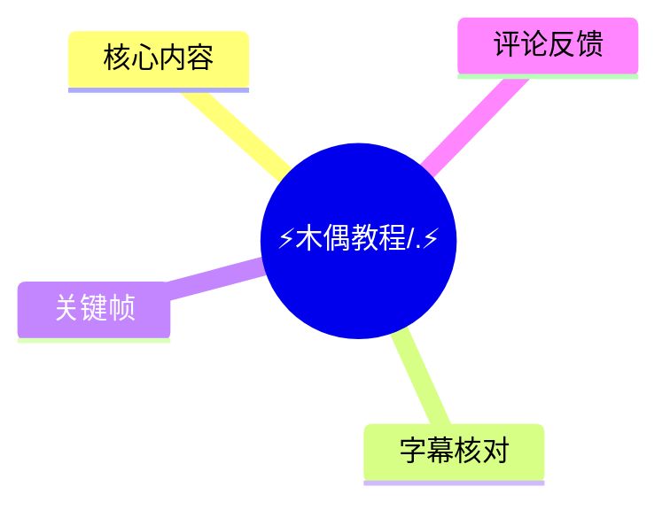
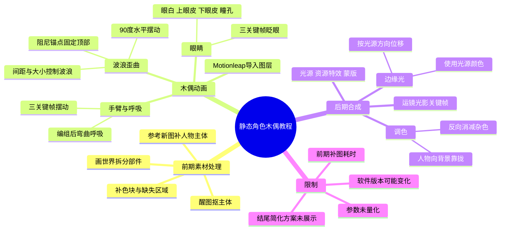
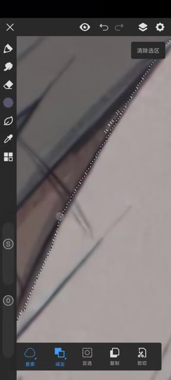
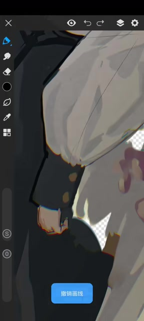
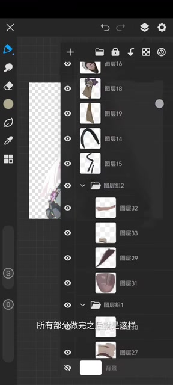

# ⚡️木偶教程/.⚡️

> 来源：[Bilibili 视频](https://www.bilibili.com/video/BV1bcxWzcEi6)  
> UP 主：隺鳥子71｜发布时间：2025-10-04｜视频时长：31:38  
> 素材说明：视频使用《蔚蓝档案》角色素材；简介署名画师 `takashima shoa`、来源 Twitter `@shoa_tksm`。UP 主明确表示自己“只懂点皮毛”，欢迎观众纠正或补充更好的方法。

## 小结

本视频是一份面向移动端剪辑/绘画用户的**二维静态角色“木偶动画”手搓教程**。其完整流程是：先用**醒图**抠出人物，再用**画世界**逐层拆分角色部件、补全被遮挡的画面，随后导入 **Motionleap（ASR 中多次识别为“M/MV”）**制作波浪摆动、眨眼、手臂运动与整体呼吸，最后在 Motionleap 和 **剪映（ASR 识别为“MD”）**中完成边缘光、调色、光源、资源特效与运镜光影变化。

最关键的经验不是某个单一特效，而是前期的**分层质量**：UP 主将“人物部件的抠图和补图”称为最折磨、也最决定最终效果的部分；拆出的部件越充分，后续角色越容易产生细腻、自然的动态。部件抠出后，必须补掉残留色块、补齐遮挡区域，并借助一张新的角色参考图确认人物主体应补到哪里。

木偶主体主要通过 Motionleap 的**“波浪歪曲”**实现。视频给出几个明确可迁移的关系：角度 `90°` 对应水平摆动；间距越大，波浪数量越多；大小控制波动幅度；阻尼锚点决定哪一部分固定，应把锚点置于可见图像的最上方。单个图层可以叠加多个歪曲效果，不同部件可分别做水平或垂直运动。

局部动画方面，眼睛由眼白、上眼皮、下眼皮、瞳孔四部分构成；眨眼采用“三个关键帧、两边不变、中间移动”的结构，上眼皮下拉并可适当旋转，下眼皮的位移幅度更小。手臂运动同样采用三个关键帧；UP 主还演示了头发阴影、手臂额外弯曲和全图层编组后的呼吸效果。

后期核心是让角色与背景共享同一光色逻辑：边缘光的颜色应与光源一致；人物颜色可参照背景调整；若要消减背景中不希望出现的颜色，则向该颜色的反方向调节。视频结尾只提出“是否有更简单的方法”的问题并回答“有的”，但在 `31:33` 左右即结束，**没有继续展示简化方案**。

本教程反映的是视频发布时的手机端应用界面与功能命名；应用版本、特效位置、资源商店内容、遮罩或混合模式名称均可能随版本更新而变化。视频没有提供精确数值参数、导出规格、帧率或工程文件，实践时需要依据素材尺寸和画面效果自行试调。

## 思维导图

## 目录

- [教程定位、素材与软件准备](#教程定位素材与软件准备-0000)
- [第一步：醒图抠出人物主体](#第一步醒图抠出人物主体-0019)
- [第二步：画世界拆件、补图与图层管理](#第二步画世界拆件补图与图层管理-0115)
- [第三步：Motionleap 制作基础摆动](#第三步motionleap-制作基础摆动-0926)
- [第四步：眼睛眨动、阴影与手臂动画](#第四步眼睛眨动阴影与手臂动画-1236)
- [第五步：整体呼吸、边缘光、调色与打光](#第五步整体呼吸边缘光调色与打光-2445)
- [第六步：运镜中的光影变化与未展开的简化方案](#第六步运镜中的光影变化与未展开的简化方案-3009)
- [完整操作清单与关键参数](#完整操作清单与关键参数-0000)
- [限制、风险与时效性](#限制风险与时效性-0000)
- [字幕比对](#字幕比对-0000)
- [评论分析](#评论分析-0000)
- [处理记录](#处理记录-0000)

## 教程定位、素材与软件准备 [00:00](https://www.bilibili.com/video/BV1bcxWzcEi6?t=0)

视频开场说明这是一份“木偶”教学。ASR 将所需工具识别为四项，但其中存在名称识别噪声；结合语义可整理为：

| 工具 | 视频中的用途 | 名称可靠性 |
| --- | --- | --- |
| 画世界 | 抠人物部件、补图、管理拆分后的图层 | 高 |
| Motionleap | 制作木偶摆动、局部动作、部分边缘光 | 中；ASR 多次记为“M/MV” |
| 剪映 | 后期边缘光、调色、打光、资源特效、蒙版 | 中；ASR 记为“MD” |
| 醒图 | 初步抠人物主体 | 高；ASR 个别位置识别为“形图/形囿” |

视频的剪辑演示中存在大量无旁白的屏幕操作段。ASR 有效语音时长约 `265.21` 秒，仅占全片 `13.98%`；因此操作时不能只依赖字幕文字，还应观看对应软件界面中的长段演示。

> 图：画面展示了待处理的全身二次元角色及透明背景效果，是理解“先抠主体、再拆件”的起点。其价值在于说明本教程处理的是单张静态立绘，而非已绑定骨骼的模型。

## 第一步：醒图抠出人物主体 [00:19](https://www.bilibili.com/video/BV1bcxWzcEi6?t=19)

1. 在醒图中打开**“智能抠图”**功能。
2. 导入已准备好的角色图片。
3. 先进入预览，检查是否存在未抠干净的位置。
4. 对多余区域使用橡皮擦继续擦除；对误删或缺失位置则用画笔补全。
5. 检查完成后点击确认，再从右上角导出。

UP 主没有给出导出格式、分辨率、透明通道格式或抠图阈值；但后续需要在画世界和 Motionleap 内继续使用透明背景图层，因此导出时应以能保留透明背景的图片格式为目标。该句属于基于后续工作流的操作需求，不是视频给出的具体格式参数。

## 第二步：画世界拆件、补图与图层管理 [01:15](https://www.bilibili.com/video/BV1bcxWzcEi6?t=75)

### 拆件原则与操作 [01:15](https://www.bilibili.com/video/BV1bcxWzcEi6?t=75)

UP 主明确指出：角色部件的抠图和补图是最折磨、也最决定最终效果的一段；**抠出的部件越多，木偶效果越精细**。

具体步骤如下：

1. 将在醒图抠好的透明人物导入画世界。
2. 隐藏背景。
3. 先规划要拆哪些部位，再逐块处理。
4. 选择选区工具；视频示例使用**套索**。
5. 沿部件边缘建立选区。
6. 点击“剪切”，并勾选“新建图层”。
7. 注意剪切时当前选中的图层：应保持为默认的、要被扣取的原始图层。
8. 将已抠下的部件图层隐藏，再对人物主体继续拆出下一个部件。

> 图：画面显示画世界的套索选区沿角色衣物边缘建立选区，并可见“套索、减去、反选、复制、剪切”等底部工具。它直观说明拆件不是自动完成，而是需要沿视觉边界手动精修。

### 部件补图：处理残留和缺口 [04:19](https://www.bilibili.com/video/BV1bcxWzcEi6?t=259)

拆件后，部件常会带有相邻部位残留的色块，或者因为遮挡而缺少一部分画面。视频的处理思路是：

- 用取色笔/取色方式取得部件附近的颜色；
- 将多出来的色块填掉；
- 将缺失的小块补上；
- 完成后，这个部件才可用于动画。

> 图：画面显示角色袖子、手部与衣物交界处正在被手工修整，透明棋盘格背景说明该区域已独立为图层。其价值在于体现补图的目标：让部件单独移动时不露出原本被相邻物体遮挡的空洞或残边。

### 人物主体补图：用新参考图确定轮廓 [05:19](https://www.bilibili.com/video/BV1bcxWzcEi6?t=319)

当许多部件被拆出去后，人物主体会留下大量缺口，难以判断应当补到哪里。UP 主的办法是：

1. 导入一张新的角色图片作为参考。
2. 使用线条将人物缺失部分的轮廓勾勒出来。
3. 根据勾出的轮廓判断主体需要补全的位置。
4. 再继续绘制与修补主体。

视频在约 `08:50` 提到会出现白色背景，但该句上下文不足以确定其具体指向何种图层或显示状态。因此只能确认这是操作中出现的一种画面现象，不能据此推断完整解决方案。

### 图层完成状态 [09:23](https://www.bilibili.com/video/BV1bcxWzcEi6?t=563)

完成拆件与补图后，角色被拆为多个独立图层，以便分别控制摆动、眼部、手臂、头发和阴影。

> 图：图层面板中可见多个单独部件、分组和隐藏状态，角色主体位于透明画布上。这张图最能说明教程的核心资产结构：后续动画依赖多个可独立显示、隐藏、位移和变形的图层。

## 第三步：Motionleap 制作基础摆动 [09:26](https://www.bilibili.com/video/BV1bcxWzcEi6?t=566)

### 导入工程与图层时长 [09:28](https://www.bilibili.com/video/BV1bcxWzcEi6?t=568)

1. 打开 Motionleap。
2. 视频先展示可调整图层默认时长的位置。
3. 新建工程。
4. 导入前一步已经拆好、补好的各个图层。

视频没有说明默认时长的具体秒数，也没有展示导出时长设置，因此该项需要按成片需求自行确定。

### 用“波浪歪曲”制作摆动 [10:01](https://www.bilibili.com/video/BV1bcxWzcEi6?t=601)

对单个图层添加**“波浪歪曲”**效果。视频给出的关键规则如下：

| 控制项/动作 | 视频说明 | 动画含义 |
| --- | --- | --- |
| 预设 | 可循环 | 可用于连续、重复的摆动 |
| 角度 `90°` | 水平摆动 | 波浪主要沿水平方向变化 |
| 阻尼锚点 | 选中的位置可看成图层被分成 100 份后固定的部分 | 决定摆动根部在哪里 |
| 锚点位置 | 调到图上可见内容的最上方 | 防止整个图层无支点地乱摆 |
| 间距 | 越大，波浪越多 | 控制波形疏密/数量 |
| 大小 | 调整波幅大小 | 控制摆动强度 |
| 多重歪曲 | 同一图层可叠加多个效果 | 可组合更复杂的形变 |

视频先展示“图层仍在乱摆”的错误/未完成状态，然后通过调整阻尼锚点解决。这个顺序说明：仅添加波浪歪曲并不能得到自然的木偶效果，**固定点的设置是必要条件**。

不同图层的方向不应机械统一：有的部件适合水平摆动，有的适合垂直摆动。视频没有提供“哪个部件必须使用哪一方向”的固定表，需依据角色姿势和预期运动自行判断。

## 第四步：眼睛眨动、阴影与手臂动画 [12:36](https://www.bilibili.com/video/BV1bcxWzcEi6?t=756)

### 眼睛的分层与眨眼关键帧 [12:36](https://www.bilibili.com/video/BV1bcxWzcEi6?t=756)

UP 主将眼睛拆为四部分：

1. 眼白；
2. 上眼皮；
3. 下眼皮；
4. 瞳孔。

其中上眼皮还能继续拆成两个部分。眨眼制作采用三关键帧结构：

- 总共打 **3 个关键帧**；
- 两端关键帧保持不变；
- 中间关键帧移动；
- 中间帧里将上眼皮向下拉，可适当旋转；
- 曲线使用视频所称的“第四个”选项，但 ASR 未能识别该曲线名称，因此不能确认其准确预设名称；
- 下眼皮与上眼皮同向变化，但幅度要更小。

UP 主说明自己没有抠下眼皮，随后演示了替代做法；但 ASR 在该长段屏幕操作中语音稀少，无法从现有素材可靠还原其全部手势、数值和工具路径。

### 眼部与头发阴影 [17:11](https://www.bilibili.com/video/BV1bcxWzcEi6?t=1031)

视频提示眼部此处可添加阴影。对于头发阴影，UP 主在 `21:40` 给出的明确经验是：

> 给头发上阴影时，可以先编组，再上阴影。

这意味着头发由多个拆分图层构成时，先将其编组可以让阴影处理更集中，减少逐层处理的负担；但视频未具体说明所用阴影效果名称、透明度或混合模式。

### 手臂运动 [17:33](https://www.bilibili.com/video/BV1bcxWzcEi6?t=1053)

手臂摆动的关键帧结构同样是**3 个关键帧**。视频在后续补充：手臂摆动还可以再叠加一个“弯曲”效果，以增加形变感。

由于 `17:44—20:42`、`22:18—24:15` 等区间主要为无语音操作演示，ASR 不能可靠提供手臂具体位移、旋转角度、时间间隔或曲线参数。可以确认的是：该教程以“关键帧位移/变化 + 弯曲效果”的组合完成手臂动画，而非骨骼绑定。

## 第五步：整体呼吸、边缘光、调色与打光 [24:45](https://www.bilibili.com/video/BV1bcxWzcEi6?t=1485)

### 全角色呼吸 [24:45](https://www.bilibili.com/video/BV1bcxWzcEi6?t=1485)

当局部动作完成后：

1. 将所有图层编组。
2. 给该编组添加一个“弯曲”效果，作为整体呼吸。

UP 主笑称没有录下这段演示视频；因此这里可确认流程与目的，但没有可复现的具体参数。若要实践，应从低幅度开始，避免整个角色产生过强的橡皮感；这是一般动画控制建议，不是视频提供的数值。

### Motionleap 边缘光 [24:59](https://www.bilibili.com/video/BV1bcxWzcEi6?t=1499)

视频先讲 Motionleap 中的边缘光，步骤为：

1. 复制人物图层两份。
2. 将上方/下方图层中指定的一层向光源方向移动。
   - 光源在右，图层向右移；
   - 光源在左，图层向左移。
3. 将图层编组，并选择“第三个编组方式”。
4. 最后填充颜色。
5. 填充色应与光源颜色一致。

这一方法本质上利用位移后的轮廓差异形成边缘，再以光源颜色统一视觉方向。视频没有说明移动像素量、填充工具的精确路径或“第三个编组方式”的标准命名。

### 剪映边缘光 [25:36](https://www.bilibili.com/video/BV1bcxWzcEi6?t=1536)

后续转入剪映处理边缘光、调色和打光。可确认步骤为：

1. 记得添加**绿幕遮罩**。
2. 复制两个图层。
3. 将两个图层编组。
4. 移动下方图层。
5. 将某一图层填充为黑色。
6. 将下方图层填充为光源颜色。
7. 添加混合属性。
8. ASR 识别出“选绿色”，但无法确定它对应剪映界面中的完整混合选项名称。
9. 继续添加灰光/相关光效，完成边缘光。

这里的“绿幕遮罩”“选绿色”“灰光”等术语受 ASR 识别影响较大，尤其最后两项可能是界面选项或素材名称的误识别。应以画面操作和当前剪映版本中的实际菜单为准。

### 调色、光源与资源特效 [27:10](https://www.bilibili.com/video/BV1bcxWzcEi6?t=1630)

视频的调色原则较为明确：

- 使用**颜色分级**工具，让人物颜色向背景色调靠拢；
- 背景本身也可以调整；
- 如果不想要某种背景颜色，则向该颜色的反方向调节，以减去该色；
- 视频以“减去紫色”为例展示效果。

打光操作：

1. 在“新建图层 / 填充 / 镜头光源”（ASR 近似转写）中寻找光源。
2. 按个人喜好添加。
3. 添加后记得再加入“绿色”相关处理；该词的准确含义无法仅凭 ASR 确认。
4. 可在资源商店添加其他效果。
5. 使用蒙版细调每一部分的明暗变化等。

需要注意，视频只提供了调色逻辑和界面类别，没有量化颜色分级数值、光源强度、蒙版羽化、透明度或资源名称。

## 第六步：运镜中的光影变化与未展开的简化方案 [30:09](https://www.bilibili.com/video/BV1bcxWzcEi6?t=1809)

### 运镜光影变化 [30:09](https://www.bilibili.com/video/BV1bcxWzcEi6?t=1809)

针对运镜时的光影变化，UP 主使用：

1. 两个关键帧；
2. 后面的关键帧不动，前面的关键帧动；
3. 曲线使用“快捷缓出”。

该结构适合让光影效果随着镜头开始运动而渐变，在后段稳定下来。视频没有说明这个效果具体作用于哪一个属性（如位置、透明度、光源参数或蒙版），因此不能据此扩展为精确工程设置。

### 结尾问题与信息边界 [31:24](https://www.bilibili.com/video/BV1bcxWzcEi6?t=1884)

结尾中，UP 主模拟观众提问：

- 手搓木偶太麻烦；
- 有没有更简单的方法？

随后回答“有的兄弟有的”，但视频在约 `31:33` 结束，未展示任何简化方案、软件名、模板、AI 工具或下一步链接。因此不能将视频解读为已经提供“一键木偶”或替代流程。

## 完整操作清单与关键参数 [00:00](https://www.bilibili.com/video/BV1bcxWzcEi6?t=0)

### 可执行工作流

1. **准备素材**：选择角色立绘，保留原图作为补图参考。
2. **醒图抠主体**：智能抠图 → 预览检查 → 橡皮擦清理多余区域/画笔补缺 → 确认并导出。
3. **画世界拆件**：导入透明主体 → 隐藏背景 → 套索选区 → 剪切并新建图层 → 隐藏已拆部件 → 继续拆分。
4. **修复部件**：取邻近颜色填除杂色、补齐缺口。
5. **修复人物主体**：导入新的角色参考图 → 勾勒缺口轮廓 → 依据轮廓补画。
6. **Motionleap 建工程**：导入全部拆分图层，并设置所需图层时长。
7. **制作基础摆动**：为各部件添加波浪歪曲 → 设置方向 → 将阻尼锚点置于部件顶部固定处 → 调整间距与大小 → 必要时叠加多个歪曲。
8. **做眼睛**：以眼白、上下眼皮、瞳孔分层 → 三关键帧 → 两端不变、中间眼皮下拉 → 下眼皮较小幅度联动。
9. **做手臂和阴影**：手臂三关键帧 → 可叠加弯曲；头发先编组再上阴影。
10. **做整体呼吸**：所有图层编组 → 给编组添加弯曲效果。
11. **Motionleap 边缘光**：复制图层 → 按光源方向位移 → 编组 → 填光源色。
12. **剪映后期**：添加绿幕遮罩 → 复制/编组图层制作边缘光 → 颜色分级匹配背景 → 添加镜头光源、资源效果与蒙版。
13. **运镜光影**：两关键帧，后帧固定、前帧变化，曲线使用快捷缓出。

### 视频明确给出的参数/关系

| 项目 | 明确内容 |
| --- | --- |
| 波浪歪曲角度 | `90°` 为水平摆动 |
| 波浪间距 | 越大，波浪越多 |
| 波浪大小 | 控制波幅大小 |
| 锚点理解 | 可视为把图层分成 100 份，选中的部分固定 |
| 锚点推荐位置 | 图上可见内容的最上方 |
| 波浪效果数量 | 同一图层可以使用多个 |
| 眨眼关键帧 | 3 个；两边不动，中间移动 |
| 下眼皮运动 | 与上眼皮同向，但幅度较小 |
| 手臂关键帧 | 3 个 |
| 整体呼吸 | 所有图层编组后加弯曲效果 |
| 边缘光方向 | 图层向光源方向移动 |
| 边缘光颜色 | 使用光源颜色 |
| 运镜光影关键帧 | 2 个；后面不动，前面动 |
| 运镜曲线 | 快捷缓出 |

## 限制、风险与时效性 [00:00](https://www.bilibili.com/video/BV1bcxWzcEi6?t=0)

- **前期工作量高**：视频直接将拆件和补图称为最折磨的部分。角色姿势越复杂、遮挡越多，补图成本越高。
- **没有统一数值模板**：除了 `90°`、关键帧数量及参数关系外，视频未提供波浪大小、间距、锚点百分比、光效强度、位移距离或颜色分级数值。
- **大量信息依赖无声屏录**：ASR 语音覆盖不足 `14%`，关键操作可能在无旁白画面中完成；仅阅读文字不能完全复刻界面点击路径。
- **软件名称和菜单需以实机为准**：Motionleap、剪映和醒图的版本更新可能变更效果名称、遮罩入口、混合模式、资源商店内容及功能权限。
- **素材版权需自行确认**：UP 主在简介中列出了画师、来源和作品/角色信息，但视频并未提供该素材的商业授权条款。复用角色图、发布二创、接商用项目时应自行核实原作者和作品版权要求。
- **“更简单的方法”未展示**：不能把结尾的口头回答当作已交付的替代教程。
- **适用范围**：适合单个二维角色立绘的局部循环动画；不等同于 Live2D 骨骼绑定、三维角色动画或自动动作生成方案。

## 字幕比对 [00:00](https://www.bilibili.com/video/BV1bcxWzcEi6?t=0)

| 字幕来源 | 完整性 | 专有名词 | 时间轴 | 主要问题 |
| --- | --- | --- | --- | --- |
| Bilibili 站内字幕 `p01-ai-zh.srt` | 与本视频完全不匹配 | 出现“消费主义、茅台、双11、苹果、甲壳虫”等，与木偶教程无关 | 虽有完整时间轴，但覆盖的是另一支约 27 分 40 秒的消费主义内容 | 不能用于本视频的内容整理或时间定位 |
| 本次 ASR 字幕 | 覆盖全片的有声片段；113 段，有效语音约 265.21 秒 | “画世界、醒图”较可靠；Motionleap 被识别为“M/MV”，剪映被识别为“MD”，部分效果名称失真 | 时间戳与全片 1897.09 秒音频相符，可直接用于章节定位 | 无声操作段较多，语音覆盖率仅 13.98%，存在大量长空档和个别术语误识别 |

### 最终字幕选择

最终以**本次 ASR 时间轴字幕**作为内容与章节时间轴的主要依据，因为它与视频标题、关键帧画面和木偶教学流程一致。站内字幕虽然具备精细时间码，但内容明显串台，未被采用。

本次 ASR 诊断中**没有** `noAudioStream=true` 标记；相反，诊断显示存在中文音轨，音频时长 `1897.0935` 秒、识别语言为中文、语言概率 `0.97998046875`。因此这不是“源视频无音轨”的情况，而是视频本身包含大量仅展示操作的无旁白片段。

### 已结合画面与上下文校正的术语

- ASR 的“形图/形囿”按上下文校正为**醒图**。
- ASR 的“M/MV”按上下文校正为 **Motionleap**，但视频口播未提供完整清晰的软件名，因此保留不确定性。
- ASR 的“MD”按用途（后期、调色、资源商店、蒙版）校正为**剪映**。
- “歪曲”按特效语境整理为**波浪歪曲**。
- “关键针”统一整理为**关键帧**。
- “绿色”“灰光”“第三个编组方式”“曲线第四个”等仍无法仅凭 ASR 精确还原标准菜单名，正文已明确标注其不确定性。

## 评论分析 [00:00](https://www.bilibili.com/video/BV1bcxWzcEi6?t=0)

本次可获取热评仅有 2 条，少于请求上限“前三条”；因此仅分析实际获取到的两条，不补造第三条。

1. **存在即合理yu**（207 赞）  
   > “这视频就像路上有人莫名其妙给了你块金子[吃瓜]”  
   该评论表达对教程价值和信息密度的高度认可，认为视频像意外获得高价值资源。这是观众的主观评价，不提供关于软件、参数或教程准确性的可验证补充信息。

2. **一罐蠢乃酱**（85 赞）  
   > “果然还是发教程最适合你[吃瓜]”  
   评论肯定 UP 主制作教程内容的表现，暗示其受众对实操教学有较高偏好。同样属于偏好判断，不能据此证明教程对所有初学者都易学，或证明视频中每项技术均为最佳实践。

## 处理记录 [00:00](https://www.bilibili.com/video/BV1bcxWzcEi6?t=0)

- Worker ID：`worker-mrj0www4-e8d79408`
- 模型：`gpt-5.6-terra`
- 调用工具与素材：视频元数据、关键帧、Bilibili 站内 SRT、ASR `transcript.srt`、ASR 诊断 `asr-result.json`、热评数据。
- 字幕选择：检查了站内字幕和本次 ASR。站内字幕内容为不相关的消费主义视频，判定串台；最终采用与画面和教程流程一致的本次 ASR 时间轴，并对明显软件名误识别进行谨慎校正。
- 音轨判断：ASR 结果未标记 `noAudioStream=true`；音频实际存在，时长 `1897.0935` 秒。由于大量屏幕操作未配口播，ASR 覆盖率为 `13.98%`，正文对缺乏语音支撑的操作不作细节编造。
- 关键帧选择依据：
  - `frames/frame-001.jpg`：展示角色原始素材/透明主体，说明教程对象；
  - `frames/frame-002.jpg`：展示套索选区，支撑拆件步骤；
  - `frames/frame-003.jpg`：展示手部与衣物边缘修补，支撑补图难点；
  - `frames/frame-004.jpg`：展示多图层面板，支撑后续分层动画的工程结构。
- 热评处理：仅获取到 2 条热评，已全部分析；未虚构第 3 条。
- 缓存清理：素材清单未提供缓存清理执行日志；本记录不声称已执行清理。
- 未解决问题：Motionleap/剪映的部分精确菜单名称、曲线“第四个”预设、绿幕/混合属性中“绿色”的确切含义，以及结尾提到的简化方案，均无法由现有语音、字幕与关键帧可靠确认。

## 评论分析

- 热评 1：这视频就像路上有人莫名其妙给了你块金子[吃瓜]
- 热评 2：果然还是发教程最适合你[吃瓜]

以上内容是观众反馈摘录，只用于补充理解视频反响，不作为正文事实依据。
