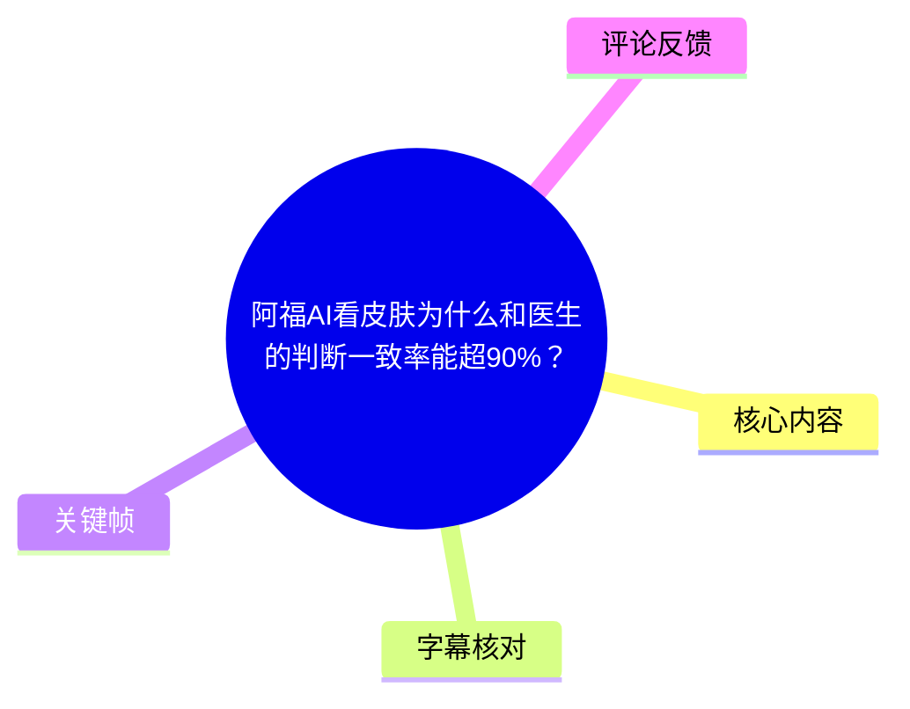
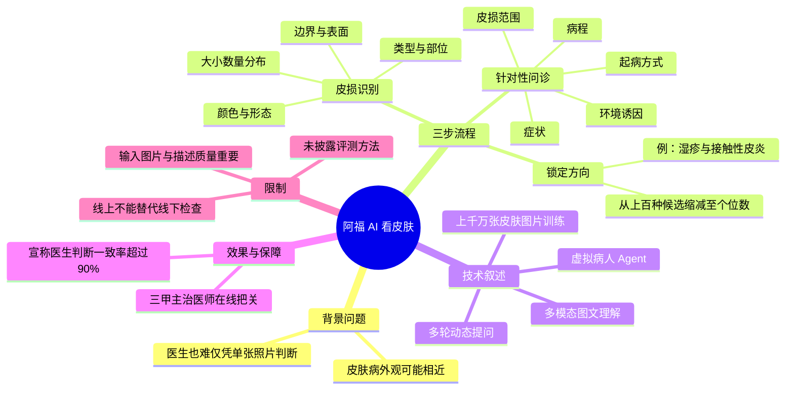
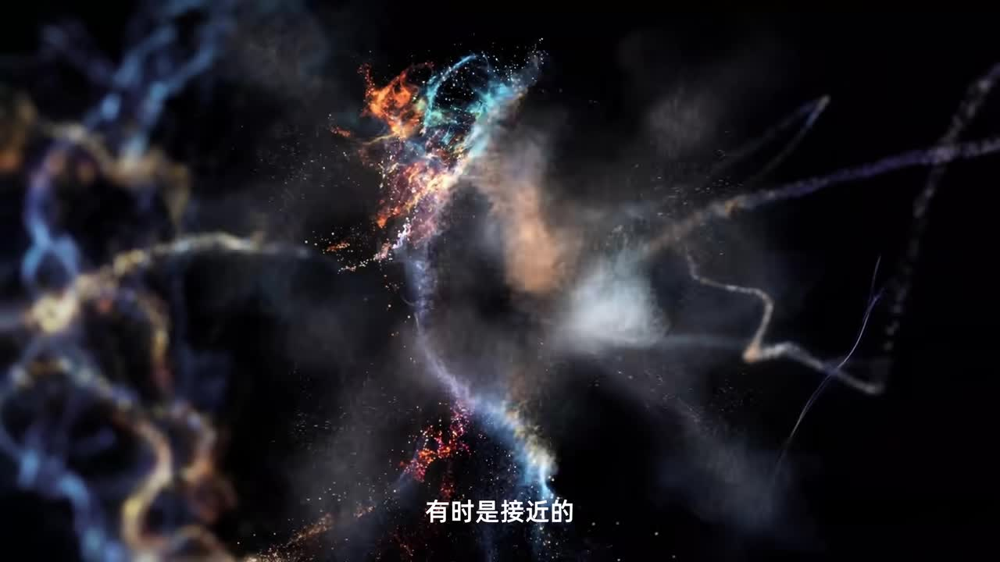

## 小结

视频介绍蚂蚁阿福 App 的“拍皮肤”功能如何完成皮肤问题的初步判断。其叙述的核心不是“拍一张照片立即确诊”，而是以**皮损图像识别 → 缩小候选疾病方向 → 根据候选进行多轮针对性问诊**的三步流程，模拟皮肤科诊疗中从观察到鉴别的思路。

视频称，皮肤病的难点在于视觉表现可能相近：例如同样出现泛红、起皮，既可能是湿疹，也可能是接触性皮炎。因此，照片中的颜色、形态、大小、数量、分布、边界、表面状态等信息只是起点；病程、皮损范围、起病方式和环境诱因等问诊信息，才用于继续缩小可能性。

技术上，视频将系统描述为“多模态皮肤多轮问诊大模型”：能够结合图片与文字理解，并按当前候选方向动态提问，而不是让所有用户填写同一套固定问卷。视频还称，该系统使用“上千万张皮肤图片”强化训练，并借助基于真实患者 Agent 生成的虚拟病人，学习医生的临床判断顺序。

标题和视频均宣称：基于“海量测试”，其回答与三甲医生判断的一致率超过 90%。这一表述应理解为产品方所称的**医生判断一致率**，不能直接等同于临床确诊准确率、医疗安全性或所有人群、所有疾病的适用效果。素材未披露测试集构成、具体疾病分布、金标准、指标定义、置信区间及独立验证结果。

视频提出的风险控制方式是“AI 辅助 + 真人医生把关”：称三甲主治医师 24 小时在线，可对 AI 结论进行判断并继续问诊。不过，服务覆盖范围、触发条件、响应时限、地区、费用以及是否每次结果均会被医生复核，视频均未展开说明。

## 思维导图

## 目录

- [背景：为何单靠皮肤照片难以判断](#背景为何单靠皮肤照片难以判断)
- [三步工作流：识别、锁定方向与问诊](#三步工作流识别锁定方向与问诊)
- [模型与训练：多模态皮肤多轮问诊](#模型与训练多模态皮肤多轮问诊)
- [超 90% 一致率：指标含义与医生复核](#超-90-一致率指标含义与医生复核)
- [使用步骤、参数与边界](#使用步骤参数与边界)
- [时效性与未验证事项](#时效性与未验证事项)
- [字幕比对](#字幕比对)
- [关键帧说明](#关键帧说明)
- [评论分析](#评论分析)
- [处理记录](#处理记录)

## [背景：为何单靠皮肤照片难以判断](https://www.bilibili.com/video/BV19WKD6nEf3?t=0)

视频以“皮肤上长了一块红疹，拍一张照片问医生”为场景切入，并指出即使是三甲医院医生，也可能难以仅凭照片立刻给出明确判断。

其原因是，不同皮肤病的外观可能具有相似性。视频明确提到，皮肤病的视觉表现“有时是接近的”；这意味着泛红、起皮等单一表现并不能直接对应唯一疾病。

视频据此提出 AI 的作用路径：先从图像中提取结构化的皮损信息，再配合问诊逐层缩小候选范围，而非仅以照片直接下结论。

## [三步工作流：识别、锁定方向与问诊](https://www.bilibili.com/video/BV19WKD6nEf3?t=28)

### [第一步：皮损识别](https://www.bilibili.com/video/BV19WKD6nEf3?t=35)

视频称，阿福会对照片里的皮损进行多维度扫描。其列举的观察项目如下：

| 观察维度 | 视频中的具体内容 | 用途 |
| --- | --- | --- |
| 类型与部位 | 识别皮损类型及其所在部位 | 建立初步观察框架 |
| 颜色与形态 | 观察颜色、外观形态 | 提取表观特征 |
| 大小、数量、分布 | 红斑是一大片还是分散；皮损是孤立还是成簇出现 | 区分分布模式 |
| 边界与表面 | 表面光滑，或存在鳞屑、结痂、抓痕 | 增加鉴别所需线索 |

视频将这些内容定义为“判断的起点”。也就是说，图像识别得到的是初步特征，而不是单独完成最终诊断。

素材没有说明拍摄距离、光线、焦距、分辨率、多角度拍摄要求、图像模糊时的拒答机制或重拍机制。因此，不能从视频推断其对低质量图片的实际处理能力。

### [第二步：锁定方向](https://www.bilibili.com/video/BV19WKD6nEf3?t=66)

在皮损识别后，AI 会根据皮损状况锁定若干疾病方向。视频举例称：同样出现泛红、起皮，可能是湿疹，也可能是接触性皮炎。

视频的关键说法是，系统会把“上百种皮肤病”的候选选项缩减到“个位数”。这里的逻辑是筛选候选方向，而不是让一张照片直接输出一百种疾病结果。

| 视频表述 | 应如何理解 |
| --- | --- |
| 可诊断一百多种皮肤疾病 | 产品方对可覆盖或可处理疾病范围的表述 |
| 缩减到个位数 | 单次问诊中先将较大候选集合收敛为少数方向 |
| 锁定几位“嫌疑人” | 视频对候选疾病鉴别过程的拟人化比喻 |

### [第三步：针对性追问](https://www.bilibili.com/video/BV19WKD6nEf3?t=88)

视频认为，皮肤病“长得太像”是其鉴别难点，所以 AI 还需要通过问诊取得更多线索。

其提问会随当前怀疑方向变化，而不是使用固定模板。例如：

| 当前候选方向 | 视频称重点确认的信息 | 目的 |
| --- | --- | --- |
| 湿疹 | 症状、病程长短、皮损范围 | 判断表现与病程是否符合该方向 |
| 虫咬皮炎 | 起病方式、可能的环境诱因 | 寻找暴露与环境线索 |

视频概括为：“看图锁定几位嫌疑人，一番盘问揪出病情真凶。”这是对诊断辅助流程的通俗表达。实际医疗场景中，问诊信息只能提高或降低某些可能性，仍可能需要线下视诊、触诊、皮肤镜、真菌检查、过敏原检查或病理检查等进一步手段；这些检查并未在视频功能中展示。

## [模型与训练：多模态皮肤多轮问诊](https://www.bilibili.com/video/BV19WKD6nEf3?t=117)

视频称，阿福的提问机制不是固定问卷，而是依靠“多模态皮肤多轮问诊大模型”实现。按视频说法，该模型具有以下工作特点：

1. **理解图文信息**：同时处理皮肤照片与用户文字描述。
2. **连续完成图像识别与提问**：从看图到问诊形成连续流程。
3. **根据候选方向动态发问**：针对湿疹、接触性皮炎或虫咬皮炎等不同方向，询问不同的信息。
4. **学习临床判断顺序**：视频称其目标不是学习“怎么聊天”，而是学习顶尖医生的临床思维与判断次序。

视频还将其与通用大模型作对比：通用模型“见多识广”，但不一定在皮肤病任务上具有专门能力；阿福则称使用了“上千万张皮肤图片”进行强化训练。

视频以“一家三甲医院皮肤科门诊连续接诊 30 年的病例量”来类比这一训练规模。该比喻只能说明视频方想强调数据量，并不能证明数据质量、样本代表性、疾病覆盖均衡性或临床有效性。

关于训练方式，视频称模型面对的是“基于真实患者 Agent 生成的虚拟病人”。但以下重要信息未在素材中披露：

- 图片数据的来源、授权与脱敏方式；
- 图像是否经过医生标注、标注标准为何；
- 虚拟病人的生成机制与医学专家校验方式；
- 训练集和测试集是否严格隔离；
- 是否覆盖罕见病、复杂合并症、儿童、孕期等场景；
- 不同肤色、不同拍摄环境下的表现差异。

因此，这一部分应被视为产品技术路线介绍，而非完整公开的方法学或临床研究报告。

## [超 90% 一致率：指标含义与医生复核](https://www.bilibili.com/video/BV19WKD6nEf3?t=147)

视频称，基于“海量测试”，阿福目前的回答与三甲医生判断的一致率超过 90%。标题中的“超 90%”对应的是“判断一致率”。

需要区分以下几个概念：

| 概念 | 含义 | 视频是否明确提供 |
| --- | --- | --- |
| 医生判断一致率 | AI 输出与医生判断相符的比例 | 是，视频宣称超过 90% |
| 临床诊断准确率 | AI 输出与预先定义的真实诊断或金标准一致的比例 | 否 |
| 敏感度、特异度 | 对患病与未患病样本的识别能力 | 否 |
| 高风险病例识别能力 | 是否能识别需紧急线下处理的情况 | 否 |
| 实际临床获益 | 是否改善就医效率、治疗结果或患者体验 | 否 |

视频没有说明“一致”的具体定义，例如是否允许多个候选结论、医生之间存在分歧时如何处理、测试样本来自何处、疾病分布如何、是否有独立外部验证，以及“海量测试”的样本量究竟是多少。

针对“90% 多仍可能出错”的问题，视频给出的方案是增加真人医生把关：称有三甲主治医师 24 小时在线，能够快速判断 AI 的话是否正确，并继续问诊、作最后把关。

这表明视频呈现的理想路径是：

1. AI 根据图片进行初筛；
2. AI 通过多轮问诊补充信息；
3. 真人医生对结果进一步判断；
4. 用户在人工医疗环节获得最终把关。

但视频没有披露每次 AI 问诊是否必然进入医生复核，也未说明医生服务的可用时间、响应时间、地域、费用或覆盖疾病范围，不能据此扩大解释其服务承诺。

## [使用步骤、参数与边界](https://www.bilibili.com/video/BV19WKD6nEf3?t=35)

### 按视频可还原的使用步骤

1. **拍摄或上传皮肤问题照片**  
   视频以皮肤出现红疹后拍照咨询为起点。

2. **等待 AI 识别皮损特征**  
   系统从皮损类型、部位、颜色、形态、大小、数量、分布、边界及表面状态等维度读取图像信息。

3. **进入候选方向筛选**  
   系统从较大疾病候选集合中缩小到少数可能方向。

4. **完成针对性多轮问诊**  
   用户按当前疑似方向补充症状、病程、范围、起病方式和环境诱因等信息。

5. **进入视频所称的医生把关流程**  
   视频称三甲主治医师可在线判断 AI 结论并继续问诊；具体入口和触发规则未提供。

### 视频明确提到的参数

| 项目 | 视频提供的信息 | 素材未提供的信息 |
| --- | --- | --- |
| 疾病范围 | “一百多种皮肤疾病” | 完整疾病清单、各病种能力差异 |
| 图像训练规模 | “上千万张皮肤图片” | 数据来源、标注质量、数据分布 |
| 结果表现 | 与三甲医生判断一致率“超过 90%” | 测试样本量、准确率、敏感度、特异度、置信区间 |
| 交互机制 | 图片识别加多轮文字问诊 | 是否支持语音、视频、皮肤镜图像等 |
| 人工保障 | 三甲主治医师 24 小时在线 | 医生覆盖率、平均响应时长、收费与审核规则 |

### 使用边界与风险

视频呈现的是线上图片与文字问诊能力。它不能替代线下医疗中可能需要的检查，也不能仅凭视频内容推断其对所有复杂皮肤问题均适用。

若出现病情迅速进展、明显全身不适、呼吸困难、面部或口唇肿胀、高热、大片水疱或脱皮、黏膜受累、明显疼痛、化脓或感染迹象等情况，不宜等待普通线上图文流程，应优先寻求及时线下医疗帮助。此处是健康场景的一般风险提示，并非视频展示的产品功能描述。

## [时效性与未验证事项](https://www.bilibili.com/video/BV19WKD6nEf3?t=181)

视频结尾称，“拍皮肤只是一个开始”，未来“人机合作”的方式还会出现在更多健康场景中。这属于未来规划，视频未说明具体场景、上线时间、服务模式或监管状态。

本视频中的以下信息均具有时效性：

- 视频时长为 193 秒，功能版本、疾病范围与服务策略可能在发布后调整；
- 抓取元数据时，视频播放量为 109,788、点赞数为 61,563、收藏数为 7,664、评论数为 442；这些数字仅代表素材抓取时点；
- “一百多种皮肤疾病”“上千万张皮肤图片”“一致率超过 90%”“三甲主治医师 24 小时在线”均为视频中的当前产品表述；
- 视频未提供独立第三方评测、同行评审论文、临床试验材料、完整服务协议或明确适用范围。

因此，使用者如需依据该服务作实际健康决策，应以产品内最新说明、医生意见及线下诊疗结果为准。

## [字幕比对](https://www.bilibili.com/video/BV19WKD6nEf3?t=0)

| 字幕来源 | 完整性 | 专有名词准确性 | 时间轴 | 主要问题 |
| --- | --- | --- | --- | --- |
| Bilibili 站内字幕 | 未提供可用字幕 | 无法核验 | 无法核验 | 素材中未提供可用站内字幕文件 |
| 本次 ASR 字幕 | 覆盖视频主线 | 存在同音、近音及术语误识别 | 未提供逐句时间戳 | 疾病名称、技术名称与指标名称部分不稳定 |

本次 ASR 已执行。由于没有可用的站内字幕，正文以本次 ASR 为主要依据，并只在标题、视频描述及上下文足以支持时进行有限校正。

| ASR 文本或疑似误识别 | 正文采用表述 | 校正依据 |
| --- | --- | --- |
| “和三甲医生的移植率超过90%” | 与三甲医生判断的一致率超过 90% | 视频标题明确为“判断一致率” |
| “诊断一百多种皮膜疾病” | 诊断一百多种皮肤疾病 | 视频主题、标题和上下文均指向皮肤病 |
| “锁紧几位嫌疑人” | 锁定几位嫌疑人 | 上下文为逐步筛选候选疾病 |
| “接触性皮皮严” | 接触性皮炎 | 皮肤病语境中的常见术语 |
| “重咬皮炎” | 虫咬皮炎 | 与起病方式、环境诱因的问诊语义相符；但仍属上下文校正 |
| “多膜胎皮肤多轮问诊大模型” | 多模态皮肤多轮问诊大模型 | 后文“同时秒懂图文”与技术语境支持 |
| “炭基再为你最后把个关” | 再为你最后把个关 | 前文正在描述真人医生复核 |

其中，“虫咬皮炎”属于基于上下文作出的低置信度术语校正；由于站内字幕缺失且关键帧抽取失败，无法以屏幕文字进一步复核。

## [关键帧说明](https://www.bilibili.com/video/BV19WKD6nEf3?t=16)

本任务未在正文插入关键帧图片。

原因是素材处理记录明确提示：`ffmpeg` 抽帧失败，退出码为 `4294967274`；提供的路径模式仅为 `frames/frame-%03d.jpg`，未提供任何已确认实际存在的具体文件名。上一稿引用 `frames/frame-001.jpg` 已被校验判定为不存在，因此本稿不虚构图片路径。

用户提供的画面内容带有“有时是接近的”字幕，适合解释“不同皮肤病视觉表现可能相近”这一背景观点；但该画面未附可验证的 `frames/xxx.jpg` 文件名，不能按要求安全引用为 Markdown 图片。待实际关键帧文件生成后，可优先选择对应约 00:16 的画面，并使用真实存在的相对路径插入正文。

## [评论分析](https://www.bilibili.com/video/BV19WKD6nEf3?t=0)

以下仅处理本次可获取的热评前三条，不将评论观点当作已验证事实。

### 1. Tex萨斯｜103 赞

评论认为：“能诊断一百多种疾病”是否意味着拍一张照片会输出一百种结果。

这条评论指出了视频传播语句可能产生的歧义。结合视频流程，“一百多种”更接近系统所称的疾病覆盖或候选总范围；实际叙述是先从上百种选项缩小到个位数，再通过问诊继续判断，而不是一次性给用户展示一百种诊断结果。

### 2. 池崽喵喵｜70 赞

评论称，今年 MICCAI 有人以类似课题发表论文，审稿人认为“这东西没意义”。

该评论没有提供论文标题、作者、链接、评审原文或研究对象，无法核验其是否与本视频产品、皮肤病图像任务或虚拟患者训练直接相关。它可以反映观众对医学 AI 研究意义与临床转化价值的质疑，但不能作为否定或支持视频技术效果的证据。

### 3. 吃酸奶的小龙虾｜160 赞

评论认为，有明确线索的病症可能更适合 AI 判断，但前提是病人描述必须准确；线上缺少专业仪器，未来可能仍需在线下由 AI 辅助诊疗。

这条评论与视频“图像识别后多轮问诊”的逻辑具有一定呼应：图片和主诉质量确实会影响线上图文系统可获得的信息。不过，评论中“AI 判定更好”“误判率极高”等判断没有数据支撑，仍属于个人观点。其有价值的补充在于强调了线上服务的检查能力边界。

## [处理记录](https://www.bilibili.com/video/BV19WKD6nEf3?t=0)

- **Worker ID**：`worker-mrj0www4-e8d79408`
- **模型**：`gpt-5.6-terra`
- **整理依据**：任务提供的 Bilibili 元数据、视频描述、ASR 字幕、热评前三条、素材清单与处理警告。
- **工具与素材输出**：素材清单记录有 `merged.mp4`、`audio/audio.wav`、`info.json`、`comments/comments.json`、`subtitles/`、`asr/` 等输出；本次文档基于已提供的文本素材整理。
- **字幕选择**：站内字幕未提供可用文件；本次 ASR 已执行，正文采用 ASR 为主，并用视频标题、描述与上下文校正明显误识别。
- **关键帧依据**：用户提供的画面内容与“皮肤病视觉表现有时接近”相符，理论上适合作为背景章节配图；但抽帧失败且没有实际存在的 `frames/xxx.jpg` 文件可用，故未插入虚构路径。
- **关键帧限制**：处理警告为“frames failed: ffmpeg 执行失败，退出码 4294967274”；无法确认任何帧文件存在、编号及精确时间位置。
- **评论范围**：严格仅分析可获取热评前三条。
- **缓存清理**：素材未提供缓存目录或缓存清理成功记录；无法确认清理状态，未作虚构说明。
- **未解决问题**：缺少站内字幕；ASR 无逐句时间戳且存在术语误识别；关键帧未成功生成；视频未公开一致率评估方法、疾病清单、训练数据来源、医生复核流程细则及独立验证材料。

## 精选关键帧

> 图：来自视频的代表性画面，用于辅助核对正文与字幕语义。

## 评论分析

本次流程未获取到可用热评，因此不推断观众态度或额外结论。
