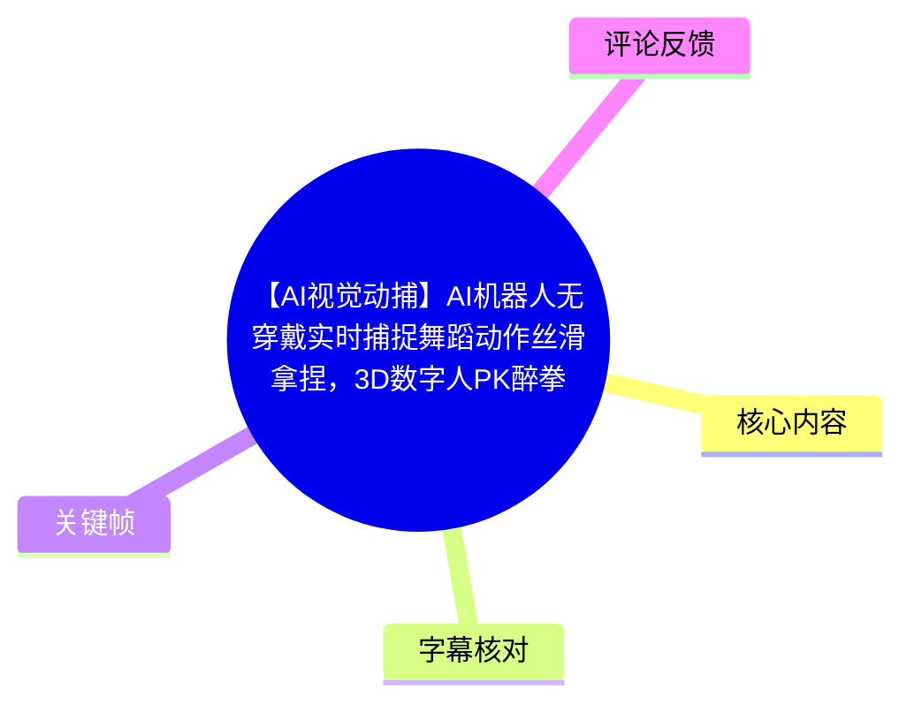
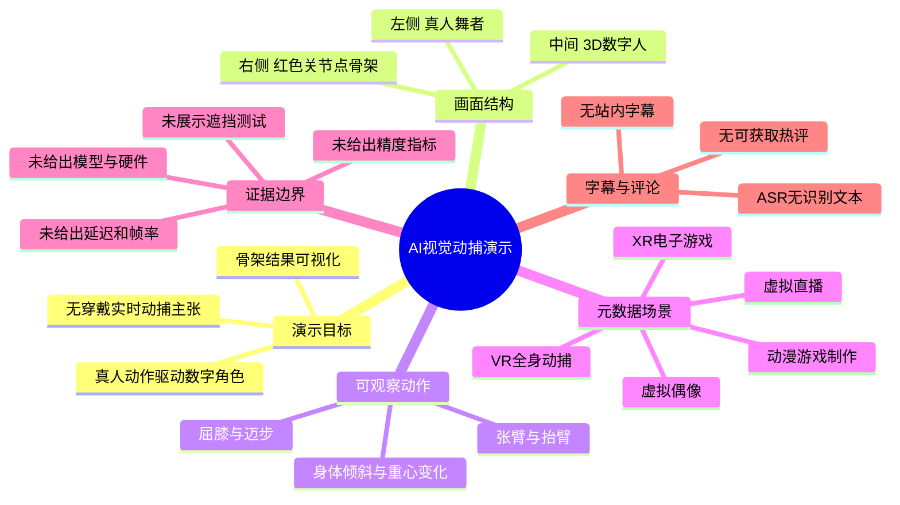
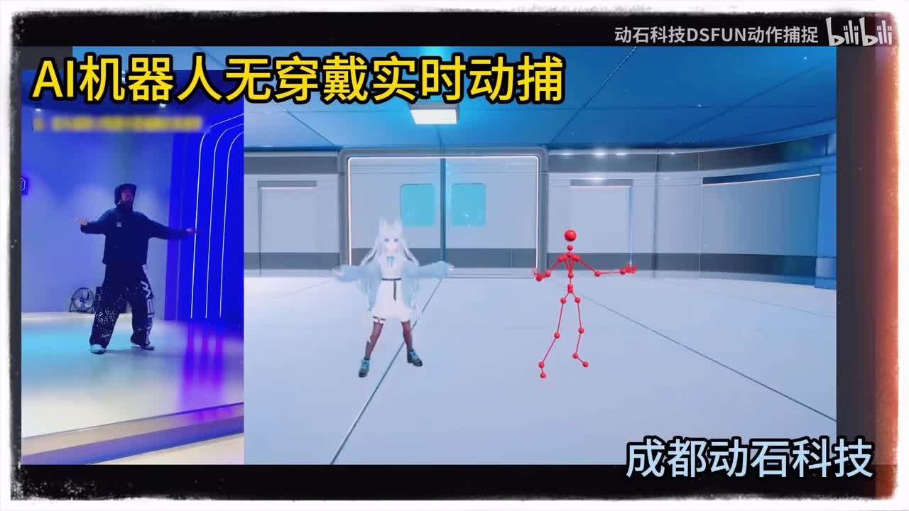
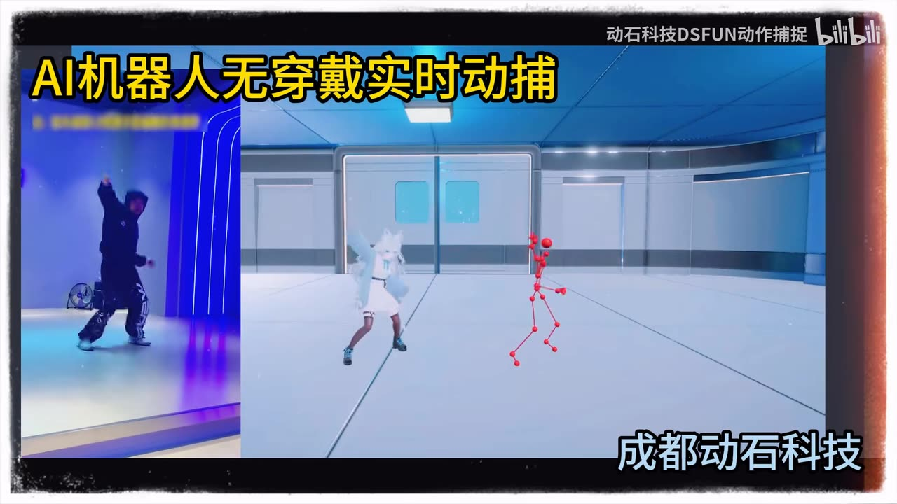
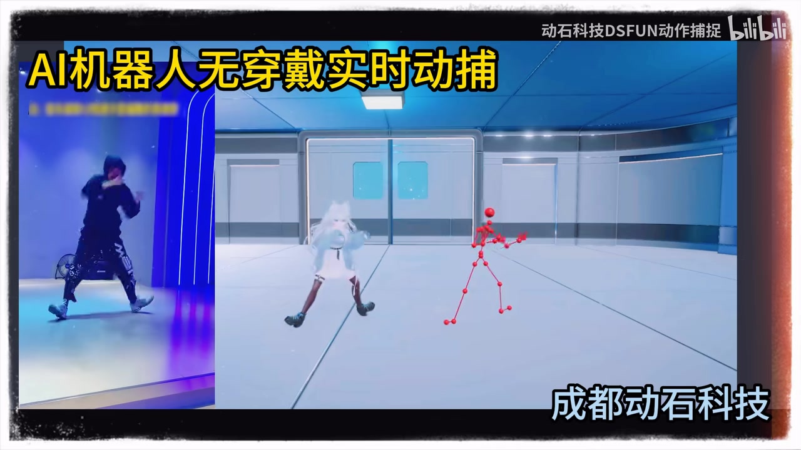

# 【AI视觉动捕】AI机器人无穿戴实时捕捉舞蹈动作丝滑拿捏，3D数字人PK醉拳

> 来源：[Bilibili 视频](https://www.bilibili.com/video/BV1417f6tEnF) 
> UP 主：动石科技DSFUN动作捕捉｜视频时长：20 秒｜画面规格：1920×1080 
> 视频简介称其提供实时动捕服务，面向虚拟直播、VR 全身动捕、XR 电子游戏、虚拟偶像及动漫游戏等 3D 内容制作场景。

## 小结

这是一支时长 20 秒的视觉动捕展示短片。画面以三栏同步对照呈现：左侧为真人舞者，中间为白发 3D 数字人，右侧为红色关节点骨架。视频标题和首帧文案明确主张“AI机器人无穿戴实时动捕”，核心意图是展示真人舞蹈动作向数字角色与骨架结果的同步映射效果。

从连续关键帧可见，舞者的张臂、抬臂、屈膝、迈步及身体倾斜等大幅动作，在中间数字人与右侧骨架中具有相近的姿态变化。该证据能够支持“视频展示了人体姿态/动作驱动效果”的描述；但它不足以独立验证算法模型、实际端到端延迟、相机数量、三维深度精度、遮挡鲁棒性或是否完全无需任何附加设备。

视频没有提供操作界面、部署流程、硬件型号、输入视频规格、帧率、延迟数值、骨骼拓扑、导出格式、追踪丢失率等工程参数。因此，它适合作为动捕演示效果的快速参考，不应直接作为采购、技术选型或性能基准的依据。

标题包含“3D数字人PK醉拳”，但现有关键帧主要呈现舞蹈式的连续动作；画面中未见可确认“醉拳”的文字标签、动作拆解或对比规则。对此应保留为标题层面的宣传表述，而非已经由片中证实的测试结论。

视频时效性以元数据发布时间为准：2026-06-04（UTC）。视觉动捕产品的模型、部署方式和性能可能会在后续版本中变化；本片未给出版本号，无法据此判断当前产品能力是否仍与演示一致。

## 思维导图

## 目录

- [视频定位与画面证据](#视频定位与画面证据)
- [三栏同步动捕展示](#三栏同步动捕展示)
- [可复用的评估方法与步骤](#可复用的评估方法与步骤)
- [参数、限制与时效性](#参数限制与时效性)
- [字幕比对](#字幕比对)
- [评论分析](#评论分析)
- [处理记录](#处理记录)

## 视频定位与画面证据

### 演示性质与应用语境 [00:00](https://www.bilibili.com/video/BV1417f6tEnF?t=0)

本片由“动石科技DSFUN动作捕捉”发布，标题聚焦“AI视觉动捕”“无穿戴”“实时捕捉舞蹈动作”。首帧左上角叠加的醒目文字为“AI机器人无穿戴实时动捕”，右下角出现“成都动石科技”字样，右上角为账号标识。

结合视频简介，发布方将实时动捕服务描述为可用于以下方向：

1. 虚拟直播；
2. VR 全身动捕；
3. XR 电子游戏；
4. 虚拟偶像；
5. 动漫、游戏等 3D 内容制作。

这些内容属于发布方提供的应用定位，并非视频中逐项完成验证的案例。视频实际呈现的是一个室内舞蹈动作映射演示，而不是上述场景的完整工作流。

> 图：该帧清楚展示视频的基本布局：左侧是真人动作源，中间是数字角色，右侧是红色关节点骨架。它是理解“输入—角色结果—骨架可视化”三层对照关系的关键证据。

## 三栏同步动捕展示

### 姿态对应：张臂到抬臂 [00:00](https://www.bilibili.com/video/BV1417f6tEnF?t=0)

开场画面中，真人双臂展开；中间数字人也呈接近的展开姿态；右侧骨架以头部、躯干、四肢等红色节点与连线表现人体结构。此处能够观察到三个画面区域在大姿态层面存在对应关系。

后续帧中，真人开始将一侧手臂举向头部附近并改变腿部支撑；数字人与骨架也随之出现手臂上举、肢体收拢及步态转换。由于视频未提供骨骼命名、关节点数量或误差读数，不能从画面推导其使用的具体骨架标准，也无法量化关节角度误差。

> 图：这一帧显示动作从展开状态进入不对称姿态。它的价值在于可观察到手臂与下肢动作并非静态摆放，而是在三栏画面中同时发生变化。

### 大幅肢体运动与重心变化 [00:00](https://www.bilibili.com/video/BV1417f6tEnF?t=0)

画面继续呈现舞者的身体侧倾、单臂上举和下肢跨步。数字角色保持相似的整体身体方向，红色骨架也以倾斜的躯干连线和弯曲肢段反映这一变化。对于内容制作人员而言，这种对照方式能够快速检查以下视觉层面的结果：

- 人物整体朝向是否随真人变化；
- 上肢抬举、收回等大关节运动是否可见；
- 下肢步幅、屈膝及支撑腿切换是否存在明显映射；
- 数字人角色动作是否在视觉上跟随输入源连续变化。

不过，“看起来跟随”不等于严格的实时性或动作精度。该视频没有时间码对照、延迟叠字、帧同步标记或原始传感器数据，因此无法从成片中测量输入与输出之间的实际延迟。

> 图：该帧包含较明显的躯干倾斜、抬臂和下肢姿态变化，适合用于检查大范围身体动作在角色与骨架侧的可见对应关系。

### 角色驱动结果与骨架可视化的分工 [00:00](https://www.bilibili.com/video/BV1417f6tEnF?t=0)

中间的 3D 数字人承担最终角色效果展示：它拥有完整服饰、头发和角色化外观。右侧的红色关节点模型则更接近动作结构的可视化表达，便于观察躯干、手臂、腿部之间的相对关系。

这两种输出在工作流中的潜在价值不同，但视频未展示二者之间的配置过程：

| 画面层 | 片中可见作用 | 视频未提供的信息 |
| --- | --- | --- |
| 真人舞者 | 动作来源的可视化参照 | 相机位置、拍摄帧率、拍摄范围、是否多机位 |
| 3D 数字人 | 动作驱动后的角色化展示 | 模型绑定方式、IK/物理设置、角色资产来源 |
| 红色骨架 | 姿态/关节点结构展示 | 节点定义、骨骼拓扑、三维坐标、滤波策略 |

> 图：该帧显示舞者跨步、数字人抬腿及骨架下肢展开的状态。其价值是说明成片持续保留了真人、角色、骨架三种观察层，而不只是展示最终渲染角色。

## 可复用的评估方法与步骤

### 将短演示转化为动捕验收问题 [00:00](https://www.bilibili.com/video/BV1417f6tEnF?t=0)

视频本身没有给出软件操作步骤或部署教程，不能据此整理出真实的软件安装、标定和导出流程。若将本片的三栏对照结构用于评估同类视觉动捕方案，可采用以下**通用验收步骤**；这些是基于画面结构提出的检查方法，不是视频明确展示的产品操作流程。

1. **固定输入动作序列**  
   准备包含张臂、抬臂、屈膝、跨步、转身、快速挥臂等动作的短序列。片中已覆盖张臂、抬臂、倾斜和跨步等大动作，可作为最低观察维度。

2. **同时保留三类证据**  
   录制真人输入、骨架追踪结果与绑定角色结果。仅看角色渲染效果容易掩盖骨架抖动、手脚滑移或关节翻转问题；仅看骨架则无法判断实际角色绑定效果。

3. **逐段检查姿态一致性**  
   对每个动作段检查头部、躯干、肩肘、髋膝踝的相对方向，尤其关注脚步落地、重心切换、单侧遮挡和快速动作。片中大幅动作能说明基础可视映射，但不覆盖这些高难度条件。

4. **单独测量延迟而非凭观感判断**  
   若要验证“实时”，应在输入端和输出端加入同一时间基准，或记录高帧率对照视频，再计算动作事件之间的时间差。由于本片没有提供这类测量标记，不能把“视觉上连续”换算成毫秒级性能结论。

5. **记录失败条件**  
   应额外测试人物部分出画、双臂交叉、背向镜头、多人同框、弱光、强运动模糊和宽松服装等情况。本视频画面中主要是一名人物、室内相对稳定光照和无遮挡的大动作，不能代表上述复杂环境。

## 参数、限制与时效性

### 已知参数与不可确认项 [00:00](https://www.bilibili.com/video/BV1417f6tEnF?t=0)

以下信息来自视频元数据、标题、简介及关键帧，按证据强度整理：

| 项目 | 可确认信息 | 证据来源 | 边界说明 |
| --- | --- | --- | --- |
| 视频时长 | 20 秒 | 元数据 | 仅为成片时长，不代表连续可用时长 |
| 分辨率 | 1920×1080 | 元数据 | 是视频画面规格，不等于算法输入分辨率 |
| 画面结构 | 真人、数字人、红色骨架三栏对照 | 关键帧 | 可见但未标注各模块名称 |
| 无穿戴 | 标题及画面文案作出该主张 | 标题、首帧文案 | 片中未展示完整拍摄环境或设备清单 |
| 实时 | 标题及画面文案作出该主张 | 标题、首帧文案 | 未给出端到端延迟、帧率或测试方法 |
| 应用场景 | 虚拟直播、VR、XR、虚拟偶像、动漫游戏等 | 视频简介 | 为发布方说明，并非本片逐项案例验证 |
| “醉拳”对比 | 出现在标题中 | 标题 | 关键帧未提供可验证的醉拳标识、规则或结果 |
| 技术模型 | 未披露 | — | 无法确定采用何种视觉模型或算法 |
| 相机配置 | 未披露 | — | 无法判断单目、双目、多目或其他方案 |
| 精度指标 | 未披露 | — | 无法判断位置、角度、脚滑或抖动误差 |
| 导出与兼容性 | 未披露 | — | 未知是否支持 FBX、BVH、引擎插件等格式/接口 |

### 使用与解读限制 [00:00](https://www.bilibili.com/video/BV1417f6tEnF?t=0)

1. **宣传片证据有限**：该短片呈现的是经过成片编排的对照效果，未提供原始输入、测试设置和统计数据。  
2. **“无穿戴”不等于“无设备”**：可从文案确认“不穿戴”的主张，但不能由此推断无需摄像头、计算设备、标定或网络环境。  
3. **“实时”缺少数值定义**：实时可能指视觉上连续更新，也可能对应某一延迟阈值；片中没有给出定义和测量结果。  
4. **复杂动作未被充分覆盖**：现有画面主要展示单人、室内、大幅舞蹈动作，无法评估手指、面部、多人交互、遮挡恢复、地面接触稳定性等能力。  
5. **版本不可追溯**：未提供产品名称、软件版本或模型版本，后续能力变化无法与本片建立精确对应。  
6. **发布时间具有时效性**：本文采用元数据时间戳换算的 2026-06-04 UTC 作为发布时间；产品规格和服务内容应以发布方后续正式文档或实际测试为准。

## 字幕比对

### 站内字幕与本次 ASR 检查结果 [00:00](https://www.bilibili.com/video/BV1417f6tEnF?t=0)

| 字幕来源 | 完整性 | 专有名词 | 时间轴 | 主要问题 |
| --- | --- | --- | --- | --- |
| Bilibili 站内字幕 | 不可用 | 无法核验 | 无可用分段 | 素材明确说明未提供可用站内字幕 |
| 本次 ASR 字幕 | 为空，0 个识别分段 | 无法识别 | ASR 结果具备时间戳能力，但无有效字幕段 | 诊断显示未识别到语音，语音覆盖时长为 0 秒、覆盖率为 0 |

本次 ASR 使用 `medium` 模型自动识别，语言检测结果为英语，概率为 `0.541015625`；但最终没有生成任何语音分段。诊断信息提示“未识别到语音片段”，应检查音轨中是否存在可识别的人声。

本素材的 ASR 诊断**没有**标记 `noAudioStream=true`，因此不能断言源视频没有音轨，也不能将空 ASR 结果解释为工具失败。更准确的表述是：已输出音频文件并完成 ASR 检查，但未检测到可转写的人声内容。视频中可见文字包括“AI机器人无穿戴实时动捕”“成都动石科技”及账号标识；本文据此并结合关键帧进行画面理解，不将其伪造成语音字幕。

最终字幕策略：**不采用站内字幕或 ASR 文本作为正文事实来源**；正文中的技术主张均注明其来自标题、视频简介或画面文案，动作描述来自关键帧可见内容。

## 评论分析

### 可获取热评前三条 [00:00](https://www.bilibili.com/video/BV1417f6tEnF?t=0)

本次获取结果中热评列表为空，未获得可分析的评论。元数据同时显示该视频 `reply: 0`，与“无可获取热评”的结果一致。

因此，本文不补造用户评价、争议观点或使用反馈，也不将点赞、投币、收藏等统计数据解读为性能或口碑结论。

## 处理记录

- Worker ID：`worker-mrj0wjed-b0c290ad`
- 模型：`gpt-5.6-terra`
- 调用工具与素材：视频元数据、关键帧、音频导出结果、ASR 诊断与识别结果、评论抓取结果。
- ASR 模型与配置：`medium`；自动语言识别；CUDA；`float16`；音频时长 `19.737` 秒；无识别分段。
- 字幕选择：站内字幕未提供可用内容；本次 ASR 为空且未标记 `noAudioStream=true`。最终不使用虚构字幕，改用标题、简介、可见画面文字与关键帧进行事实整理。
- 时间轴依据：ASR 与站内 SRT 均无可用分段时间；章节统一链接至视频起点 `00:00`，不根据文字顺序虚构片内具体秒数。
- 关键帧选择依据：`frame-001` 用于说明三栏总体结构；`frame-002`、`frame-003` 用于观察抬臂、身体倾斜和下肢变化；`frame-004` 用于说明跨步状态下真人、数字人和骨架的并列呈现。未使用无内容差异证据的其余帧。
- 缓存清理：本次提供的素材清单未包含缓存清理执行日志；不虚报已清理结果。
- 未解决问题：无法从现有素材确认动捕算法、相机方案、硬件配置、端到端延迟、刷新率、精度、遮挡表现、角色绑定流程、骨骼格式及“醉拳 PK”的具体对比规则。
