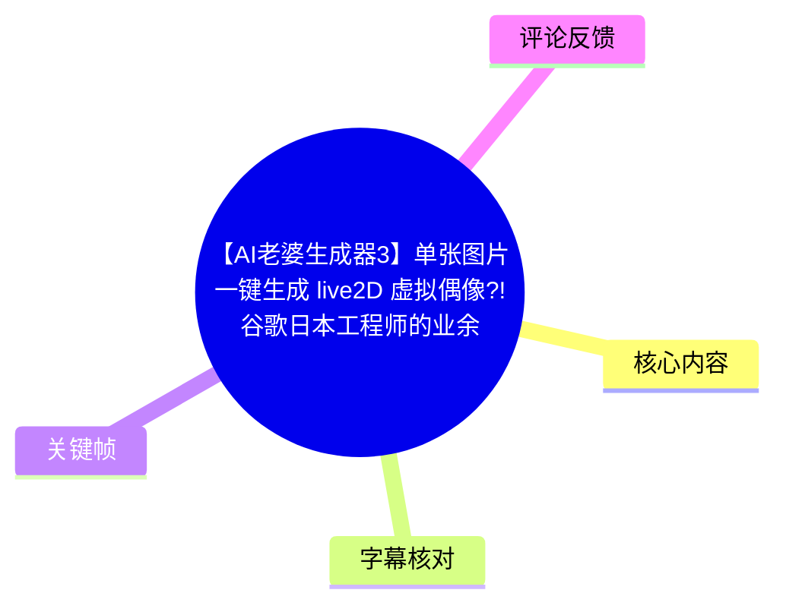
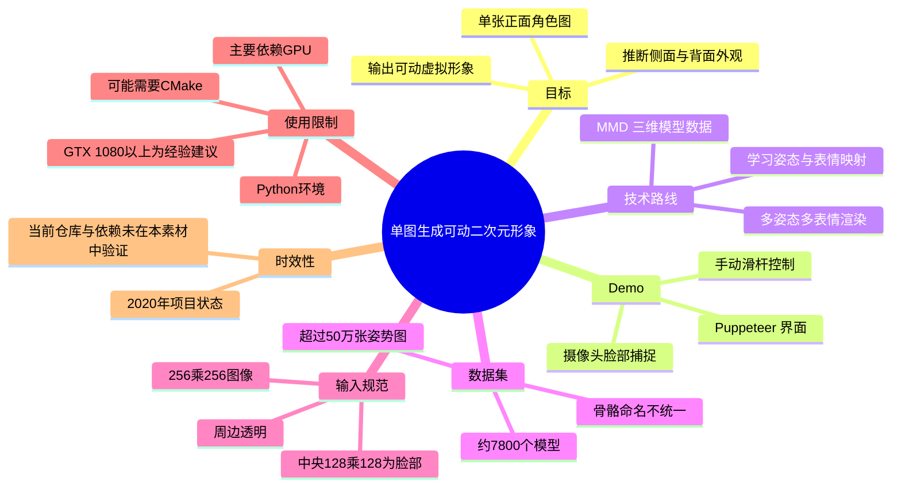
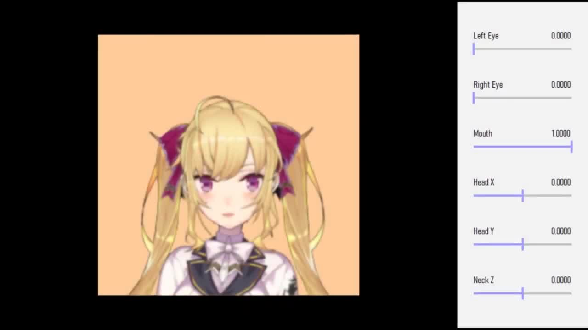
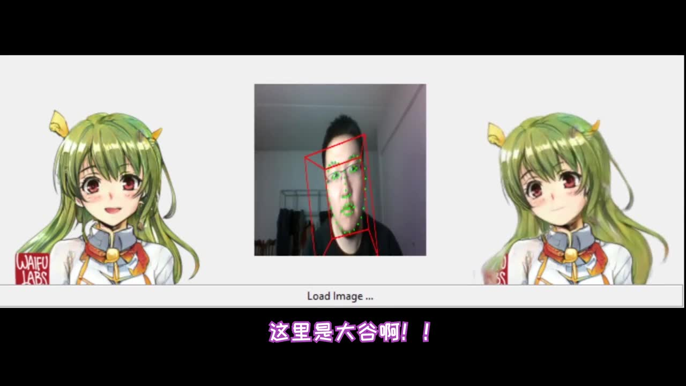
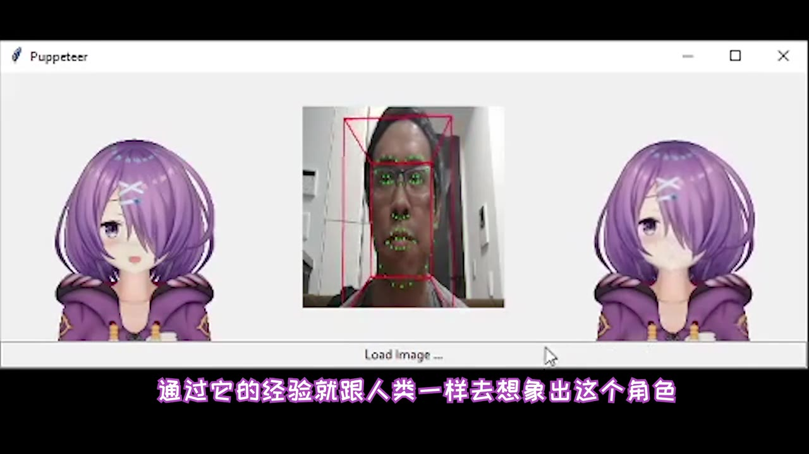
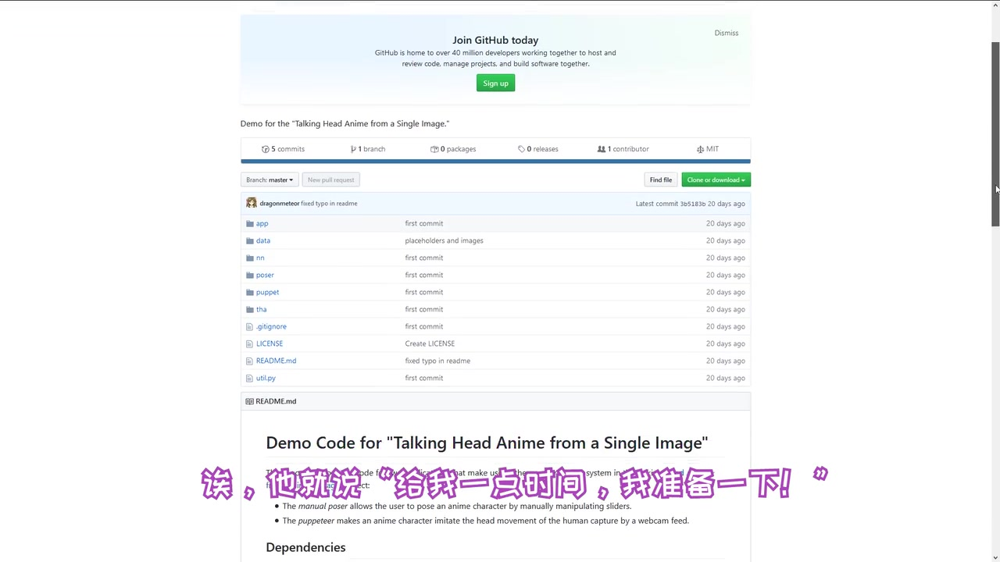

# 【AI老婆生成器3】单张图片一键生成 live2D 虚拟偶像?!谷歌日本工程师的业余爱好!【大谷纽约实验室】

> 来源：[Bilibili 视频](https://www.bilibili.com/video/BV1zJ41177WS) 
> UP 主：大谷的游戏创作小屋 ｜ 发布时间：2020-01-16 ｜ 视频时长：09:48 ｜ 分区合集：AIcode

## 小结

视频介绍了一个将**单张正面二次元角色图**驱动为可动虚拟形象的实验性项目。UP 主将其与传统 VTuber 制作方式对照：常规路线通常要么准备 3D 模型，要么将 2D 图拆成眼睛、眉毛、头发等图层后再绑定；本项目则尝试直接从一张图推断角色转头时的侧面、背面发型与发饰等不可见信息。

视频中的 Demo 提供两种控制方式：其一是通过滑杆手动调节左右眼、嘴部、头部与颈部参数；其二是使用电脑摄像头进行脸部捕捉，将真人头部动作映射到角色。画面显示的软件窗口标题为 **Puppeteer**，项目页画面写有 “Talking Head Anime from a Single Image”。

技术核心不在“把图片切片”，而在于从大量 3D 二次元模型渲染的姿势/表情图像中学习头部姿态和表情变化。视频称作者使用约 **7,800 个 MMD 模型**、超过 **50 万张**采样姿势图，涵盖转头、抬头、眨眼、张嘴与闭嘴等动作。

输入图像存在明确格式约束：视频给出的尺寸为 **256×256**，角色脸部应位于中央约 **128×128** 的区域，周边需要透明；UP 主特别提醒，使用 Photoshop 直接导出 PNG 并不能满足该项目要求，但未在视频中给出可替代的具体导出流程或失败原因。

该项目在视频发布时已经公开到 GitHub，但并非面向普通用户的一键网页工具。UP 主实际安装后认为配置较麻烦，需要 Python 环境，可能还需 CMake；运行主要依赖 GPU，并以 **NVIDIA GeForce GTX 1080 或更高**作为“可能较流畅”的经验门槛。以上软件状态、依赖和硬件建议均是 2020 年视频中的信息，不应直接视为当前版本要求。

## 思维导图

## 目录

- [开场、问题与项目定位](#开场问题与项目定位)
- [单图驱动 Demo：手动控制与脸捕](#单图驱动-demo手动控制与脸捕)
- [作者、开源信息与技术动机](#作者开源信息与技术动机)
- [训练数据：MMD 模型、姿势采样与自动化](#训练数据mmd-模型姿势采样与自动化)
- [输入图规格与制作步骤](#输入图规格与制作步骤)
- [论文基础、部署门槛与硬件限制](#论文基础部署门槛与硬件限制)
- [结论、适用范围与时效性](#结论适用范围与时效性)
- [关键帧索引](#关键帧索引)
- [字幕比对](#字幕比对)
- [评论分析](#评论分析)
- [处理记录](#处理记录)

## [开场、问题与项目定位](https://www.bilibili.com/video/BV1zJ41177WS?t=65)

视频的有效中文讲解从约 **01:05** 开始。UP 主介绍的目标是：输入任意一张正面静态角色图，由 AI 生成一个能够表现头部运动的 VTuber/虚拟偶像效果。

在 [01:22](https://www.bilibili.com/video/BV1zJ41177WS?t=82) 至 [01:59](https://www.bilibili.com/video/BV1zJ41177WS?t=106) 的对比中，UP 主将当时常见的实现方式分为两类：

1. **3D 模型路线**：直接使用三维角色模型。
2. **2D 拆件与绑定路线**：将角色图拆分成眼睛、眉毛、头发等独立部件，再进行组合与驱动；视频口述中举例提到 FaceRig、Live2D。

他认为两类方式都存在一定制作门槛与繁琐性。本文介绍的项目则试图省去手工拆图和完整建模：只给一张图，让模型依据训练经验“脑补”角色转头后的侧脸、背面头发和发饰。

需要注意，这里的“脑补”是视频的通俗表述，并不意味着项目取得角色真实的三维结构；它描述的是模型根据训练数据生成视觉上连贯的动画结果。视频没有提供定量精度、泛化失败率或与 Live2D 的严格性能对比。

## [单图驱动 Demo：手动控制与脸捕](https://www.bilibili.com/video/BV1zJ41177WS?t=172)

UP 主在 [02:52](https://www.bilibili.com/video/BV1zJ41177WS?t=172) 导入了一张自己绘制的女性角色图片，展示项目的实际运行过程。Demo 被说明为包含两种软件/模式：

### 1. 手动姿态控制

导入图片后，可拨动界面滑杆，角色会根据参数方向改变表情或姿态。画面可见的参数包括：

- Left Eye（左眼）
- Right Eye（右眼）
- Mouth（嘴部）
- Head X（头部 X 方向）
- Head Y（头部 Y 方向）
- Neck Z（颈部 Z 方向）

> 图：该帧展示单张二次元角色图及右侧滑杆控制区，能直观说明该项目并非仅输出一段固定动画，而是可以由参数实时控制眼睛、嘴部和头颈姿态。

### 2. 摄像头脸部捕捉

在 [03:16](https://www.bilibili.com/video/BV1zJ41177WS?t=196) 至 [03:23](https://www.bilibili.com/video/BV1zJ41177WS?t=203)，UP 主说明另一模式会调用电脑摄像头，将真人面部捕捉结果投射到角色上。演示画面中，人脸中央带有检测点与姿态框，左右两侧为被驱动的二次元角色。

> 图：此帧同时呈现摄像头画面、面部关键点/姿态框与左右角色输出，是理解“脸部捕捉驱动”而非纯手动调参的关键证据。

UP 主在 [03:26](https://www.bilibili.com/video/BV1zJ41177WS?t=206) 评价效果“非常有趣”，并特别指出系统甚至会补出原图中看不到的后方马尾。此处是视觉演示结论，不等同于模型可以保证所有角色发型、饰品或遮挡区域的正确性。

> 图：画面中的 Puppeteer 窗口以不同紫发角色进行脸捕，表明视频展示的能力并非只针对单一示例角色；但素材不足以据此推断其对所有画风、构图和角色类别均有效。

## [作者、开源信息与技术动机](https://www.bilibili.com/video/BV1zJ41177WS?t=120)

在 [02:00](https://www.bilibili.com/video/BV1zJ41177WS?t=120) 至 [02:49](https://www.bilibili.com/video/BV1zJ41177WS?t=169)，UP 主介绍项目作者。结合视频简介，作者姓名为 **Pramook Khungurn**；ASR 和站内字幕对此专有名词均有明显误识别，出现了 “Premlook”“PrimeMove”“Premake”等变体，不能据此作为姓名依据。

视频中的作者背景陈述包括：

- 来自东南亚的软件工程师；
- 当时在 Google 日本工作；
- 项目是其业余时间完成的小作品；
- 本科和研究生阶段在 MIT，博士阶段在 Cornell 学习 Computer Science。

这些均为视频转述信息，本文未对履历作外部核验。

UP 主表示自己关注该项目较久，曾私信询问是否有公开版本或源代码；作者随后将代码提供给他，后来也将其公开至 GitHub。视频截图中可以看到 GitHub 仓库页面，标题为：

> Demo Code for “Talking Head Anime from a Single Image”

> 图：该帧的价值在于直接呈现视频所指向的是公开代码 Demo，而不是已成熟商业产品；页面中还能看到 `app`、`data`、`nn`、`poser`、`puppet` 等目录名，但视频未逐一解释这些目录的具体作用。

在 [03:26](https://www.bilibili.com/video/BV1zJ41177WS?t=206) 至 [04:15](https://www.bilibili.com/video/BV1zJ41177WS?t=255)，UP 主还转述了作者的创作动机：作者是 VTuber 及彩虹社等内容的爱好者，也接触过视频此前系列介绍的“二次元老婆生成器”类内容，因此希望把生成的角色直接导入并以脸捕方式扮演，进而做成会动的角色形象。

## [训练数据：MMD 模型、姿势采样与自动化](https://www.bilibili.com/video/BV1zJ41177WS?t=255)

### 数据收集为何最麻烦

视频称，项目制作中最繁琐的环节是构建数据集。为让 AI 学习“同一角色在不同姿势下如何变化”，训练数据需要包含：

- 大量二次元角色；
- 尤其是便于控制的 3D 角色；
- 同一角色在不同头部姿态、表情下的对应图像；
- 多角色之间的样本，用于形成可泛化的关联。

UP 主用“让 AI 理解它要学什么”概括该过程。视频并未说明具体模型架构、损失函数、训练轮数、数据划分或评测方法，因此不能从本视频推断其完整训练方案。

### MMD 数据与采样规模

在 [04:51](https://www.bilibili.com/video/BV1zJ41177WS?t=291) 至 [06:04](https://www.bilibili.com/video/BV1zJ41177WS?t=364)，视频给出了较明确的数据规模和采样内容：

| 项目 | 视频给出的信息 |
| --- | --- |
| 基础模型 | 约 7,000～8,000 个 MMD 3D 模型 |
| 最终模型数 | 7,800 多个 |
| 采样图数量 | 50 多万张姿势图 |
| 动作/表情例子 | 不同转头角度、抬头、眨一只眼、张嘴、闭嘴 |
| 数据生成方式 | 将姿态和表情设定后渲染、输出为图像供 AI 学习 |

视频将 MMD 展开为 “MikuMikuDance”。这里的关键不是简单收集角色图片，而是将模型置于可控姿态并批量生成成对或同类样本，从而得到角色在不同驱动参数下的外观变化。

### MMD 模型带来的工程问题

UP 主指出，MMD 模型由不同作者制作，骨骼及骨骼节点命名并不统一，且大量名称为日语。由此带来两个自动化难题：

1. **定位眼睛等面部骨骼**：不能假设所有模型使用统一节点名。
2. **定位头部**：需要获得角色头部位置，用于构图、对齐或姿态控制。

视频称作者专门编写软件来判断角色眼睛骨骼的位置，再自动安排转向、眨眼等动作并生成图像；头部位置则“勉强”依据头部骨骼的位置处理，UP 主认为得到的效果“意外地还可以”。

这一经验可迁移到角色数据管线：数据量本身不足以保证可用性，异构资产的骨骼命名、层级和坐标标准化同样是训练数据生产的重要成本。

## [输入图规格与制作步骤](https://www.bilibili.com/video/BV1zJ41177WS?t=364)

视频没有提供从安装到训练的完整操作命令，但给出了用户准备输入图片、导入 Demo 并使用输出的基本顺序。

### 输入图像要求

在 [06:04](https://www.bilibili.com/video/BV1zJ41177WS?t=364) 至 [06:17](https://www.bilibili.com/video/BV1zJ41177WS?t=377)，UP 主说明输入图需要满足以下要求：

| 参数 | 视频要求 |
| --- | --- |
| 图像分辨率 | 256×256 |
| 脸部区域 | 位于中间约 128×128 区域 |
| 周边区域 | 应抠为透明 |
| 导出注意事项 | Photoshop 直接输出 PNG 不可用 |

“Photoshop 直接输出 PNG 不可用”是视频中特别强调但信息不完整的一点。视频未说明是透明通道、PNG 色彩格式、预乘 Alpha、图片尺寸、编码方式，还是项目读取逻辑导致的问题；因此不能擅自补充解决命令。实践者应以仓库 README、当前依赖版本和实际报错为准。

### 基于视频可复现的操作流程

1. **准备角色原图**：选择正面二次元角色图，而不是任意角度图片。
2. **处理画布与构图**：将图片整理为 256×256；角色脸部放在中心约 128×128 区域。
3. **处理透明背景**：将人物周边区域抠为透明。
4. **按项目格式导出**：不要仅按 Photoshop 默认方式直接输出 PNG；需查询项目文档确定兼容格式。
5. **在 Demo 中 Load Image**：载入准备好的角色图。
6. **选择控制方式**：
   - 调节眼睛、嘴部、Head X/Y、Neck Z 等滑杆进行手动测试；
   - 或授权摄像头，通过脸部捕捉驱动角色。
7. **检查转头和遮挡效果**：重点观察头发、马尾、发饰等原图中没有直接可见的信息是否出现明显失真。

视频展示的是推理/驱动使用流程，不包含从零训练自定义模型的完整步骤。

## [论文基础、部署门槛与硬件限制](https://www.bilibili.com/video/BV1zJ41177WS?t=385)

### 相关研究基础

在 [06:25](https://www.bilibili.com/video/BV1zJ41177WS?t=385) 至 [07:14](https://www.bilibili.com/video/BV1zJ41177WS?t=434)，UP 主展示作者的论文与个人网站内容，并说作者曾做过从二次元角色图预测骨骼/姿态的 AI 系统：输入一张图，系统可以判断角色大致以什么站姿站立。

视频的判断是，这类姿态预测研究为后来“生成虚拟偶像”的项目提供了技术基础。由于本素材没有给出论文标题、链接、实验设置或具体模型名称，本文仅记录其关系，不对论文结论作额外延伸。

### 软件依赖与安装难度

在 [07:14](https://www.bilibili.com/video/BV1zJ41177WS?t=434) 至 [07:38](https://www.bilibili.com/video/BV1zJ41177WS?t=458)，UP 主根据自己的安装体验给出如下信息：

- 需要安装 **Python** 相关环境；
- 项目已给出版本号；
- UP 主认为项目未明确提及、但实际可能还需要安装 **CMake**；
- 他自己完整安装一次后认为过程“比较麻烦”。

这里的“可能需要 CMake”属于 UP 主安装经验，不是视频中可确认的官方依赖清单；不同操作系统、代码版本和构建方式可能不同。

### GPU 与性能门槛

UP 主进一步表示，该系统主要需要 GPU 运算，显卡可能至少要 **NVIDIA 1080（GTX 1080）以上**，才会有比较流畅的运行体验。

这不是硬性兼容性列表，也不是当前版本的最低配置。它至少受以下因素影响：

- 当时的软件版本、CUDA 与深度学习框架版本；
- 输入分辨率与模型结构；
- 是否仅运行推理，还是包含数据预处理；
- 显存容量、CPU、驱动和系统环境；
- 后续项目是否有优化、重构或停止维护。

## [结论、适用范围与时效性](https://www.bilibili.com/video/BV1zJ41177WS?t=458)

UP 主在 [07:38](https://www.bilibili.com/video/BV1zJ41177WS?t=458) 后期待项目未来能进一步产品化、简化为网页端直接上传图片并生成虚拟偶像。这一段是对未来形态的期待，而非视频中已经实现的功能。

### 可迁移的技术经验

- **以标准化 3D 资产构造 2D 学习数据**：通过可控姿态渲染得到大规模表情与动作图，比只采集随机图片更利于学习驱动关系。
- **自动化资产适配不可缺少**：面对大量来源不同的 MMD 模型，骨骼命名与结构不统一会直接阻碍批处理，需要编写专门的识别和转换工具。
- **输入规范决定可用性**：即使目标是“单图”，角色朝向、脸部位置、画布大小、透明区域和导出格式仍是关键前提。
- **Demo 可用不等于生产可用**：视频展示了动态效果，但安装复杂度、GPU 依赖、输入限制和未知泛化边界说明它更接近研究/开源 Demo。

### 适合谁参考

- 希望理解早期“单图驱动二次元头像”技术路线的开发者；
- 研究角色动画、姿态迁移、数据自动生成的学习者；
- 有 GPU、Python 环境配置经验，愿意阅读仓库文档并处理图像格式问题的实践者。

### 不适合直接据此承诺的场景

- 需要稳定商业级虚拟主播生产流程的团队；
- 只有低配置设备、无法配置深度学习环境的普通用户；
- 需要精确控制身体、衣物、复杂手势或完整三维视角的需求；
- 需要确保角色素材版权、模型授权或数据集来源合规的发布项目。视频未讨论模型与素材的授权边界。

### 时效性说明

本视频发布于 **2020-01-16**。作者所在单位、GitHub 仓库可访问性、安装步骤、Python/CMake/CUDA 版本、显卡性能建议，以及是否已有更成熟替代方案，均没有在本素材中进行当前核验。阅读时应将其视为**视频发布时期的项目介绍与实测经验**。

此外，视频开头 [00:00](https://www.bilibili.com/video/BV1zJ41177WS?t=0) 至 [00:19](https://www.bilibili.com/video/BV1zJ41177WS?t=19) 出现英文“Mother’s Day”片段，结尾 [09:27](https://www.bilibili.com/video/BV1zJ41177WS?t=567) 至 [09:38](https://www.bilibili.com/video/BV1zJ41177WS?t=578) 出现“请不吝点赞，订阅、转发、打赏支持明镜与点点栏目”等无关语音；它们与主体内容不一致，未纳入知识结论。

## [关键帧索引](https://www.bilibili.com/video/BV1zJ41177WS?t=172)

| 关键帧 | 正文位置 | 画面内容 | 选用价值 |
| --- | --- | --- | --- |
| `frames/frame-001.jpg` | 单图驱动 Demo | 二次元角色与 Left Eye、Right Eye、Mouth、Head X/Y、Neck Z 滑杆 | 证明手动参数控制的存在，并保留可见参数名称。 |
| `frames/frame-002.jpg` | 摄像头脸捕 | 真人摄像头、人脸关键点/姿态框、角色输出 | 直观说明角色由真人脸部捕捉驱动。 |
| `frames/frame-003.jpg` | 脸捕效果补充 | Puppeteer 窗口与另一角色示例 | 补充展示不同角色下的同类驱动界面。 |
| `frames/frame-004.jpg` | 开源信息 | GitHub 项目页与 “Talking Head Anime from a Single Image” 标题 | 将视频中的“公开源代码”主张落到可见项目页证据。 |

## [字幕比对](https://www.bilibili.com/video/BV1zJ41177WS?t=65)

| 字幕来源 | 完整性 | 专有名词 | 时间轴 | 主要问题 |
| --- | --- | --- | --- | --- |
| Bilibili 站内字幕 `p01-ai-zh.srt` | 覆盖主体讲解，含开头和结尾无关片段 | 多处错误，如作者名、GitHub、Live2D 等出现错写 | 粒度较细，主体讲解起止时间可用 | [01:16](https://www.bilibili.com/video/BV1zJ41177WS?t=76) 至 [01:20](https://www.bilibili.com/video/BV1zJ41177WS?t=80) 存在句子断裂；夹杂英文母亲节与无关结尾内容。 |
| 本次 ASR（`medium`，中文识别） | 共 23 段；语音覆盖约 421.58 秒，占视频约 71.82% | 误识别较多，如 “Premlook”“Gigab”“Lab2D”“脸部补充”“Miku Miku Das” | 具备时间戳；主体中文讲解大段时间与站内字幕接近 | 分段较粗、词间粘连；在 [04:39](https://www.bilibili.com/video/BV1zJ41177WS?t=279) 至 [04:51](https://www.bilibili.com/video/BV1zJ41177WS?t=291) 有约 11.87 秒空缺；开头及结尾同样识别到无关音频。 |

### 最终字幕选择与校正原则

本次 ASR 已实际检查：其诊断显示存在正常音频流，**未标记 `noAudioStream=true`**；因此不存在“源视频没有音轨”的情况。ASR 检测语言为中文，置信度约 **0.9775**，使用 CUDA 与 float16 推理。

正文采用以下合并策略：

1. **时间定位优先使用 ASR 的真实分段起止时间**，章节链接均据其起始秒数生成。
2. **语义以站内字幕为主体并与 ASR 交叉检查**：两者对于视频主体结构、数据规模、输入规格、依赖与 GTX 1080 建议高度一致。
3. **以元数据、视频简介和关键帧纠正专名**：
   - 作者：采用视频简介中的 **Pramook Khungurn**，不采用 ASR/站内字幕的 “Premlook”“PrimeMove”“Premake”等变体；
   - 项目页面：关键帧显示 “Talking Head Anime from a Single Image”；
   - 软件窗口：关键帧显示 **Puppeteer**；
   - MMD：根据站内字幕“mmd 模型”及语境保留为 **MMD / MikuMikuDance**；
   - “脸部补充”：结合上下文与关键帧中的人脸关键点，校正为**脸部捕捉**；
   - “Lab2D”：校正为视频语境中的 **Live2D**。

## [评论分析](https://www.bilibili.com/video/BV1zJ41177WS?t=482)

本次素材仅获取到 **2 条**热评，未提供第 3 条，因此仅分析可获取的前两条；评论不作为已经验证的技术事实。

1. **批哩屑哩乾杯**（654 赞）  
   > “大佬的业余时间：制作游戏   我们的业余时间：玩大佬制作的游戏”

   这是一条对作者技术能力与业余创作投入的感叹，呼应视频中“作者利用业余时间制作项目”的叙述。它没有补充项目功能、性能、安装方式或来源信息，属于情绪化评价。

2. **安丁EnderFoxy**（478 赞）  
   > “一键live2d制作，制作师都失业了，嗯[吓]”

   评论将单图驱动能力戏称为会令 Live2D 制作者失业。视频本身并不支持这一结论：该项目依然要求特定输入格式、环境配置和较高 GPU 条件，且视频没有展示完整 Live2D 建模、分层绘制、物理效果、精细变形与商业制作流程的替代能力。该评论可反映观众对“降低角色动画门槛”的直观感受，但不应当作职业替代的事实判断。

## [处理记录](https://www.bilibili.com/video/BV1zJ41177WS?t=0)

- **Worker ID**：`worker-mrj0wjed-b0c290ad`
- **模型**：`gpt-5.6-terra`
- **ASR 模型与运行信息**：`medium`；语言识别为 `zh`；languageProbability 为 `0.9775390625`；CUDA / float16。
- **使用的素材与工具输出**：视频元数据、站内字幕 `p01-ai-zh.srt`、本次 ASR 时间轴字幕与 `asr-result.json` 诊断、12 个可用关键帧路径、可获取热评 JSON。
- **字幕选择**：检查站内字幕与本次 ASR 后，以 ASR 的真实时间戳作为章节定位基准，以站内字幕和 ASR 的共同语义为主，并通过元数据、视频简介和关键帧校正人名、项目名、Puppeteer、MMD、脸部捕捉、Live2D 等误识别内容。
- **关键帧选择依据**：选取展示滑杆参数、摄像头脸捕、人脸关键点/角色输出、GitHub Demo 页面等与正文技术论点直接对应的帧；未将缺少语境的装饰性画面作为证据。
- **热评处理范围**：素材仅返回 2 条热评，严格只分析这 2 条，不补造第 3 条。
- **缓存清理**：未提供缓存清理执行日志；本文不声称已执行或完成缓存清理。
- **未解决问题**：未在素材范围内核验项目仓库当前状态、依赖版本、许可证、数据集授权、当代显卡门槛及项目后续维护情况。

## 评论分析

- 热评 1：大佬的业余时间：制作游戏 我们的业余时间：玩大佬制作的游戏
- 热评 2：一键live2d制作，制作师都失业了，嗯[吓]

以上内容是观众反馈摘录，只用于补充理解视频反响，不作为正文事实依据。
