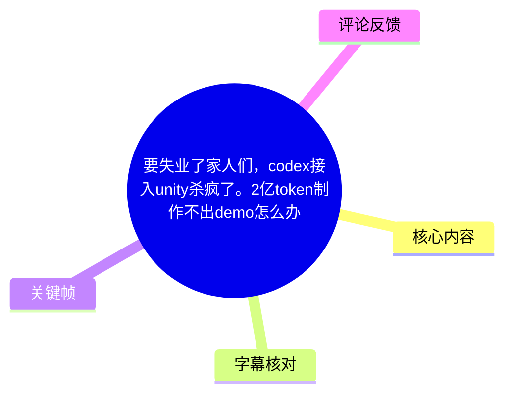
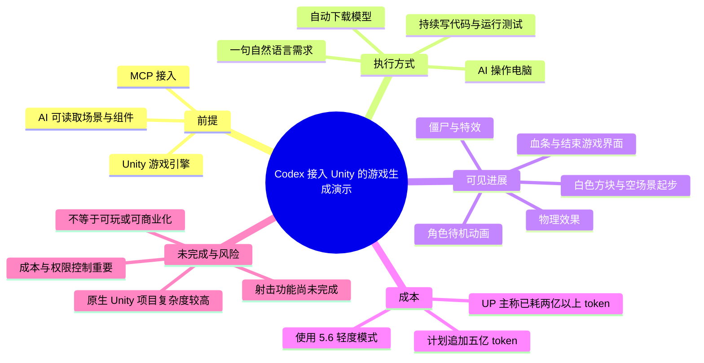
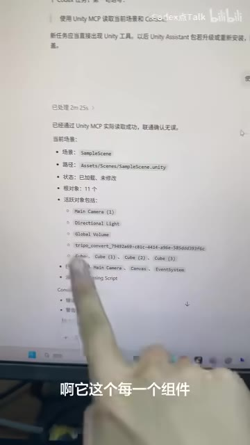
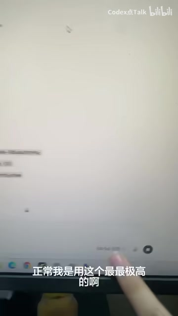
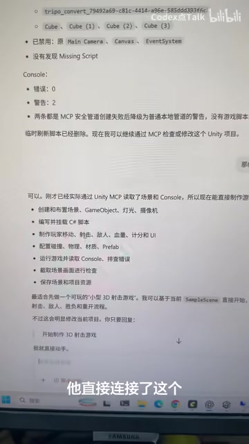

# 要失业了家人们，codex接入unity杀疯了。2亿token制作不出demo怎么办！

> 来源：[Bilibili 视频](https://www.bilibili.com/video/BV1xjKL6uERx)  
> UP 主：Codex点Talk｜视频时长：2 分 53 秒｜分辨率：1080 × 1920（竖屏）  
> 标签：AI、Unity、游戏开发、Codex、MCP、Demo

## 小结

视频展示了一次由 UP 主口述和录屏记录的 Unity AI 辅助开发过程：他将一个 MCP 接入 Unity 后，让 AI 读取当前场景及其组件，并以一句“直接给我做一个 Unity 的游戏”的自然语言指令启动生成与迭代。

核心展示并不是一个已完成、可玩的游戏，而是 AI 在 Unity 工程中持续操作、运行测试、下载模型并修改场景的过程。UP 主称，AI 能读取场景层级、对象与组件；随后从原本的白色方块/空场景逐步生成角色、待机动画、小型僵尸、特效、物理效果、血条和“结束游戏”等 UI 元素。

视频最重要的经验是：**Unity 这类原生游戏工程的 AI 自动化，成本和复杂度显著高于简单的 2D 项目或网页 3D 项目。**UP 主为控制消耗，将模型设置为“5.6 的轻度模式”，而非自己平常使用的“极高”模式；即便如此，他称后台统计已经消耗“两个多亿 token”。

该案例适合关注 AI Agent、MCP 接入 Unity、游戏原型自动化的人阅读。但应明确区分：视频证明的是一次正在运行中的演示，不能据此推出 AI 已可稳定一键完成商业游戏。视频结束时，射击功能尚未完成，UP 主计划再投入“五个亿 token”继续观察结果，因此最终可玩性、性能、成本结构与成功率均未得到验证。

## 思维导图

## 目录

- [背景：AI 做游戏的能力判断](#背景ai-做游戏的能力判断)
- [Unity MCP 接入与场景读取](#unity-mcp-接入与场景读取)
- [从一句需求到 AI 接管操作](#从一句需求到-ai-接管操作)
- [生成过程：下载资产、写代码与测试](#生成过程下载资产写代码与测试)
- [当前 Demo 的可见成果与未完成项](#当前-demo-的可见成果与未完成项)
- [成本、限制与可迁移经验](#成本限制与可迁移经验)
- [字幕比对](#字幕比对)
- [评论分析](#评论分析)
- [处理记录](#处理记录)

## 背景：AI 做游戏的能力判断 [00:00](https://www.bilibili.com/video/BV1xjKL6uERx?t=0)

视频开头，UP 主针对“AI 还没有那么智能”的看法提出反驳。他的判断是：AI 在游戏制作上的能力已经达到“很厉害”的程度，并准备以实际 Unity 工程录屏作为例证。

这里需要注意，该判断属于 UP 主的主观评价，而不是视频中经过基准测试得出的结论。视频没有提供模型版本、计费单价、完整提示词、项目文件、运行性能指标或成品试玩链接，因此其价值主要在于展示工作流与过程现象。

> 图：UP 主在开头说明 AI 做游戏能力的主观看法。该画面用于建立视频的论题背景：后续内容是一次 Unity 工程内的 AI 自动化演示，而非完整产品发布。

## Unity MCP 接入与场景读取 [00:09](https://www.bilibili.com/video/BV1xjKL6uERx?t=9)

UP 主说明，自己使用的游戏引擎是 **Unity**，并在其中“接入了一个 MCP”。这里的 MCP 在视频语境中承担 AI 与 Unity 工程之间的工具连接层：AI 可以据此读取场景信息，并进一步执行或协助执行工程操作。

按站内字幕的完整表述，接入后 AI “瞬间读取了场景中所有的东西”，并且“每一个组件都已经获取到”。录屏画面也显示了场景/控制台信息，包括示例场景、场景路径、对象层级以及控制台状态等内容；画面文字还提示存在两条与 MCP 安全通道相关的警告，但没有发现脚本错误。

视频中能够确认的能力边界包括：

1. **读取场景结构**：可识别当前场景中的对象、层级和部分组件信息。
2. **检查工程状态**：画面显示控制台“错误：0、警告：2”一类的状态信息。
3. **面向 Unity 的操作入口**：录屏文字列出创建/修改场景与 GameObject、灯光、摄像机，以及制作/修改 UI、动画、敌人、血量、计分等能力方向。
4. **并不意味着完全无约束执行**：视频没有展示 MCP 的权限配置、允许调用的工具列表、文件访问范围或安全隔离方案，实际接入时不能忽略这些部分。

> 图：屏幕中展示 Unity MCP 已连接后返回的场景信息、对象层级和控制台状态。它是理解“AI 能读取组件”这一说法的直接画面依据，也显示工程内仍有警告项需要人工辨别。

## 从一句需求到 AI 接管操作 [00:41](https://www.bilibili.com/video/BV1xjKL6uERx?t=41)

UP 主表示，自己只给出了一句需求：“你可以直接给我做一个 Unity 的游戏吗？”随后 AI 开始制作，并出现了控制电脑屏幕的行为。UP 主在视频中多次承认自己“不知道它在做什么”，说明此时 Agent 的长链路执行对操作者而言缺乏足够的过程可解释性。

他特别提到模型模式选择：

| 项目 | 视频中的说法 | 含义与注意事项 |
| --- | --- | --- |
| 当前使用模式 | “5.6 的轻度模式” | UP 主为降低大项目的 token 消耗而采用；视频未给出产品名称、模型全称或具体配置。 |
| 常用模式 | “最最极高的” | UP 主称正常情况下会使用更高配置，但本次没有使用。 |
| 选择原因 | 大型游戏项目“特别浪费 token” | 是本次工作流的关键成本约束。 |
| 输入方式 | 一句自然语言需求 | 需求过于宽泛，视频未展示明确的玩法、验收条件、资源预算或版本边界。 |

> 图：画面字幕对应“正常我是用这个最最极高的”，用于说明视频并非在最高模型配置下展示结果；模式选择与成本控制是本案例的重要前提。

### 实践启示：不要只用一句宽泛需求启动长任务

视频中使用的是高度开放的需求，适合作为能力演示，却不适合作为可控生产流程。若将这一方式迁移到实际项目，应先拆解为可验收的阶段任务：

1. **明确最小玩法闭环**：例如移动、攻击、敌人生成、伤害结算、胜负条件。
2. **限定本轮允许修改的范围**：例如只允许改动指定场景、脚本目录和 UI Prefab。
3. **规定资源来源与许可要求**：禁止 Agent 自行下载来源不明或授权不清的模型、贴图和音频。
4. **每阶段运行测试**：先完成可启动，再完成功能，再加入表现层，最后进行性能检查。
5. **设置 token、时间和失败上限**：长链路自动化应允许中止，而不是无限迭代。

以上是根据视频暴露出的成本与可控性问题提出的工程化建议，并非视频中已实际执行的完整步骤。

## 生成过程：下载资产、写代码与测试 [00:57](https://www.bilibili.com/video/BV1xjKL6uERx?t=57)

UP 主称，他观察到 AI 从一个白色方块开始构建；此前该场景并不存在。AI 还会自行下载模型，UP 主推测自己之前曾提供过免费模型的下载链接，且 AI 之前已经下载过不少模型。

随后，AI 持续写代码。UP 主从屏幕提示中观察到与击杀、分数、治疗、错误检查等相关的内容，但没有完整展示脚本源码或具体实现。因此可以记录为：系统正在尝试围绕战斗/生存类游戏的功能进行代码与场景迭代；不能据此确认各模块均已正确实现。

在 [01:44](https://www.bilibili.com/video/BV1xjKL6uERx?t=104) 至 [01:58](https://www.bilibili.com/video/BV1xjKL6uERx?t=118) 的阶段，UP 主看到 AI 再次控制屏幕，并判断它有时会自行运行项目、发现问题后进行测试。视频能支持“存在自动运行/测试行为”的描述，但没有展示测试用例、日志、断言、覆盖率或自动修复前后的差异。

> 图：画面中的操作说明涉及场景、对象、UI、动画、敌人、血量、计分与控制台检查等方向。它有助于解释为什么一个看似简单的游戏任务会演变为跨场景、资源、脚本和测试的复合型工作流。

### 视频中可还原的执行顺序

1. 在 Unity 工程中接入 MCP。  
2. 由 AI 获取当前场景、对象与组件信息。  
3. 选择“5.6 的轻度模式”以压低成本。  
4. 用一句自然语言请求让 AI 制作 Unity 游戏。  
5. AI 开始操作电脑，并从白色方块/原无场景的状态推进。  
6. AI 下载或使用模型资源，持续生成和修改内容。  
7. AI 编写与击杀、得分、治疗等方向相关的逻辑，并检查错误。  
8. AI 间歇性运行项目进行测试。  
9. 后续新增动画、敌人、特效、物理与 UI。  
10. 在视频结束时，项目仍处于迭代中，尚未完成射击功能。

## 当前 Demo 的可见成果与未完成项 [02:00](https://www.bilibili.com/video/BV1xjKL6uERx?t=120)

在约 2 分钟后，UP 主指出 AI 已经把动画加进项目：角色具备待机动画。随后，画面中又出现了小型僵尸、特效和物理效果。

到 [02:14](https://www.bilibili.com/video/BV1xjKL6uERx?t=134) 后，UP 主概括当前游戏已有：

- 角色待机动画；
- 小型僵尸敌人；
- 特效；
- 某种物理效果；
- 血条；
- “结束游戏”相关界面或功能入口。

但同时，他明确说：**射击功能还没有完成。**因此，这一结果应被定义为“具有部分可见元素的进行中原型”，而非功能闭环的射击/生存游戏 Demo。

| 已展示或被口述提及 | 状态 | 证据强度 |
| --- | --- | --- |
| Unity 场景与组件读取 | 已展示 | 录屏与口述均支持 |
| AI 操作电脑 | 已展示 | UP 主口述与录屏过程支持 |
| 模型下载 | UP 主口述观察 | 未展示下载来源和许可证 |
| 待机动画 | 已展示/口述 | UP 主明确说明已加入 |
| 僵尸、特效、物理效果 | 已展示/口述 | UP 主明确说明画面中出现 |
| 血条、结束游戏 | 已提及并在画面中观察 | 未展示完整交互逻辑 |
| 射击功能 | 未完成 | UP 主明确说明 |
| 可玩性、性能、稳定性 | 未验证 | 视频未提供试玩和指标 |

## 成本、限制与可迁移经验 [02:38](https://www.bilibili.com/video/BV1xjKL6uERx?t=158)

成本是本视频最突出的限制。UP 主称，自己在后台计算后发现，项目已经消耗“两个多亿 token”；之后又说计划再给“五个亿 token”，看看 AI 最终能把游戏做成什么样。

这些数值是 UP 主的自述，视频未提供账单、token 计量口径、模型输入输出拆分、缓存命中率、单价或总金额。因此可以把它作为该案例的成本预警，不能当作不同模型、不同项目之间可直接复现的统一基准。

UP 主还比较了任务类型，称这类 Unity 项目的消耗不同于 2D 项目或网页 3D 项目。合理的工程解释是：原生 Unity 工程往往同时涉及场景编辑、C# 脚本、资源导入、动画状态、碰撞/物理、UI、运行时调试与项目配置；每一轮 Agent 操作都可能需要重新读取上下文、运行验证并处理错误。但这段解释是对视频现象的技术归纳，视频本身没有给出严格的对照实验。

### 关键限制

1. **功能未闭环**：射击功能尚未完成，无法证明玩法成立。
2. **成本不可控风险高**：UP 主称已到两亿 token 量级，且任务还在继续。
3. **过程可解释性不足**：UP 主多次表示不知道 AI 正在做什么。
4. **资源合规性未说明**：AI 自动下载模型的来源、授权、依赖安全性均未披露。
5. **测试证据不足**：仅能确认存在运行/测试动作，不能确认测试覆盖、结果可靠性或修复质量。
6. **没有性能数据**：缺少帧率、内存、包体、加载时间、目标平台等信息。
7. **时效性强**：MCP 工具、AI 模型能力、Unity 版本、插件接口与计费规则都可能变化；本文只记录视频素材所覆盖的状态。

### 对实际开发者的结论

AI Agent 可以在 Unity 中承担场景读取、资源整合、代码编写、运行测试和原型迭代等工作，但更适合把它视作可被约束、分阶段验收的自动化协作者。对于商业项目，决定价值的仍包括玩法设计、受众定位、美术一致性、性能、可靠性、版权合规与持续运营；这些内容均不能由本视频中的“已生成若干元素”直接证明。

## 字幕比对

| 字幕来源 | 完整性 | 专有名词 | 时间轴 | 主要问题 |
| --- | --- | --- | --- | --- |
| Bilibili 站内字幕 `p01-ai-zh.srt` | 覆盖 00:00:00.040—00:02:52.760，分段细，基本覆盖全片口述 | “Unity”“MCP”“token”等术语正确 | 真实 SRT 起止时间，可直接用于章节链接 | 少量口语重复、停顿和不完整句保留；个别表述含糊。 |
| 本次 ASR（medium） | 诊断显示语音覆盖约 95.12%，覆盖 00:00:00—00:02:52.420 | 多处识别错误，如“Unity”被识为“用int/游记”，“token”附近存在错字，“待机动画”等也有误识 | 具备时间戳，但分段较粗，部分段落跨越 20 秒以上 | 专有名词与口语内容错误较多，不宜单独作为正文依据。 |

### 最终字幕选择与校正

正文以**站内字幕**为主，因为其时间颗粒度更细，且 Unity、MCP、token 等关键术语识别正确；本次 ASR 已完成检查，未发现 `noAudioStream=true` 标记，说明源视频存在音轨，ASR 不是因无音轨而缺失。

本次 ASR 的诊断信息为：语言 `zh`、语言置信度约 `0.9966`、语音时长约 `164.52` 秒、语音覆盖约 `95.12%`、无大间隔警告。尽管覆盖良好，其文本准确性不足，故不作为主要转写来源。

结合站内字幕、ASR 对照和关键帧/录屏画面，本文重点校正为：

- ASR 的“用int”“游记”等，统一校正为 **Unity/游戏**；
- ASR 中的“消耖”“渠道”等，统一按站内字幕和上下文校正为 **消耗/游戏**；
- ASR 的“雪条”按站内字幕语义校正为 **血条**；
- “5.6 的轻度模式”“最最极高”等均按视频口述记录，视频未提供可核验的产品全称，不扩展解释为特定公开模型版本。

## 评论分析

以下仅分析可获取的热评前三条；评论反映的是用户观点，不构成对视频内容的事实验证。

1. **wudi666ojbk（63 赞）**  
   评论以“AI 能全做了我还用得着在这 9106 吗？”表达对 AI 替代开发岗位的焦虑与调侃。它呼应了视频标题中的“要失业了”，但没有提供关于 AI 实际产能、岗位替代率或项目质量的证据。结合视频中射击功能尚未完成、成本已很高的事实，不能把该评论理解为 AI 已能全面替代开发者。

2. **银银子う（35 赞）**  
   评论质疑：“这些功能几行代码就能解决，AI 为什么用了两亿 token？”这是对成本收益比的直接追问，具有较强的讨论价值。视频确实缺少 token 计量细节，无法解释两亿 token 分别消耗在上下文读取、反复修改、工具调用、模型下载、测试、失败重试还是其他操作上。因此，评论提出的问题成立，但“几行代码即可解决”的前提也未必覆盖 Unity 场景、资产、动画、测试与调试等完整工作量。

3. **D_Lune（3 赞）**  
   评论认为，一键生成类结果与“生成毕设”相似；游戏产品还需要满足受众、提供游玩理由和乐趣，否则即使能运行也不创造价值。该观点补充了视频没有覆盖的产品层面标准。视频确实主要展示技术生成过程，并未展示受众测试、玩法深度、留存、性能或商业价值，因此不能用当前演示反驳这一质疑；但评论同样没有对该原型进行完整试玩，其“谁会想玩”的判断仍属于观点。

## 处理记录

- Worker ID：`worker-mrj0wjed-b0c290ad`
- 模型：`gpt-5.6-terra`
- 调用工具与素材：视频元数据、站内字幕 `p01-ai-zh.srt`、本次 ASR 结果 `asr/asr-result.json`、ASR SRT、关键帧目录、热评 JSON。
- 字幕选择：以站内字幕为正文时间轴和转写主来源；已对本次 ASR 进行完整检查，并用其语音覆盖诊断辅助确认。未检测到 `noAudioStream=true`。
- 关键帧选择依据：选用 `frame-001.jpg` 说明开场论题，`frame-002.jpg` 佐证 Unity MCP 的场景/组件读取，`frame-003.jpg` 说明模型模式与成本取舍，`frame-004.jpg` 展示 MCP 可面向 Unity 执行的操作范围。仅将画面可见信息用于佐证，不从模糊画面扩写未经口述确认的细节。
- 缓存清理：素材清单未提供缓存清理执行结果；本文不虚构已清理状态。
- 未解决问题：缺少完整项目文件、模型与 MCP 的精确版本、提示词全文、token 账单和计量口径、资源授权信息、测试日志、性能数据及最终可玩的 Demo，因此无法验证成本、稳定性和成品质量。
