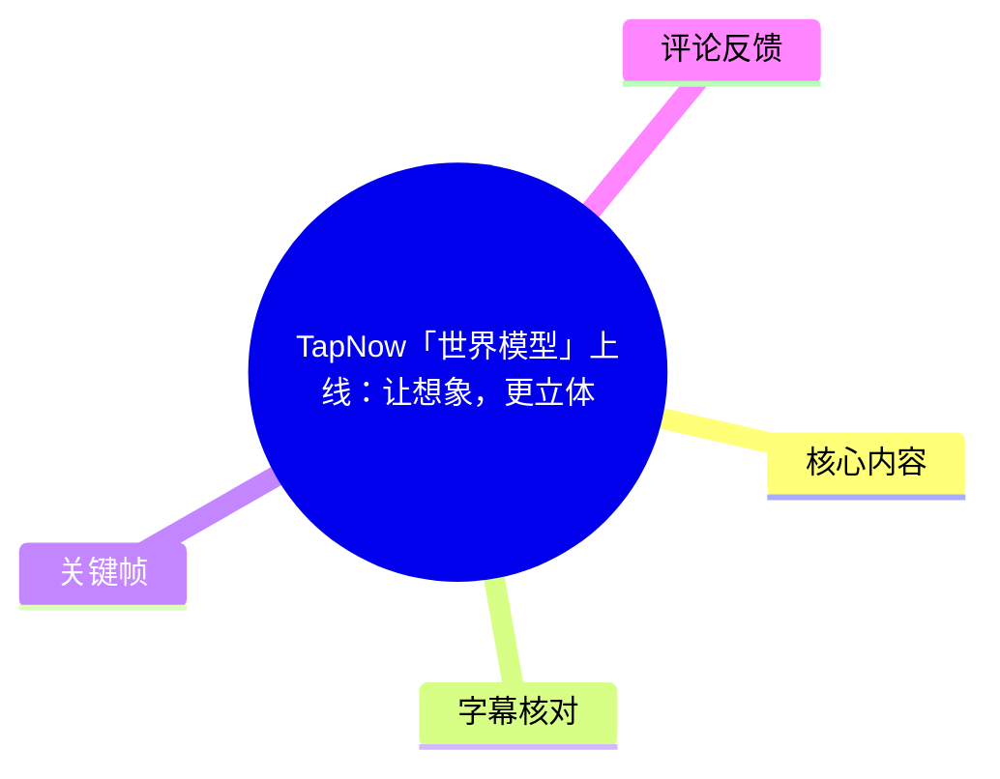
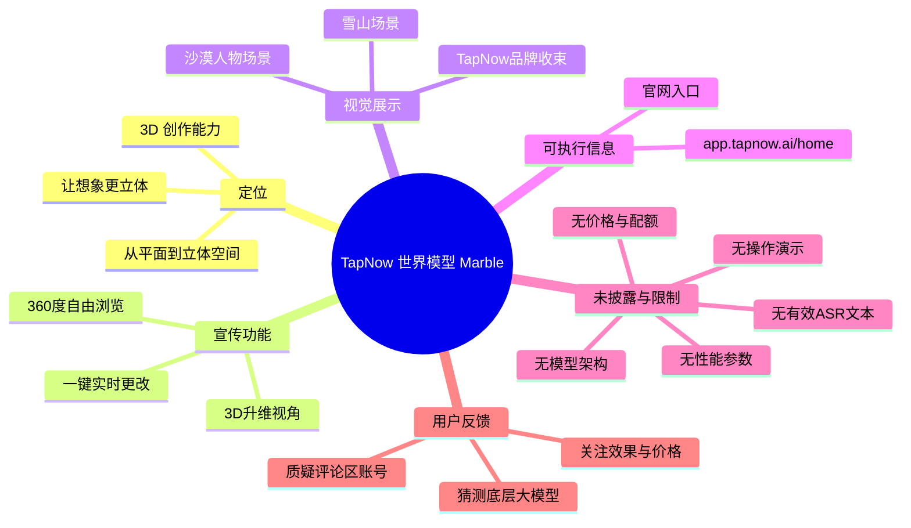

# TapNow「世界模型」上线：让想象，更立体

> 来源：[Bilibili 视频](https://www.bilibili.com/video/BV1ujdGBxECW)  
> UP 主：TapNow｜时长：53 秒｜画面规格：1920×1080｜合集：AIcode  
> 本文以视频元数据、UP 主简介、可用关键帧、已执行但未产出有效文本的 ASR，以及可获取热评前三条为依据；未在素材中出现的信息不作补充推断。

## 小结

这是 TapNow 对其“世界模型（World Model）”能力 **Marble** 的短宣传片。视频标题和简介将其定位为面向 3D 创作的能力更新，核心传播点是让内容从二维画面延展到可浏览的立体空间。

UP 主在简介中明确列出三项产品主张：**360° 自由浏览**、**3D 升维视角**、以及**一键实时更改**。其中，“告别盲盒生成”是其对可控性的宣传表述；素材并未提供操作界面、输入方式、生成时长、价格、模型架构、支持格式或实际编辑链路，因此不能将其写成已被独立验证的技术指标。

可见关键帧以雪山、沙漠人物等场景呈现空间与镜头感，末帧出现“万千宇宙 尽在 TapNow”的品牌口号。这些画面能支持“展示多种沉浸式场景”的判断，但仅凭帧图不能证明其由 Marble 生成，也不能验证是否真的支持完整的 360° 漫游、几何重建或任意视角控制。

对于 AIGC 视频创作者、视觉概念设计者及关注“世界模型”产品落地的人，这支视频的价值在于快速了解 TapNow 的产品方向；若准备实际试用，仍需进入其简介提供的 TapNow 页面确认开放状态、账户权限、使用成本、生成额度与输出版权。

该信息具有明显时效性。视频元数据发布时间为 2026 年 5 月，素材抓取于 2026 年 7 月；产品能力、入口、资费、模型版本及可用地区均可能已经变化。视频当时的互动快照为：播放 22,219、点赞 3,032、收藏 1,364、投币 24、分享 54、评论 47、弹幕 4；这些数字只代表抓取时的页面状态。

## 思维导图

## 目录

- [发布内容与时效背景](#发布内容与时效背景)
- [视频中的产品主张](#视频中的产品主张)
- [视觉叙事与关键帧](#视觉叙事与关键帧)
- [可执行步骤与已知参数](#可执行步骤与已知参数)
- [技术解读、限制与验证边界](#技术解读限制与验证边界)
- [字幕比对](#字幕比对)
- [评论分析](#评论分析)
- [处理记录](#处理记录)

## 发布内容与时效背景

### 宣传片定位与信息来源 [00:00](https://www.bilibili.com/video/BV1ujdGBxECW?t=0)

视频由 TapNow 发布，标题为“TapNow「世界模型」上线：让想象，更立体”，总时长 53 秒。标题中的“上线”表达的是产品发布或能力开放的宣传口径；但仅依据当前素材，无法确定 Marble 是全量开放、限量测试，还是仅在特定套餐或地区可用。

UP 主简介提供了这支视频最完整的文字信息：

> 世界模型 Marble 开启 3D 创作新纪元，宇宙不再是平面，想象从此拥有深度。  
> ✅ 360° 自由浏览：打破框幅限制，全方位探索每一个角落  
> ✅ 3D 升维视角：由平入深，让创意在立体空间跃然屏上  
> ✅ 一键实时更改：告别盲盒生成，画面随你心意瞬息万变  
> 创意瞬间落地，未来即刻掌握。这一刻，万千宇宙触手可及。  
> 在 TapNow 👉 https://app.tapnow.ai/home

这里的“世界模型”与“Marble”均来自 UP 主原始简介。视频素材未解释“世界模型”在该产品中具体对应哪种技术路线，例如多视角扩散、三维高斯表示、NeRF、网格生成、视频世界模拟，或其他实现方案；因此应将其作为**产品命名与营销定位**理解，而非已确认的模型技术定义。

## 视频中的产品主张

### 三项明确宣传能力 [00:00](https://www.bilibili.com/video/BV1ujdGBxECW?t=0)

视频简介集中提出了以下三项能力。下表区分“素材明确陈述”与“目前不能据此确认的内容”。

| 宣传点 | 素材中的原始表述 | 可合理理解的产品方向 | 素材未提供的验证信息 |
| --- | --- | --- | --- |
| 360° 自由浏览 | “打破框幅限制，全方位探索每一个角落” | 希望用户不局限于单一固定镜头观看场景 | 是否为完整球形全景、可转动范围、移动方式、是否支持遮挡区域补全、是否可导出全景格式 |
| 3D 升维视角 | “由平入深，让创意在立体空间跃然屏上” | 强调由二维内容走向带空间感的展示或创作 | 是否输出真实三维资产、深度图、点云、网格或仅为多视角视觉效果 |
| 一键实时更改 | “告别盲盒生成，画面随你心意瞬息万变” | 强调修改结果可快速反馈、降低生成结果不可控感 | 可改的对象、文本或图像输入方式、所谓“实时”的实际延迟、修改后的一致性与成本 |

“盲盒生成”通常是对生成式内容难以精确控制结果的非技术化描述。该视频用“一键实时更改”回应这一痛点，但没有展示任何按钮、提示词、参数面板、前后对比或编辑过程。因此，不能进一步断言其已经实现对象级编辑、局部重绘、镜头轨迹锁定、材质编辑或物理一致性保持。

### Marble 的角色：从命名到产品能力 [00:00](https://www.bilibili.com/video/BV1ujdGBxECW?t=0)

根据简介，**Marble** 是 TapNow 用于“世界模型”能力的名称。视频的语言重点不在模型训练方法，而在创作者体验：

1. 以“宇宙不再是平面”“拥有深度”描述空间化的创作结果；
2. 以“全方位探索”描述观看或探索方式；
3. 以“瞬息万变”描述修改的反馈速度；
4. 以“万千宇宙尽在 TapNow”收束为平台品牌与入口导流。

因此，更准确的阅读方式是：这是一则展示 **TapNow 希望提供沉浸式、可调整的 3D/空间内容创作体验** 的产品宣传片，而不是一份可复现实验、技术白皮书或功能说明书。

## 视觉叙事与关键帧

### 雪山场景：以空间纵深建立“世界”感 [00:00](https://www.bilibili.com/video/BV1ujdGBxECW?t=0)

> 图：该关键帧展示积雪山地、远处山脉、近处岩壁和天空形成的多层景深。它适合作为“由平入深”“探索空间”的视觉例证：画面通过明显的前景、中景和远景传递广阔场景感。  
> 价值：帮助读者理解视频为何用“世界模型”“立体空间”包装能力；但该帧本身不展示交互控件或视角操作，不能独立证明 360° 浏览功能。

雪山画面强调自然环境的尺度与纵深。对于产品宣传而言，这类高空间层次场景容易让观众联想到自由观察、镜头移动和沉浸式探索。不过，素材没有提供同一场景的连续转向、移动镜头轨迹或多视角切换证据，因此应避免将单帧视觉效果直接等同于可交互 3D 场景。

### 沙漠人物与品牌收束 [00:52](https://www.bilibili.com/video/BV1ujdGBxECW?t=52)

> 图：该关键帧是视频尾部式样的品牌收束画面：沙漠地形中有人物动作，左下角叠加“万千宇宙 尽在 TapNow”。  
> 价值：它把动态人物、地形起伏和品牌口号放在同一画面，说明视频重点是用不同题材场景传达空间创作想象，并明确导向 TapNow 平台；但没有显示 Marble 的具体操作流程。

沙漠中的人物和沙丘构成动态主体与地形背景的组合。结合标题及简介，这一类场景可被视为对“万千宇宙”概念的视觉化表达：TapNow 不只用静态风景，也用含人物动作的场景传达创作范围。但帧图没有给出人物运动质量、场景物理规律、人物身份一致性或编辑前后结果，相关效果仍无法评测。

## 可执行步骤与已知参数

### 素材允许确认的访问步骤 [00:00](https://www.bilibili.com/video/BV1ujdGBxECW?t=0)

视频简介只给出了一个明确入口：`https://app.tapnow.ai/home`。在不补充未证实操作的前提下，当前可整理的步骤只有：

1. 访问 TapNow 页面：<https://app.tapnow.ai/home>。
2. 在页面内确认是否存在名为 **Marble** 或“世界模型”的入口。
3. 进入前确认登录要求、地区限制、套餐、额度、隐私条款、素材上传规则和输出版权。
4. 若页面提供生成或编辑界面，再以当期产品文档为准设置输入内容、视角、编辑项和导出格式。

视频**没有**提供以下关键操作信息：创建项目的步骤、提示词写法、图像或视频输入规格、镜头控制方式、输出分辨率、任务耗时、重试次数、收费标准或 API 调用参数。故本文不能编写伪操作教程，也不应虚构提示词或配置项。

### 可确认参数与数据快照 [00:00](https://www.bilibili.com/video/BV1ujdGBxECW?t=0)

| 项目 | 可确认值 | 说明 |
| --- | ---: | --- |
| 视频时长 | 53 秒 | 来自视频元数据 |
| 视频分辨率 | 1920×1080 | 来自视频元数据，描述的是宣传片画面，不等于 Marble 输出规格 |
| 分 P 数 | 1 | 单段视频 |
| 发布方 | TapNow | 视频 UP 主 |
| 功能/产品名 | Marble、世界模型 | 来自标题与简介 |
| 明示入口 | `https://app.tapnow.ai/home` | 来自视频简介 |
| 播放量 | 22,219 | 抓取时页面快照，可能变化 |
| 点赞量 | 3,032 | 抓取时页面快照，可能变化 |
| 收藏量 | 1,364 | 抓取时页面快照，可能变化 |
| 评论量 | 47 | 抓取时页面快照，可能变化 |
| 弹幕量 | 4 | 抓取时页面快照，可能变化 |
| 价格、免费额度、生成速度 | 未披露 | 不能从视频或简介确认 |
| 可浏览角度、导出格式、模型版本 | 未披露 | “360°”“实时”均未给出量化定义 |

## 技术解读、限制与验证边界

### 应如何理解“世界模型”宣传 [00:00](https://www.bilibili.com/video/BV1ujdGBxECW?t=0)

从视频的文案可以提炼出三个产品诉求：**空间感、视角自由度、可编辑性**。这三者也正是面向 3D/沉浸式内容生成时用户通常关心的体验维度。

但视频没有给出技术实现，因此以下内容必须保持边界：

- **可以确认**：TapNow 宣传 Marble 面向 3D 创作，并声称具备 360° 浏览、3D 视角和一键实时更改能力。
- **不能确认**：Marble 的底层大模型、训练数据来源、世界状态是否持久化、是否有显式三维表示、是否支持真实相机位姿控制。
- **不能确认**：所谓“实时”是秒级、分钟级，还是仅指相较传统生成流程更快；视频未给出测试条件。
- **不能确认**：最终输出是否可用于专业制作工作流，例如是否支持高分辨率、透明通道、深度/法线图、USD/FBX/GLB 等格式，或是否有商用授权。
- **不能确认**：宣传画面是否全部由 Marble 生成、是否经过后期制作，或者是否为概念展示。

### 试用时建议重点验证的事项 [00:00](https://www.bilibili.com/video/BV1ujdGBxECW?t=0)

若实际获得功能入口，建议以相同输入条件测试以下项目，而不要只凭宣传片判断：

1. **视角连续性**：旋转或移动视角时，建筑、人物、地形与遮挡关系是否稳定。
2. **编辑可控性**：修改单一物体、光照或风格后，未修改区域是否保持一致。
3. **人物与动作一致性**：人物在连续视角或动作过程中是否出现肢体、服装或身份漂移。
4. **复杂场景质量**：对雪山、沙漠等大尺度地形，远景细节是否稳定，地表是否出现重复纹理或不合理结构。
5. **性能与成本**：记录实际生成/修改时间、失败率、单次消耗额度及导出限制。
6. **资产权利与数据安全**：确认上传素材是否用于训练、生成内容的商用授权范围，以及删除机制。

以上是面向实际试用的验证清单，不是视频已经展示或保证的能力。

### 时效性与风险 [00:52](https://www.bilibili.com/video/BV1ujdGBxECW?t=52)

该视频作为 53 秒的产品宣传素材，信息密度集中在卖点而非证据。使用者应注意：

- “上线”不等于所有用户均可立即使用，实际可用性需要以 TapNow 页面为准。
- 简介中的“360°”“实时”“一键”均属宣传用语，没有给出边界条件或测试数据。
- AIGC 产品的版本、计费和开放策略变化快；本文记录的发布时间、互动量和链接状态均可能失效。
- 视频未讨论版权、肖像、训练数据、内容安全或商用责任；实际生产使用前应查阅最新服务条款。
- 热评中关于与“豆包”比较、底层模型身份的说法均未被视频材料证实，不能作为采购或技术判断依据。

## 字幕比对

### 站内字幕与本次 ASR 的可用性 [00:00](https://www.bilibili.com/video/BV1ujdGBxECW?t=0)

| 字幕来源 | 完整性 | 专有名词 | 时间轴 | 主要问题 |
| --- | --- | --- | --- | --- |
| Bilibili 站内字幕 | 未提供可用字幕 | 无法核验 | 无法核验 | 素材明确标注“未提供可用站内字幕” |
| 本次 ASR 字幕 | 已执行，但未产出有效文本 | 无法从空白结果核验 | 无可用分段时间轴 | 提供的 ASR 字幕内容为空白，无法据此转写旁白或建立逐句时间线 |

最终未采用任何字幕文本作为事实依据。本篇关于产品名称、功能表述和访问入口的内容，均优先取自视频标题、UP 主简介和元数据，而非猜测旁白。

通过关键帧和上下文可校正/确认的关键写法包括：

- **TapNow**：由 UP 主名称、标题、简介链接及尾帧品牌文案共同支持。
- **Marble**：来自 UP 主简介中的“世界模型 Marble”。
- **“万千宇宙 尽在 TapNow”**：可在 `frame-002.jpg` 左下角读取。
- **360° 自由浏览、3D 升维视角、一键实时更改**：来自视频简介，非 ASR 转写。

由于 ASR 结果为空，不能把没有文字证据的语音内容补写为逐字稿；正文时间轴因此只按视频整体起点和尾部品牌帧进行保守标注。

## 评论分析

### 热评 1：关注效果、竞品比较与价格 [00:00](https://www.bilibili.com/video/BV1ujdGBxECW?t=0)

- 评论者：安东星最强肘击王
- 点赞：37
- 原文：“这个AI怎么样啊？应该要比豆包强很多吧，如果便宜的话，先弄个试一试”

这条评论反映出潜在用户最直接的决策维度：**效果是否优于已有产品**、**价格是否可接受**、以及是否值得低成本试用。评论将其与“豆包”作比较，但视频没有展示横向测试，也没有披露价格，因此“应该要比豆包强很多”仅是评论者的期待或猜测，不能视为能力结论。它恰好指出了宣传片尚未回答的两项问题：性能基准和成本。

### 热评 2：猜测底层模型 [00:00](https://www.bilibili.com/video/BV1ujdGBxECW?t=0)

- 评论者：1111独步剑客
- 点赞：36
- 原文：“他暴露了它使用的大模型[doge]”

该评论暗示评论者认为视频或画面暴露了 TapNow 所用的底层大模型，但没有给出具体模型名称、画面证据或可复核链接。结合视频素材未披露模型架构、合作方或技术栈的事实，这只能被视为玩笑式推测或社区猜测，可信度不足，不能据此认定 Marble 使用了某一特定大模型。

### 热评 3：质疑评论区账号质量 [00:00](https://www.bilibili.com/video/BV1ujdGBxECW?t=0)

- 评论者：CectDecD
- 点赞：14
- 原文：“666评论区8个人机号”

这条评论质疑评论区存在“人机号”，但没有列出被质疑的账号、识别依据或平台处理结果。它反映了部分观众对互动真实性的警惕，不提供关于 Marble 功能、价格或效果的直接补充信息。鉴于素材中没有账号行为数据，这一指控无法验证，也不应据此判断视频互动质量。

## 处理记录

- Worker ID：`worker-mrj0wbly-5dc4e50c`
- 调用模型：`gpt-5.6-terra`
- 可用素材与工具产物：视频元数据、视频简介、互动统计快照、`frames/frame-001.jpg`、`frames/frame-002.jpg`、`comments/comments.json`、站内字幕检查结果、ASR 执行产物。
- 字幕选择：站内字幕未提供可用内容；本次 ASR 已执行，但结果为空白、无有效可引用文本。因此不采用字幕转写，改以标题、简介、元数据和关键帧作为正文事实依据。
- 关键帧选择依据：
  - `frames/frame-001.jpg`：雪山具有清晰的远近空间层次，适合说明视频围绕“深度”“立体空间”的视觉表达，但不把它误作 360° 交互证据。
  - `frames/frame-002.jpg`：出现沙漠人物与“万千宇宙 尽在 TapNow”品牌文案，适合说明片尾品牌收束和平台导向。
- 评论处理范围：仅分析可获取热评前三条，未扩展至其余评论，也未将评论猜测写作事实。
- 缓存清理：素材清单未提供独立的缓存清理日志或结果；本记录不虚构已执行的清理操作。当前保留的引用仅指向任务提供的相对路径关键帧。
- 未解决问题：Marble 的实际开放状态、模型版本和架构、生成与编辑流程、收费与额度、性能指标、输出格式、版权政策、宣传画面来源，以及 ASR 未识别出有效文本的原因，均无法由现有素材确认。
