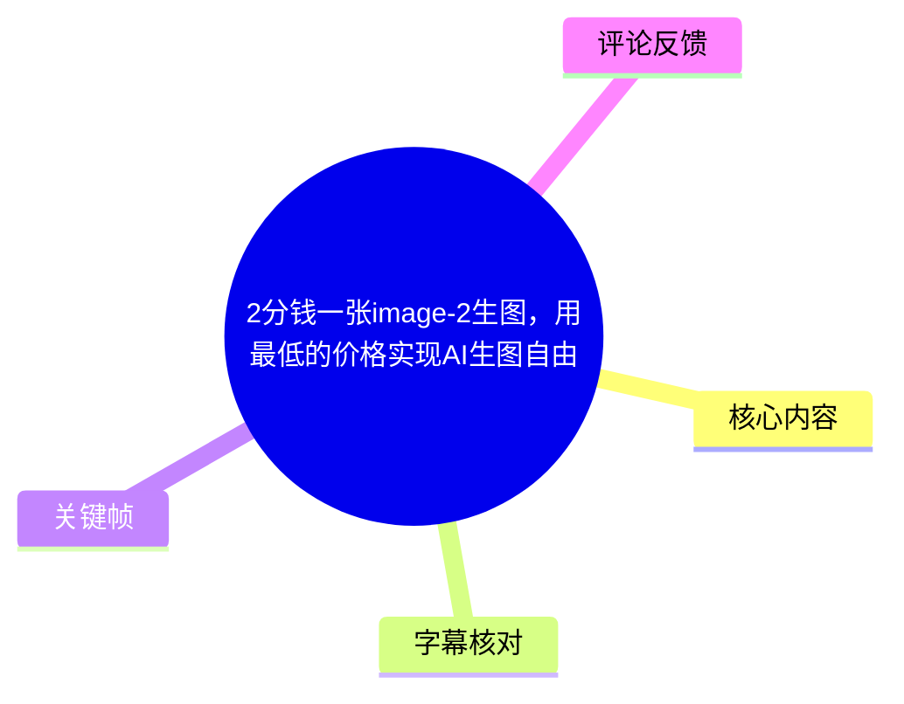
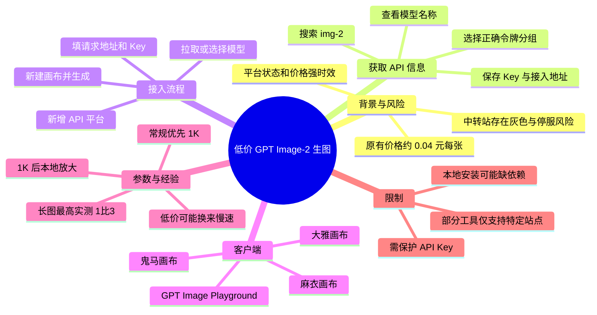
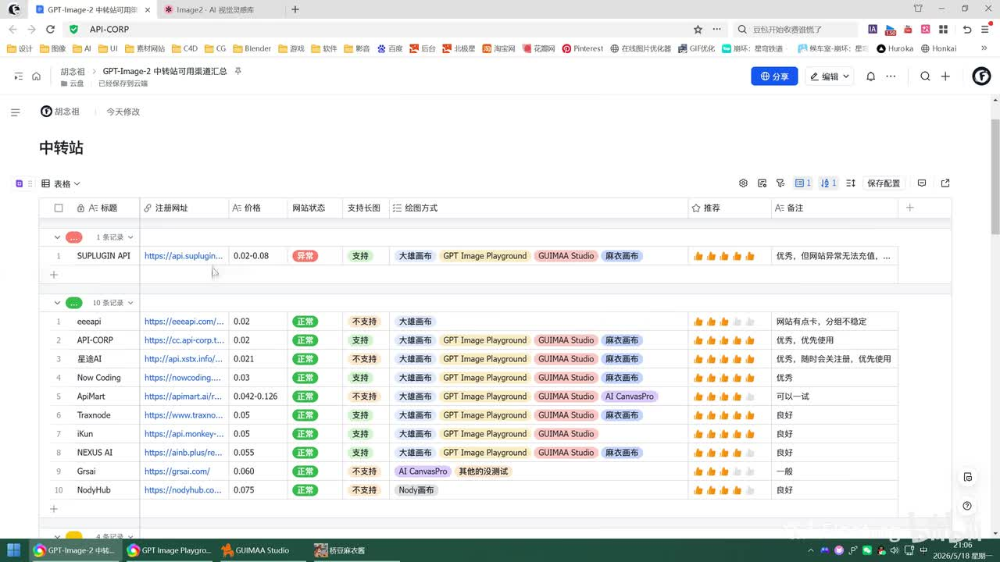
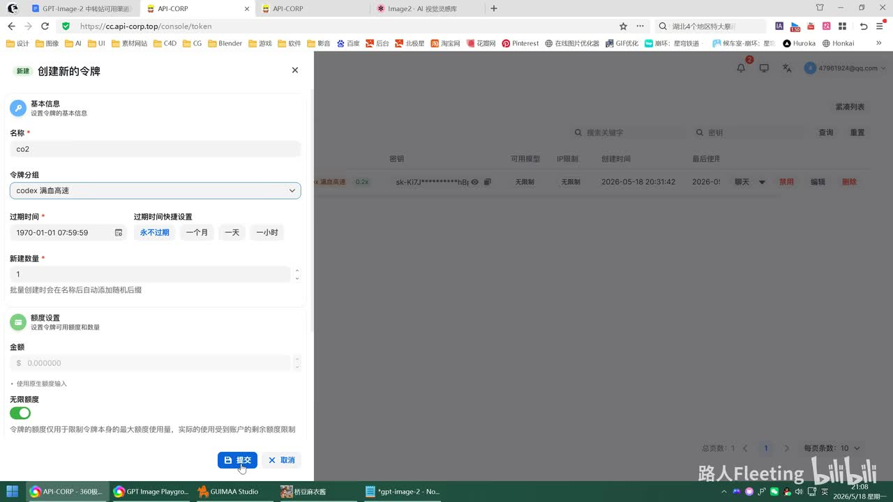
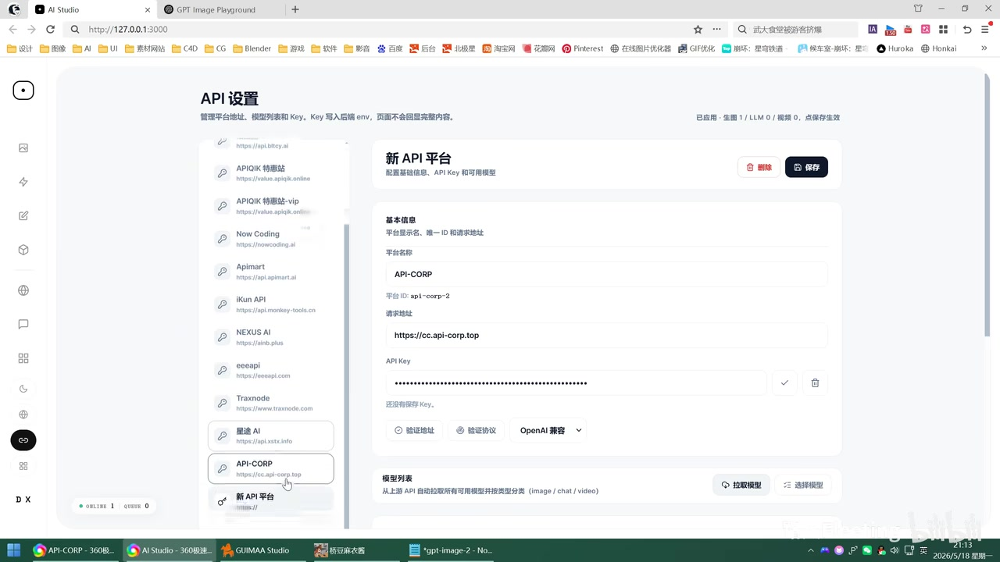
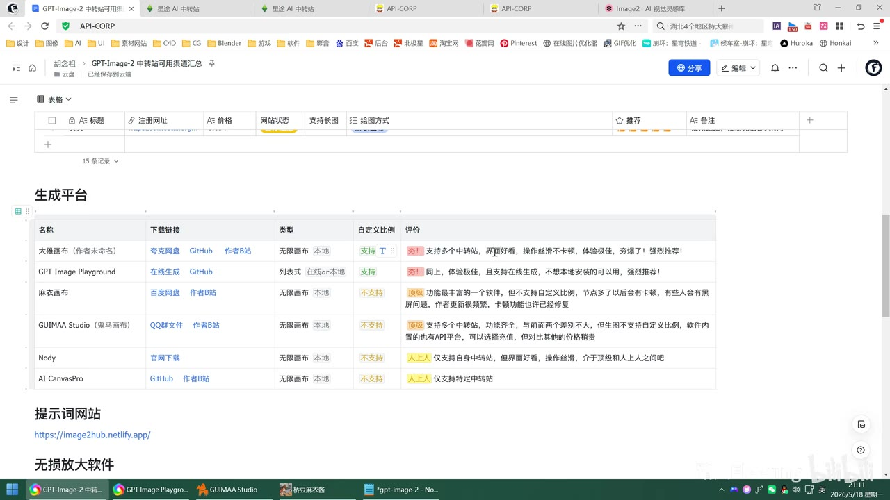

# 2分钱一张image-2生图，用最低的价格实现AI生图自由

> 来源：[Bilibili 视频](https://www.bilibili.com/video/BV12XLA6tEEv)  
> UP 主：路人Fleeting｜合集：AIcode｜标称时长：26:45  
> 注意：视频元数据包含两个分 P（P1 22:40、P2“常见问题”4:05），本次可用音频 ASR 覆盖至 P1 的 22:37；下文不对未提供字幕/音频内容的 P2 作实质性转述。

## 小结

视频讲解了一套通过第三方“中转站”API 接入 GPT Image-2（视频及画面中也写作 `image-2` / `img-2`）的低成本生图方案。作者的核心主张是：其测试表中部分平台可做到约 **0.02 元/张**，但实际操作的关键不只是拿到 API Key，而是要同时核对**模型名称、令牌分组、接入地址和 Key**；其中令牌分组填错会直接改变计费方式。

作者明确提醒，中转站属于存在合规性与经营稳定性风险的灰色领域，曾推荐的平台已有关闭或“跑路”的情况，自己也因此下架过此前两个相关视频。视频中的价格、可注册状态、充值方式、模型可用性均是强时效信息，不能据此推断当前仍然有效，更不应将其视为官方渠道或稳定的生产级服务。

工作流可概括为：在作者维护的表格中按价格、推荐等级、网站状态、长图支持情况筛选平台；注册并充值后，在模型广场搜索 `img-2`，记录模型名和计费分组；创建令牌取得 Key，并确定 API 请求地址；最后在支持自定义 API 的画布或网页客户端中配置并生成图片。

在客户端选择上，作者重点推荐一个本地安装的无限画布工具（画面表格标作“**大雅画布（作者未命名）**”）和在线的 **GPT Image Playground**，原因是二者支持多个中转站且支持自定义比例。此前介绍过的“麻衣画布”功能更多，但视频中指出其版本存在图片模型未继承全局地址的配置问题；“鬼马画布”操作方便但不支持自定义比例；另有两个工具仅兼容特定中转站，作者不建议作为通用方案。

参数层面，作者建议常规生成优先选 **1K**；2K 可自行测试；4K 在其经验中往往更慢、质量也未必更好。针对 UI、H5 宣传页和电商详情页等长图需求，视频实测到 **1:3、1024×3000**，并提示更长比例可能报错。为兼顾价格与清晰度，可先生成 1K 图，再用本地放大软件放大 2～3 倍至 4K；放大耗时取决于本机显卡性能。

## 思维导图





## 目录

- [背景：低价 API 与中转站风险](#背景低价-api-与中转站风险)
- [筛选表格与注册前检查](#筛选表格与注册前检查)
- [获取四项接入信息](#获取四项接入信息)
- [无限画布：配置 API 并生成](#无限画布配置-api-并生成)
- [尺寸、长图与速度实测](#尺寸长图与速度实测)
- [在线客户端 GPT Image Playground](#在线客户端-gpt-image-playground)
- [其他画布工具及兼容性](#其他画布工具及兼容性)
- [放大、安装与排错](#放大安装与排错)
- [限制、时效性与安全建议](#限制时效性与安全建议)
- [字幕比对](#字幕比对)
- [评论分析](#评论分析)
- [处理记录](#处理记录)

## [背景：低价 API 与中转站风险](https://www.bilibili.com/video/BV12XLA6tEEv?t=1)

### [作者为何重新整理平台](https://www.bilibili.com/video/BV12XLA6tEEv?t=1)

作者称，自己此前通过介绍 API 中转站的方式使用 GPT Image-2 生图，当时价格约为 **0.04 元/张**。但其后发现先前推荐的若干中转站已经无法继续使用，因此下架了此前两期相关视频。

这里需要区分两层信息：

1. **视频中的事实陈述**：作者认为此类中转站多数属于灰色产业，存在非法经营及经营者关闭服务、停止充值或失联的风险。
2. **由此产生的实践结论**：任何第三方渠道的余额都应视为高风险预付资金；不要因为低单价而一次性充值大量金额，也不要将其作为唯一生产依赖。

作者重新制作表格，称所列站点均由自己充值测试过，并会在视频简介中放置文档链接。其元数据简介显示，原飞书文档已不可用，链接暂时迁移至 Notion；这进一步说明资源链接、维护方式和站点状态会变化。

### [表格的筛选维度](https://www.bilibili.com/video/BV12XLA6tEEv?t=33)

作者将中转站按价格排序，也会按个人推荐度打分。画面中的表格包含以下实用字段：

- 标题与注册网址；
- 单价；
- 网站状态，例如“正常”“异常”“暂停注册”；
- 是否支持长图；
- 适配的绘图方式或客户端；
- 推荐等级与备注。



> 图：该画面直接说明作者并非只按“最低价”选站，而是同时标注状态、长图能力、客户端兼容性与主观推荐。它是理解后续“先筛选，再配置”流程的入口。画面中具体站点与状态仅代表录制时显示内容，不应视为当前可用清单。

作者建议优先挑选标注为“优秀”或“良好”的平台，并根据实际可注册、可充值和实际出图情况继续筛选。视频也提到，某些网站可能在用户拿到文档后不久便关闭注册或关闭充值；遇到这种情况可反馈给作者更新状态，但这不是服务可用性的保证。

## [获取四项接入信息](https://www.bilibili.com/video/BV12XLA6tEEv?t=93)

### [第一步：注册、余额与令牌](https://www.bilibili.com/video/BV12XLA6tEEv?t=93)

作者演示的通用入口是：

1. 通过选定中转站注册；
2. 检查钱包或余额页面；
3. 根据站点规则在线充值，或购买兑换码；
4. 进入“令牌”页面创建 Token。

作者称，部分站点注册后会赠送约 1 元或几角额度，但这是其当时观察到的常见情况，不是统一规则，更不构成保证。

### [第二步：搜索模型并确认分组](https://www.bilibili.com/video/BV12XLA6tEEv?t=120)

在创建令牌之前，作者建议先打开“模型广场”，搜索：

```text
img-2
```

视频特别提醒搜索词需要包含连字符，即 `img-2`。在演示平台中，模型价格显示为 **0.02 元**，即两分钱一张。作者强调，点击模型详情后不能只看模型名称，还必须确认其所属**分组**。

其演示中出现过类似“Codex 满血高速”“GPT 按次”等分组名称。不同站点的分组命名不同，且同一模型在不同分组下的价格与计费方式可能不同。因此，不能照抄名称；应以当前站点模型页所展示的分组和价格为准。



> 图：该关键帧呈现了创建 Token 时需要填写的名称、令牌分组、过期时间、额度等字段。它支撑了视频最重要的操作提醒：分组需要与模型页对应，否则计费可能不同。

### [第三步：保存四类信息](https://www.bilibili.com/video/BV12XLA6tEEv?t=179)

作者在不同站点重复演示后，将接入所需信息归纳为四项：

| 信息 | 用途 | 视频中的注意点 |
| --- | --- | --- |
| 模型名称 | 在客户端选择要调用的图像模型 | 多站点可能相同，但不要想当然，应从模型广场确认 |
| 令牌分组 | 决定令牌的可用模型范围与实际计费 | 创建令牌时必须选对 |
| API Key / Token | 对 API 请求鉴权 | 复制并妥善保存，不能公开展示或提交到代码仓库 |
| 接入地址 / 请求地址 | 客户端访问中转站 API 的基础地址 | 作者提示有时应去掉末尾斜杠；具体仍以客户端要求为准 |

作者在口语总结中有时将其称为“三个信息”（模型名、Key、接入地址），但前文又明确要求记住分组。实际执行时应按**四项**记录，尤其不要遗漏分组这一计费关键条件。

## [无限画布：配置 API 并生成](https://www.bilibili.com/video/BV12XLA6tEEv?t=299)

### [客户端选择与“大雅画布”](https://www.bilibili.com/video/BV12XLA6tEEv?t=299)

作者在表格的“生成平台”区列出多个客户端，并优先推荐前两个：

- 一个需本地安装、采用无限画布交互的工具。作者表示其作者未给软件命名，视频中暂称其为“**大雅画布**”；
- 在线使用的 **GPT Image Playground**。

作者认为大雅画布界面美观、操作流畅，支持节点式组织，并可添加常用节点和其他功能。其提供网盘下载、GitHub 与作者 B 站等入口；作者建议有能力者查看开源仓库，并关注作者的更新说明和问题反馈渠道。

### [新增 API 平台的配置步骤](https://www.bilibili.com/video/BV12XLA6tEEv?t=366)

以大雅画布为例，视频操作顺序为：

1. 打开 **API 设置**；
2. 点击“新增平台”；
3. 填写中转站的**请求地址**；
4. 填写 **API Key**；
5. 为便于识别，给平台起一个名称，可使用中转站名称；
6. 拉取或搜索模型；
7. 选择 `image-2` / `img-2` 对应模型；
8. 点击应用或保存。



> 图：该画面展示自定义 API 平台配置的核心字段，并显示“拉取模型”“选择模型”等操作区域。其价值在于将前文保存的接入地址、Key 与模型名对应到客户端界面。

作者为测试添加了多个 API 平台；这只是其个人测试环境，不表示用户也需要配置多个平台。初次使用应先配置一个低余额平台，确认连接和生成流程均正常后再扩展。

### [画布内生成节点](https://www.bilibili.com/video/BV12XLA6tEEv?t=432)

保存配置后，作者进入无限画布并演示：

1. 新建画布，名称可填可不填；
2. 在画布中右键，或通过顶部入口添加节点；
3. 添加“API 生成”类图片生成节点；
4. 输入提示词文本；
5. 如需图生图，添加图像输入并上传参考图；
6. 在生成节点中选择刚配置的平台与模型；
7. 选择分辨率和比例；
8. 点击生成，查看输出结果。

这套节点式工作流的优势是能保留提示词、输入图、参数与生成结果的关联，适合多轮尝试和流程复用。视频没有展示可直接复制的 API 请求代码，因此不应将画布的表单字段擅自转换为某一特定 SDK 或接口格式。

## [尺寸、长图与速度实测](https://www.bilibili.com/video/BV12XLA6tEEv?t=466)

### [分辨率与比例建议](https://www.bilibili.com/video/BV12XLA6tEEv?t=466)

作者在生成节点中给出的经验是：

- **1K**：日常优先使用，速度和成本更可控；
- **2K**：可自行测试；
- **4K**：其经验中多数情况下“不怎么好用”，可能生成更慢且质量不一定更高；
- 常用比例可以直接选，部分平台或客户端支持自定义比例；
- 并非所有中转站都支持自定义比例或长图。

这里的“1K / 2K / 4K”是视频界面中的档位称呼，并非所有平台都以同一像素规则实现。实际输出尺寸、计费和是否支持自定义宽高，应以调用方返回结果和平台文档为准。

### [长图用途与边界](https://www.bilibili.com/video/BV12XLA6tEEv?t=490)

作者以自身 UI 工作及朋友的电商需求说明长图用途，包括：

- H5 手机版宣传图；
- 电商长详情页；
- 其他需要纵向延展版式的图片。

作者在表格中标注平台是否支持长图；若某个平台不支持，应换平台测试。对于 GPT Image Playground，作者称自己实测最长为 **1:3**，再长会报错；视频进一步给出 1:3 的示例尺寸：

```text
1024 × 3000
```

平台不支持严格 1:3 时，可能会使用其支持范围内的最大长宽比输出。作者认为这种替代结果在部分场景下仍可接受，但这意味着尺寸与构图并不完全可控。

### [两次生成的耗时对比](https://www.bilibili.com/video/BV12XLA6tEEv?t=560)

作者使用收藏的提示词做 1:3 长图测试，录制中报告：

| 测试情形 | 单价陈述 | 生成耗时 | 作者结论 |
| --- | ---: | ---: | --- |
| 第一次长图生成 | 约 0.02 元/张 | 约 2 分钟 | 便宜，但速度偏慢 |
| 切换另一平台后生成 | 约 0.02 元/张 | 约 40 秒 | 更快，列为优先选择 |
| 另一平台 | 约 0.03 元/张 | 作者称速度也快 | 同样评价较高 |
| GPT Image Playground 长图示例 | 未单独说明本次单价 | 44 秒 | 体验较好 |

这些是视频录制时、特定提示词和特定站点下的单次或少量测试结果。它们不能用于推导稳定 SLA，也不能保证当前相同平台仍有相同价格与延迟。视频中 10:26 至 10:52 附近存在约 25.6 秒无语音间隔，应理解为等待生成过程，而非遗漏的技术步骤。

## [在线客户端 GPT Image Playground](https://www.bilibili.com/video/BV12XLA6tEEv?t=700)

### [适合不想本地安装的用户](https://www.bilibili.com/video/BV12XLA6tEEv?t=700)

作者指出，如果用户不希望安装本地软件，可使用在线的 **GPT Image Playground**。该网站可以在浏览器中直接打开，也可“安装成应用”，使系统桌面出现快捷方式；但本质仍是网页应用。



> 图：该画面是视频的客户端选型依据。表中将大雅画布和 GPT Image Playground 标注为支持自定义比例，而麻衣画布、GUIMAA Studio 等标作不支持；这是理解作者优先推荐前两者的关键视觉证据。

### [配置流程](https://www.bilibili.com/video/BV12XLA6tEEv?t=752)

GPT Image Playground 的配置逻辑与大雅画布一致：

1. 打开右上角“设置”；
2. 进入 API 配置；
3. 新建配置；
4. 填写配置名称；
5. 填接入地址与 API Key；
6. 检查模型名称。作者称部分情况下系统会预填，模型名不一致时应回到中转站模型广场复制；
7. 保存并关闭设置；
8. 粘贴提示词，选择分辨率和比例，点击生成。

作者称该平台也支持自定义比例，可直接选择常见比例，或在提示中表达期望比例。其 1:3 测试输出被描述为 1024×3000，生成结果实际比例则显示为 5:11；这表明平台可能对请求比例进行适配或裁切，使用前应检查最终像素尺寸而非只看下拉选项。

## [其他画布工具及兼容性](https://www.bilibili.com/video/BV12XLA6tEEv?t=874)

### [麻衣画布：功能多，但要检查图片模型地址](https://www.bilibili.com/video/BV12XLA6tEEv?t=874)

作者称此前已介绍过“麻衣画布”，并认为其功能最多，包括大量节点、局部重绘、智能高清、全球视角、视频、音乐与分镜等能力，对视频创作也较有价值。

但视频指出其当前版本存在配置问题：下方图片模型可能**无法继承全局设置中的接入地址**。若用 image-2 生图，操作上不能只填全局地址和 Key，还要：

1. 进入图片模型设置；
2. 找到 image-2；
3. 单独检查并填写其接入地址；
4. 执行连接测试；
5. 确认显示“连接成功”后再生成。

作者还建议选择异步方式，再设置每次生成张数并运行。该问题是其录制时所见版本行为，后续更新可能已修复或改变。

### [鬼马画布：易用但缺少自定义比例](https://www.bilibili.com/video/BV12XLA6tEEv?t=996)

作者评价“鬼马画布”生成记录的视觉效果不错、操作方便，但它**不支持自定义比例**，只提供若干预设比例，因此不适合严格要求超长图的任务。

视频给出的操作为：在 API 设置中填入地址和 Key，清空原有模型后拉取模型，再于“添加节点 → 图片生成”中选择拉取到的 GPT Image 系列模型。作者未继续做完整演示。

### [不建议作为通用方案的工具](https://www.bilibili.com/video/BV12XLA6tEEv?t=1042)

作者提到表格下方还有两个软件，但一般不推荐使用，原因是它们只支持特定中转站，无法任意填写自定义 API 地址。视频举例其中一个价格为约 **0.042 元/张**，但没有提供可验证的完整兼容规则。

对用户而言，这里的可迁移原则是：如果要在多个站点之间切换、应对停服和价格变化，应优先选择能够填写**自定义接入地址、Key 并拉取模型**的客户端；只绑定少数服务商的客户端会降低替换空间。

## [放大、安装与排错](https://www.bilibili.com/video/BV12XLA6tEEv?t=1089)

### [先 1K 生成，再本地放大](https://www.bilibili.com/video/BV12XLA6tEEv?t=1089)

作者最后推荐一个无损放大软件，并在文档中提供软件、网盘和官网链接；其中特别提醒打开官网时关闭代理。视频未给出软件的明确名称，因此不在此补写。

作者演示的建议流程：

1. 先生成 1K 图片，以获得更快出图；
2. 把图片拖入放大软件；
3. 根据图像类型选模型：
   - 插画：选“数字艺术”；
   - 其他类型：可选“标准”或“高保真”；
4. 选择放大倍数，通常建议 **2～3 倍**；
5. 演示中选择 **2 倍**，将 1K 图放大为 4K 图；
6. 等待处理完成，在输出位置查看结果。

作者称放大速度取决于电脑显卡，显卡越好越快。这一策略的前提是放大模型确实适合图像内容；它可提高像素量和主观清晰度，但不能保证补全生成阶段本不存在的正确细节。

### [本地无限画布安装与依赖排错](https://www.bilibili.com/video/BV12XLA6tEEv?t=1182)

对于大雅画布，作者提示安装可能遇到依赖缺失或无法启动的问题。视频给出的排错路线是：

1. 从作者提供的网盘下载文件夹；
2. 按修改时间排序，选择当时最新的无限画布版本；
3. 解压或放到本地目录；
4. 若能正常运行，按说明双击“启动服务”；
5. 若无法打开，可使用已有的 Codex、Cloud Code 等工具，或腾讯的 WorkBuddy（作者口语称“小龙虾”）协助检查；
6. 在工具中打开本地工作空间，将项目目录和“启动服务”批处理文件提供给工具；
7. 让工具检查能否运行；若提示缺依赖，则根据其说明安装依赖后重试。

这不是对任何 AI 编程工具均有效的通用修复承诺。运行来源不明的批处理文件、安装依赖或授予工具本地目录访问权限前，应先核查代码来源、文件内容和权限范围。

## [限制、时效性与安全建议](https://www.bilibili.com/video/BV12XLA6tEEv?t=1316)

### [本视频方案的适用范围](https://www.bilibili.com/video/BV12XLA6tEEv?t=1316)

该方案适合希望以较低成本测试 API 生图、愿意自行比较多家第三方服务、能够处理客户端配置和临时故障的用户。它尤其适用于：

- 需要反复试验提示词的个人创作；
- 需要生成 H5 视觉稿、电商详情页等长图的设计探索；
- 希望用画布节点保存生成流程的用户；
- 能接受站点、价格、速度不断变化的人。

不适合以下情况：

- 对合规、数据处理、可用性 SLA 或发票有严格要求的企业生产任务；
- 不能承担余额损失、突然停服或账号不可用风险的用户；
- 需要严格 4K 输出、精确固定比例或稳定批量产能的场景；
- 不愿在本地安装软件、处理依赖、配置 API 或保护密钥的用户。

### [必须持续复核的信息](https://www.bilibili.com/video/BV12XLA6tEEv?t=1340)

作者请观众在发现站点无法注册时反馈，以便更新文档状态。这恰好说明如下数据均具有时效性：

- 0.02 元/张、0.03 元/张等价格；
- 新用户赠送额度；
- 注册、充值和兑换码规则；
- 站点是否“正常”；
- 模型、分组、请求地址和客户端兼容性；
- 软件下载链接及依赖安装方式。

建议在实际付费前执行最小验证：

1. 只充值最小金额；
2. 创建权限和额度受控、可随时撤销的 Key；
3. 用低成本提示词生成一张图；
4. 检查实际扣费、延迟、分辨率和水印/内容限制；
5. 确认长图、自定义比例和图生图是否符合需求；
6. 保存配置，但不在截图、公开文档、Git 仓库或聊天记录中泄露 Key；
7. 若服务不可用，优先撤销 Key 并停止充值，而非继续尝试更大额付款。

## [字幕比对](https://www.bilibili.com/video/BV12XLA6tEEv?t=1)

| 字幕来源 | 完整性 | 专有名词 | 时间轴 | 主要问题 |
| --- | --- | --- | --- | --- |
| Bilibili 站内字幕 `p01-ai-zh.srt` | 严重不完整且内容不对应，仅覆盖 00:00～01:02 | 与视频主题无关 | 时间轴格式有效，但不能用于本视频知识整理 | 内容为“无法改变现状，那就享受当下”等鸡汤文案，与 API 生图讲解完全不匹配 |
| 本次 ASR（medium） | 覆盖 1.22～1357.39 秒，语音覆盖率 84.22%，与 P1 22:40 基本一致 | 有不少听写误差，但可结合上下文校正 | 具有逐段真实起止时间，可用于章节链接 | “中转站/中软站”“API Key”“image-2”等存在错字、混淆；等待出图处有无语音间隔 |

### 字幕采用结论

本次整理**不采用站内字幕正文**，原因是其内容与视频明显不匹配；采用带时间戳的本次 ASR 作为时间轴依据，并结合关键帧、元数据标题、画面表格和上下文对专有名词进行谨慎校正。

重要校正如下：

| ASR 识别形式 | 本文采用写法 | 校正依据 |
| --- | --- | --- |
| “中软站”“中轿站”“重转站” | 中转站 | 标题、上下文与行业语义 |
| “1M2”“IMG2” | image-2 / img-2 | 视频标题、搜索步骤及关键帧网页标签 |
| “API-K” | API Key | 配置界面与技术语境 |
| “无线画布” | 无限画布 | 画布式工作流的常用称呼；原 ASR 此处存在同音误识 |
| “大雄画布”“大雹画布” | 大雅画布（视频中暂称） | 作者说明“作者叫大雅、软件未写名称” |
| “workbody” | WorkBuddy | 作者口述“腾讯的小龙虾”后的英文名称，保留大小写作为名称转写 |

ASR 诊断中**未标记 `noAudioStream=true`**，且识别到中文语音、语言置信度为 0.9941，因此可确认源素材存在可用音轨；站内字幕失配并非无音轨所致。由于本次没有提供 P2“常见问题”的独立字幕、ASR 或关键帧，本文不扩写该分 P 内容。

## [评论分析](https://www.bilibili.com/video/BV12XLA6tEEv?t=1316)

以下仅分析可获取的热评前三条。评论属于用户经验、推荐或宣传信息，未经独立验证，不能视为当前价格、功能或安全性的事实。

1. **道空上君（25 赞）**  
   评论称“1K 现在已经无限免费畅用”，但 4K 渠道更隐蔽，较大的几家已关闭注册，4K 价格已接近 1 元/张。  
   - **补充价值**：与视频“平台和价格变化快”的风险提示一致，提出 1K 与 4K 的供给差异。  
   - **可信度边界**：未提供平台、时间、计费规则、地区或验证方式；“无限免费”“接近 1 元”均不能外推为普遍现状。

2. **hhhhxxxxoff（29 赞）**  
   推荐开源客户端 [Image-Studio](https://github.com/RoseKhlifa/Image-Studio)，称可用于本地生图。  
   - **补充价值**：为视频列出的画布/网页工具之外提供一个开源客户端方向。  
   - **可信度边界**：评论没有说明它是否兼容视频讨论的中转站、自定义 API、image-2、长图或图生图，也未说明安装要求。使用前应查看项目文档、许可证、更新频率和安全性。

3. **Cook_Sleep（22 赞）**  
   评论称 GPT Image Playground v0.4.0 已支持 Agent 模式、自主多轮出图、上下文参考、联网搜索生成简报图，甚至可制作 PPT。  
   - **补充价值**：若评论准确，说明该平台在视频录制后可能新增 Agent 与多轮工作流能力。  
   - **可信度边界**：这是一条带有产品推广性质的功能声明，未给出版本发布记录或操作证据；并且评论所述功能不代表本视频已实际演示或验证。

## [处理记录](https://www.bilibili.com/video/BV12XLA6tEEv?t=1)

- **Worker ID**：worker-mrj0www4-e8d79408
- **模型**：gpt-5.6-terra
- **工具与素材**：使用任务提供的视频元数据、关键帧清单、4 张可见关键帧、Bilibili 站内 SRT、ASR `transcript.srt`、ASR 分段诊断结果及热评 JSON；未调用外部站点验证中转站、软件链接或评论中的产品功能。
- **字幕选择**：已检查站内字幕与本次 ASR。站内 `p01-ai-zh.srt` 与视频内容明显失配，仅覆盖前 62 秒；最终以本次 ASR 的真实分段时间作为时间轴基础，并通过关键帧与上下文校正术语。ASR 未标记 `noAudioStream=true`，实际有音轨。
- **关键帧选择依据**：选用 `frames/frame-001.jpg` 解释站点筛选表；`frames/frame-002.jpg` 解释令牌分组；`frames/frame-003.jpg` 解释客户端能力对照；`frames/frame-004.jpg` 解释 API 地址、Key 和模型配置。所选图均直接承载正文中的配置或筛选信息。
- **缓存清理**：未提供可执行的缓存清理日志或清理接口；本次仅基于任务已提供的素材进行整理，未声明已删除任何源文件或缓存。
- **未解决问题**：
  - 未提供 P2“常见问题”的可用转写或关键帧，无法可靠整理其内容；
  - 中转站的实际合法性、当前价格、可注册性、余额安全与服务质量均未作外部验证；
  - 视频中若干软件、站点和放大工具名称受 ASR 错识或未明确展示影响，本文只保留素材能够支持的名称与结论。

## 评论分析

- 热评 1：1k现在已经无限免费畅用了(知道的人还是不要太多的好)[doge]现在都在求4k的渠道，都很隐蔽，比较大的那几家已经关闭注册了[doge]还有几个都是小的，用户量很小，但依旧是达不到之前两分钱还是四分钱一张了，基本上都是快1快一张4k[doge]
- 热评 2：推荐一下这个开源的客户端 本地生图https://github.com/RoseKhlifa/Image-Studio
- 热评 3：感谢推荐！GPT Image Playground v0.4.0 已支持Agent模式，支持自主多轮出图、上下文参考、搜索互联网并生成简报图…… 甚至是制作 PPT！（虽然并不针对此用例优化），欢迎大家体验

以上内容是观众反馈摘录，只用于补充理解视频反响，不作为正文事实依据。
