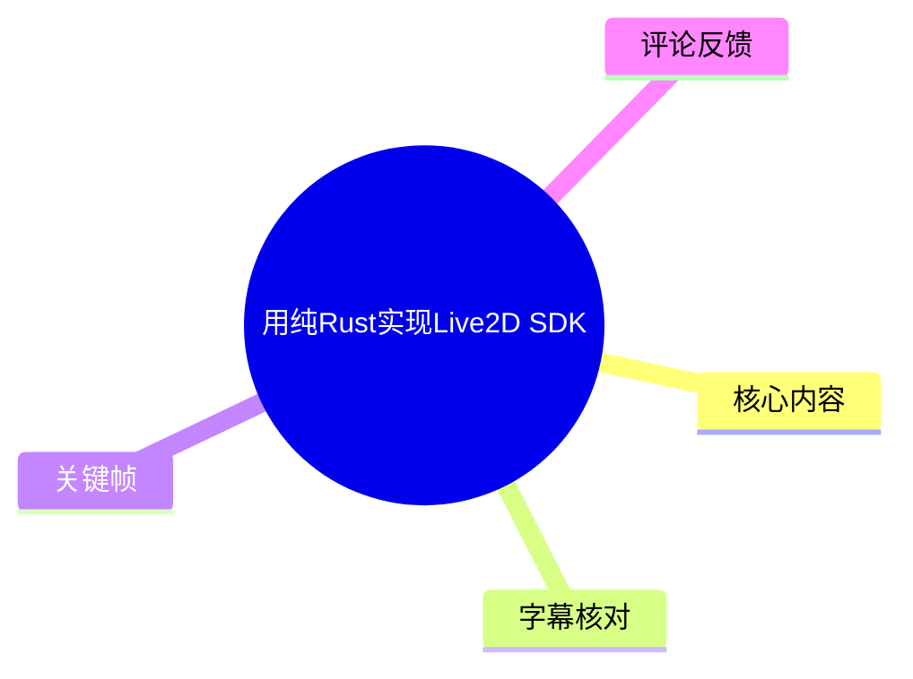
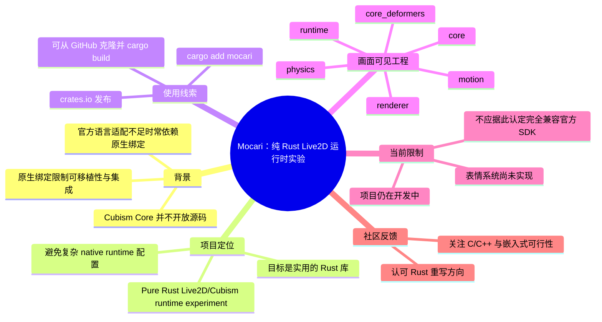
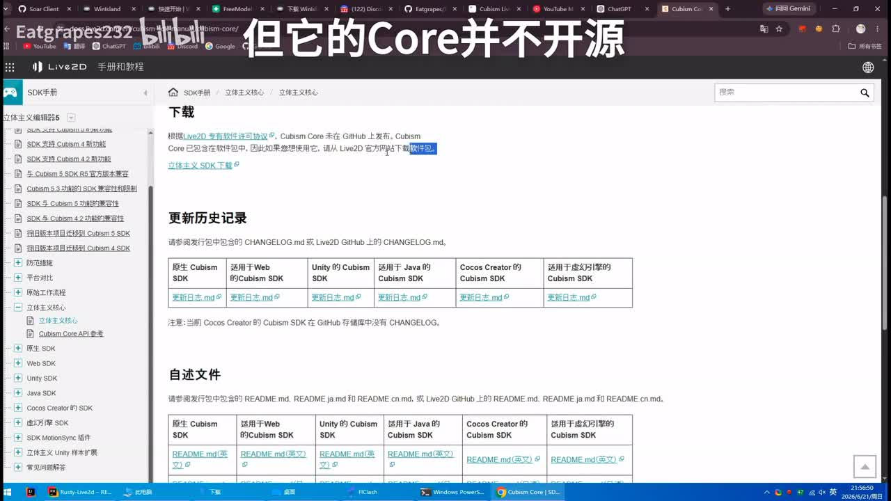
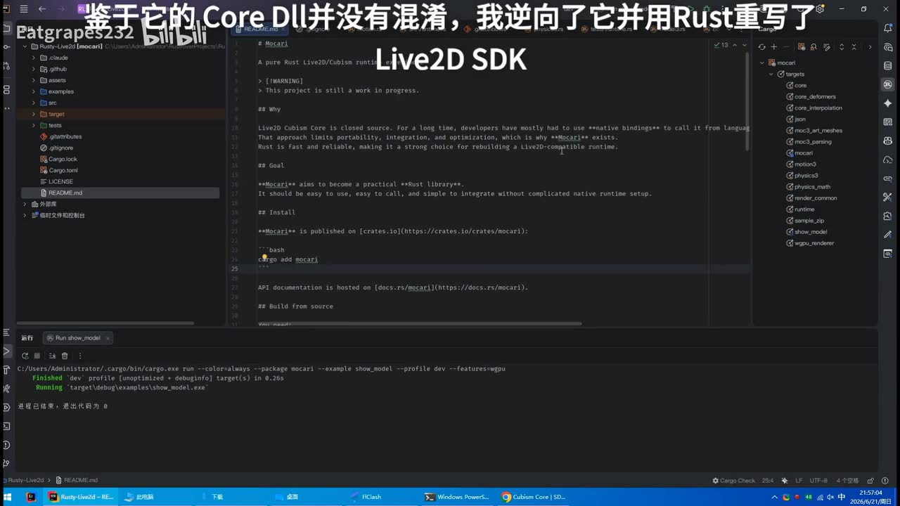
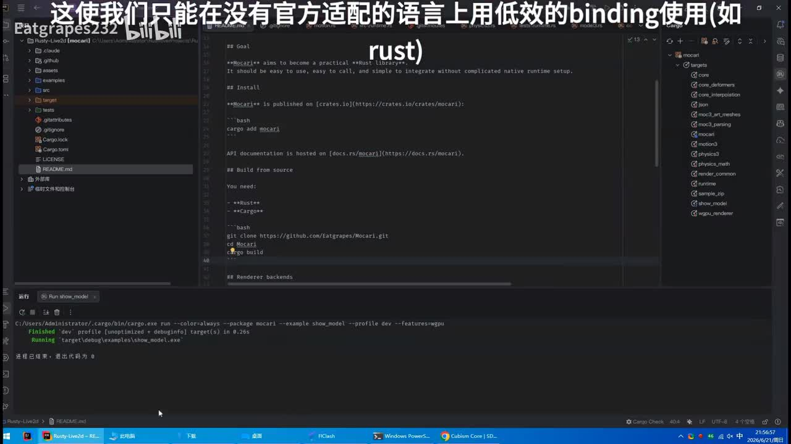
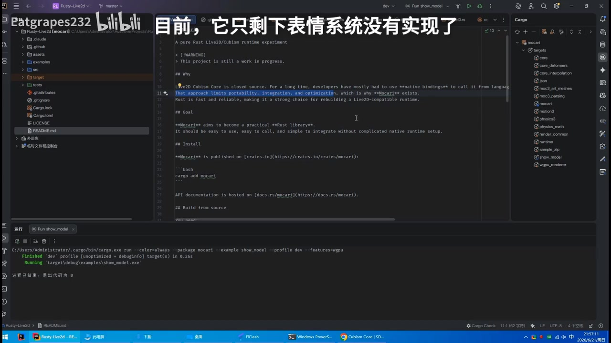

# 用纯Rust实现Live2D SDK

> 来源：[Bilibili 视频](https://www.bilibili.com/video/BV1bwj863Edz)<br>
> UP 主：Eatgrapes232｜合集：AIcode｜视频时长：78 秒<br>
> 视频简介仓库：[Eatgrapes/Mocari](https://github.com/Eatgrapes/Mocari)｜项目说明：开发中，欢迎贡献和 Star；项目与 Cubism 公司无任何关系。  
> 资料抓取时间：2026-07-15｜发布时间以元数据 `pubdate` 为准（2026-06-21）

## 小结

视频展示了作者正在开发的 **Mocari**：一个以 Rust 实现的 Live2D／Cubism 运行时实验项目。作者的核心动机是，Live2D Cubism Core 并非开源；在缺乏官方语言适配的情况下，开发者通常需要通过 native binding（原生绑定）调用 Core，这会对可移植性、集成方式和优化空间形成约束。

从画面中的项目 README 可见，Mocari 的目标是成为一个“实用的 Rust 库”，强调易用、易调用，并避免复杂的 native runtime（原生运行时）配置。README 还显示项目已发布至 crates.io，可通过 `cargo add mocari` 安装；也给出了从源码构建的 Git 克隆与 `cargo build` 路径。

这不是一个宣称已完整替代官方 SDK 的成品演示。画面明确标注项目仍在进行中（work in progress），并特别说明：**表情系统尚未实现**。因此，视频更适合关注 Rust 图形运行时、Live2D 兼容层、跨平台部署或希望参与开源实现的开发者作为项目进展参考，而不宜直接将其视为功能完备、生产就绪的 Cubism SDK 替代方案。

视频没有提供可用的站内字幕；本次 ASR 也没有识别出任何语音片段。因而本文的事实整理主要依据视频中可见的中文大字说明、README、IDE 工程树、命令行输出、视频简介及元数据；未从画面中能够确认的 API 细节、格式兼容范围、渲染性能、授权边界和平台支持情况均不作推断。

时效上，这是一段约 78 秒的开发进度展示，仓库状态与功能完成度可能在发布后快速变化。尤其是“未实现表情系统”的结论仅反映视频录制时画面所示状态，实际使用前应以仓库当前 README、Release 和源码为准。

## 思维导图





## 目录

- [项目背景：Cubism Core 未开源](#项目背景cubism-core-未开源-000000)
- [Mocari 的定位与已展示能力](#mocari-的定位与已展示能力-000000)
- [安装、源码构建与运行演示](#安装源码构建与运行演示-000000)
- [工程结构与实现范围](#工程结构与实现范围-000000)
- [限制、适用边界与时效性](#限制适用边界与时效性-000000)
- [关键帧索引](#关键帧索引)
- [字幕比对](#字幕比对)
- [评论分析](#评论分析)
- [处理记录](#处理记录)

## 项目背景：Cubism Core 未开源 [00:00](https://www.bilibili.com/video/BV1bwj863Edz?t=0)

> **时间轴说明：**素材未提供站内 SRT，ASR 结果也没有任何有效语音分段及起止时间。为满足可跳转性，本篇各章节统一链接至视频起点 `t=0`，不将关键帧文件顺序伪造成真实时间戳。

视频开篇画面展示 Live2D SDK 手册的下载页面，并以大字强调“**但它的 Core 并不开源**”。页面正文可辨识出与 Cubism Core 相关的说明，视频要表达的背景是：SDK 生态中虽有不同平台或语言的 SDK 入口，但其底层 Core 并非以源码形式开放。



> 图：该帧同时呈现 Live2D SDK 手册下载页和“但它的 Core 并不开源”的叠加文字，是理解项目动机的直接画面证据：作者针对的是 Core 闭源带来的依赖与集成问题，而非泛泛地重写一个 2D 渲染工具。

随后 README 画面中的英文说明写明：长期以来，开发者主要需要使用 **native bindings** 从其他语言调用 Live2D Cubism Core；该方式会限制 portability（可移植性）、integration（集成）与 optimization（优化），这也是 Mocari 存在的原因。这里应区分两层信息：

- **视频画面直接陈述**：Cubism Core 是 closed source；Mocari 希望减少对复杂原生运行时配置的依赖。
- **可作出的有限理解**：项目试图提供 Rust 侧的运行时实现路径。
- **不能由视频确认的内容**：是否已在所有 Cubism 文件格式、所有版本模型、所有目标平台上达到官方 SDK 的等价兼容性。

## Mocari 的定位与已展示能力 [00:00](https://www.bilibili.com/video/BV1bwj863Edz?t=0)

视频在 IDE 的 README 页面中展示项目标题：

> `Mocari`  
> `A pure Rust Live2D/Cubism runtime experiment`

对应的中文大字说明为“**鉴于它的 Core DLL 并没有混淆，我逆向了它并用 Rust 重写了 Live2D SDK**”。这是作者对项目来源与路线的自述。基于该自述和 README，可确认其定位为 Rust 运行时实验；但“重写 Live2D SDK”不应自动扩展解释为对官方全部 SDK 功能、工具链或授权体系的完全替代。



> 图：该帧可见 “A pure Rust Live2D/Cubism runtime experiment”、`[WARNING] This project is still a work in progress.`、Why/Goal/Install 等 README 结构，是项目定位与成熟度判断的核心依据。

README 的目标段落可辨识为：

- Mocari aims to become a practical Rust library；
- 应当易于使用、易于调用；
- 可集成时不需要复杂的 native runtime setup。

这组目标体现的是工程集成诉求，而非视频中已经量化展示的性能指标。视频未展示帧率、CPU/GPU 占用、内存、模型加载耗时、与官方 Core 的测试对比或格式兼容测试，因此不能据此比较性能优劣。

### 视频可确认的运行结果

IDE 下方终端展示了示例运行的命令与结果。画面中可辨识的命令包含：

```bash
cargo run --color=always --package mocari --example show_model --profile dev --features wgpu
```

终端后续显示：

```text
Finished `dev` profile [unoptimized + debuginfo] target(s) in 0.26s
Running `target\debug\examples\show_model.exe`
```

最后出现“进程已结束，退出代码为 0”。这说明在该录制环境中，名为 `show_model` 的示例曾成功完成一次开发配置下的构建和启动/退出过程；不过画面没有完整展示模型窗口、渲染输出或交互过程，不能把“退出代码为 0”进一步视为所有模型渲染、动作、物理或交互功能均已通过验证。

## 安装、源码构建与运行演示 [00:00](https://www.bilibili.com/video/BV1bwj863Edz?t=0)

README 画面给出了两条获取路径：通过 crates.io 安装，或从 GitHub 源码构建。

### 1. 通过 Cargo 添加依赖

README 的 Install 部分显示：

```bash
cargo add mocari
```

这意味着作者在录制时将 Mocari 作为 crates.io 包提供。视频画面还显示 API 文档托管在 docs.rs 的 `mocari` 页面，但未展示具体版本号、最低 Rust 版本（MSRV）、features 列表或 API 签名；集成时应到当前 crates.io / docs.rs 页面核验。

### 2. 从源码构建

README 中可见：

```bash
git clone https://github.com/Eatgrapes/Mocari.git
cd Mocari
cargo build
```

项目简介也给出了同一仓库地址：[github.com/Eatgrapes/Mocari](https://github.com/Eatgrapes/Mocari)。



> 图：该帧左侧 README 显示 `cargo add mocari` 与源码构建命令，底部终端显示 `show_model` 示例的完成状态。它将“可安装/可构建”的文档说明与一次实际录制环境中的命令结果对应起来。

### 3. 运行示例时的可见参数

视频中实际可辨识到的示例运行参数如下：

| 参数/字段 | 画面含义 | 可确认范围 |
| --- | --- | --- |
| `--package mocari` | 指定 Cargo 包为 `mocari` | 已在终端命令中出现 |
| `--example show_model` | 运行名为 `show_model` 的示例 | 已在终端命令中出现 |
| `--profile dev` | 使用开发配置 | 已在终端命令中出现 |
| `--features wgpu` | 启用 `wgpu` feature | 已在终端命令中出现 |
| `target\debug\examples\show_model.exe` | Windows 环境生成/执行的目标文件路径 | 仅能说明录制环境表现为 Windows 路径 |

`--features wgpu` 表明视频中的该次示例运行显式选择了 `wgpu` 功能特性，但视频没有展示其依赖版本、支持的图形后端、是否存在其他 renderer feature、平台矩阵或回退策略，不能补充为未出现的配置结论。

## 工程结构与实现范围 [00:00](https://www.bilibili.com/video/BV1bwj863Edz?t=0)

IDE 工程树中可见仓库的常规文件和目录，包括 `.github`、`assets`、`examples`、`src`、`tests`、`Cargo.lock`、`Cargo.toml`、`LICENSE` 与 `README.md`。右侧 Cargo 结构树中能辨识出多个模块/目标名称，例如：

- `core`
- `core_deformers`
- `core_json`
- `core_part_meshes`
- `moc3`
- `moc3_parsing`
- `motion`
- `motion3`
- `physics`
- `physics3`
- `physics_math`
- `renderer`
- `runtime`
- `sample_zip`
- `show_model`
- `wgpu_renderer`

这些名称表明项目目录中至少划分了 Core、MOC3 解析、动作、物理、渲染与运行时等方向的代码组织。注意：模块名只能说明代码组织或构建目标的可见存在，**不能单独证明**每个模块已完整实现、通过测试或达成对官方格式的完全兼容。



> 图：该帧的右侧 Cargo 树展示了 `moc3`、`motion`、`physics`、`renderer`、`runtime`、`wgpu_renderer` 等模块名称；该信息有助于理解项目覆盖的技术方向，但不足以据此推断具体算法或兼容程度。

### 当前明确缺失：表情系统

视频后段大字说明为：“**目前，它只剩下表情系统没有实现了**”。这是视频关于完成度最具体的声明。


> 图：画面叠字直接指出表情系统未实现。该帧的价值在于为“当前限制”提供明确证据，避免将工程目录中的其他模块误读为项目功能已经全面完备。

在技术决策上，这意味着：

1. 若目标模型或业务流程依赖表情切换/表情参数系统，需要先确认仓库后续版本是否已经补齐。
2. 即使模型能加载、动作或物理模块名称存在，也不能从本视频推导表情相关数据会被正确解析、驱动或渲染。
3. 若要贡献，应优先查看项目 Issue、分支、测试和表情相关数据格式处理，而不是仅根据短视频判断任务边界。

## 限制、适用边界与时效性 [00:00](https://www.bilibili.com/video/BV1bwj863Edz?t=0)

### 视频和项目明确给出的限制

- README 可见警告：`This project is still a work in progress.`（项目仍在进行中）。
- 视频明确称表情系统尚未实现。
- UP 主在视频简介中说明项目“开发中，欢迎贡献和 star”。
- UP 主在简介中明确声明：**本项目与 Cubism 公司无任何关系**。

### 资料不足而不能确认的问题

下列项目均未在提供的字幕、画面或元数据中得到充分证实：

| 问题 | 本视频可否确认 | 原因 |
| --- | --- | --- |
| 对 Cubism 各版本文件的兼容范围 | 否 | 未展示兼容性列表、测试集或版本说明 |
| MOC3、动作、物理数据的完整支持度 | 否 | 仅见模块名称，未见功能验收 |
| 表情系统以外的功能是否全部完成 | 不宜确认 | 作者的口头/画面概述不能代替逐项测试 |
| 与官方 SDK 的性能对比 | 否 | 未展示基准数据 |
| 跨平台支持情况 | 否 | 录制画面仅可见 Windows 路径 |
| C/C++ 导出或 FFI 使用方式 | 否 | 未展示相关 API、构建产物或文档 |
| ESP32 等嵌入式平台可行性 | 否 | 视频没有相关演示或资源数据 |
| 授权、逆向边界与商业可用性 | 否 | 仅有“与 Cubism 公司无关”的免责声明，不构成法律意见 |

### 使用建议

若计划评估或接入 Mocari，建议按以下顺序进行，而非直接依据短视频上线：

1. 打开仓库当前 README、Cargo.toml、Release 和 Issue，确认最新维护状态。
2. 使用目标 Rust 工具链运行 `cargo build`，并根据文档配置 renderer feature。
3. 使用自身的 `.moc3`、动作、物理、表情资源建立最小回归用例。
4. 对比目标平台上的渲染正确性、资源加载失败处理、内存与性能。
5. 对涉及官方格式、逆向实现、发行和商业使用的事项，独立核验许可证与法律合规要求。

## 关键帧索引

| 关键帧 | 正文用途 | 画面价值 |
| --- | --- | --- |
|  | 背景与动机 | 显示 Live2D SDK 手册下载页及“Core 并不开源”，支撑项目问题定义。 |
|  | 安装与运行 | 同时可见 `cargo add mocari`、源码构建步骤及 `show_model` 命令运行结果。 |
|  | 项目定位 | 可见“pure Rust Live2D/Cubism runtime experiment”和 WIP 警告。 |
|  | 工程范围与限制 | 可见工程模块树，并显示“表情系统没有实现”的状态提示。 |

> 未使用其余关键帧：提供的文字素材未给出各帧对应时间，且当前正文所选帧已经覆盖项目背景、定位、安装/构建、模块结构与明确限制；为避免重复插图或从未核验画面中推断信息，未强行引用其余帧。

## 字幕比对

| 字幕来源 | 完整性 | 专有名词 | 时间轴 | 主要问题 |
| --- | --- | --- | --- | --- |
| Bilibili 站内字幕 | 不可用 | 无法评估 | 无可用 SRT 分段 | 素材明确说明未提供可用站内字幕。 |
| 本次 ASR 字幕 | 为空，0 个语音分段 | 无法识别 | 无有效分段时间 | ASR 使用 `medium` 模型、自动语言检测为 `en`（置信度约 0.541），但未识别到任何 speech segment；诊断警告提示需核验音频是否有可识别语音。 |

### 最终字幕选择与校正方法

本次没有可采用的文本字幕：

- **站内字幕**：未提供可用字幕。
- **本次 ASR**：结果为空；`segments` 为空、语音覆盖率为 0、无首末语音时间。  
- **音轨判断**：ASR 诊断中**没有**标记 `noAudioStream=true`。因此不能说源视频“没有音轨”；只能如实表述为：本次音频处理产物存在，但 ASR 没有识别出可用语音内容。

正文改用以下可核验来源整理：

1. 视频关键帧中的大字说明；
2. 视频画面内 README、Cargo 工程树与终端文本；
3. 视频简介中的仓库与免责声明；
4. Bilibili 元数据中的标题、时长、作者和互动数据。

已通过画面校正并保留原写法的关键术语包括：`Mocari`、`Live2D/Cubism`、`native bindings`、`cargo add mocari`、`show_model`、`wgpu`、`moc3`、`physics3`、`wgpu_renderer`。这些术语来自画面可见文本，不来自 ASR 转写。

## 评论分析

以下仅处理本次可获取的热评前三条。评论反映的是用户态度、需求或猜测，不作为项目能力已经得到验证的证据。

| 热评 | 点赞 | 观点与补充 | 可信度/边界 |
| --- | ---: | --- | --- |
| 不死の祥云：“真rust重写一切啊” | 6 | 对用 Rust 重写 Live2D 运行时的方向表达认可，也呼应视频标题中的“纯 Rust”。 | 属于感叹式评价，没有新增技术细节。 |
| 神人ミケ拉：“LGBTR牛逼（Linux GNU Bash Tmux Rust）” | 4 | 以缩写玩笑表达对 Linux、GNU、Bash、Tmux、Rust 工具链文化的认同。 | 不涉及 Mocari 的兼容性、性能或实际部署事实。 |
| 雪琳Sherlyn：“这玩意能转成C/C++吗？如果可以的话，我想办法把这玩意应用到ESP32S31上边” | 9 | 提出两个潜在应用问题：是否能面向 C/C++ 使用，以及是否能用于 ESP32 类嵌入式目标。 | 这是需求与疑问，不是已验证结论；视频没有展示 C/C++ FFI、静态库导出、交叉编译或 ESP32 支持。“ESP32S31”按评论原文保留，具体型号/拼写未作校正。 |

评论区的共同信号是：受众不仅关注“Rust 重写”本身，也在意跨语言复用与资源受限设备部署。但这些方向都超出视频已展示的证据范围，后续应通过仓库文档、构建目标和实机测试确认。

## 处理记录

- **Worker ID**：`worker-mrj0wbly-5dc4e50c`
- **模型**：`gpt-5.6-terra`
- **素材处理工具/产物**：
  - 视频合并文件：`merged.mp4`
  - 音频产物：`audio/audio.wav`
  - 关键帧目录：`frames/`
  - ASR 产物：`asr/transcript.srt`、`asr/asr-transcript.txt`、`asr/asr-result.json`
  - 评论产物：`comments/comments.json`
  - ASR 配置：`medium`、CUDA、`float16`、自动语言检测
- **字幕选择**：未采用站内字幕（无可用文件）；本次 ASR 已检查但输出为空，故不将其作为正文转写来源。内容以关键帧多模态阅读、视频简介和元数据为依据。
- **时间轴依据**：没有站内 SRT 时间段；ASR 无有效 segment 与时间戳。章节链接统一回到 `t=0`，明确不以关键帧编号或文字出现顺序猜测实际秒数。
- **关键帧选择依据**：选取 `frame-001` 至 `frame-004`，分别覆盖 Core 闭源背景、README 安装/构建、项目定位/WIP 警告、工程模块与表情系统未实现；均与正文中的可核验结论直接对应。
- **缓存清理**：提供的素材清单未包含缓存清理执行日志；本文不虚构清理结果。已仅引用给定的相对路径素材，不新增外部下载文件。
- **未解决问题**：
  - 视频是否含有可供人工听辨的语音、为何 ASR 为零覆盖，无法仅凭诊断确定；
  - Mocari 当前版本、发布版本号、MSRV、许可证和 API 文档细节未在素材中给出；
  - 功能完整度、文件格式兼容性、渲染效果、性能、跨平台能力、C/C++ FFI 与嵌入式支持均未获得视频证据。
