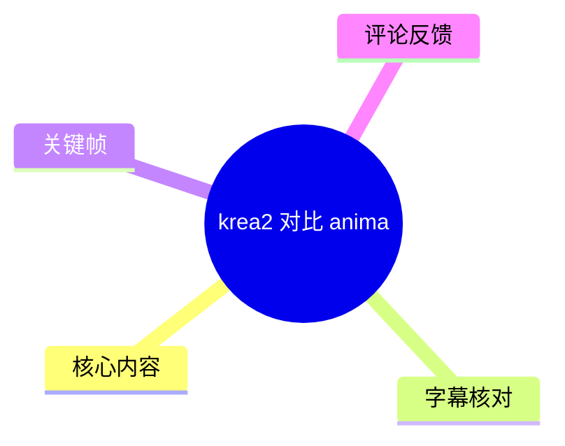
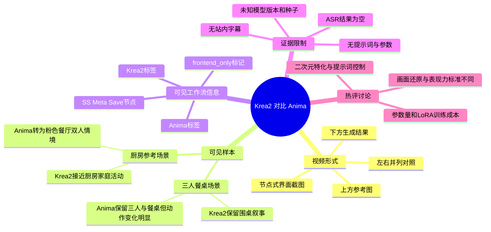
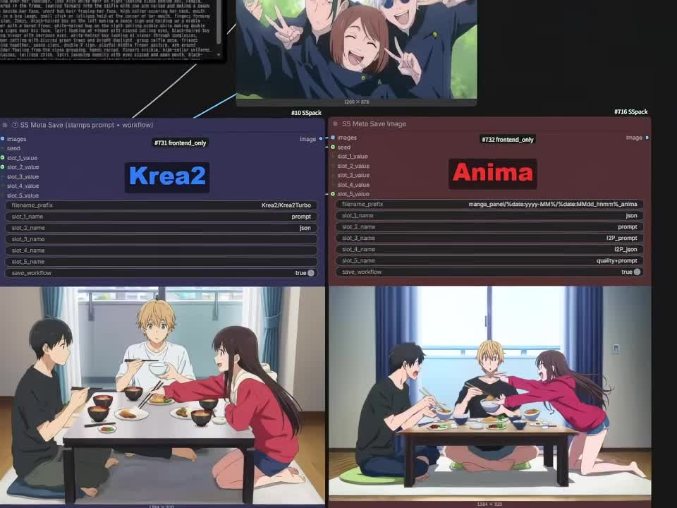
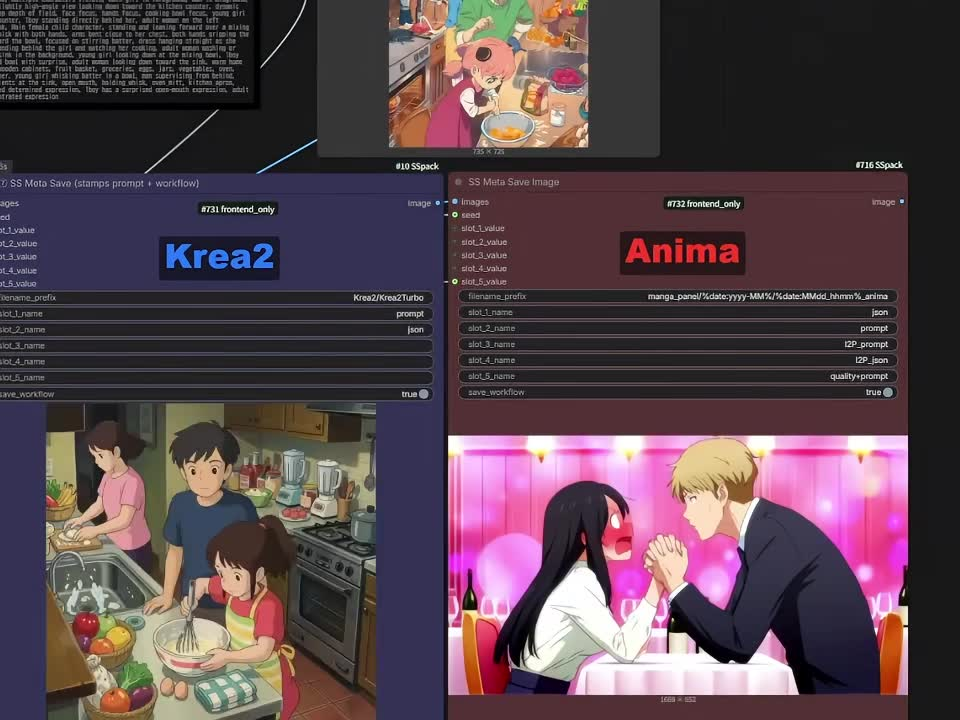

# krea2 对比 anima

> 来源：[Bilibili 视频](https://www.bilibili.com/video/BV1xr7a6jEcp) 
> UP 主：青龙圣者｜合集：AIcode｜视频时长：1 分 07 秒｜画面尺寸：960×720 
> 视频描述仅为“krea2 对比 anima”，未提供进一步测试说明、提示词或参数表。

## 小结

视频以左右并列的方式，对比标注为 **Krea2**（左）与 **Anima**（右）的两组动漫风格图像生成结果。画面上方为参考图，下方为各模型对应的输出；中间可见类似节点式图像工作流界面及保存节点，说明视频重点是展示同类输入下的视觉结果差异，而非讲解完整操作流程。

第一组对比中，参考图为三名角色的合照。Krea2 输出保留了三人围桌用餐的场景与人物数量；Anima 输出同样保留三人和餐桌，但人物动作、构图及姿态变化较明显。第二组中，参考图为厨房场景，Krea2 输出仍接近厨房家庭活动的叙事；Anima 输出则转化为粉色餐厅内两人相对的夸张动漫情境。就这两帧可见样本而言，二者对原图的“人物/场景/叙事”保留侧重点并不相同。

视频没有提供可用站内字幕，本次 ASR 已执行，但产物为空，因而无法据此还原作者口播、提示词、模型版本、采样器、步数、CFG、分辨率、随机种子或运行硬件。本文的事实性整理仅依据元数据、两张关键帧和可获取热评，不将观众评价或画面观感写成已验证的模型性能结论。

对二次元图像生成、参考图重绘或模型选型感兴趣的读者可将本视频视作一个非常短的视觉案例。若要据此做实际选型，仍需补齐统一提示词、种子、尺寸、工作流、模型版本及多组测试样本；尤其不能仅凭两张输出推导泛化能力、可控性、微调成本或生态成熟度。

时效性方面，视频元数据发布时间为 2026 年 6 月，模型版本、在线服务能力、价格、授权规则及社区工作流可能已发生变化。视频本身未明确 Krea2、Anima 的具体版本或发布渠道，因此所有结论应限定在该视频展示时点及其可见样本范围内。

## 思维导图

## 目录

- [视频背景与证据边界](#视频背景与证据边界)
- [可见对比一：三人餐桌场景](#可见对比一三人餐桌场景)
- [可见对比二：厨房参考图的改写差异](#可见对比二厨房参考图的改写差异)
- [界面、步骤与参数：视频实际提供了什么](#界面步骤与参数视频实际提供了什么)
- [经验、结论与限制](#经验结论与限制)
- [字幕比对](#字幕比对)
- [评论分析](#评论分析)
- [处理记录](#处理记录)

## 视频背景与证据边界 [00:00](https://www.bilibili.com/video/BV1xr7a6jEcp?t=0)

视频标题直接点明主题为“Krea2 对比 anima”，画面采取固定的左右对照布局：

- 左侧明确标注 **Krea2**；
- 右侧明确标注 **Anima**；
- 每一组画面顶部放置一张较小的动漫参考图；
- 下方分别展示两个模型的图像结果；
- 两侧生成区域上方均可见带有 `SS Meta Save` 字样的界面模块，且附近存在 `frontend_only` 标签。

因此，能够确认的是：视频展示了两组 Krea2 与 Anima 的并排结果。不能确认的是两侧是否使用完全一致的文本提示词、图生图强度、随机种子、采样配置、后处理流程或模型版本。即使上方参考图相同，也不能仅从截图证明其他变量完全受控。

视频总时长仅 67 秒，且没有可解析的口播文本。本整理不会补写作者未说出的测试标准，例如“谁绝对更强”“哪一方一定更忠实”或“某模型参数量是多少”。

## 可见对比一：三人餐桌场景 [00:00](https://www.bilibili.com/video/BV1xr7a6jEcp?t=0)

第一张关键帧的上方参考图是一张三位角色合照：中间角色闭眼微笑，两侧人物靠近镜头并作出较活跃的姿势。下方则是两侧模型输出。

> 图：该关键帧直接呈现本视频的核心证据——同一组画面中标注为 Krea2 和 Anima 的左右输出。它适合用来观察两者对于人物数量、室内餐桌场景和角色姿态的可见保留程度，但不能单独证明提示词或推理参数一致。

### 画面中可直接观察到的结果

| 观察维度 | Krea2（左） | Anima（右） | 可确认范围 |
| --- | --- | --- | --- |
| 人物数量 | 可见三名人物 | 可见三名人物 | 两侧均保留三人关系 |
| 主场景 | 室内低桌用餐 | 室内低桌用餐 | 两侧均生成了餐桌情境 |
| 人物位置 | 三人分布在低桌周围 | 三人亦围绕低桌，但位置与姿势不同 | 均非对参考合照的逐像素复刻 |
| 中间人物姿态 | 坐在桌边，手持餐具/碗具的视觉叙事较突出 | 以盘坐或低坐姿态处于画面中央 | 姿态存在明显改写 |
| 右侧人物动作 | 右侧长发角色前倾伸手 | 右侧长发角色同样前伸，但身体姿态变化更大 | 可见动作语义有部分延续 |

从这个样本看，Krea2 的输出把参考图中的三人关系转换为较日常的餐桌用餐画面；Anima 也保留了三人和低桌，但重新组织了人物姿势。这里的“保留”是针对可见的主体数量和场景语义，不等同于面部、服饰、镜头角度或动作的严格还原。

### 不应从该帧直接推出的结论

- 不能断言 Krea2 在所有动漫人物参考图中都更擅长保留角色；
- 不能断言 Anima 的构图偏移一定更大，因为未见更多种子和测试集；
- 无法确认两边是否使用了同一文本提示词及相同图生图权重；
- 看不到完整的原始输出尺寸、生成耗时和放大/修复步骤；
- 上方参考图尺寸标记虽可见为 `1200 × 675`，但下方输出区域的精确分辨率、裁切方式和是否二次处理无法由截图可靠确认。

## 可见对比二：厨房参考图的改写差异 [00:33](https://www.bilibili.com/video/BV1xr7a6jEcp?t=33)

第二张关键帧上方参考图为厨房场景：一名成年人站在水槽附近，前景中有两名儿童/少年角色，台面、水槽、食材和烹饪器具共同构成家庭厨房环境。左右输出的叙事走向差异比第一组更明显。

> 图：该帧的价值在于，它展示了在厨房参考图条件下，两侧输出对“原始场景语义”的不同取舍：左侧仍呈现厨房活动，右侧则成为粉色餐厅中的双人对坐画面。它是讨论场景保持与风格化改写差异的主要视觉依据。

### Krea2 一侧的可见表现

Krea2 输出维持在厨房室内：画面可见水槽、台面、锅具或厨具、食材，以及多个人物。其人物组成和具体动作并非对参考图的原样复制，但整体仍可被识别为家庭厨房中的食物准备场景。

在本例中，可以谨慎描述为：**Krea2 输出较多地延续了参考图的厨房环境与家庭活动语义。** 这一描述仅对应画面语义层面的连续性，不涉及模型整体能力排名。

### Anima 一侧的可见表现

Anima 输出显示为高饱和粉色背景的餐厅/约会式场景，画面核心是黑发女性与金发男性相对而坐、握手或相互靠近。该输出中已不见参考图中清晰的厨房结构、成人与儿童组合及料理准备叙事。

从可见图像可以确认：该样本中的 Anima 结果发生了较大的场景和人物关系改写。至于这种改写来自模型自身倾向、提示词权重、工作流差异、参考强度设置或其他处理，视频没有提供足够信息，不能归因。

### 两组样本合看时的正确读法

两组对比都显示，模型输出并非对参考图的机械复制，而是围绕若干可见视觉元素进行重构。适用于此视频的阅读框架是：

1. 先看是否保留人物数量、室内/厨房/餐桌等高层语义；
2. 再看人物动作、表情、镜头与场景细节是否被改写；
3. 将“符合自己的创作目标”与“画面还原度更高”分开判断；
4. 对没有公布的推理条件保持保留，不把单帧结果推广为稳定规律。

## 界面、步骤与参数：视频实际提供了什么 [00:00](https://www.bilibili.com/video/BV1xr7a6jEcp?t=0)

### 可见界面信息

两张关键帧中都可见紫色与红褐色的节点式区域，分别与 Krea2、Anima 标识对应。可辨认的信息包括：

- 左侧模型区域显示 `Krea2`；
- 右侧模型区域显示 `Anima`；
- 两侧均有 `SS Meta Save` / `SS Meta Save Image` 类似的保存节点标题；
- 节点上存在 `images`、`seed`、`slot_1_value`、`slot_2_value` 等字段；
- 部分节点上方可见 `frontend_only`；
- Krea2 一侧字段中能看到与 `Krea2/Krea2Turbo` 相关的文字；
- Anima 一侧字段中可见 `prompt`、`l2p_prompt`、`quality_prompt` 等字段名称或相近字样；
- 两侧均可见 `save_workflow`，并显示为 `true`。

以上只能说明截图里存在保存元信息/工作流的节点与若干字段，**不能**可靠还原完整工作流，也不能断定字段的具体赋值、模型加载路径或所有节点连接关系。

### 视频可复现流程：仅能整理到的最小步骤

依据画面，可整理出的操作逻辑仅为：

1. 准备一张动漫参考图；
2. 在并列的 Krea2 与 Anima 工作流/配置区域中分别执行生成；
3. 保存或展示两边的结果；
4. 以左右并列方式进行肉眼比较；
5. 再以另一张参考图重复展示结果。

视频未显示足以复现的完整节点图、输入提示词、负面提示词、图生图强度、控制条件或推理命令。因此以下常见参数均为**缺失信息**，不能补全：

| 参数或条件 | 视频是否提供 | 说明 |
| --- | --- | --- |
| 模型精确版本/发布日期 | 否 | 仅可见 Krea2、Anima 名称及 Krea2/Krea2Turbo 相关字样 |
| 提示词全文 | 否 | 仅可见 `prompt`、`l2p_prompt` 等字段名 |
| 负面提示词 | 否 | 未见可读取的具体内容 |
| 随机种子 | 不可确认 | 虽可见 `seed` 字段，数值不可可靠辨认 |
| 采样器、步数、CFG | 否 | 未展示或文字不可读 |
| 图生图去噪强度 | 否 | 未展示 |
| 输出分辨率 | 不完整 | 上方参考图可见 `1200 × 675`；输出精确尺寸不能确认 |
| 硬件、显存、耗时 | 否 | 无法比较成本和速度 |
| LoRA、ControlNet、后处理 | 否 | 无法确认是否使用 |

### 对实践者的建议

若要把本视频的对比思路变成可检验测试，应在同一测试表中固定以下变量：

1. 使用同一参考图，并保留原始文件与输入尺寸；
2. 记录每一侧实际使用的模型版本和工作流版本；
3. 明确是纯文生图、图生图、参考图适配，还是额外控制网络；
4. 对齐输出尺寸、采样器、步数、CFG、去噪强度与随机种子；若无法对齐，需说明原因；
5. 同时记录正向/负向提示词及其权重写法；
6. 用多张不同题材图片测试人物、场景、动作、表情、复杂构图和文字元素；
7. 将“角色一致性”“原图构图保留”“场景保留”“审美风格”“提示词服从性”“速度/显存”等拆分评分，而不是用单一“好看”概括。

这些是对视频展示形式的可迁移测试建议，不是视频中已经展示完成的操作参数。

## 经验、结论与限制 [01:00](https://www.bilibili.com/video/BV1xr7a6jEcp?t=60)

### 可迁移经验

- **先定义比较标准。** 对参考图任务而言，“更好”至少可能指角色外观还原、动作还原、场景保留、情绪表现、构图美观或风格特化；这些标准相互之间可能冲突。
- **并列图有助于发现差异，但不足以解释原因。** 本视频的两组画面清楚展示了结果差异，尤其第二组的厨房场景改写；但未披露推理条件，不能把差异直接归因于模型本体。
- **单案例适合提出假设，不适合直接排名。** 视频可作为进一步测试的起点：例如测试某一模型是否在特定参考图条件下更易保留厨房语义；该假设仍需扩展样本验证。
- **保存工作流是可复现性的基础。** 画面中 `save_workflow: true` 的可见设置提示了保留工作流的重要性。真正有价值的模型比较应同时保存输入、工作流、版本、种子和输出。

### 本视频范围内的结论

1. 视频展示了 Krea2 与 Anima 的两组并列生成结果；
2. 第一组中，两侧均生成三人围桌场景，但人物姿势和画面组织不同；
3. 第二组中，Krea2 一侧仍明显呈现厨房家庭活动，Anima 一侧呈现粉色双人餐厅情境；
4. 视频没有提供足够的技术参数，不能严格判定结果差异是否完全由模型能力造成；
5. 不能从本视频确认 Krea2 或 Anima 的通用优劣、实际参数量、训练成本、显存要求或 LoRA 适配能力。

### 时效性与风险

- 元数据对应的发布时间在 2026 年 6 月，AI 模型与在线工具更新频繁，后续版本表现可能不同；
- 视频未标示 Krea2、Anima 的精确版本，旧版与新版结果不应混为一谈；
- 热评中涉及“12B 参数”“LoRA 训练成本”等说法均是评论者观点，未由视频或元数据证实；
- 画面可能经过提示词、尺寸、工作流或后处理调整；缺乏公开配置时，不宜用于严肃基准结论；
- 当前素材没有可用口播转录，作者对于“比较目标”和“结果解释”的原意无法核验。

## 字幕比对 [00:00](https://www.bilibili.com/video/BV1xr7a6jEcp?t=0)

| 字幕来源 | 完整性 | 专有名词 | 时间轴 | 主要问题 |
| --- | --- | --- | --- | --- |
| Bilibili 站内字幕 | 无可用字幕 | 无法核验 | 无 | 素材明确标注“未提供可用站内字幕” |
| 本次 ASR 字幕 | 已执行，但结果为空 | 无可用识别结果 | 无 | ASR 字幕内容为空，无法转写或校正口播 |

最终未采用任何字幕文本作为正文事实来源。本次 ASR 已按要求执行，但未产出可用文本；站内字幕也不存在可供对照的内容。

本整理中的专有名词校正主要来自关键帧可见文字与视频标题：

- `Krea2`：关键帧左侧大标题及节点字段附近可见相关文字；
- `Anima`：关键帧右侧大标题；
- `SS Meta Save` / `SS Meta Save Image`：节点标题可见，但因画面清晰度限制，保留为界面可见文字而不推导其实现细节；
- `prompt`、`l2p_prompt`、`quality_prompt`：仅作为截图中可辨识的字段名记录，不补充字段语义或具体内容。

## 评论分析 [00:00](https://www.bilibili.com/video/BV1xr7a6jEcp?t=0)

以下仅处理当前可获取的热评前三条。评论反映的是用户经验与偏好，不构成已经验证的技术事实。

### 1. PopeStoken（51 赞）

> “为啥都觉得左边好……论画面还原度和表现力以及服从性是右边好吧？左边不管原画面表情神态多么夸张，一直都是平淡脸……”

**观点概括：** 评论者不同意“左边更好”的潜在观感，认为右侧在画面还原、表现力与服从性上更有优势，并指出左侧人物表情相对平淡。

**与视频画面的关系：** 该评论将评价重点放在表情神态和表现力，与视频展示的两组人物图像有关。但视频未披露提示词和控制条件，无法验证“服从性”是否确由模型差异造成。

**可信度边界：** 这是基于主观视觉判断的有效讨论角度，提醒观看者不要仅以场景是否保留来判断优劣；但“右边更好”不具普遍性，需要量化标准和更多样本支持。

### 2. kongbai---空白（46 赞）

> “krea2更全能但不适合动漫。单纯二次元动漫还是Anima……krea2的12B参数有些太大了……Lora训练对于显存需求太高不利于生态发展……”

**观点概括：** 评论者认为 Krea2 更偏全能、Anima 更适合纯二次元需求；同时提出标签与权重控制、画师/角色直出、模型参数量、LoRA 训练成本、显存门槛及社区生态等问题。

**提供的补充信息：**
- 倡导将自然语言提示词与标签、权重提示词作为不同控制方式比较；
- 指出二次元用户可能需要画师风格、角色与特定概念的生态支持；
- 认为大模型参数量可能提高 LoRA 训练难度与显存成本，从而影响社区生态。

**可信度边界：** 这是一条信息密度较高的经验性评论，但视频本身没有验证 Krea2 的“12B 参数”、两模型具体提示词语法、训练难度或实际显存占用。上述内容应作为待检索、待实测的选型假设，而非本视频能够证明的结论。

### 3. 鸣濑白羽酱（14 赞）

> “这么一看anima是真厉害，在低参数量下，居然达到了这么好的效果。krea2这个，微调成本应该很高吧，硬件受限的情况下，社区生态很难发展起来。”

**观点概括：** 评论者认可 Anima 的可见效果，并从假定的低参数量出发，担忧 Krea2 的微调成本与硬件门槛会限制生态发展。

**与前一条评论的关系：** 该评论延续了“参数量—微调成本—社区生态”的讨论，但没有独立给出数据或来源。

**可信度边界：** “低参数量”“微调成本高”“生态难发展”均未由视频实证，且模型训练与微调成本还会受架构、量化、训练方法、数据规模、批量大小及工具链影响。因此可将其视作用户购买/部署决策中的关注点，不应直接据此断定任一模型的客观成本。

## 处理记录 [00:00](https://www.bilibili.com/video/BV1xr7a6jEcp?t=0)

- **Worker ID**：`worker-mrj0wbly-5dc4e50c`
- **模型**：`gpt-5.6-terra`
- **任务素材**：视频元数据、素材清单、2 张关键帧、站内字幕状态、已执行的 ASR 结果、可获取热评 3 条。
- **调用工具与产物**：素材已提供 `merged.mp4`、`audio/audio.wav`、`frames/`、`info.json`、`comments/comments.json`、`subtitles/`、`asr/` 等输出；本文依据任务提供的可见内容整理，未获得可用字幕正文或完整工作流配置。
- **字幕选择**：站内字幕未提供可用内容；本次 ASR 已执行但字幕结果为空。故不采用字幕转录，改以关键帧可见文字、元数据与评论进行事实边界明确的整理。
- **关键帧选择依据**：
  - `frames/frame-001.jpg`：展示三人参考图及 Krea2/Anima 的第一组左右餐桌输出，适合说明人物数量、餐桌场景和动作构图差异；
  - `frames/frame-002.jpg`：展示厨房参考图与两侧明显不同的结果，适合说明场景语义延续和大幅改写的可见差异。
- **关键帧使用原则**：只描述画面可直接识别的模型标签、场景、人物关系及界面字段；不从截图推定不可见的提示词、版本、采样器、种子或硬件配置。
- **评论处理范围**：仅分析可获取热评前三条，未扩展至其余 155 条回复或其他外部讨论。
- **缓存清理**：本次整理未新增可清理的本地缓存；素材清单中列出的既有音频、视频、帧、字幕与评论产物未在本文生成过程中改写或删除。
- **未解决问题**：缺少作者口播文本、完整工作流、提示词、负面提示词、模型精确版本、种子、采样参数、图生图强度、输出尺寸、硬件与耗时数据；因此无法进行严格可复现的性能比较。

## 评论分析

本次流程未获取到可用热评，因此不推断观众态度或额外结论。
